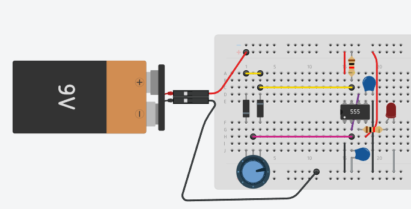
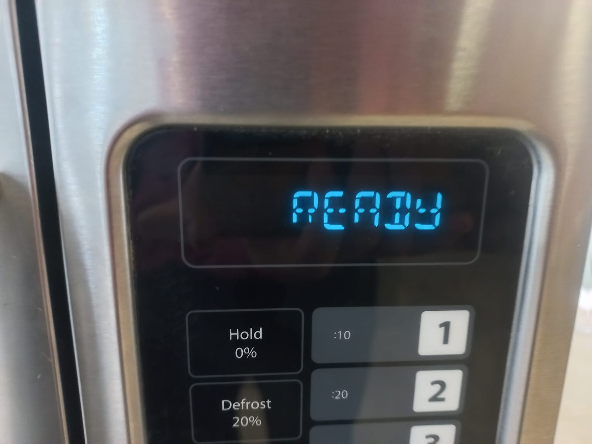
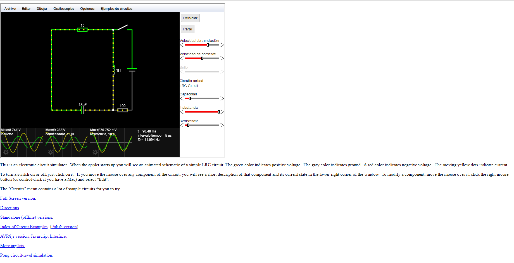
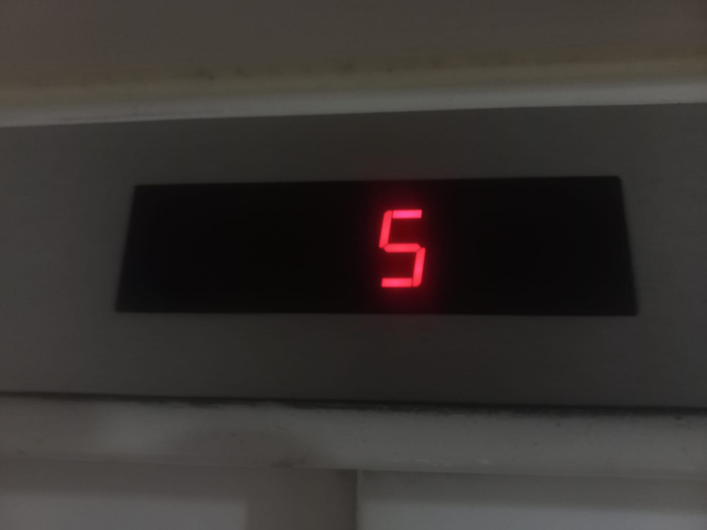
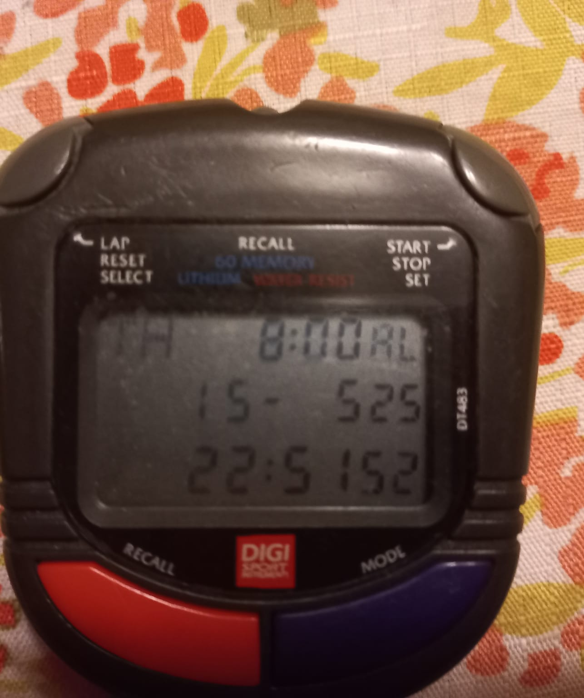
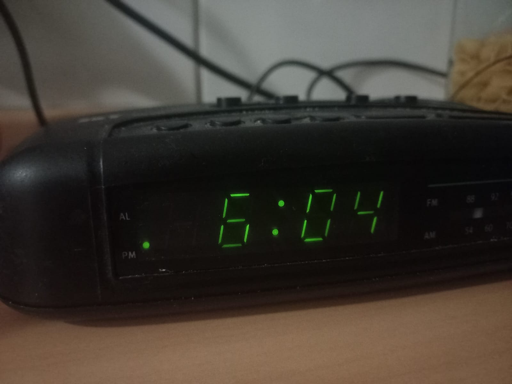

# sesion-10a

## Apuntes

- Durante la mañana se hablaron diversos temas, como cosas que habían ocurrido durante el fin de semana. En mi caso, logré preparar un queque para celebrar el Día domingo a mi mamá; quedó bien rico. También se habló sobre un cantante llamado Trueno (rapero argentino), y Misaa nos comentó que iba a presentar su tesis de Magíster en la Facultad de Arte, Arquitectura y Diseño de la Universidad de Chile. Me gustan estas dinámicas en clase, ya que generan un ambiente más agradable y dan ganas de comenzar el día así.

### Circuito PWM

- Durante la clase realizamos el circuito PWM en grupos de tres personas. Al inicio trabajé solo con Francisco Stephens, ya que Braulio aún no había llegado. Francisco amplió el circuito integrando dos LED de diferentes colores. Más adelante se unieron al grupo Santiago Gaete y Martín Silva. Debíamos usar LED de tres colores: rojo, verde y azul, colocando cada uno en un circuito separado para luego unirlos.

- Juntos realizamos el ejercicio de juntar los circuitos bajo una hoja de papel, lo que nos permitió observar distintos colores al variar la intensidad de la luz. Esta actividad fue un acercamiento a cómo funcionan las luces RGB.

- Cuando se mezclan luces de color rojo, verde y azul en diferentes cantidades, se puede crear muchos colores distintos. Esto pasa porque nuestros ojos tienen células que solo ven esos tres colores, y el cerebro mezcla lo que ve para que percibamos todos los colores.

## Siete segmentos

- Dispositivos electrónicos que permiten visualizar números (0-9) y algunos caracteres, formado por 7 segmentos LED dispuestos en forma de “8”.
- Segmentos identificados como: a, b, c, d, e, f, g.
- Un ejemplo cotidiano son los semáforos.
- Durante el break nos mandaron a buscar objetos que cuenten con estas pantallas.
  

- Fui al casino de la FAAD y le saqué una fotografía a la pantalla de uno de los microondas.

## Falstad

Nos presentaron y utilizamos Falstad por primera vez; anteriormente, lo había visto usar Fran UDP en algunas clases.

- Simulador online de circuitos eléctricos.
- Permite armar y probar circuitos en tiempo real.
- Visualiza voltaje, corriente y ondas.
- No requiere hardware.
  
## encargo-20: pantallas de siete segmentos

- Ascensor de mi edificio
  

- El cronómetro de mi padre. Lo usa casi todos los días, ya que es profesor de Educación Física. Se lo pedí cuando llegó, como a las 9 de la noche.
  

- Radio con reloj. Tiene una pantalla que indica la hora. Lo tenemos desde hace bastante tiempo y no recuerdo que haya mostrado más información; si alguna vez tuvo otras funciones, hoy en día ya no aparecen en la pantalla. Está algo polvoriento, y la verdad es que lo tenemos bastante arrumbado en una esquina de la cocina.

## encargo-21: simulación de circuitos con 555 y/o comparadores hechos con opamps en Falstad

simular circuitos que hemos visto en clases con chips 555 y/o circuitos comparadores usando el simulador de Falstad disponible en https://falstad.com/circuit/

SUBIR el texto en una cajita como esta, revisar cómo se hace esta cajita de texto revisando el código en Markdown que lo hace posible.
