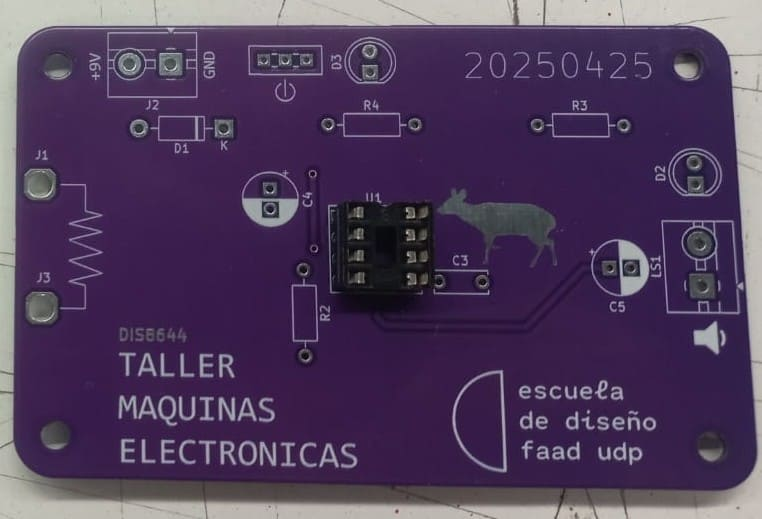
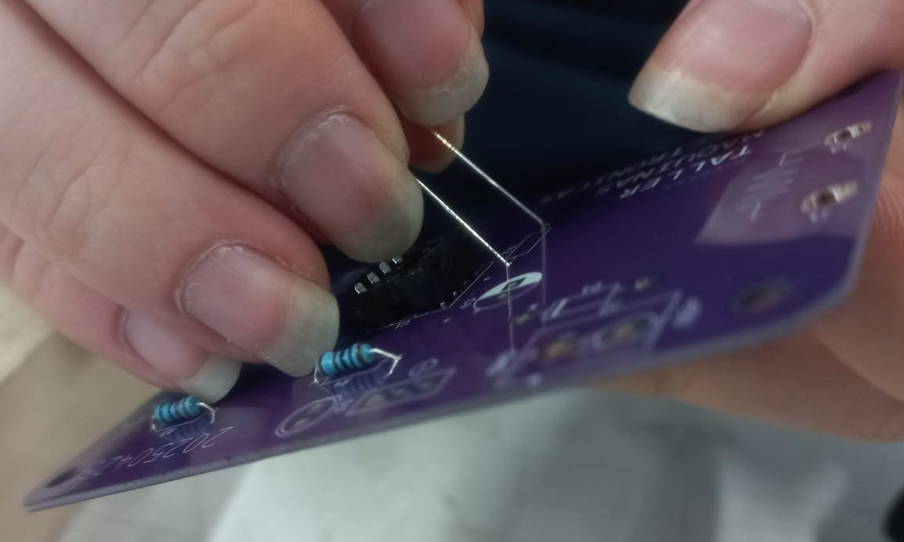
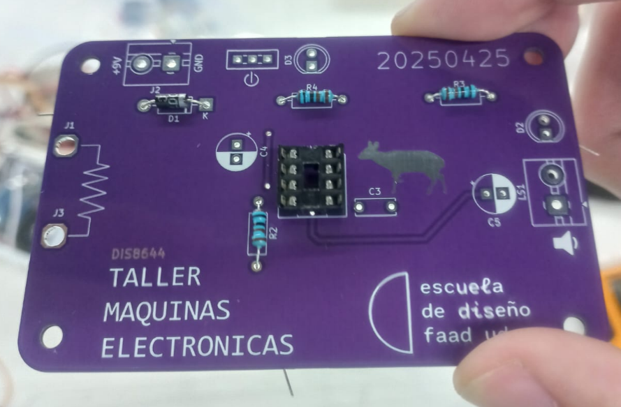
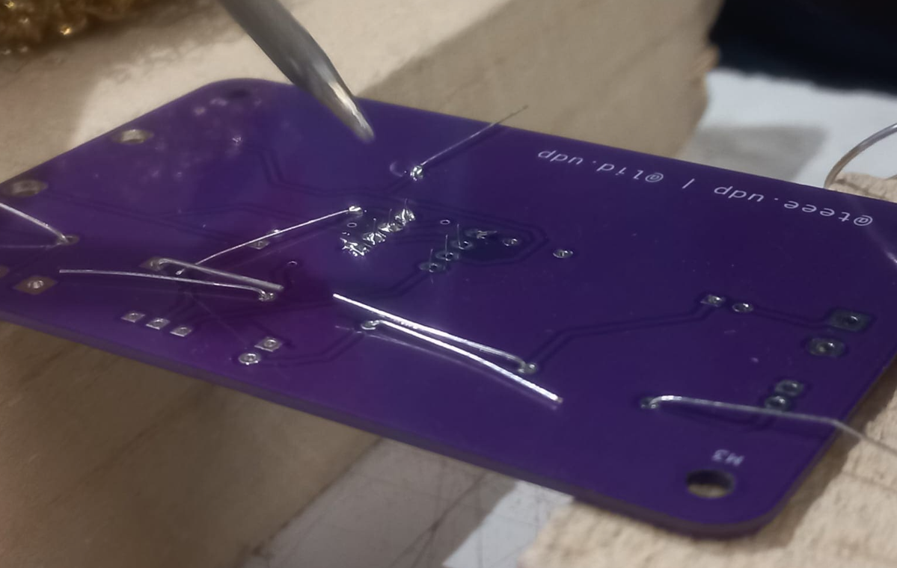
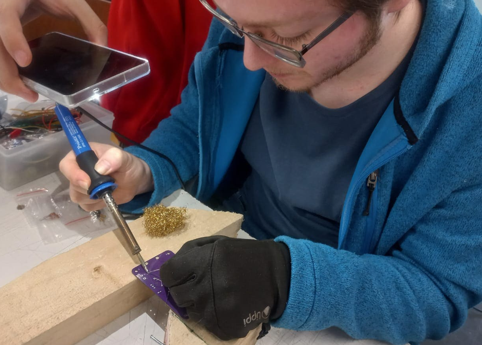
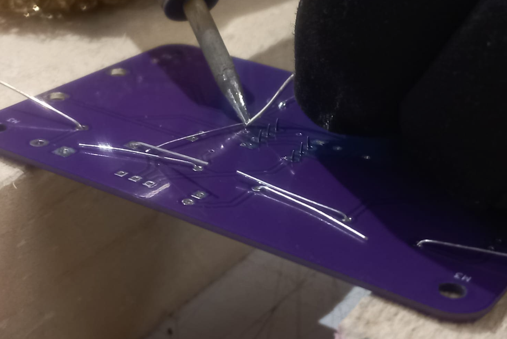
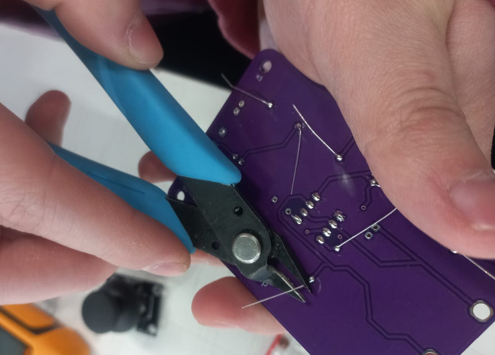
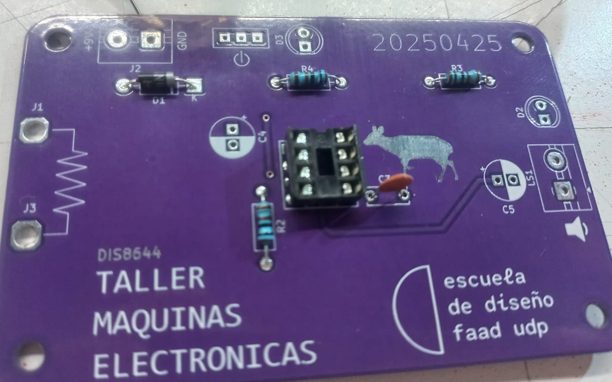
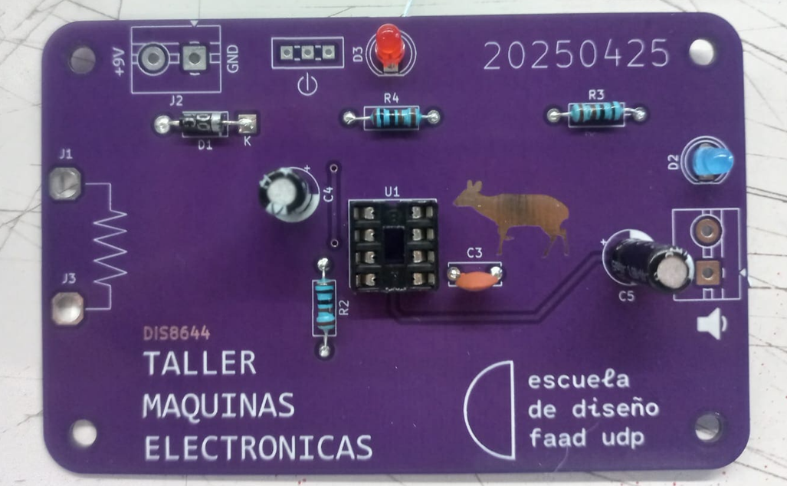
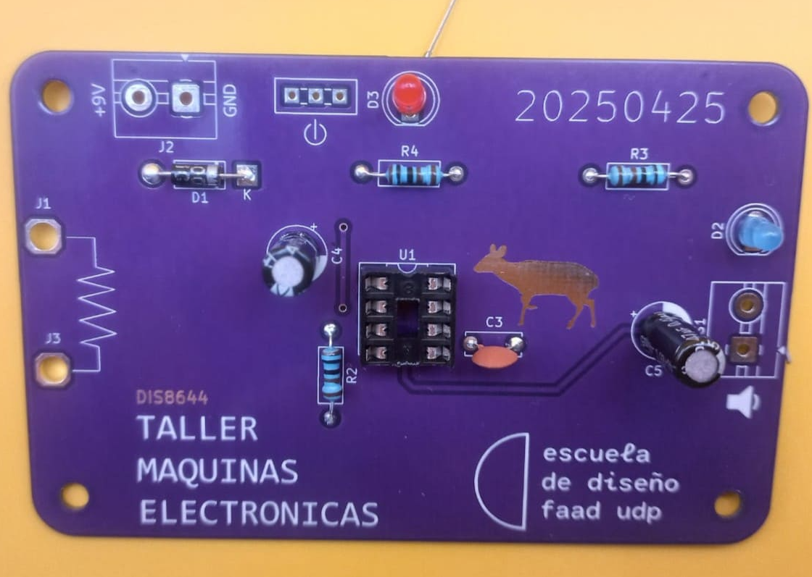

# sesion-10b
### taller viernes 16 de mayo
- Llegué un poco atrasado, no tan tarde, pero cuando pasa esto cuesta entrar en la conversación.
  
- Dead Internet Theory. Se dice que gran parte de internet está controlada por bots y no por personas reales. Creo que esta parte de la teoría tiene algo de verdad, pero me parece exagerado decir que la mayoría del contenido está siendo manipulado, porque todavía hay mucha gente auténtica creando y compartiendo cosas en línea. Además, por ahora no creo que esto empeore demasiado, ya que es relativamente fácil detectar a estos bots falsos, porque casi siempre intentan que hagas clic en enlaces sospechosos o visites perfiles dudosos.
  
- Circuit bending es modificar circuitos electrónicos de diversas cosas para crear sonidos nuevos y experimentales haciendo conexiones improvisadas dentro del dispositivo. Como ejemplo, se puede hacer en juguetitos.
  
- Hardware hacking
  
  
- Aaron nos hizo entrega de las placas UDPUDU.

### UDPUDU - escribir manual con pasos a seguir, receta, de los pasos que siguieron para ensamblar la PCB.
- Primmero nos juntamos en grupos de 4, ordenando la zona de trabajo.
- Ordenamos los componentes revisando el BOM; cada componente tenía que tener el mismo valor que indicaba la tabla.
  

| Componente                      | Cantidad |
|--------------------------------|----------|
| Socket de 8 pines              | 1        |
| Resistencias de 1k             | 3        |
| Diodo 1N4007                   | 1        |
| Condensador cerámico 100n      | 1        |
| Condensador electrolítico 1u   | 1        |
| Condensador electrolítico 47u  | 1        |
| LED 5mm                        | 2        |
| TBLOCK_2                       | 1        |
| Speaker                        | 1        |
| Switch SPDT                    | 1        |
| Chip NE555                     | 1        |
| Clip para batería              | 1        |
| Parlante 8Ω                    | 1        |
| Cables caimán                  | 2        |

- Primero colocamos los sockets de 8 pines, ya que son la base principal de la placa; ahí se inserta el chip NE555.
  

- Las resistencias van colocadas en R2, R3 y R4, y un diodo en D1. Hay que fijarse que el diodo tenga bien orientados sus polos positivo y negativo para colocarlo correctamente. Para facilitar el soldado, se doblaron las patitas.
  

  

  

- Para el soldado, usamos dos pedazos de madera para mantener la pieza elevada y trabajar de forma más cómoda. Ojalá tuviéramos algo más adecuado para este proceso. Utilizamos una resistencia delgada; ojo que vi a varios grupos usando una bastante gruesa, y si no se coloca bien, podría provocar un cortocircuito.

- Al final del soldado de cada componente, se recortaron el alambre en exceso de las patitas. Fuimos juntando el exceso para que no se ensuciara la zona de trabajo.
  

- Finalizando la clase, los componentes que se alcanzaron a soldar fueron los LEDs, el diodo, el condensadores ceramico y las resistencias.

- Continuaremos con el soldado en las próximas clases.

