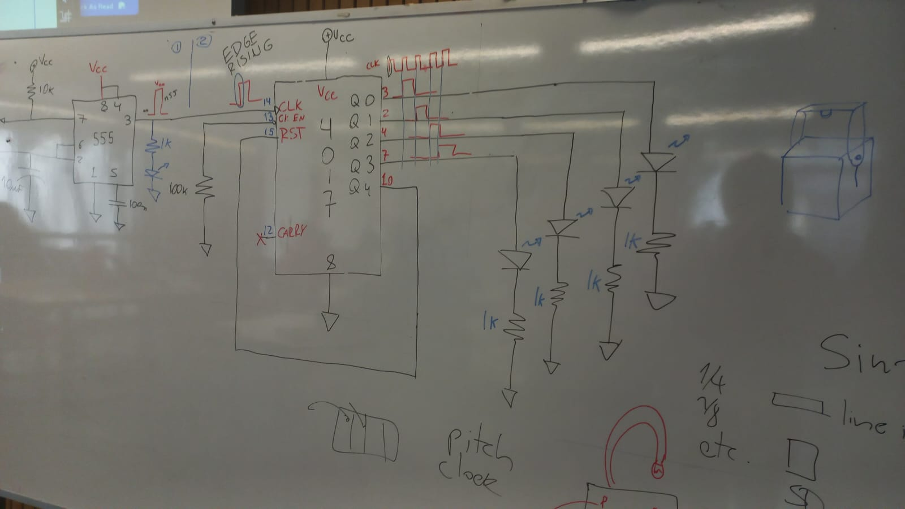
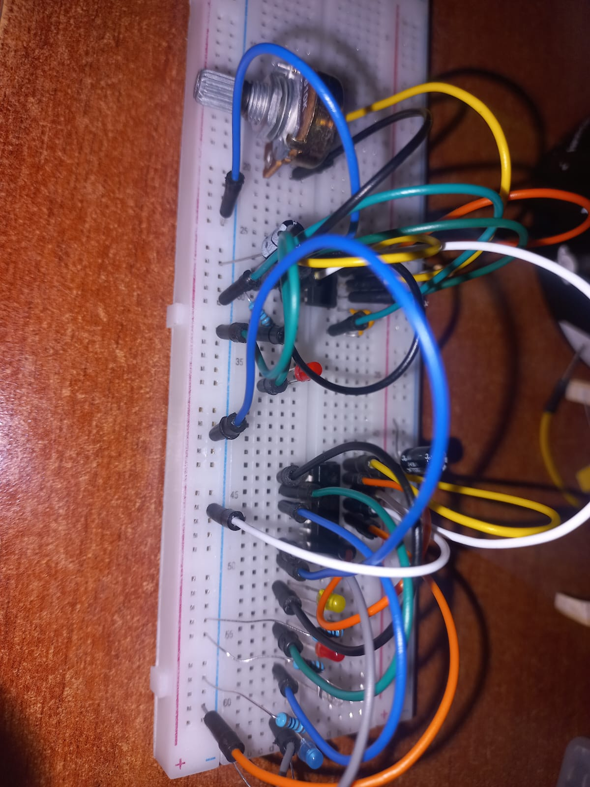

# sesion-11b

## Apuntes
- Llegué un poco después de las 8:30 y me perdí una parte en la que hablaron de Radiohead. Me dio lata porque últimamente he querido meterme más en la banda. Jugué KID A MNESIA EXHIBITION, una experiencia interactiva basada en Kid A y Amnesiac. Más que un juego, es como visitar un museo digital  medio raro y atmosférico. Me ayudó a conectar con la música de otra forma, no solo escuchándola, sino habitándola visual y espacialmente. Desde ahí que quiero seguir explorando más de ellos.

## Chip 4017

- Empezamos a trabajar con el chip 4017, que tiene 16 patitas.
  
- Se utiliza como secuenciador, activando una salida distinta con cada pulso recibido.

- Los pulsos se generan con el chip 555 en modo astable, funcionando como reloj (CLK).
  
- Para darnos una idea de como funciona, es parecido a las luces de Navidad que se prenden en secuencias.
  
- La lógica que usa el 4017 se llama lógica secuencial porque depende del orden y el tiempo de los pulsos que recibe. No es solo la señal de ahora, sino también cuántos pulsos llegaron antes. Cada vez que llega un pulso, cambia a la siguiente salida, como si fuera una cuenta que avanza paso a paso.
  
- Al ser un circuito tan extenso, me perdí bastante, pero yendo despacio y anotando las partes que iba completando, funcionaba mucho como guía. La primera parte me funcionó, pero en la segunda solo logré que del chip 4017 se encendieran dos LEDs, siendo estos los de las patitas 4 y 7. Nunca logré encender los de las patitas 2 y 3. Por el tiempo, y debido a que ya estábamos empezando a preparar la sala para soldar lo que quedaba del UDPUDU, no alcancé a preguntar con tiempo. Posiblemente haya algo mal conectado o la batería tenía un voltaje muy bajo. Tampoco logré registrar el circuito encendido, ya que no me quedaba batería.

## Soldado udp
- Finalizamos de soldar el circuito en su mayoria, en este caso FranUDP se ofrecio a finalizar el soldado de esta pieza. En esta ocasion se preparo mejor para el soldado ay que compro unos brazitos de soporte para afirmar la placa. 
