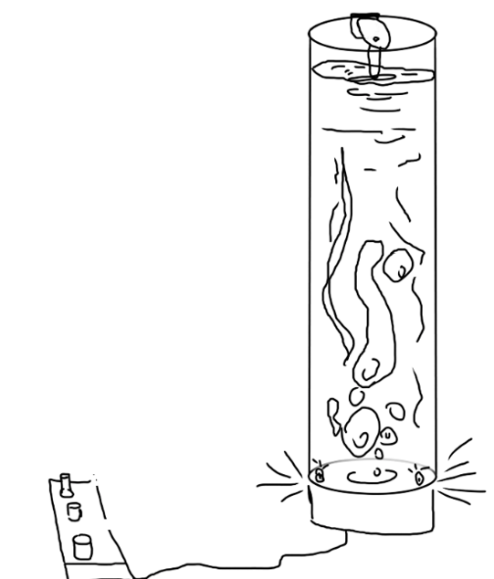
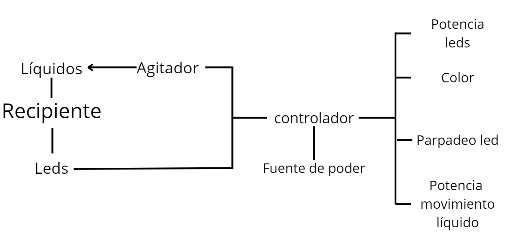
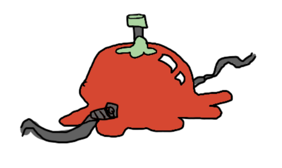
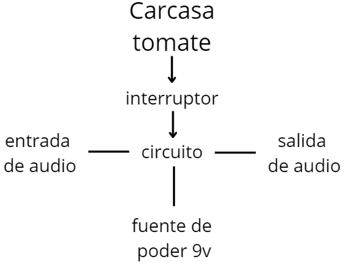
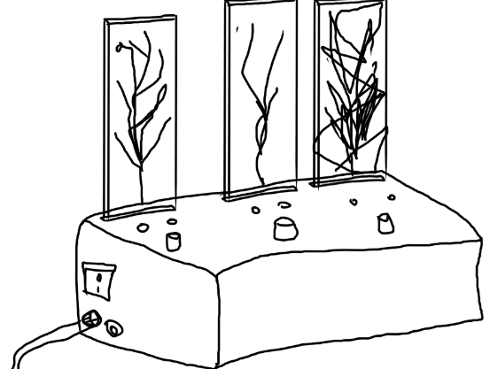
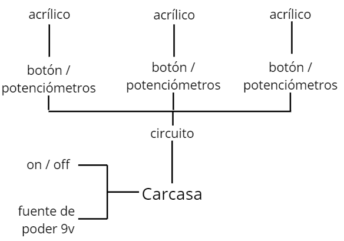

# sesion-12b
### taller viernes 30 de mayo

## Módulo mañana
- Al iniciar la sesión, Misaa nos habló de Christian Oyarzún. Él es mi profe de Programación Creativa Multimedia. Trabaja con programación, arte digital y composición algorítmica. Desde 1999 sube obras interactivas en internet (error404.cl).
  
- Algunas de sus obras están obsoletas al intentar abrirlas, ya que, por ejemplo, están hechas en Flash y ya no funcionan en los navegadores actuales, lo que también refleja el paso del tiempo. Actualmente, está trabajando para restaurar gran parte de ellas.
  
- Algo que me da pena hoy en día es lo poco visibles que están varios artistas en internet. Ahora se ha masificado mucho el subir contenido a plataformas como Instagram, y muchas obras quedan opacadas por contenido de fácil consumo, rápido y muchas veces superficial. Esto genera que el arte más complejo, experimental o de nicho pase desapercibido para la mayoría, lo que puede ser frustrante para los creadores que buscan comunicar algo más profundo o innovador. Sin embargo, no creo que sea algo totalmente negativo. Hay algo especial en que existan obras y espacios más ocultos, que solo un público reducido pueda descubrir y valorar. Esa exclusividad fortalece comunidades y crea un vínculo más cercano entre artista y espectador. En un mundo saturado de información, a veces es necesario que ciertas cosas se mantengan fuera del foco masivo para preservar su esencia.

-  Se habló de las web 1.0, 2.0, 3.0. Web 1.0 es la primera etapa de internet, sin mucha interacción ni personalización; aquí solo se tendía a leer.Web 2.0: Acá el internet era mucho más interactivo y social. Muchos de los que nacimos en los 2000 debemos recordar haber jugado cosas como Club Penguin o Habbo Hotel. Y finalmente Web 3.0, actualmente estamos en esta etapa, donde todo es más inteligente y personalizado. Usa tecnologías como inteligencia artificial y blockchain para que las páginas y aplicaciones entiendan mejor lo que necesitas y funcionen de forma más descentralizada.

- Misaa mostró varios Net Art, los cuales son arte creado para Internet, que usa la web como medio y lienzo. Un ejemplo de esto es [Summer Net Art](https://art.teleportacia.org/olia/summer/). Se utilizan imágenes de una chica en un columpio, el cual está colgado del link en la barra de direcciones. Cada frame está almacenado en la página de alguno de sus amigos, por lo que cada vez que la chica se mueve se carga un link diferente.

- [FoxDot](https://foxdot.org) es una plataforma que permite programar música en directo usando Python, conectándose con SuperCollider para producir sonidos al instante. 
- [Sonic Pi](https://sonic-pi.net) programa para crear música en vivo mediante código, fácil de usar (eso espero). Me gustaría aprender a usarla. Hay lugares donde se hace esto en tiempo real (como en un concierto). No sé si sería capaz de hacerlo, pero me parecería interesante probarlo.

- Se habló del proyecto final y cómo nos vamos a ir encaminando hacia este. Vamos a tener harto tiempo para ir desarrollándolo, pero este pasa muy rápido. Hay que tener en cuenta que lo que vayamos a hacer funcione antes de mandar a hacer la placa, ver componentes, cotizar, etc.

---- agregar apuntes celu------

## encargo-24
traer 3 ideas, ordenadas de mejor a peor, explicadas de forma textual. concentrarse en el lenguaje, los rangos de operación, el uso, no partir desde un chip en particular.,

## Propuesta 1

### Recipiente para registro de visuales experimentales líquidas.

Un recipiente diseñado para el desarrollo de visuales con líquidos en tiempo real. El dispositivo está compuesto por un contenedor transparente que alberga un líquido de comportamiento denso y cambiante, similar al de las lámparas de lava. Este líquido es iluminado desde la base mediante un conjunto de LEDs RGB, cuya intensidad y comportamiento pueden ser regulados mediante un controlador.

El líquido se mantiene en movimiento constante a través de un sistema interno, que puede incluir una bomba de aire, un motor vibrador o un agitador líquido que genere burbujeo o flujo. Este dinamismo permite que la luz interactúe con el líquido de múltiples formas, generando imágenes en constante transformación.

- lo que se busca lograr
  

Un controlador gestiona:

-La potencia e intensidad de los LEDs.

-El color

-El parpadeo o variación de las luces.

-La intensidad del movimiento del líquido.

Este objeto está pensado como una herramienta para crear visuales experimentales en vivo, mezclando luz y movimiento líquido. Permite improvisar efectos visuales en sincronía con la música, funcionando como una especie de VJ análogo, pero usando agua, color y luz en vez de pantallas.

## Propuesta 2

### Pedal tomatatera

Sí, literalmente es un pedal con forma de tomate, diseñado para conectarse a instrumentos eléctricos (guitarra, teclado, sintetizador). Al presionar su “corazón” o la cosita verde (la superficie superior), transforma la señal entrante en un efecto de timbre pegajoso o “bizcoso”. La forma de este pedal da a entender que el tomate se aplastó, y por eso debería sonar bizcoso.

Se busca hacer un pedal con una forma poco vista, ya no es una carcasa, es un tomate.

Uso:
Se conecta con cables al amplificador o dispositivo de audio. Cuando el músico pisa el tomate, la señal del instrumento se procesa para producir un efecto “viscoso”.

Explorar un timbre extraño y desconcertante.

## Propuesta 3

### Acrílico Sonoro

Un objeto el cual muestre una relación entre sonido, luz y color. Se trata de un dispositivo contenido en una carcasa, que incorpora 3 paneles de acrílico, posicionados arriba de unos leds, estos responden visualmente a distintas modulaciones sonoras. Cada uno de estos paneles cuenta con una fuente de iluminación LED desde abajo, permitiendo resaltar el sonido y las texturas.

El dispositivo incluye un sistema de generación de ruido que puede ser modulado mediante perillas y botones, uno por cada panel. Los controles permiten alterar la intensidad, tono y textura del ruido que afecta cada acrílico, creando contrastes visuales y sonoros en tiempo real.

Los rangos de operación estarán definidos por:

-Volumen e intensidad del ruido

-Luminosidad de los LEDs (control de brillo y color si RGB).

