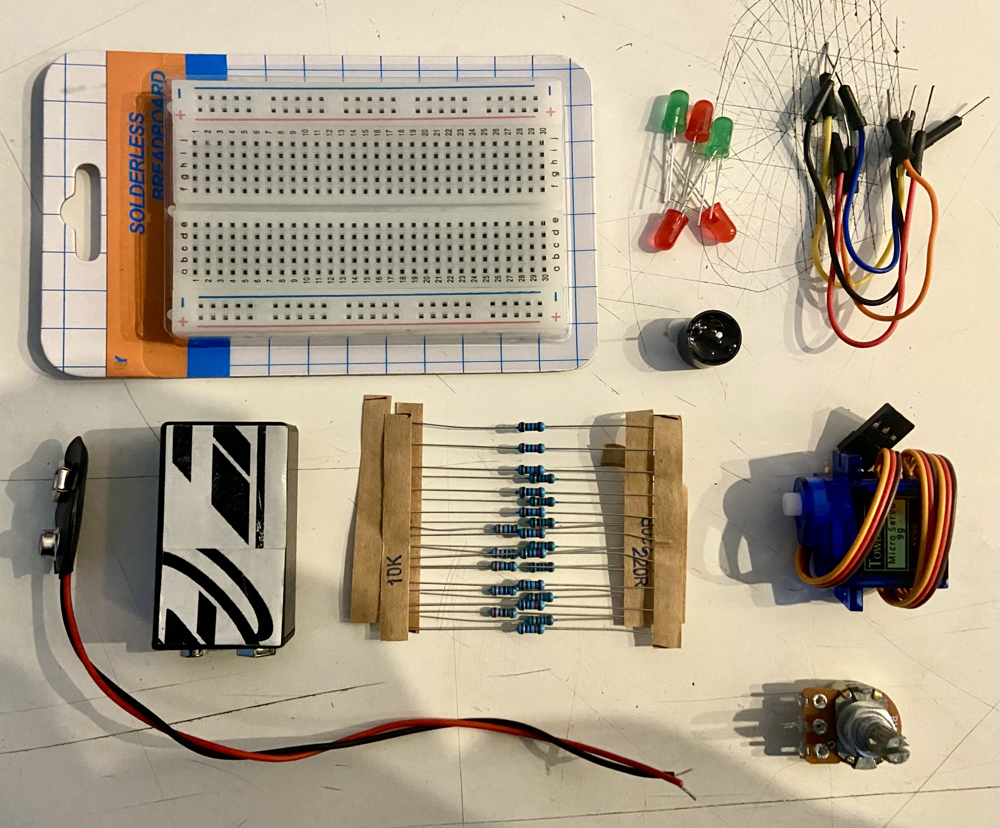

# sesion-01b

<html>
    <body>
<h1> Apuntes día 2: 14 Marzo 2025 </h1>
         
    <h2> Parte 1: Aprendizaje Github </h2>
        
 Hoy se enseñó a como poder iniciar sesión en la cuenta de Github, a ver las partes que componen la interface de la cuenta principal, a como crear la copia de un repositorio perteneciente a otra cuenta usando el botón "Fork" (Bifurcación en español). A la par se mostró a como poder editar un archivo desde la copia personal, acto el cual puede modificar el archivo original a través de la herramienta "Pull requests". La ida es poder actualizar los encargos de la clase anterior y subirlos a la carpeta correspondiene según el número de orden de la lista.

         
    <h2> Parte 2: Como armar circuitos </h2>
    
Sección enfocada en el aprendizaje de los elementos que componen un circuito simple. Para ello se entregaron una serie de herramientas para la exploración en equipos de 3 personas.
    

     
    
 Para ello se entregó un kit con los siguientes componentes: 

<h2> Registro visual </h2>
       
Fotografías de apuntes y resultados obtenidos.

         
        
         
<h2> Tarea: Analizar los componentes entregados en el Kit </h2>
         
Estudiar las piezas y partes que componen el kit inicial con el cual se trabajó en dicha clase, además de hacerse preguntas curiosas.

         
        <h2> Tareas extras</h2>
       <ol>
         <li> Escuchar un álbum de "Aphex Twin", hacer una reseña y breve investigación </li>
         <li> Ver el documental "The Internet's Own Boy" y escribir una breve reseña de esta. </li>
        </ol>
         
 <h1> Encargos y tareas 18 marzo 2025 </h1>
         
    <h2> 1. Encargo 03: Kit de electrónica </h2>
     
        
     
        <ol>
         <li>Cables dupont macho-macho: Es un tipo de cableado usado para interconectar los componentes electrónicos de un prototipo a la “protoboard” o tabla de pruebas, transmitiendo señales eléctricas. Soporta un rango entre lo 3v a 18v como máximo.Son de varios colores y están compuesto de cobre y plástico ABS.  Surgen en 1950, de mano de la compañía Berg Electronics, pero se volvieron populares tras haber sido adquiridos por la compañía DuPont, adoptando su nombre.</li>
         
         <li>Protoboard/Breadboard: es un tablero con orificios que permite conectar múltiples componentes electrónicos sin la necesidad de soldarlos a este espacio, montando y desmontando circuitos eléctricos con mucha rapidez. Usualmente están compuestos de un material aislante (principalmente plástico) y un conductor metálico. Pueden variar de tamaño, contar con más características como bordes de conexión, fuentes fijas, fusibles de protección, etc. No son recomendables para usar con altas frecuencias. Cuando ya se encuentra listo el circuito se manda a fabricar una placa PCB (Placa de circuito impreso). Fueron inventadas por Jack Kilby el 1958.</li>
         
        <li>Diodos Led 5mm: (blanco, amarillo, verde, rojo, azul) Los diodos son componentes electrónicos que permiten el paso de energía eléctrica en un solo sentido, ello dado que posen dos terminales: el ánodo (positivo) y el cátodo (negativo), lo que impide que la energía circule de forma contraria (polarización). Generalmente estos suelen ser compuesto por materiales semiconductores como el silicio y el germanio, y son clasificados por su tipo, voltaje y capacidad de corriente. Uno de los diodos más conocidos son los “leds”(diodo emisor de luz, Light Emitting Diode). Los leds de 5mm posen un voltaje de 3,2 a 3,3V. Nick Holonak Jr fue el inventor del primer led en 1962.</li>
         
        <li>Baterías 9V: son pilas secas (cuyo electrólito, que contiene las celdas electroquímicas, está en forma de pasa o gel) con formas rectangulares y que cuentan en la parte superior con un conector tipo broche con 2 terminales, uno positivo y otro negativo. Dada su poca energía suelen usarse para alimentar dispositivos eléctricos de bajo consumo. Es llamada comúnmente como pila a transistor, puesto que estos eran usados en las primeras radios a transistores. Dentro de esas se suelen encontrar 6 miniceldas de1,5V conectadas simultáneamente para conformar el voltaje total de la pila. Existen 3 tipos de pilas: alcalina, litio o recargables. La primera está compuesta por dióxido de Zinc y manganeso, las segundas incluyen litio y disulfuro de hierro, y las últimas pueden estar conformadas por niquel-hidruro metálico o de iones de litio. El inventor de las baterías fue el físico Alesandro Giuseppe Antonio Anastasio Volta en 1800, mientras que la batería de 9V surgió en 1956 por mano de la compañía Eveready.</li>
         
        <li>Conector a batería:</li>
         
        <li>Potenciometro: es un sensor electrónico que se utiliza para medir y controlar las señales eléctricas. Utiliza el método electroquímico para medir el pH de una disolución Se pueden usar para ajustar el volumen en dispositivo de audio, controlar la velocidad de motores, regular la intensidad de las luces, etc.</li>
         
        <li>Resistencias:</li>
         
        <li>Motores micro servo:</li>
         
        <li>Buzzer magnetico: se utiliza para generar música simple o como parte de la interfaz de usuario.</li>
        </ol>
         
    <h2> 2. Encargo 02.1 : Aphex Twin - Come to Daddy </h2>
        
Este álbum del 1997 cuenta con 8 canciones y tiene una duración aprox. de 33 minutos. Los videos fueron dirigidos por Chris Cunnignham. En este album se usaron ordenadores, sintetizadores de software, generando música a través de voces computerizadas. Originalmente lo temas se distribuyeron en 2 CDs separados: WAP94CD y WAP94CDR, más tarde estas versiones serían reemplazadas por un solo EP: WAP94CDX. El género de este álbum es electrónico IDM (Intelligent dance music) con los estilos Drum n Bass, Experimental, Abstract, Breaks.

         
        
¿Cuál es mi canción favorita del álbum?

        
Flim: Canción instrumental, suave, me recuerda a los sonidos de canciones de cuna. Es armoniosa, y tranquila, cálida, los ritmos pronunciados son calmados.

         
        
Sobre el artista

        
Richard David James es el Dj y productor detrás de esta banda. De origen irlandés y nacionalizado británico. Desde el 1983 que se dedica a la música de forma profesional, y desde los 12 años que comenzó componer. Sus instrumentos suelen ser teclado y sintetizadores (Yamaha DX7/DX100). Estudió ingeniería en.

         
    <h2> 3. Encargo 02.2 : </h2>
    </body>
</html>
