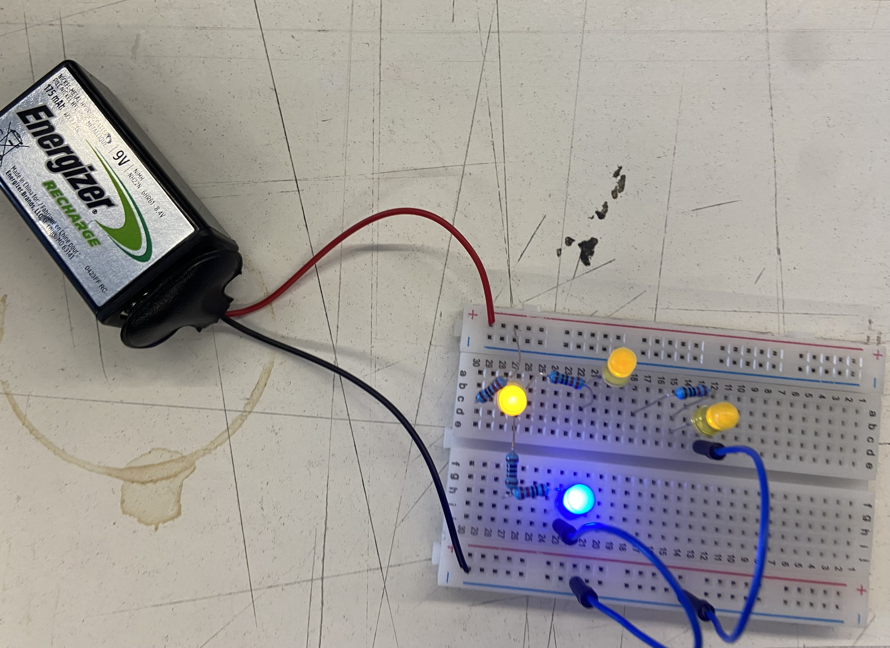
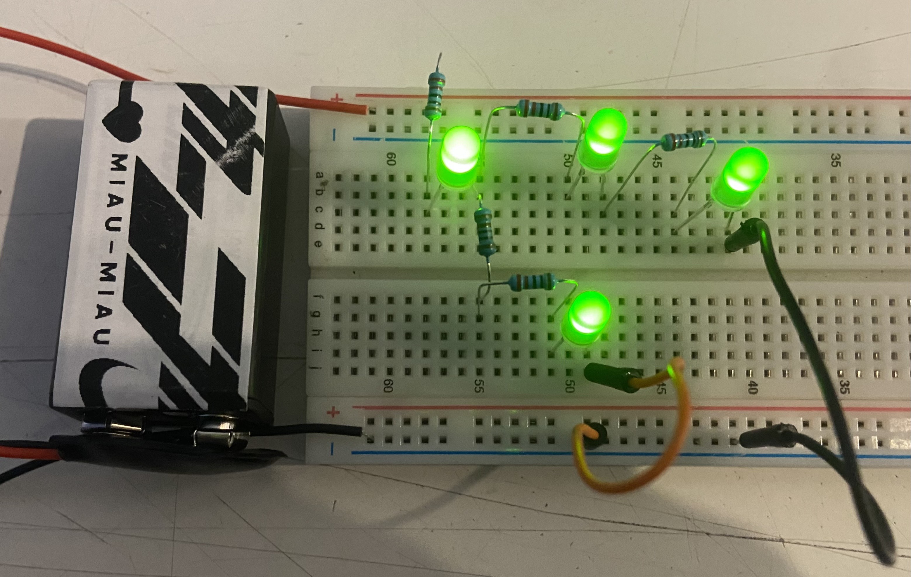
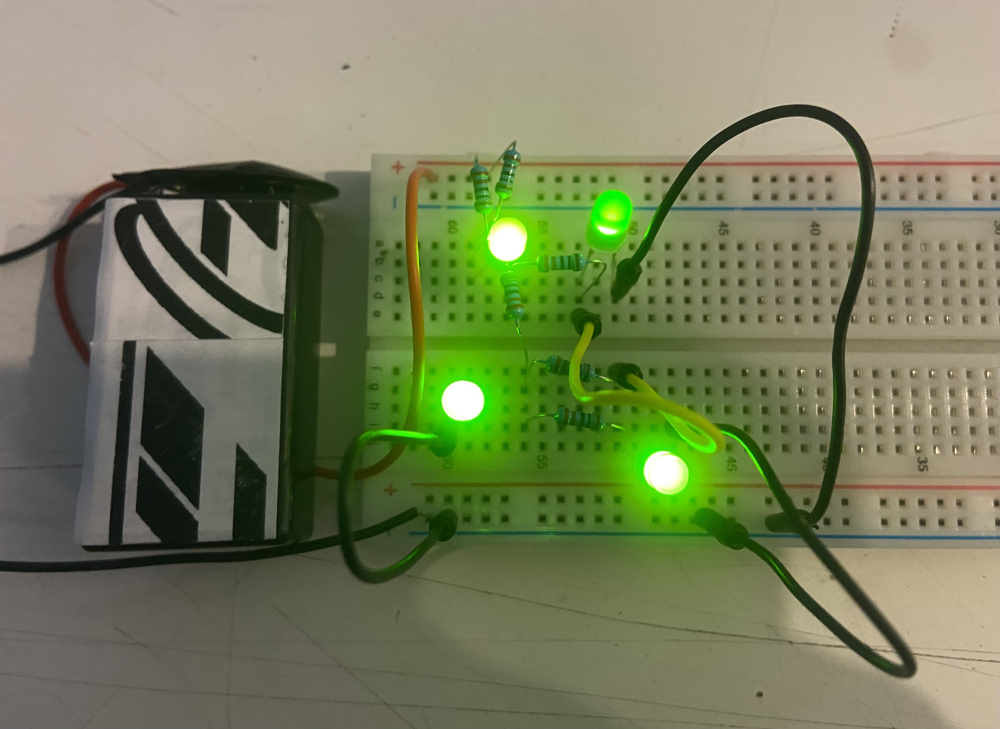
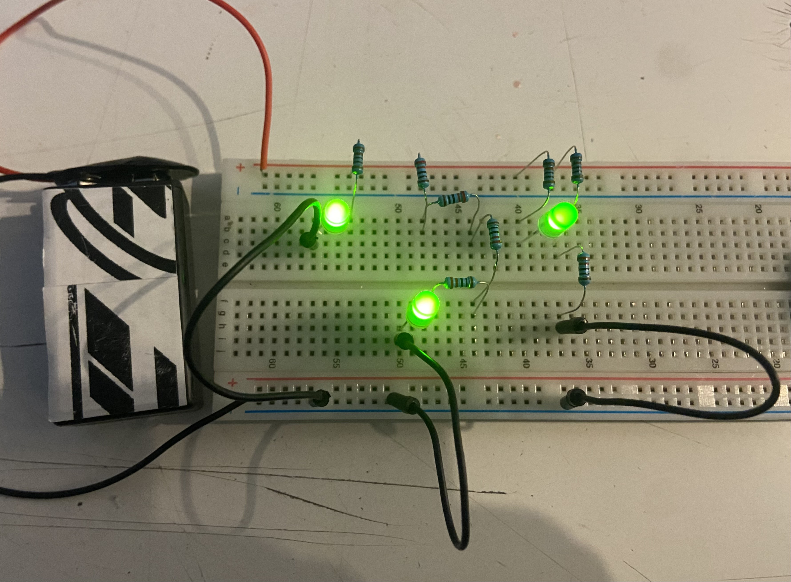

# ⋆₊˚⊹♡ Clase 02b - Primeros circuitos ♡⊹˚₊⋆

21 Marzo 2025

## Escaneo de bitácora

En esta clase pudimos aprender a interpretar el diagrama de un circuito, comenzando por la simbología de las piezas que lo componen, el nombre y valor asociado a cada parte, además de ponerlos a prueba en la protoboard. Además, aprendimos lo que era un Bill Of Materials (BOM): una lista de todos los componentes que forman parte de un circuito, cuyo contenido abarca el tipo de componente, la cantidad, el nombre asociado a cada pieza y los valores de estos. Esta información sirve como parte fundamental para poder construir un circuito.

***

### Registro visual

_▼ Circuito realizado en clases, correspondiente al mostrado en el esquema de la segunda hoja. Autoría personal._

***

### Encargos y tareas 18 marzo 2025: Circuitos a practicar y BOM

El encargo de la clase fue realizar los circuitos (previamente diagramados) con el kit de materiales, además de realizar un "Bill of Materials" de cada uno de ellos.

***

#### - Circuito 1 -

#### BOM: Circuito 1

| Componente       | Qty | Nombre(s) | Valor/tipo |
|-----------------------|---------|------------|----------------|
| Batería               | 1       | BT1        |       9V       |
| Resistencias          | 5       | R1, R2, R3, R4, R5     | 1k, 220Ω  |
| Leds                  | 4       | D1, D2, D3, D4    |   3,3V    |

***

#### - Circuito 2 -

#### BOM: Circuito 2

| Componente       | Qty | Nombre(s) | Valor/tipo |
|-----------------------|---------|------------|----------------|
| Batería               | 1       | BT1      |       9V       |
| Resistencias          | 6       | R1, R2, R3, R4, R5, R6     | 220Ω  |
| Leds                  | 4       |  D1, D2, D3, D4    |   3,3V    |

***

#### - Circuito 3 -

#### BOM: Circuito 3

| Componente       | Qty | Nombre(s) | Valor/tipo |
|-----------------------|---------|------------|----------------|
| Batería               | 1       | BT1      |       9V       |
| Resistencias          | 8       | R1, R2, R3, R4, R5, R6, R7, R8     | 1k, 220Ω  |
| Leds                  | 3      |  D1, D2, D3   |   3,3V    |

***

### Posdata

Rehaciendo todos los trabajos ૮◞ ﻌ ◟ა

***

°˖✧◝(⁰▿⁰)◜✧˖°
