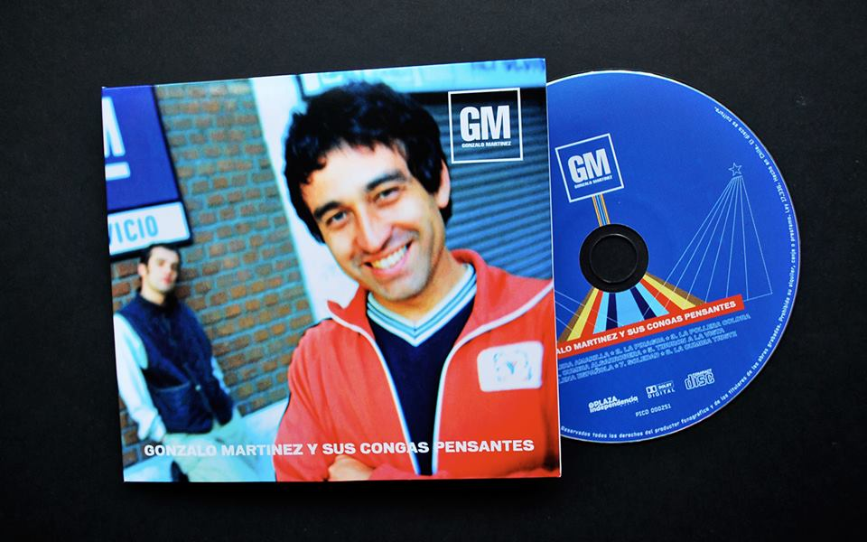

# ⋆₊˚⊹♡ Clase 03b - Atari punk console ♡⊹˚₊⋆

Viernes 28 de marzo 2025

***

## Observaciones

La clase fue más experimental. El primer módulo se enfocó en trabajar con el circuito Atari punk console. Tras ello tomamos una "sesión de fotos" a nuestros circuitos y después del descanso partimos todes a Museo de Arte Contemporáneo en el metro Quinta Normal para ver la exposición del profesor Matías Serrano.

***

### Registro visual de la bitácora y la clase

### Resultados de la Clase

<https://github.com/user-attachments/assets/9102512c-2482-4703-8dcd-dd6b0c6be7ca>

<https://github.com/user-attachments/assets/e129ae64-4c78-4237-972e-cc0221204420>

***

### Salida a terreno: Museo en estéreo

Esta fue una salida a terreno con todo el curso presente. Fuimos de república hasta llegar al MAC en la estación Quinta normal.

Antes de ingresar al lugar, los profesores hablaron un poco, sobre todo el profe Matías, puesto que él trabajó con otros artistas para crear la muestra que íbamos a presenciar. Por su parte nos contó sobre el museo y su historia, en conjunto con su experiencia sobre el construir la exposición y otros datos.

Tras eso ingresamos al lugar, pasando por el vestíbulo en donde nos detuvimos a hablar de las obras que estaban presentes en el espacio.

Ya habiendo hablado caminamos hasta la sala en la que estaba la exposición.

_▼ Imágenes recuperadas de: <https://mac.uchile.cl/exposiciones/sala-interaccion-museo-en-estereo/>_

Por mi lado aproveché de tomar fotografías centradas en lo que me llamó la curiosidad.

***

### Salida a terreno: Otras salas del museo

A continuación se nos dio "chipe libre" para seguir recorriendo las demás salas del museo y los proyectos que ahí se encuentran.

▼ Esta fue la "escultura" que me llamó más la atención. Me gusta como con elementos tan simples se puede transformar en algo memorable e interactivo. Se siente muy extraño y atractivo, como si estuviera siendo vigilada al ser mostrada en la pantalla y al hacer que se imprima un papel con la interacción.

***

### Encargo 08: Gonzalo Martínez - Gonzalo Martínez y sus Congas Pensantes

El único disco de la dupla chilena: Jorge González, líder del grupo "Los Prisioneros", y Martin Schopf, integrante del grupo alemán Sieg Über Die Sonne. Este álbum fue publicado en 1997 y su contenido se centra en 10 sencillos que mezcla música electrónica con cumbia (electrocumbia), siendo el segundo proyecto conocido en mezclar ambos estilos musicales. Cabe mencionar que antes de llevarse a cabo su producción González había estado estudiando "Ingeniería del sonido" en New York, lugar donde se encontró con Schopf. Ante ello deciden colaborar y “reversionar” canciones de cumbia de origen colombiano, siguiendo la idea de MArtín, quien "tuvo la visión de que la única manera de que la música tecno entrara a Sudamérica era que Sudamérica entrara en ella". Pese a que la publicación no tuvo exito en Chile, fue un disco apreciado dentro del circulo Underground de Europa.

Como parte de la opinión me gustó la combinación. Los ritmos se sienten frescos y poco saturados para el oído, y la mezcla de ritmos eléctricos hace que uno fluya como con la cumbia original. A la par destaco los sonidos de fondo, similares a ecos de instrumentos desconocidos, y las alteraciones de las voces, que repiten palabras o párrafos sin cargar la canción, sintiendo toda la mezcla como un ir y venir fluido similar a la marea.

***

### Encargo 09: Salida a terreno en el MAC - Opiniones personales

Hace tiempo que no visitaba dicho museo. A mi parecer la última vez que estuve en el sitio fue para una feria de [“Impresionante”]( https://www.instagram.com/impresionante/) en 2022. Ya habiendo pasado cerca de 3 años volví a poner un pie gracias a la invitación del equipo docente. 
Me gustó el poder asistir como taller, siento que a veces eso hace más disfrutable la experiencia pese a que ello limite el espacio y pueda sobre estimular mis sentidos. El tener la guía de Matías lo hizo mejor, puesto que no sólo nos ofrecía contexto sobre las obras emblemáticas del lugar sino también una explicación frente al proyecto que fuimos a visitar.
La muestra me pareció interesante y curiosa, sobre todo por la fabricación de las esculturas y los sonidos que se pueden escuchar. Ello lo hace bastante estimulante al estar escuchando muchos lugares y momentos a la vez, lo que me genero un poco de mareo, pero fuera de eso pude disfrutar del recorrido. Honestamente, lo que más me encantó fueron los canastos de fruta transformados en asientos con ruedas, ello me hizo sentir como una niña que podía ir rodando sobre este “vehículo” por la sala y tener otra visión al detenerme o percibir un sonido en conjunto.
Otra cosa que me gustó fue tener chipe libre y poder observar que obras podríamos encontrar en las otras salas, sintiendo la inspiración de poder crear cosas similares o más complejas.

***

### Posdata

Pos ando rehaciendo estas tareas, aunque no tenga sentido, porque el dejarlas sin hace me hacen sentir mal ૮◞ ﻌ ◟ა

***

°˖✧◝(⁰▿⁰)◜✧˖°
