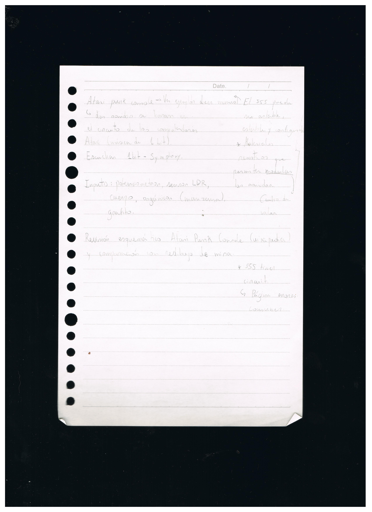
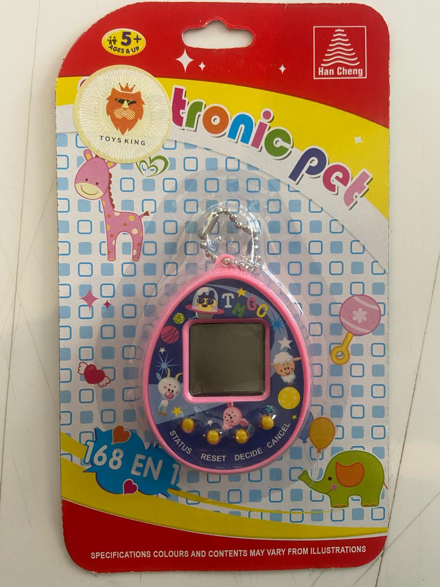
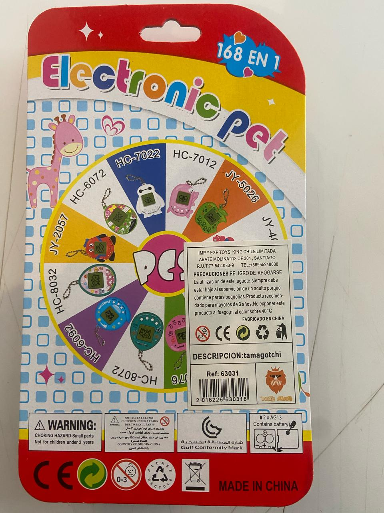
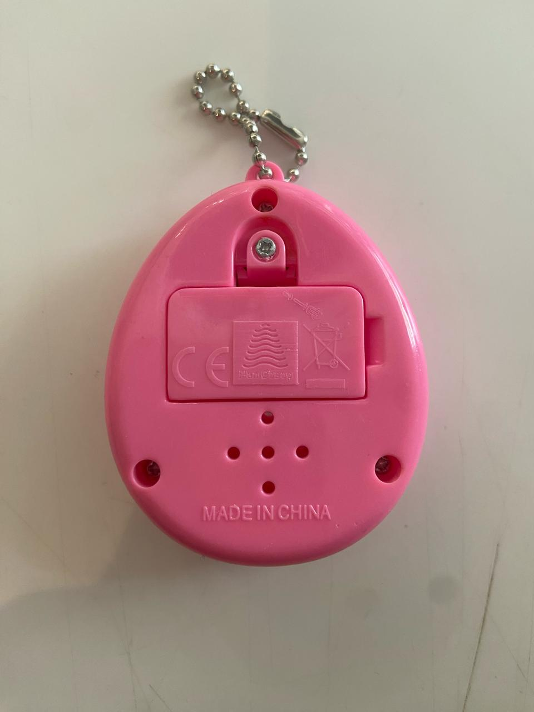
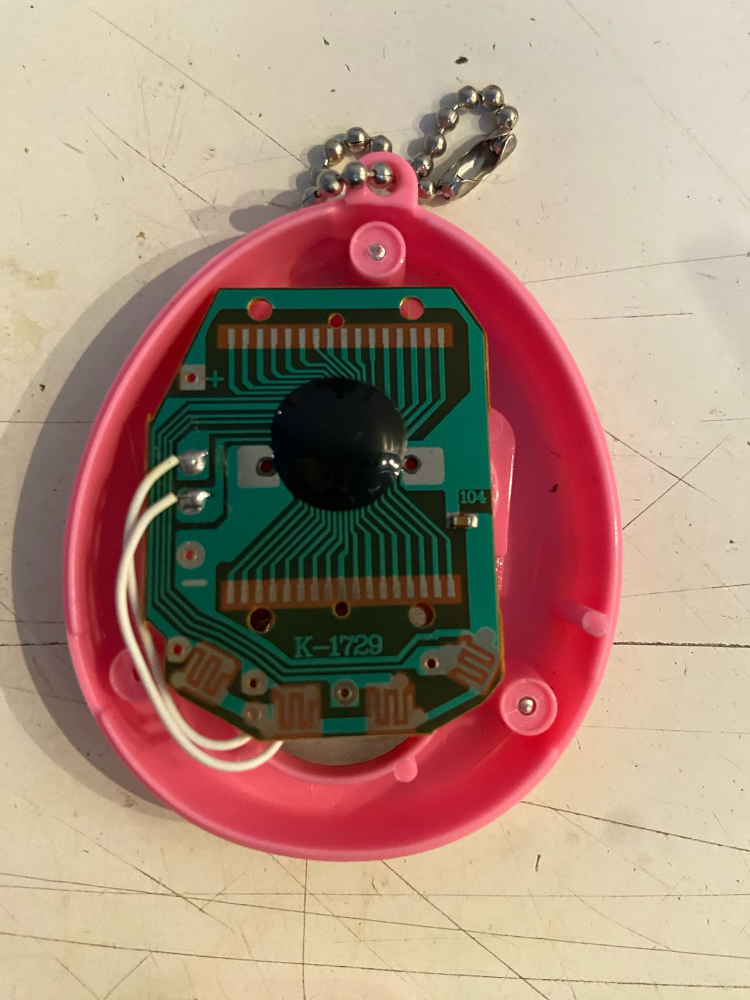

# ⋆₊˚⊹♡ Clase 04a - Primeros avances ♡⊹˚₊⋆
##### _Martes 1/04/2024_

***
 
### Observaciones

<!---Recordar para programar "md" (markdown): 
- https://github.com/adam-p/markdown-here/wiki/Markdown-Cheatsheet 
- https://www.markdownguide.org/basic-syntax/
- El Domingo 30 de marzo cumplí 25... no se porqué me gustaría sentirme orgullosa de ello, que se me reconociera --->
El primer periodo se buscó recrear uno circuitos vistos antes de la clase anterior, a la par que hablar sobre la visita a la exposición del MAC en Quinta normal. Más tarde se nos presentó un diagrama eléctrico de "Atari Punk Console", el cual cada estudiante tuvo que descifrar para poder construirlo con las piezas entregadas en clase. A su vez, se habló de las solemnes, las notas que serán parte del curso y la importancia de registrar cada avance, descubrimiento, desastre, etc. Absolutamente todo. Antes de terminar con la clase, quedamos de formar equipos de 2 a 3 personas para realizar la primera solemnte, cuya primera fase es encontrar un objeto electrónico, desarmarlo para aprender lo más posible de ella (ingeniería inversa) y usar estos conocimientos para inspirarnos en posibles ideas para las máquinas que podamos desarrollar a futuro.

***
 
### Escaneo de bitácora y apuntes escritos del día

 

 

 

***

### Avances para la clase 04b

#### _Selección de objeto_

 

Para esta ocasión, quise probar a buscar juguetes electrónicos pensados para niños, que trabajaran con botones como "inputs" y con cambios en una pantalla como "output". 
Con ello en mente me dispuse a entrar en uno de los lugares en los que se puede encontrar de todo: tiendas chinas.
 
Dado que mi tíempo ha sido acotado dado que trabajo 3 días a la semana, busqué principalmente en mi entorno cercano, encontrandome con la tienda "Doremi" del mall Arauco Maipú.
Entre mis busquedas, encontré uno de los juguetes que formaron parte de mi infancia, en su versión de copia e innovación de bajo presupuesto, accequible a todos los presupuestos posibles: "Tronic Pet", un chinagotchi (versión barata de un juguete llamado Tamagotchi). Este juguete se centra en cuidar de una mascota virtual (comida, aseo, entre otros).

 

_▼ Empaque y producto por delante_

 

_▼ Empaque y producto por detrás_

 

A primera vista, se puede ver que es un objeto pequeño, el cuál permite colgarlo gracias a una cadena, destacandose por ser portable y de un tamao pequeño, además de tener la forma de un huevo (idea relacionada con la crianza de un animal). Lo que más destaca es la pantalla, que ocupa el centro del objeto en si, seguido por 4 botones de igual color, tamaño y materialidad, pero con distintas funcionalidades: de izq. a der. se encuentran las funciones de "status", "reset", "decide" y "cancel". Esta información se comprende gracias al uso del diseño gráfico impreso como una carcasa que le da personalidad y guía al usuario en sus decisiones.

 

Por otra parte, el empaque entrega información adicional como la compañía de fabricación (Han Cheng), el dato de 168 en 1 (se desconoce si este atributo es la cantidad de mascotas a elegir u otra cosa), la edad de recomendación a partir de los 5 años (posiblemente por riesgo de asfixia por el tamaño de las piezas que componen el objeto), además de una frase que indica que los colores y el contenido puede variar de las ilustraciones.

 

Al otro lado del paquete se muestran las versiones de dicho juguete (con códigos de producto e imágenes de estos), más advertencias e información (origen, riesgos, importador, código de barras, etc) en conjunto con sellos como el de recliclaje, no botar en la basura, etc. Además, algo importante es que se menciona que viene con pilas/baterías incluidas.

 

 

 

 

 

 

 

 

***

### Investigación

Indagando un poco por el internet, consultando el producto original "Tamagotchi" pude encontrar unvideo de una copia realizado con Arduino y circuitos eléctricos.

- Link: https://www.instructables.com/Arduino-Tamagotchi-Project-I-Am-the-Tamagotchi/

 

A la par, pude observar que el circuito base de esta copia pareciera ser usado en más objetos, como por ejemplo relojes digitales.

- Link: https://www.calaquin.com/2019/02/review-r-time-sport-watch-strawberry.html

 

Todavía es necesario seguir indagando para descubrir la naturaleza del funcionamiento de sus piezas vitales: el circuito y la pantalla.

### Posdata

Estoy cansada Profe ૮◞ ﻌ ◟ა

***

 ##### *°˖✧◝(⁰▿⁰)◜✧˖°*
