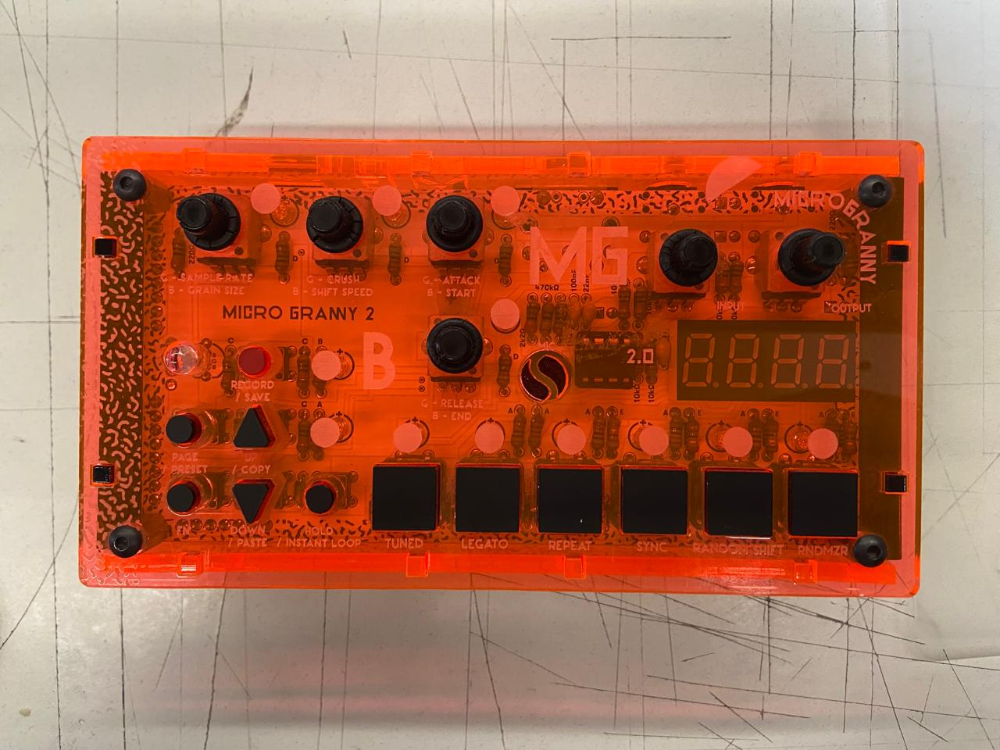
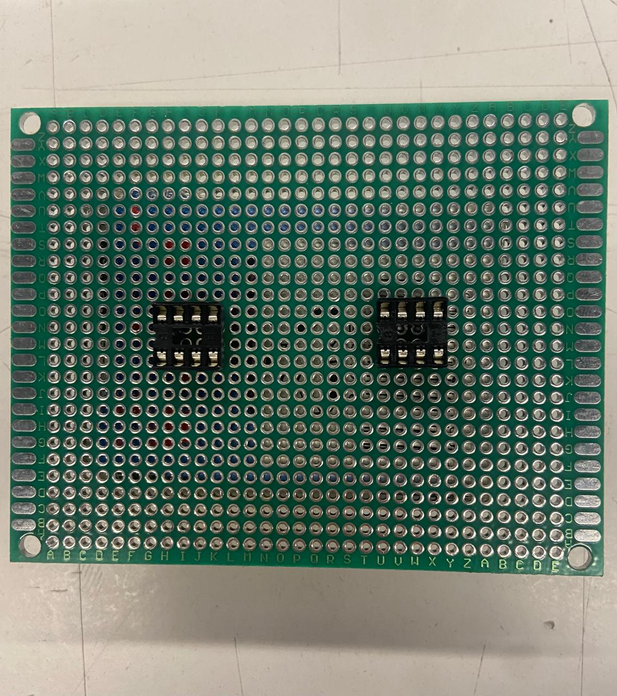
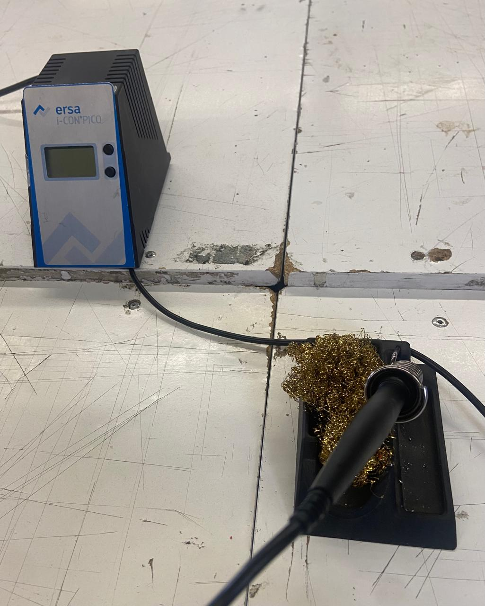
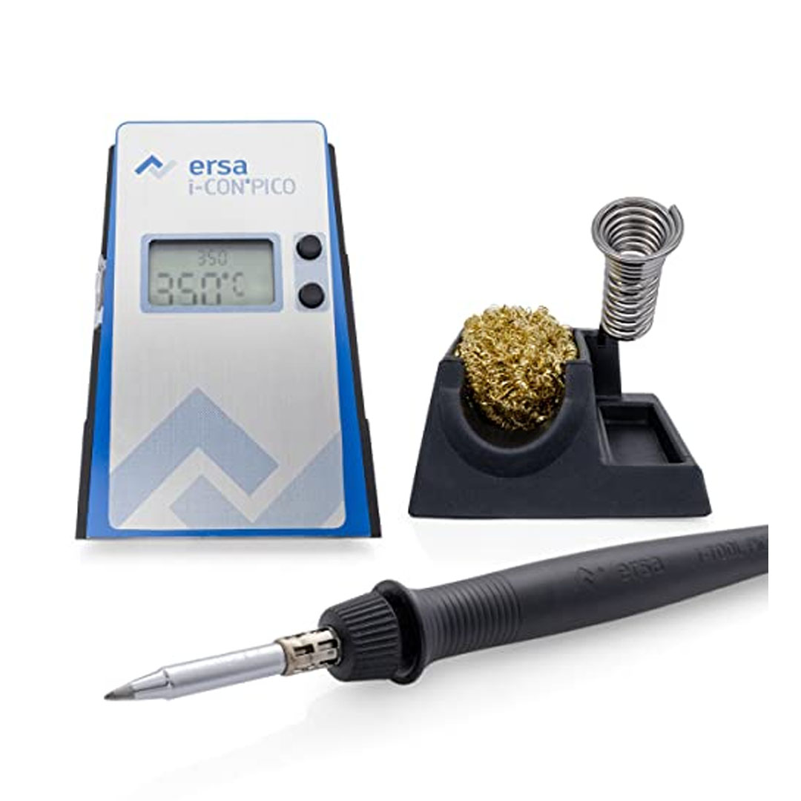

# ⋆₊˚⊹♡ Clase 05b - Soldaduras y circuitos ♡⊹˚₊⋆

Viernes 11 Abril 2025

***

## Observaciones

Esta clase se centró en aprender algunos componentes útiles para poder aplicar a las placas PCB (como es el caso de un potenciómetro). Destaco que durante casi todo el tiempo estuvimos trabajando de forma indirecta (con conocimiento) o directa (con materiales) en el arte de soldar. Se nos hizo entrega de unas placas PCB perforadas por ambos lados, cables recubiertos y soldadura, además de que nos prestaron cautines para trabajar y poder practicar montando unas “garrapatas” ([Sockets](https://afel.cl/products/kit-66-sockets-para-circuitos-integrados)) para montar encima los circuitos integrados 555. Fue una clase más tranquila que otra cosa, para compartir e ir aprendiendo poco a poco.

A la par, los profesores trajeron otra máquina pequeña, por lo que quise indagar sobre ella.

▼ Fotografía de la máquinita.

Usando la herramienta de "Búsqueda por imagen" pude indagar que este objeto fue creado por la compañía [“Bastl instruments”](https://bastl-instruments.com/), quienes confeccionaron esta máquina y la nombraron como “microGranny 2”. Este es un sampler (muestreador) monofónico de 8 bits que funciona con un Arduino incluido en su estructura. Dentro de los componentes que posee se encuentra una tarjeta micro SD, una entrada MIDI, botones y perillas, entre otras piezas.
Me parece un objeto un poco complejo de entender en cuánto al funcionamiento de sus partes, por lo que quise ver cómo se utiliza. Ante ello pillé el video a continuación, lo que me generó ganas de tener uno para poder jugar y ver qué tipo de composiciones puedo realizar de forma espontánea. 

<https://github.com/user-attachments/assets/f2f90e6d-68a2-433e-be81-695e9837575d>

▼ Video de microGranny 2 e uso. Recuperado de https://www.youtube.com/watch?v=HCZrwDsyxew&ab_channel=boop_e_.

***

### Registro fotográfico

▼ Fotografía de la placa PCB con ambos socket soldados.

▼ Fotografía de la estación de soldado que me prestaron.

Indagando sobre el cautín con el que pude trabajar, descubrí que fue construido por una empresa alemana llamada [“Kurtz Ersa”]( https://kurtzersa.com/es/), cuyo rubro es la ingeniería mecánica. En este caso el cautín corresponde al modelo “IC1300”, una estación de soldar pensado en trabajos de alta precisión en electrónica. Posee un control preciso de temperatura, la cuál se puede leer en la pantalla que incluye. La temperatura que puede alcanzar varía entre los 150 a los 450°C, teniendo un tiempo de respuesta de 9 segundos para calentarse. A la par conseguí un [documento](./archivos/ERSA-DATA-SHEET.pdf) en el que se detalla la información de esta estación.  El haber trabajado con esta herramienta me hizo querer tener una, pero más tarde me di cuenta que su coste se encuentra fuera de mi presupuesto.

▼ Imagen de la estación de soldar. Recuperado de: https://eurekaelectronics.cl/instrumentos/ersa-ic1300-estacion-soldadora/.

A la par destaco que los profesores nos compartieron un [manual para soldar](./archivos/nasa_soldar.pdf) hecho por parte de la NASA.

***

### Posdata

No se porqué, pero siempre dejo el escribir estos códigos para la madrugada... creo que debo replantearme mis hábitos para no empeorar mi salud ૮◞ ﻌ ◟ა

***

°˖✧◝(⁰▿⁰)◜✧˖°
