# ⋆₊˚⊹♡ Clase 06b - Feriado ♡⊹˚₊⋆

Viernes 18 Abril 2025

***

## Observaciones

La clase pasada falté a la entrega del día martes por encontrarme enferma de gastroenteritis, por lo que no supe que pasó más allá de revisar los repositorios de los estudiantes y leer las indicaciones de los profesores de la sesión.

***

### Encargo 12: Instalación  KiCad

Comencé por buscar la página de descarga del programa mediante Google. Tras ello ingresé al link de la página original (<https://www.kicad.org/>) y luego le di click en el botón azul "Download". Al hacer eso me redirige a una página de descargas en la que me consulta acerca del sistema operativo de mi portatil, que en este caso es Windows 10 con un sistema operativo de 64 bits.

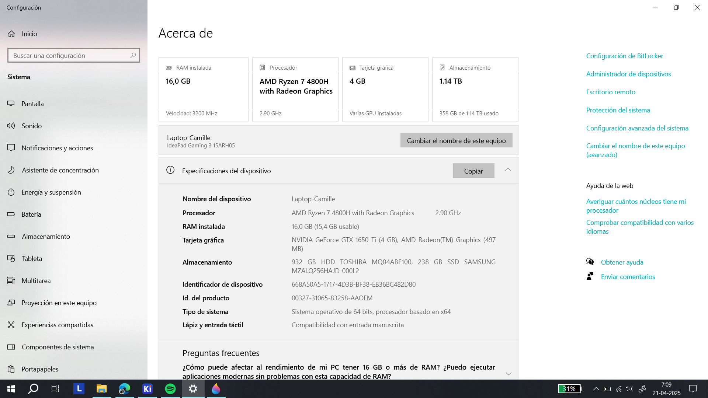

Conociendo esa información me dispuse a obtener la descarga de la versión 9.0.1 para un procesador de 64x. Ya bajado el archivo fui a la carpeta de "Descargas", donde decido abrirlo para comenzar con la instalación.

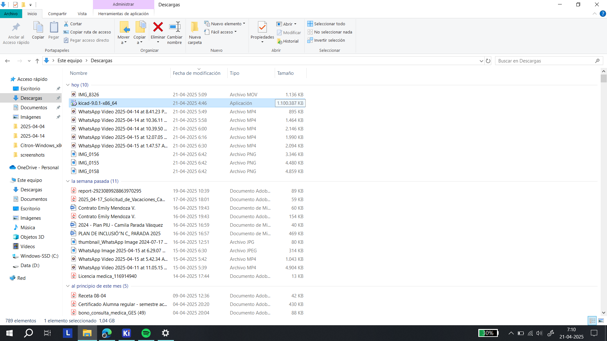

Tras ello me aparece una interface que ya reconocía, puesto que es la que trae por defecto varios programas al momento de istalarlos.

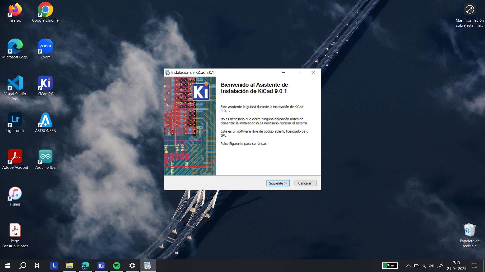

Le di continuar y permití que se instalara para todos los usuarios disponibles en la computadora. Acepté dando los permisos de administrador. Lo que continua es realizar la selección de los componentes que quiero instalar, que en este caso los incluyo todos. Además, puedo ver que el programa pesa 5,8 GB aprox.

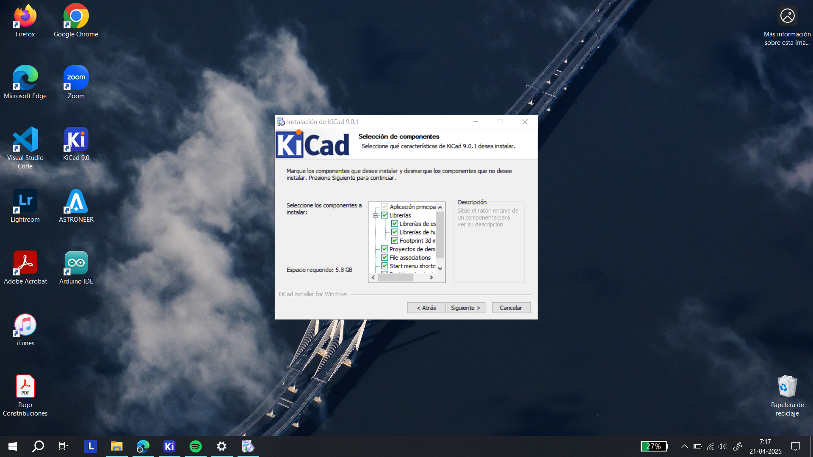

La siguiente decisión a tomar es elegir la carpeta en la cuál será instalado el programa. Dado que no dispongo de demasiado almacenamiento en el disco duro que incluye por defecto el PC termino recurriendo a la memoria externa que incluye el dispositivo, ya que dispone de mayor cantidad de espacio disponible (742 GB).En este caso para poder usar elemento tuve que crear ua carpeta adicional que nombré como "Kicad".

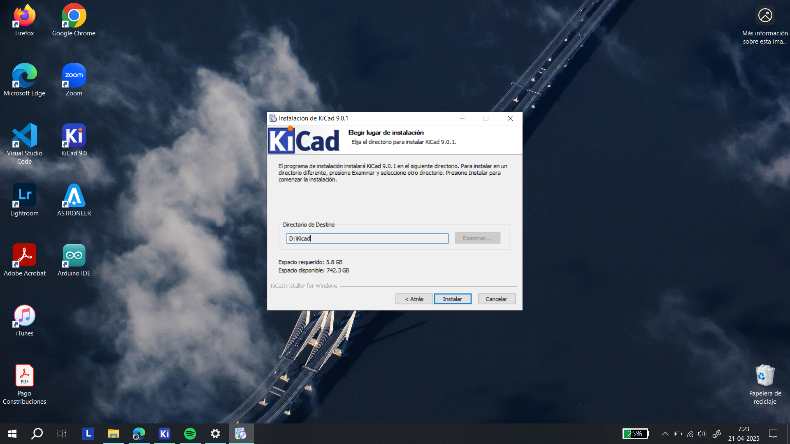

Ya lista la instalación el programa se abre. Y me deja ver la interface de este, que por suerte está en español.

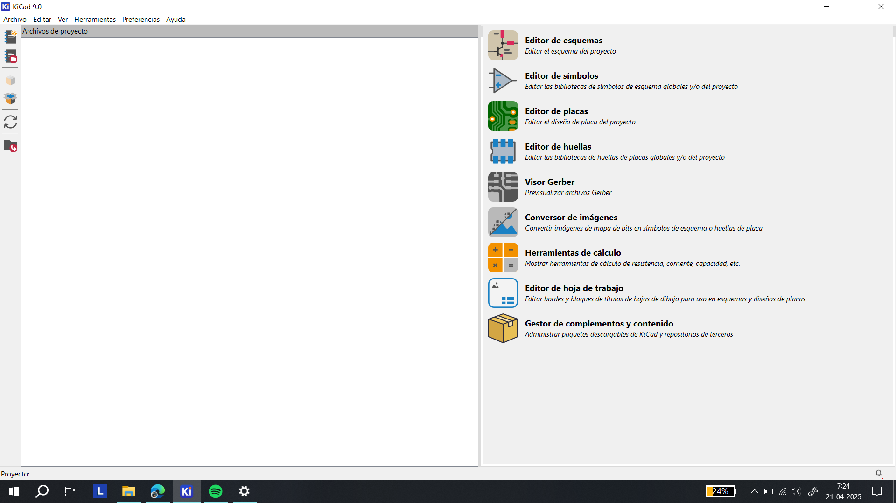

Después me puse a ver que información contiene la carpeta del programa.

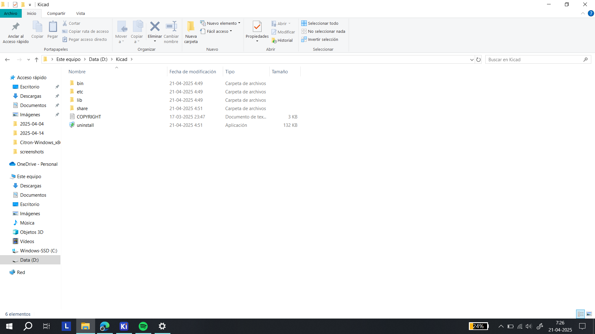

Y en la subcarpeta "bin" encuentro el acceso al programa como tal.

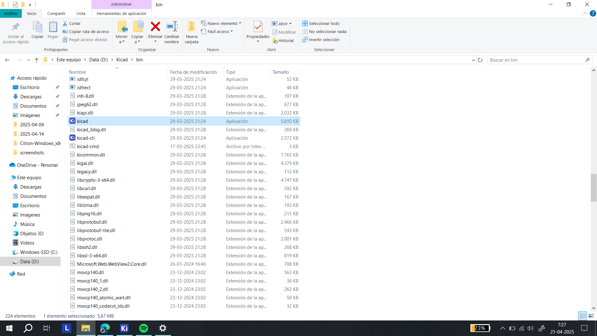

***

### Encargo 12: ¿Cómo funciona el programa?

Al abrir el programa nos recibe una interface en la que por un lado aparecen las herramientas que ofrece y por el otro se encuentran los archivos con los cuales se pueden trabajar.

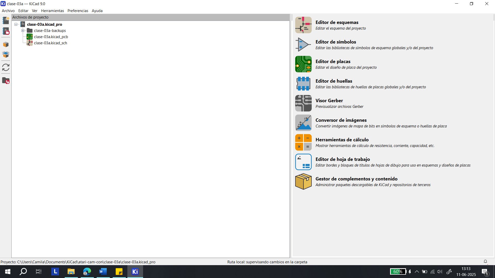

El programa permite trabajar con los diagramas o esquemas de los circuitos en cuestión, pudiendo montar las piezas accediendo a una “librería de componentes” y establecer sus dimensiones a través de una “biblioteca de huellas”. En esta última se pueden encontrar diferentes encapsulados y formas, por lo que hay que tener presente cada detalle de las piezas que se van a soldar en la futura placa de circuitos.

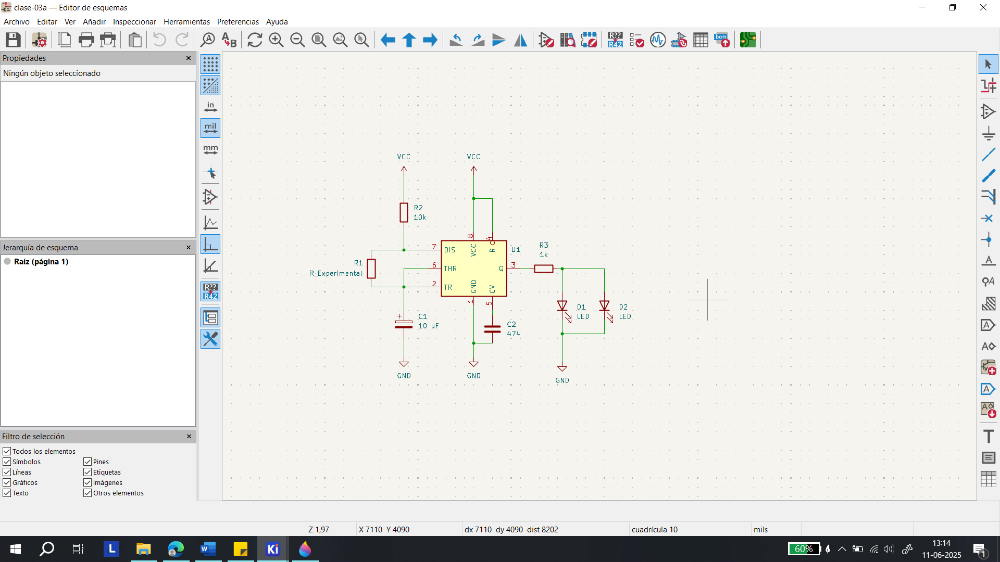

En el segundo archivo (con un icono de un circuito) se podrá trabajar para componer la placa PCB. Al haber ingresado las “huellas” se puede trabajar en las dimensiones de la placa, diseñando la superficie en la que se montará el futuro circuito. Es así que las funciones que ofrece son establecer las conexiones de cobre (caminos por donde va la energía), realizar diseños en serigrafía, establecer la forma de la placa, ordenar las piezas y los orificios, entre otras cosas. Una vez se encuentre listo este proceso se puede ver una simulación en 3D, permitiendo ver los detalles del trabajo. 

La importancia de este programa se debe a nos permite desarrollar un archivo para poder cotizar y mandar a confeccionar las placas de los circuitos que queramos diseñar, pudiendo producirlos en masa.

***

### Encargo 13: Sisters with transistors

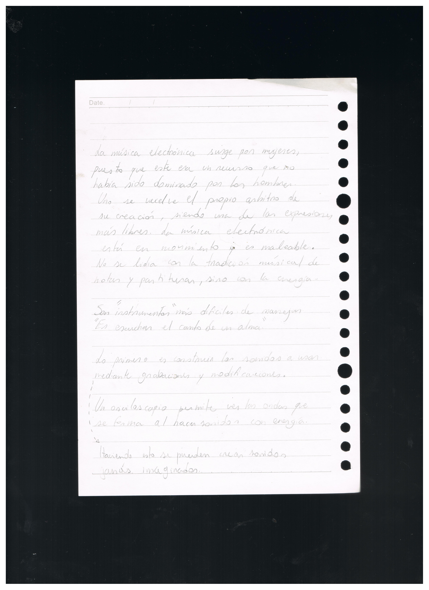

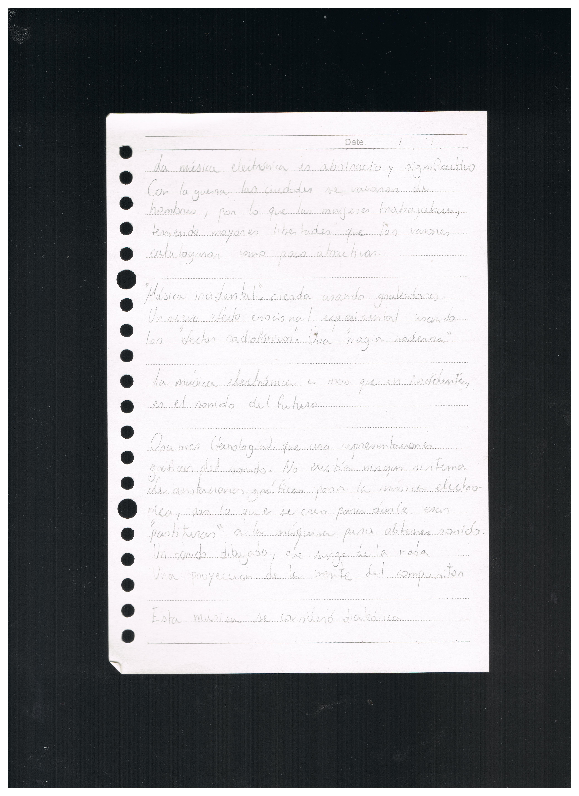

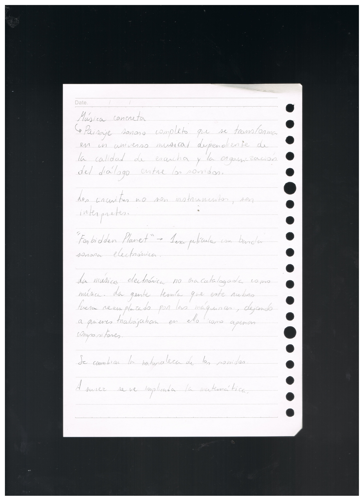

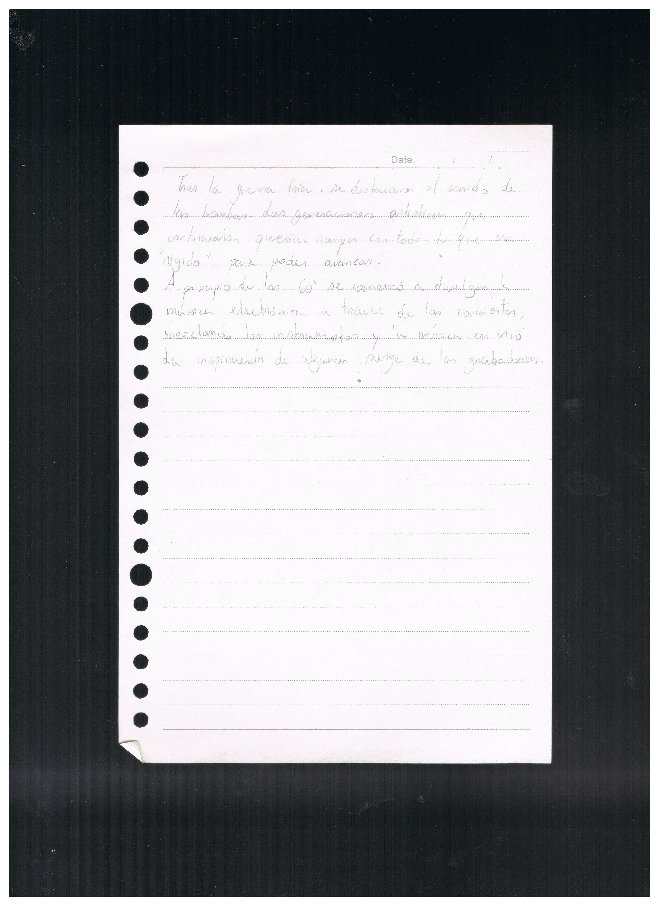

***

### Posdata

Poco a poco se va mejorando ૮ ˶ᵔ ᵕ ᵔ˶ ა

***

°˖✧◝(⁰▿⁰)◜✧˖°
