# ⋆₊˚⊹♡ Clase 07a - Kicad y placas PCB ♡⊹˚₊⋆

Martes 22 Abril 2025

***

## Observaciones

Esta clase se centró en el aprendizaje de Kicad, por lo que fue primordial el tener un portátil con el cual trabajar.

El primer módulo se centró en aprender a cómo construir el esquemático y colocar las "huellas" (asociar piezas reales al listado de materiales).

La segunda parte de la clase se centró en orientar los materiales dentro de una placa PCB ficticia y a poder revisarlos en 3D.

***

### Bitácora digital

Cuando llegué a la sala estaban hablando de proyectos y programas que no alcancé a escuchar mucho. A la par hicierom circular por la clase varios proyectos enfocados en generar música y sonido, los cuales pude registrar mediante fotografías con mi teléfono.

#### Bleep labs - "The Pico Paso"

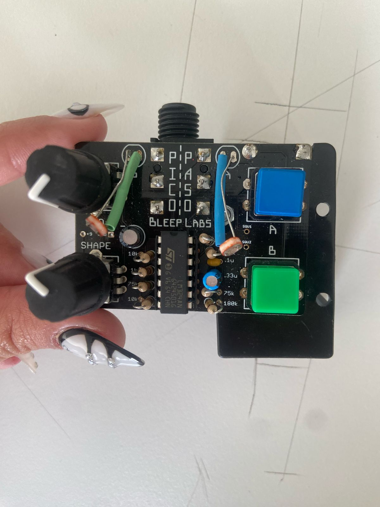

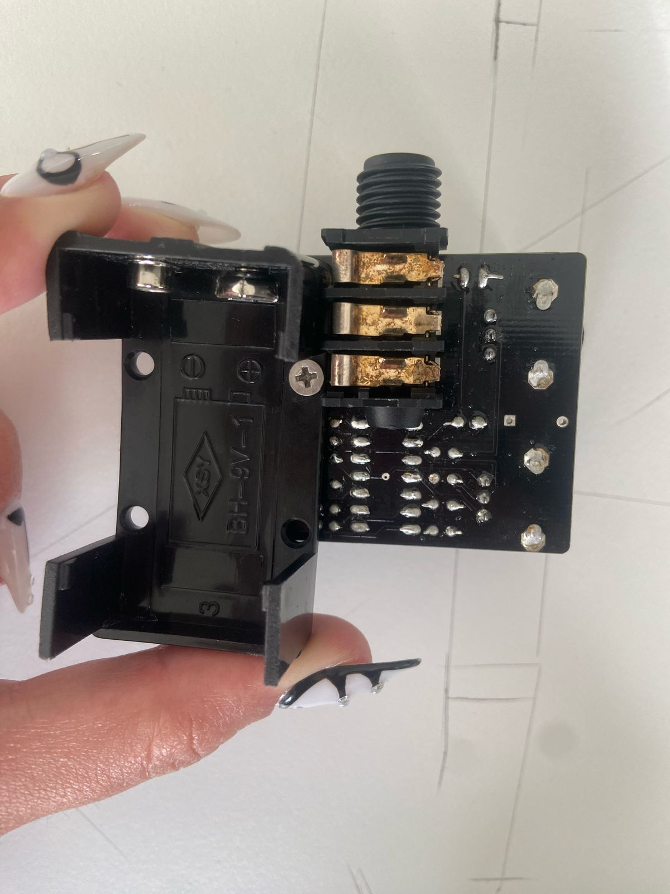

▼ Sitio web asociado: <https://bleeplabs.com/product/the-pico-paso/>

#### Loud Objects - "Noise Toys"

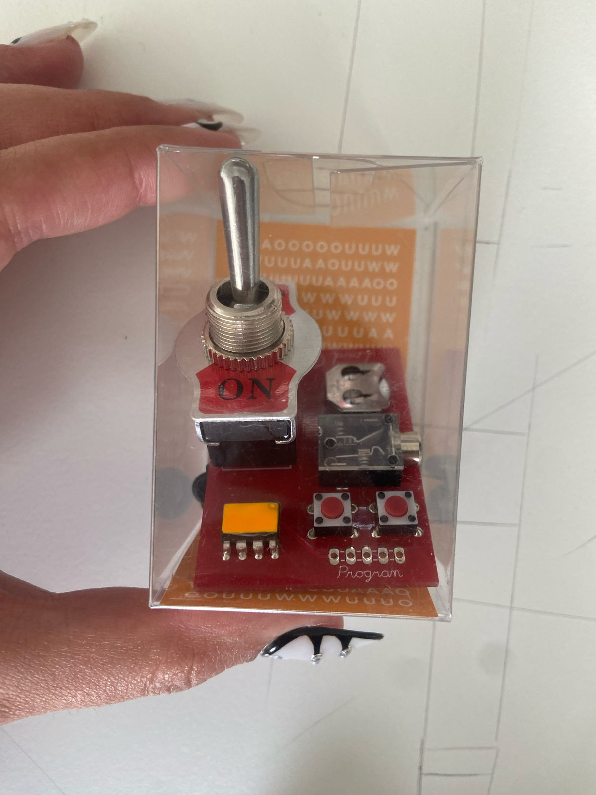

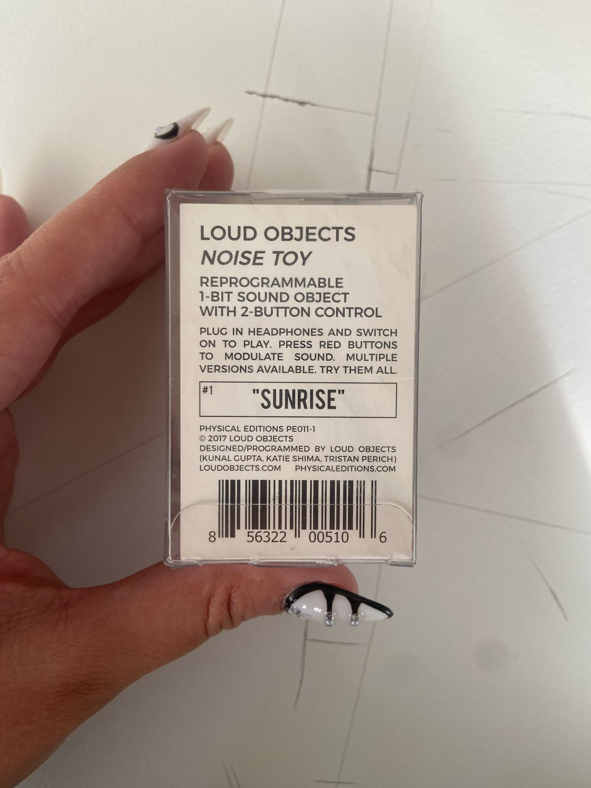

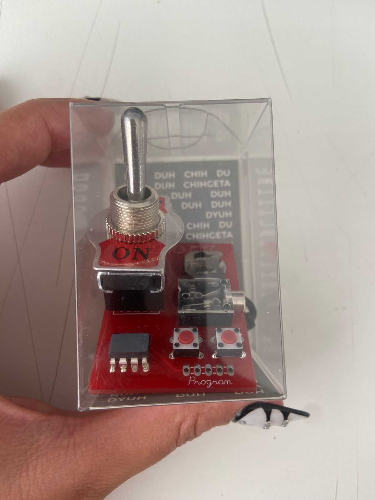

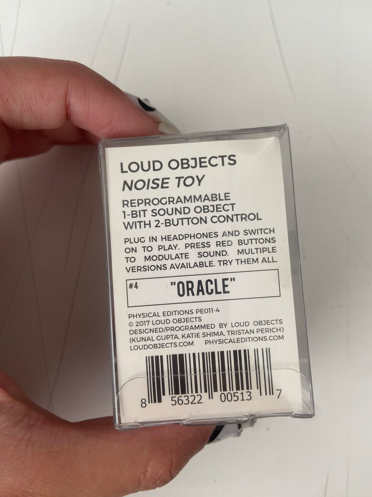

▼ Sitio web asociado: <https://loudobjects.bandcamp.com/merch>

#### Matías Serrano Acevedo - "Tarjeta de presentación"

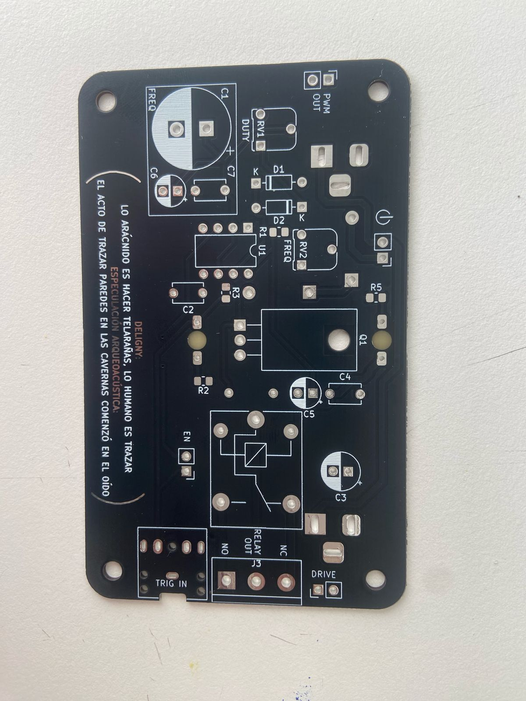

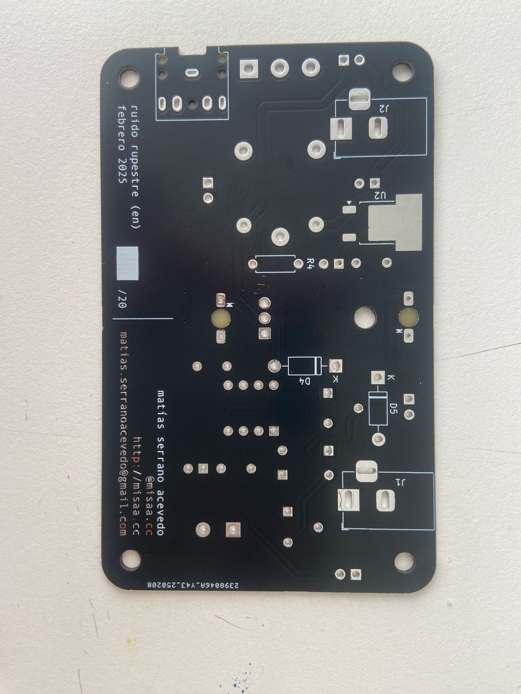

▼ Sitio web asociado: <http://misaa.cc/home.html>

Después empezamos a hablar a rasgos generales sobre el programa Kicad, que es un repertorio de componentes.

La primera etapa es el esquema. Se indican los componentes, el nombre, el valor. Solamente simbolo y conexión. Sin las dimenciones físicas.

Luego, para poder pasarlo a formato físico está el proceso de Footprint (huella), en la que se van colocando las dimenciones de los elementos para ir editando la placa ficticia.

En el siguiente proceso podrá ser visualizada en 3D la Placa de ruteo, que indica donde se van a colocar las partes exactas.

Este tipo de proyectos (Kicad) se pueden respaldar en github.

Al crear un archivo nuevo hay que permitir que se cree una carpeta con los documentos nuevos.
Aparecen 2 documentos: uno tipo sch y otro pcb. Procedemos a abrir el documento tipo sch, en el cual se trabajará el esquemático.

Apretamos el botón "Place symbols" (botón a), que abre una ventana emergente en la que se muestra una pantalla negra y un listado de cosas. Colocamos una resistencia, y usamos "r" para poder rotar. Para agregarle valor hay que presionar "v". Importante seleccionar el componente y no las letras.

Se colocan más componentes: un ne555, condensadores (uno polarizado), un led, conexión a tierra y conexión a energía.

Tras ello se presiona "w" para poner la herramienta de cables. Para mover el componente solo (sin las conexiones de cables) hay que presionar "m" y moverlo. Para trasladar el componente con el cable hay que precionar "g" y moverlo.

Ya que en este caso el Chip 555 tiene una terminal que no se va a conectar, hay que presionar el boton "q" para indicar que la pata número 5 no tendrá conexión. Después seguimos avanzando y realizando un esquema simple.

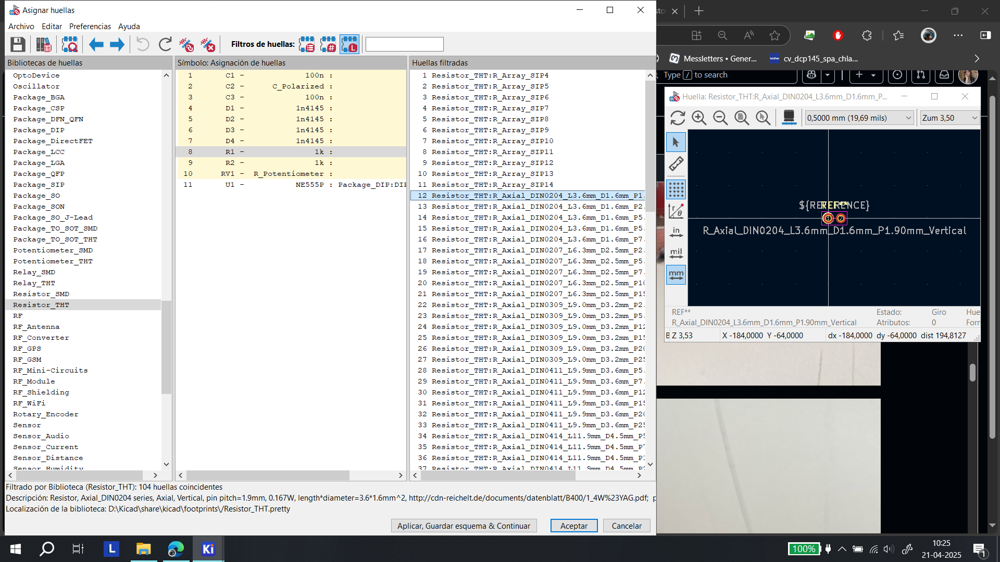

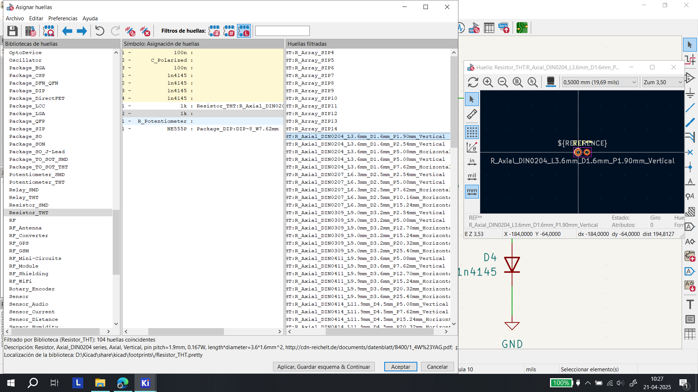

Package-> Es el encapsulado y protege a la pieza. DO35 es la forma, o mejor dicho, el tipo de encapsulado.

En el siguiente módulo terminé desconcentrandome, por lo que decidí consultar el "Manual de supervicencia" del profesor Matías.

<https://misaa.notion.site/Manual-de-supervivencia-para-KiCAD-8cc756e79ced4271ad575874aaa3497e>

***

### Encargo 14: Esquemático "Atari Punk Console" en KiCad

Dado que ya tenía hecho el esquemático del circuito dibujado en Ilustrator, solo tuve que buscar los componentes e ir montando de nuevo la estructura. Con las piezas que no conocía su nombre u código decidí buscarlas en google. Tras ello sólo quedó acomodar las partes y asignar los valores.

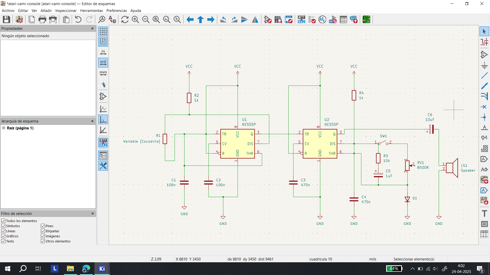

Imagen del diagrama final en Kicad

El archivo final se encuentra en la carpeta "diagram", puesto que al intentar subirlo a este documento github me lanzó el error "We don't support that file type", escribiendo muchas líneas de códigos (más de 300).

***

### Encargo 15: Preguntas sobre "Manual de supervivencia para KiCAD"

1-. ¿Cómo poder ordenar las patitas del chip N555 u otros componentes?

2-. ¿Cómo se puede colocar una imagen en PNG en la capa de serigrafía?

4-. ¿KiCad StepUp? Ayuda a poder descargar archivos en 3D

<https://github.com/easyw/kicadStepUpMod/>

***

### Encargo personal: "Una mente brillante" (2001)

▼ Portada de la película. Recuperado de: https://www.primevideo.com/-/es/detail/Una-Mente-Brillante/0JUMWO71OQJ1V10AV42E9KLCEE.

No es una tarea como tal, pero el profesor me dijo que sería un buen ejercicio verla... Lamentablemente no la he podido encontrar ni verla.

***

### Posdata

Aquí aguantando contra viento y marea (っ- ‸ - ς)

***

°˖✧◝(⁰▿⁰)◜✧˖°
