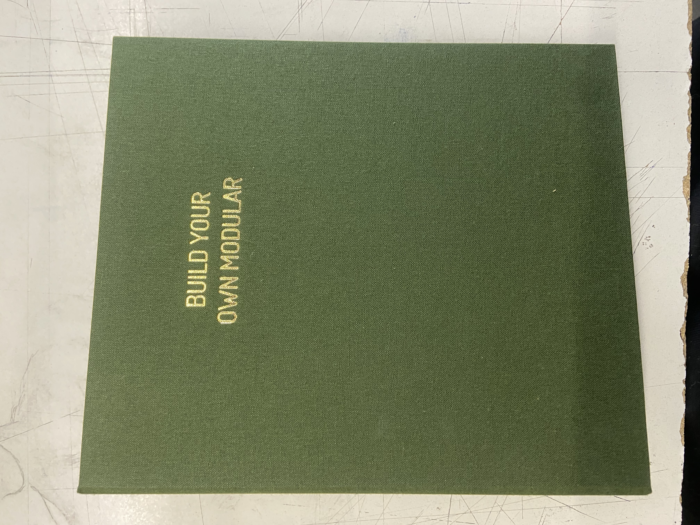
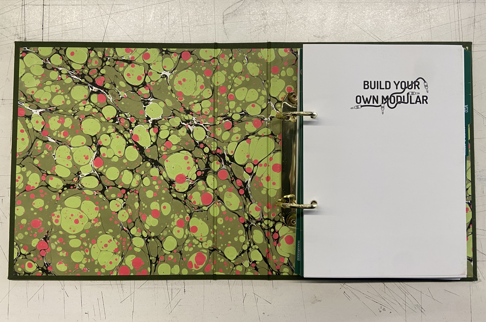
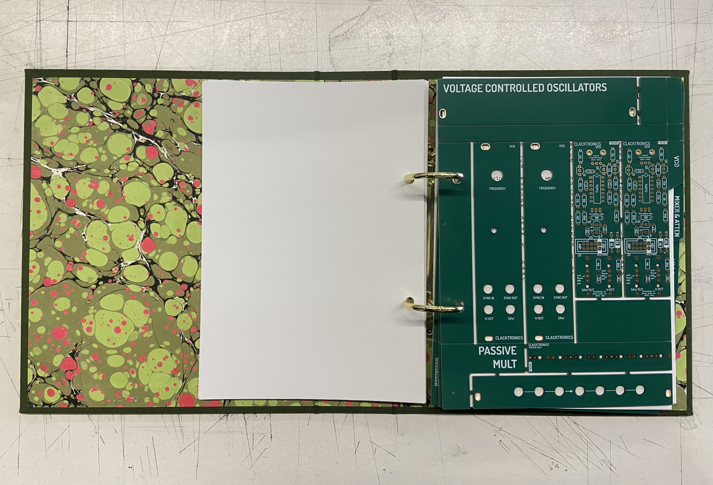
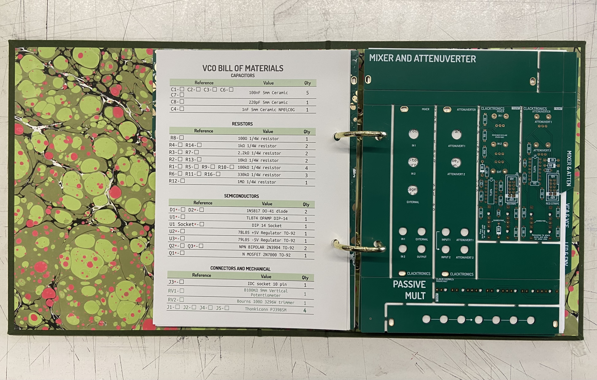
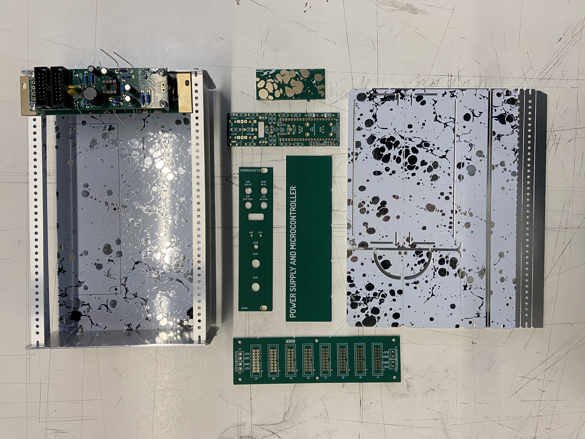

# ⋆₊˚⊹♡ Clase 07b - Kicad 2 y Atari punk console ♡⊹˚₊⋆

Viernes 25/04/2025

***

## Observaciones

La clase resolvimos dudase de Kicad, por lo que fue primordial el tener un portátil con el cual trabajar.

El primer módulo se centró en aprender a cómo construir el esquemático y colocar las "huellas" (asociar piezas reales al listado de materiales).

La segunda parte de la clase se centró en orientar los materiales dentro de una placa PCB ficticia y a poder revisarlos en 3D.

Además, el profesor trajo un libro que se centra en la construcción de un módulo.

Encontré un link que me lleva al producto: <https://www.thonk.co.uk/shop/byom/>

Y esta es la web de los desarrolladores: <https://clacktronics.co.uk/>

- Garrapatas = DIP (Dual in-line package o empaquetado/paquete de doble hilera).

***

## Bitácora digital

Al comienzo de la clase se nos presentaron algunos programas y bibliotecas que ayudan a poder facilitar los procesos de KiCad.

- **KiCad StepUp WB** (library) <https://github.com/easyw/kicadStepUpMod/>
  Permite importar diseños de PCB de KiCad a FreeCAD, creando un modelo 3D que puede ser utilizado para el diseño mecánico de la caja o envolvente.

  VRML -> El lenguaje de modelado de realidad virtual o VRML es un formato de archivo normalizado que tiene como objetivo la representación de escenas u objetos interactivos
  tridimensionales. Web a consultar: <https://www.geeksforgeeks.org/introduction-to-vrml/>

- **CAD assistant** (Herramienta) <https://www.opencascade.com/products/cad-assistant/>
  ¿Cómo poder exportar un archivo en 3D para poder revisarlo y fabricar una cobertura? Esta es una aplicación y software libre de Open CASCADE Technology que permite visualizar y convertir modelos 3D de CAD y malla.

Tras eso hubo que descargar un documento directo del Discord del curso y comenzamos con un proyecto nuevo.

Este documento posee un archivo (un chip 555). Este se agrega a a kicad mediante la gestión de biblioteca de simbolos (en herramientas).

Después, apretando la tecla "f" se pueden asignar "huellas", es decir, una forma física.

Dado que era un poco dificil encontrar la versión que se necesitaba, los profesores subieron mediante _discord_ la línea de palabras específica para encontrar el componente.

- Resistor_THT:R_Axial_DIN0207_L6.3mm_D2.5mm_P10.16mm_Horizontal (resistencia)

- Capacitor_THT:C_Disc_D6.0mm_W2.5mm_P5.00mm (condensador cerámico)

- Capacitor_THT:CP_Radial_D6.3mm_P2.50mm (Condensador polarizado)

- LED_THT:LED_D5.0mm (diodo led)

- Package_DIP:DIP-8_W7.62mm_Socket_LongPads (Chip 555 entregado por los profes)

- TerminalBlock:TerminalBlock_MaiXu_MX126-5.0-02P_1x02_P5.00mm (Parlante)

Después de hacer todas las huellas de los componentes, pues comenzamos a reordenar estos mismos para poder realizar el circuito de Atari Punk Console.

A su vez se habló ded la violencia que presente el lenguaje de los elementos (master.slave, trigger, etc). Se hizo referencia al blog "CMD", quienes crean una alternativa a los nombres de estas terminologías. (<https://cdm.link/so-yeah-lets-just-use-plug-and-socket-industry-group-recommends-obvious-change-in-terminology/>).

Se agregaron unas terminales para los cables tipo Caimán "Conn_01x01_Socket". Y después un interruptor "SW_SPDT", una batería "+9v" y un Screw Terminal (Terminal de tornillo) "Screw_Terminal_01x02"

Después se comenzó a nombrar y escribir los valores de los componentes, además de cambiarles el nombre.

Después del momento del break, hubo que volver a reinstalar una carpeta que mandaron por discord, por lo que se reemplazaron los documentos del anterior.
Tras eso hubo que gestionar la biblioteca de huellas para agregar unas las carpetas que se encuentran en "modules".

Una vez listo, volvemos al archivo del diagrama y comenzamos a revisar las huellas faltantes con la opción "Asignar huellas"

Ya teniendo el listado de huellas completo, toca trabajar en el documento pcb. Para ello es necesario reorganizar las piezas, crear las conexiones de cobre, las serigrafías, entre otros.

Al final no pude seguir el ritmo de la edición de la placa, por lo que tendré que estudiar la parte de edición y diseño gráfico de la placa, además de la importación.

Para ello he estado revisando una serie de videos de youtube: <https://youtube.com/playlist?list=PL-Hb9zZP9qC7-j4MKZNYg5i8rwu_ejkwW&si=FGzFyaG3pf5dPkZW>

Para finalizar la clase, nos enseñaron a como poder subir el documento a una página que se especializa en la fabricación de placas PCB.

<https://cart.jlcpcb.com/quote?orderType=1&stencilLayer=2&stencilWidth=100&stencilLength=100>

***

### Referentes visuales y de circuitos

 

Dado que en la clase se enseñó a como editar las placas PCB en el aspecto más visual, quise inspirarme y revisar circuitos mediante Pinterest buscando "PBC Art". Estos son algunos de los referentes visuales que encontré más atractivos.

 

#### Heart Shaped LED Chaser

 

_▼ Sitio web asociado: https://smokedprojects.blogspot.com/2014/01/valentine-led-chaser.html_

 

https://github.com/user-attachments/assets/99ced8d2-1dbc-48bc-a70e-326647521162

_▼ Video: https://youtu.be/UuvV8gj51LQ?si=0PgTeN-iXtJUCKnE_

 

#### Armored Trooper Votoms - iPhone case

 

_▼ Sitio web asociado: https://animeanime.global/2020/02/21/51644.html_

 

Esta es una placa diseñada para ser parte de una carcasa para iPhone. Por lo que informa la descripción posee un Led que se enciende sin usar batería, sino que hace uso de las ondas electrónicas del dispositivo móvil. El fabricante original se trata de "PBC Art Moeco" (https://pcbartmoeco.jp/), una empresa japonesa dedicada al diseño artístico sobre placas PBC para ser vendidas como carcasas funcionales. Posee muchas placas diseñadas con bastante precisión y belleza.

 

#### Fabriquer un CIRCUIT IMPRIME TRANSPARENT!

 

_▼ Sitio web asociado: https://youtu.be/jvw5OCUHaqc?si=msLq55Niw6DOSVZI_

 

Un video explicativo sobre como poder fabricar una placa PBC sobre vidrio u otro material transparente. Ello me abre a la imaginación y las posibilidades de poder mostrar la totalidad de la composición de un circuito.

 

#### Tristan Perich: 1-Bit Symphony

 

_▼ Sitio web asociado: https://www.tristanperich.com/#Album/1_Bit_Symphony_

 

Una composición electrónica de "cinco movimientos" en un solo microchip. Curiosamente presenta 6 piezas: una batería pequeña, un interruptor (para encenderlo), un microchip (que produce la música), un botón (que cambia la velocidad o la pista de audio), lo que parece ser un buzzer o mini parlante (mide el volumen de la música), y un conector de audio. Como indica en el sitio web del creador "(El álbum) No es una grabación en el sentido tradicional, literalmente "interpreta" su música en vivo al encenderse". Me gusta la simplicidad del circuito y todas las variedades de funciones que ofrece, me deja pensando en que no son necesarios muchos componentes para poder crear algo magnifico.

 

https://github.com/user-attachments/assets/beb47fe4-42c7-42db-b318-a0e984856fa1

_▼ Video: https://youtu.be/XZEXX9Yezjw?si=8DT6FTZDOTIuLpw-_

 

#### Pulsing Fluidic Heart Micropump

 

_▼ Sitio web asociado: https://www.instructables.com/Fluidic-heart-micropump/_

 

Nuevamente, de este proyecto me fascina la simpleza que posee. Aunque no se traten de circuitos cómo tal, considero que con las piezas necesarias se podría automatizar este objeto.

 

https://github.com/user-attachments/assets/386c253d-bace-4cff-a1e2-98ec8a553136

_▼ Video: https://vimeo.com/95586316_

 

#### Tufty 2040

 

_▼ Sitio web asociado: https://magazine.raspberrypi.com/articles/tufty-2040-interactive-name-badge-review_

 

Fabricado por Pimoroni (https://shop.pimoroni.com/products/tufty-2040?variant=40036912595027), es una placa que se basa en el chip de microcontrolador RP2040 y posee un una pantalla LCD a color de 2,4 pulgadas, siendo una "Pantalla Badger Programable". Esto quiere decir que es un gafete interactivo que consiste en una tarjeta programable que integra un microcontrolador RP2040 y una pantalla E Ink (tinta electrónica) para crear una tarjeta de identificación que puede mostrar diferentes textos e imágenes (https://www.330ohms.com/products/badger-2040#:~:text=El%20Badger%202040%20es%20un,mostrar%20diferentes%20textos%20e%20im%C3%A1genes). 

Me parece un objeto bastante curioso, siendo atraída principalmente por el aspecto visual. Al informarme me di cuenta de la complejidad que posee, y de lo útil y divertido que puede ser el tener una de estas placas.

 

_▼ Video: https://youtu.be/zNBdtbM-HrI?si=JVj6EfCIrfvPOkb6_

 

Pese a varios intentos, no pude colocar el video directamente desde youtube.

 

***

### Posdata

Me quedé colgada a la mitad de la clase, así que toca estudiar y practicar ૮◞ ﻌ ◟ა

Además, me dediqué a observar el link que mandaron los profesores, y me llama la atención el poder ver que tipo de circuitos crea la gente: 

https://www.reddit.com/r/PrintedCircuitBoard/comments/1k9ulzt/review_request_esp32c6_jtag_and_header_pin_uart/#lightbox

***

°˖✧◝(⁰▿⁰)◜✧˖°
