# ⋆₊˚⊹♡ Clase  09b - Receso de clases ♡⊹˚₊⋆

Viernes 9 Mayo 2025

***

## Observaciones

La clase comenzó con referentes y referencias: Gordon Matta-Clark, entre otros.
Tras la exposición de estos, proseguimos a hablar sobre la posición de la universidad en el mundo (según varios rankings).

A su vez conversamos sobre los primeros auxilios psicológicos y algunos hablaron de sus logros y cosas buenas que habían pasado en la semana, en conjunto a los profes.

Tras ello nos quedan las últimas 7 semanas de clases. Vamos a usar nuevas piezas para aprender qué son y para que sirven.

***

## Bitácora digital

### Parte 1: Piezas nuevas traídas a la clases

- [PAM 8403](https://afel.cl/products/amplificador-stereo-clase-d-2x3w-pam8403?srsltid=AfmBOoq8AjxWD2ZoGiEjyWEiV9xWqypejVilDozwdgQ8L9h4xyjweiaL):

Es un módulo y amplificador digital dual relacionado al audio. El módulo sa tecnología SMD ("Dispositivo de Montaje de Superficie", es un circuito PCB soldado por la parte superior de la placa, teniendo el montaje por un lado al ser soldado por una máquina).

¿Qué es un amplificador? Es un circuito cuya función es incrementar la intensidad de la corriente. En este caso, el efecto que produce es aumentar la potencia de la señal de audio a la par que permite lograr una reproducción de sonido de alta calidad gracias al bajo THD (Total Harmonic Distortion). La pieza en si posee una doble salida.

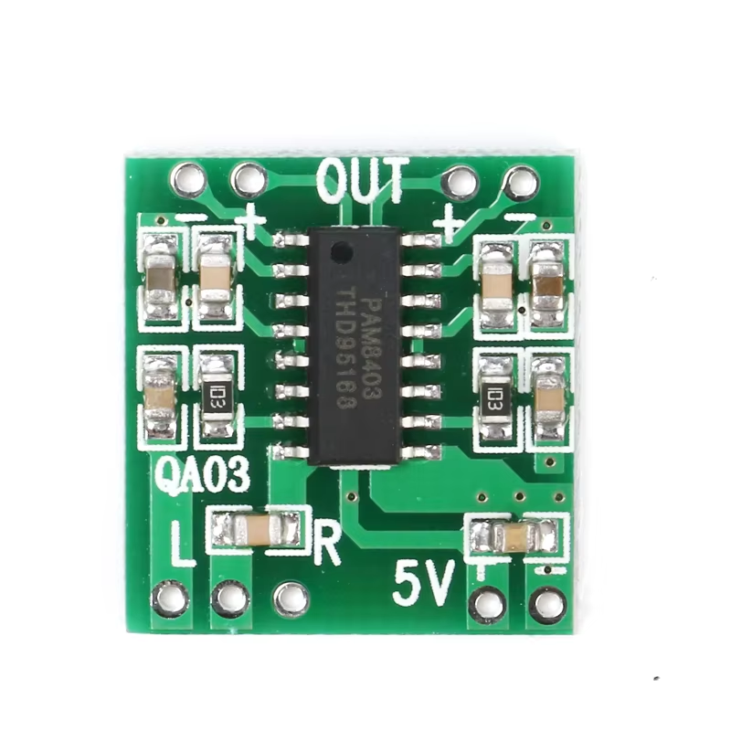

▼ Imagen de referencia (uno similar, cambia el chip). Obtenido de [Aliexpress.](https://es.aliexpress.com/item/1005002662145301.html).

- [RELE de 01 Canal](https://afel.cl/products/rele-de-01-canal):

Un Relé (en inglés Relay) es una pieza electrónica que funciona como un interruptor controlado por la energía presente en un circuito electrico. Esta pieza posee una bobina (almacena energía de forma pasiva) y un electroimán (requiere de la bobina para funcionar, permitiendo prender o apagar según la presencia de corriente).  Su funcionamiento permite encender u apagar secciones de un circuito (privando u otorgando electricidad a diferentes partes) y controlar la potencia de la energía que ingresa (actuando como un amplificador eléctrico al controlar dispositivos de alta potencia con señales eléctricas de baja potencia y al contrario). Existen variedades de relés en el mercado: electromecánicos (EMR), de estado sólido (SSR) y los Reed.

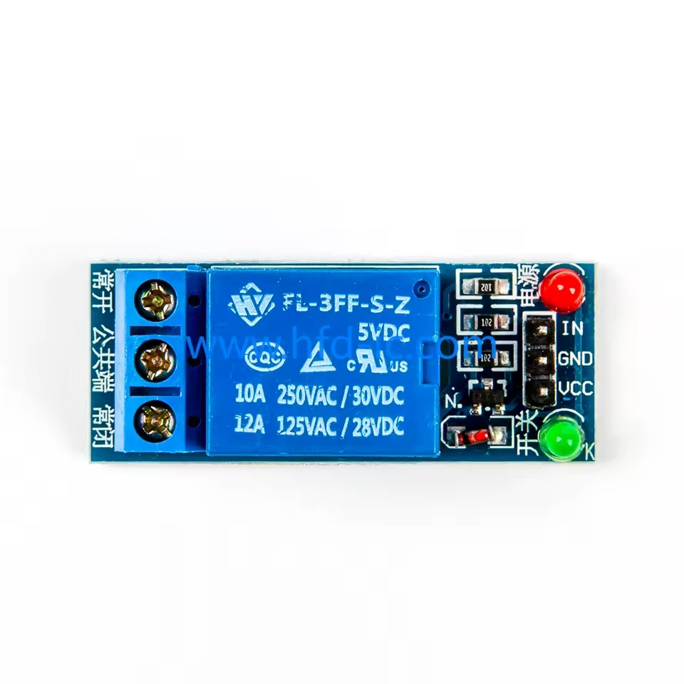

▼ Imagen de referencia. Obtenido de [Aliexpress.](https://es.aliexpress.com/item/1005005959775711.html).

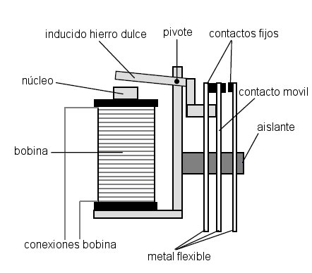

▼ Esquema de las partes de un relé. Obtenido de [Electricidad Práctica.](https://autodesarrollo-electricidadpractica.blogspot.com/2011/07/relays.html).

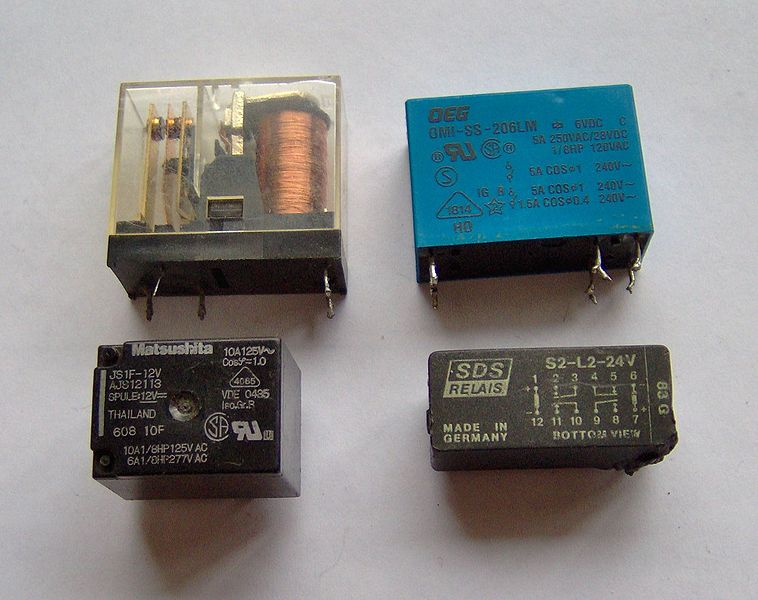

▼ Partes de un relé. Obtenido de [Electricidad Práctica.](https://autodesarrollo-electricidadpractica.blogspot.com/2011/07/relays.html).

- [1N4007 Diodo](https://maxelectronica.cl/componentes-electronicos/163-diodo-rectificador-1n4007.html):

Esta pieza es un Diodo rectificador, una pieza semiconductora que actua como un interruptor unidireccional (la corriente sigue un camino y no se devuelve), a la par permite la conversión de corriente alterna (CA senoidal, varía la magnitud y el sentido, como la energía que llega a los hogares) a corriente continua (CC, un flujo continuo de cargas eléctricas entre dos puntos con diferente potenciales y cargas eléctricas, sin cambiar el sentido). Estos poseen polaridad, teniendo una entrada positiva (ánodo) y otra negativa (cátodo). Si este se conecta con la parte positiva a la corriente y la parte negativa a tierra se permite la circulación, en caso contrario sirve como un aistante.

[¿Qué es un diodo? - fluke](https://www.fluke.com/es-cl/informacion/blog/electrica/que-es-un-diodo#:~:text=Permite%20que%20la%20corriente%20fluya,voltaje%20y%20capacidad%20de%20corriente.)

[Diferencias entre Corriente Alterna y Continua - MasterD](https://www.youtube.com/watch?v=85eQw7cmDqU)

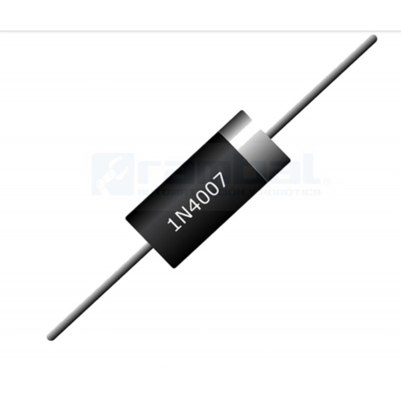

▼ Imagen de referencia. Obtenido de [Rambal.](https://rambal.com/circuitos-integrados/2120-diodo-1n4007-1kv1a.html).

Con estas piezas en mano (metafóricamente hablando) nos disponemos a recordar los conocimientos relacionados con el chip 555 y sus estados: astable (estado variable constante) y monoestable (estado permanente hasta que se perturbe). Ello para poder realizar un montaje virtual mediante Tinkercad, puesto que casi ningún esudiante llevó el kit de prototipado.

Estas piezas nos hacen pensar en el concepto de "Modularidad" aplicado a los circuitos, lo que refiere a crear piezas replicables dentro de un circuito más grande.

***

#### Parte 2: Circuito PWM (Pulse Width Modulation - Modulación por ancho de pulso)

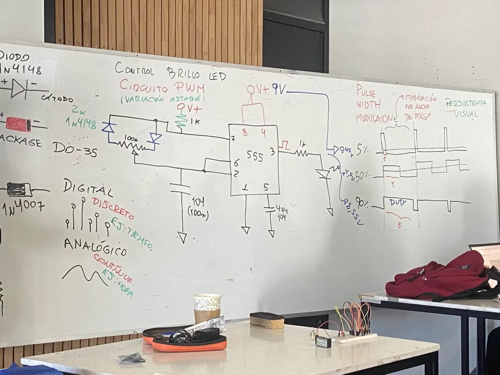

▼ Fotografía del circuito dibujado en la pantalla.

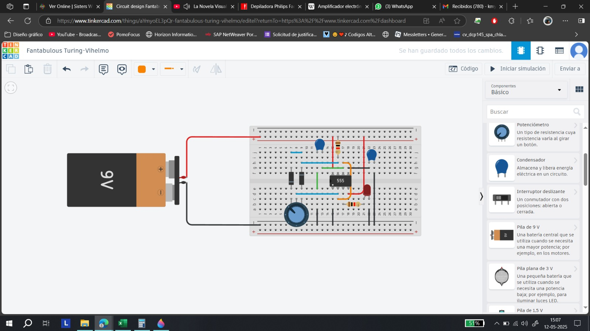

▼ Resultado del circuito hecho en Tinkercad.

Tras este ejercicio rápido y la simulación de este, los profesores se pusieron a explicar la teoría de cómo funciona un relé dentro de un circuito, procediendo por un lado a usar el prototipado del circuito anterior, conectarle un relé y una ampolleta en la salida (en vez del led). Como se puede observar, el Relé permite que la energía pueda encender y apagar la ampolleta.

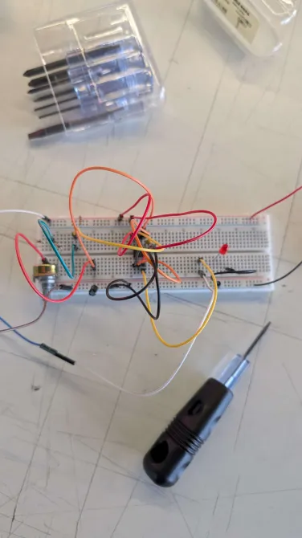

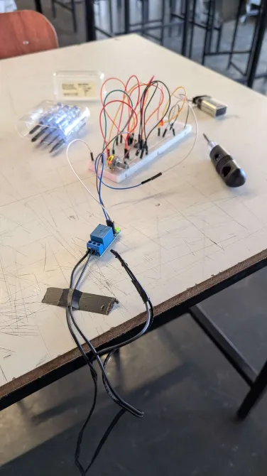

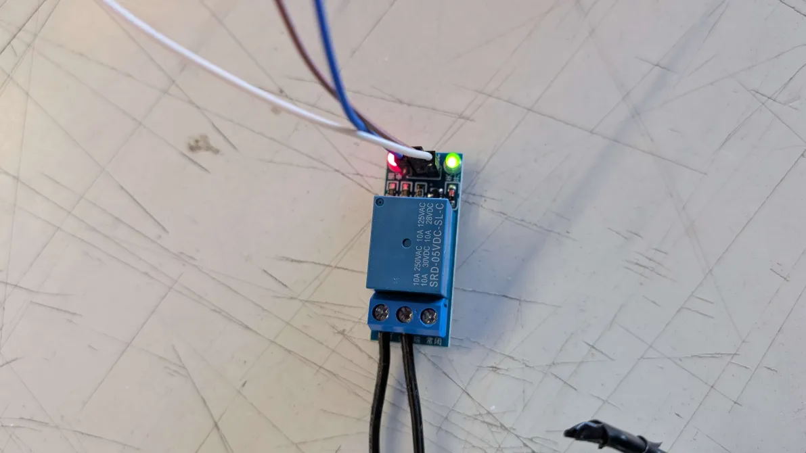

▼ Imágenes recuperadas del discord del curso, otorgadas por Aarón Montoya.

<https://github.com/user-attachments/assets/9707321d-749d-48dc-b4ed-07b176e1966d>

▼ Video del resultado.

***

### Encargo 18: Tinkerkad a protoboard

Desarrollo del circuito visto en clases

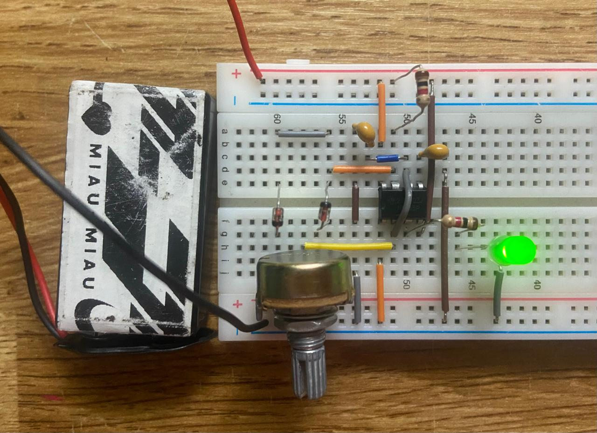

<https://github.com/user-attachments/assets/c9754b91-30a6-4a1d-9720-86b4a049daac>

***

### Encargo 19: Laurie Anderson

Este referente fue mencionado en clases, destacando su obra "Concert for Dogs" la cuál como su nombre lo indica corresponde a un concierto-performance dirigido hacia los perros. Para ello, la artista realizó una serie de piezas músicales pensadas en ser tocada en una frecuencia audible para los caninos. La primera presentación se llevó a cabo en Times Square (EEUU) en pleno invierno, reuniendo a cerca de 50 canes y 100 de sus acompañantes humanos. El concierto tuvo como instrumento el violín (instrumento que inventó en 1970) y el teclado, cuyas vibraciones al ser transmitidas a una serie de parlantes se creaba un nuevo sonido debido a la baja frecuencia resultante, el cuál apenas era audible para las personas por lo que se dispuso de auriculares que permitían escuchar el concierto como si lo hiciera un perro. Cada momento fue registrado como parte de la experiencia.

(<https://www.theguardian.com/music/2016/jan/05/laurie-anderson-music-dog-concert-times-square-new-york>)

▼ Imagen del concierto. Obtenido de [Independent.](https://www.independent.co.uk/arts-entertainment/music/news/performance-artist-laurie-anderson-plays-concert-especially-for-dogs-in-new-york-a6798581.html).

Tras indagar sobre esta obra, me surgió la duda, ¿Quién es Laurie Anderson?, ¿A qué se dedica y por qué es famosa/destacada?

Para ello quise escuchar un video que encontré en youtube: ["El proceso creativo de Laurie Anderson (Español"](https://www.youtube.com/watch?v=SB0eIKQwkOs).

Artista multimedia, primera y última artista con residencia en la NASA. Su carrera ha abordado variedades de disciplinas, desde la música, la escultura, la poesía, la fotografía, el cine, entre otras.

***

### Posdata

Pese a la poca energía que presentaba, decidí ir. Quiero seguir progresando  ૮ ◞ ﻌ ◟ ა

***

°˖✧◝(⁰▿⁰)◜✧˖°
