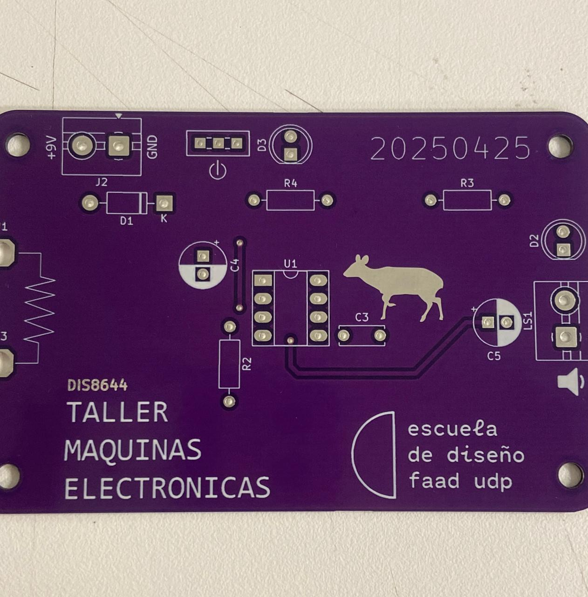

# ⋆₊˚⊹♡ Clase  10b - Montaje udpudu (Usted pudu) ♡⊹˚₊⋆

Viernes 16 Mayo 2025

***

## Observaciones

Esta clase falté. Por lo que supe los contenidos vistos giraron en torno al montaje de las piezas dentro de la placa PCB de udpudu. Por ello, a cada persona se le entregó una placa de color morada (personalización hecha por el equipo docente), y fueron dando las indicaciones para poder ir soldando poco a poco las partes del circuito.

***

## Bitácora digital

Al no estar presente no pude montar nada, por lo que no tengo registro de ningún tipo además de la fotografía de cuándo recibí la placa.
Apenas disponga de más tiempo quiero acercarme al laboratorio para poder soldar las piezas en el circuito y documentar mi propio proceso.

▼ Fotografía de la placa entregada.

Además, puedo recuperar el BOM del circuito de la carpeta de [docentes](https://github.com/disenoUDP/dis8644-2025-1/blob/main/00-docentes/sesion-10b/README.md)

|Referencia  |Valor   |Huella                   |Qty|OBS               |
|------------|--------|-------------------------|---|------------------|
|U1          |~       |Socket 8 pines           |1  |                  |
|R2,R3,R4    |1k      |Resistencias             |3  |                  |
|D1          |1n4007  |Diodo                    |1  |                  |
|C3          |100n    |Condensador cerámico     |1  |104               |
|C4          |1u      |Condensador electrolítico|1  |                  |
|C5          |47u     |Condensador electrolítico|1  |                  |
|D2,D3       |LED     |Led 5mm                  |2  |                  |
|J2          |TBLOCK_2|Terminal Block 2         |1  |                  |
|LS1         |SPK     |Terminal Block 2         |1  |                  |
|SW1         |SW_SPDT |Switch spdt              |1  |                  |
|U1          |NE555   |DIP-8                    |1  |Va en el socket U1|
|Clip batería|9v      |                         |1  |                  |
|Parlante    |8ohm    |                         |1  |                  |
|J1,J3       |CAIMAN  |Cables caimán            |2  |                  |

***

## Encargo 22 y 23: documentación textual y visual del proceso de ensamblado

***

### Posdata

Pese a la poca energía que presentaba, decidí ir. Quiero seguir progresando  ૮ ◞ ﻌ ◟ ა

***

°˖✧◝(⁰▿⁰)◜✧˖°
