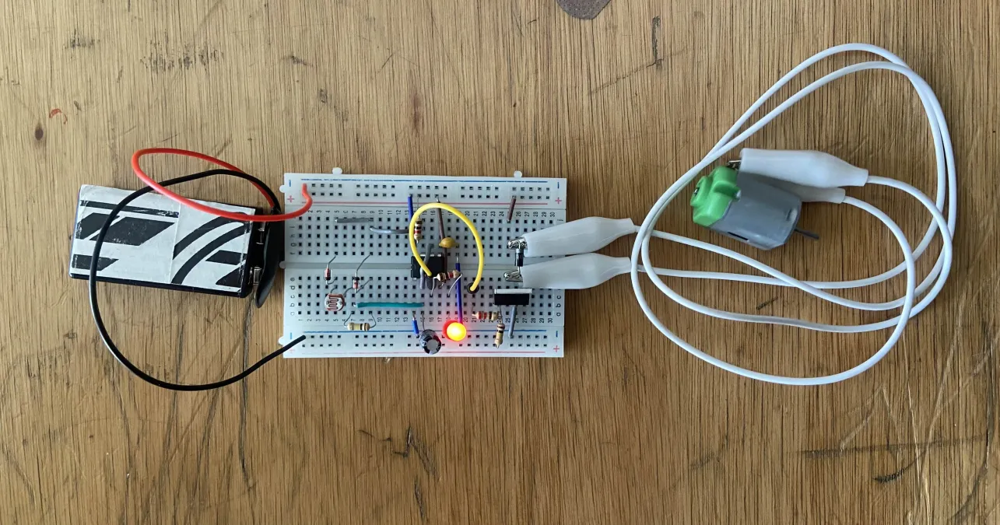

# ⋆₊˚⊹♡ Clase  11a - Circuitos PWM (Pulse Width Modulation) ♡⊹˚₊⋆

Martes 20 Mayo 2025

***

## Observaciones

Llegué a las 8:45 apróximadamente, por lo que se pusieron a hablar de los resultados obtenidos en el curso de "Programación creativa", análizando los códigos de el ejercicio (clifford1one), sus componentes, que es "P5js", y una pequeña observación que se realizó modificando el código.

A su vez se compartió un libro que el profe se encuentra leyendo: [Object-Oriented Python](https://nostarch.com/object-oriented-python).

Tras ello la clase se puso filosófica. Todo objeto tiene propiedades y métodos. Se habló sobre el filósofo "Graham harman" y el como definimos los objetos. Se nombró que la "estética" fue una de las primeras filosofías.

***

## Bitácora digital

### Parte 1: Recordar los conocimientos de la clase pasada

#### Componentes

R (Resistencias), C (condensadores), D (diodos), IC (integrated circuit, chip), POT (potencimetro), BAT (batería), PS (power supply), +9v, GND (ground), LED, OP AM (amplificador operacional), LDR, RELÉ, PROTO, SN, PCB (placa), PERFBOARD.

#### Circuitos

PMW (Duty Cycle), Astable (As), Monoestable (Ms).

#### Aplicaciones

APC (atari punk console), Brilla LED, ON/OFF Ampolleta, Sinte Rexp (UDPUDU)

Hoy vamos a ver un motor que funcione con chips 555 y pmw. Para eso armamos el circuito PWM/Brillo LED.

▼ Diagrama del circuito con motor realizado por el profesor Matías.

A su vez se nos entregó una serie de piezas:

- Transistor Mosfet (TO-220)
- Motor

▼ Piezas entregadas durante la clase. Izq a derecha: transistor npn pn2222a, mosfet-n irfz44e, base para circuito, amplificador operacional lm324, xx, interruptor pequeño, motor.

Tras ello nos dedicamos a montar un circuito, cuyas partes a destacar son el chip 555 y el motor.

<https://github.com/user-attachments/assets/8156aa4b-71b2-416e-898e-d62e0a743243>

▼ Fotografía y video del resultado de la clase.

***

### Posdata

ah  ૮ ◞ ﻌ ◟ ა

***

°˖✧◝(⁰▿⁰)◜✧˖°
