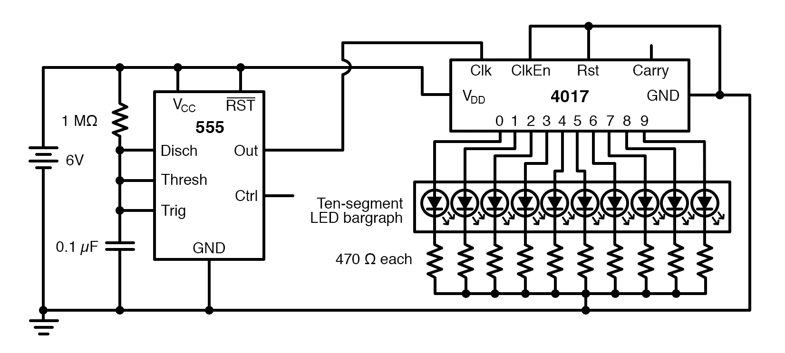
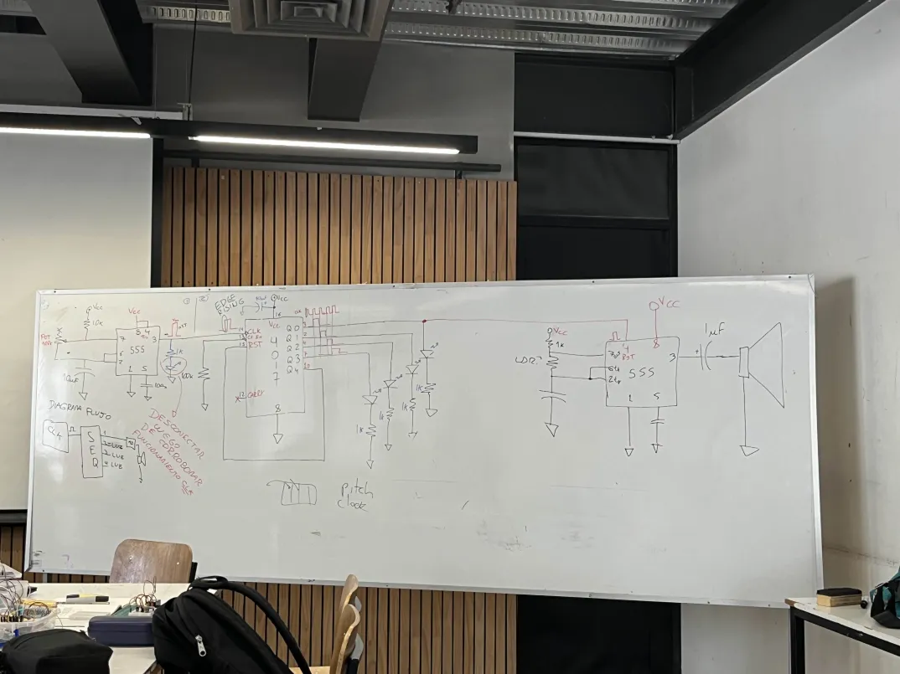
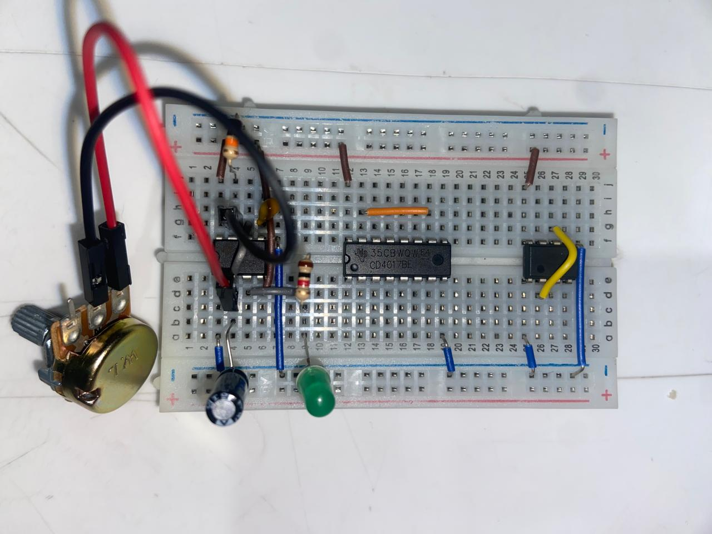
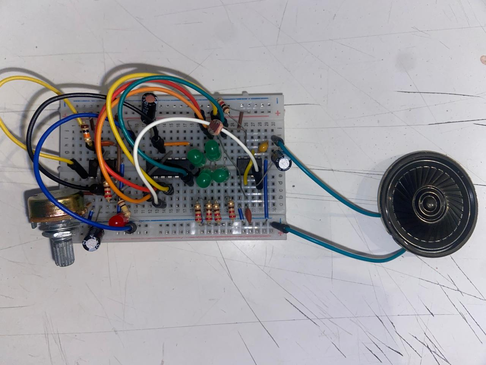

# ⋆₊˚⊹♡ Clase  11b - Circuitos PWM (Pulse Width Modulation) ♡⊹˚₊⋆

Viernes 23/05/2025

***

## Observaciones

<!---Recordar para programar "md" (markdown): 
- https://github.com/adam-p/markdown-here/wiki/Markdown-Cheatsheet 
- https://www.markdownguide.org/basic-syntax/--->

Esta clase comenzamos a ver un nuevo chip, a aprender sus funciones y a montar un circuito con el cuál presenciar de qué forma puede ser implementado en nuestros proyectos.

A la par, soltaron otro referente para ver: Hail to the thief - Radiohead

***

## Bitácora digital

### Parte 1: Chip 4017

Esta parte de la clase vamos a comenzar a trabajar con un nuevo chip: el 4017. Este posee un total de 14 patitas.

El chip 555 es un temporizador que alterna entre "tierra" y el "voltaje de alimentación", dando una señal de aviso. La pata 4 del 555 es similar al reset del 4017.

Hay dos tipos de lógica en la electrónica, en la cual la lógica secuencial se centra en una serie de eventos que generan un resultado a través del tiempo.

El chip 4017 no tiene que ser regular. Es un detector de trasnmisiones (ondas).

▼ Recuperado de: <https://www.allaboutcircuits.com/textbook/experiments/chpt-7/led-sequencer/>

Para ello se nos propone el desarrollo de un circuito, el cuál funciona con 2 chips 555 y 1 Chip 4017.

▼ Fotografía de la pizarra con el esquema dibujado por el profesor Matías. Recuperado de discord.

Tras las indicaciones, fui intentando montar el circuito poco a poco. Lo malo es que a pesar de todos los intentos que hice para que funcionara pues no encendió del todo. Ante ello pensé que podía deberse a un mal funcionamiento de la protoboard o de alguna otra pieza, y dado que no tenía otra para poder reensamblar todo me quedé observando que es lo que hacía el resto del curso mientras tanto.

Otro día quise volver a montar todo, pero nuevamente me fallaron los circuitos en todas las ocasiones.

Al final decidí tomarle fotos a mis fracasos y volver a averiguar qué era lo que estaba mal antes de que perdiera la paciencia.

▼ Fotografía de mis intentos para montar el circuito.

De igual forma, al menos pude disfrutar de los videos que hicieron los demás, destacando el de ["3-antocristi"](https://github.com/disenoUDP/dis8644-2025-1/tree/main/03-antocristi) video que me permitió disfrutar mejor del circuito en vez ded quedarme ansiosa ante tanto estimulo en la sala.

<https://github.com/user-attachments/assets/8f857e2c-bc76-409f-820d-e8b514a862c7>

▼ Video de un circuito y su funcionamiento. Recuperado de discord.

***

### Posdata

ah  ૮ ◞ ﻌ ◟ ა

***

°˖✧◝(⁰▿⁰)◜✧˖°
