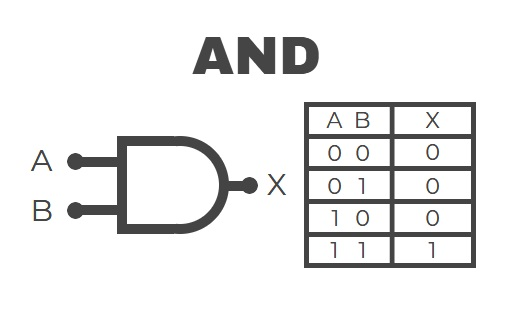

# ⋆₊˚⊹♡ Clase  12a - Circuitos para un proyecto ♡⊹˚₊⋆

Martes 27 Mayo 2025

***

## Observaciones

<!---Recordar para programar "md" (markdown): 
- https://github.com/adam-p/markdown-here/wiki/Markdown-Cheatsheet 
- https://www.markdownguide.org/basic-syntax/--->

Llegué tarde debido a un atraso en la afluencia del metro. Terminé sobre estimulada. Cuando llegué ya estaban hablando de materia y proyectos a realizar. Al igual que la clase pasada me sentí en parte desorientada, estaban hablando sobre el circuito de la clase pasada y cómo a mí me había fallado me costó en parte entenderlo. Más tarde decidí retirarme de la clase por no sentirme bien y por problemas personales.

***

## Bitácora digital

### Parte 1: [Datasheet chip 4017](./archivos/cd4017b-mil.pdf)

Se estuvo analizando las partes de este documento, el cual muestra la naturaleza de este chip.

Logica de boole
<https://es.wikipedia.org/wiki/%C3%81lgebra_de_Boole>

Compuerta AND

***

### Posdata

ah  ૮ ◞ ﻌ ◟ ა

***

°˖✧◝(⁰▿⁰)◜✧˖°
