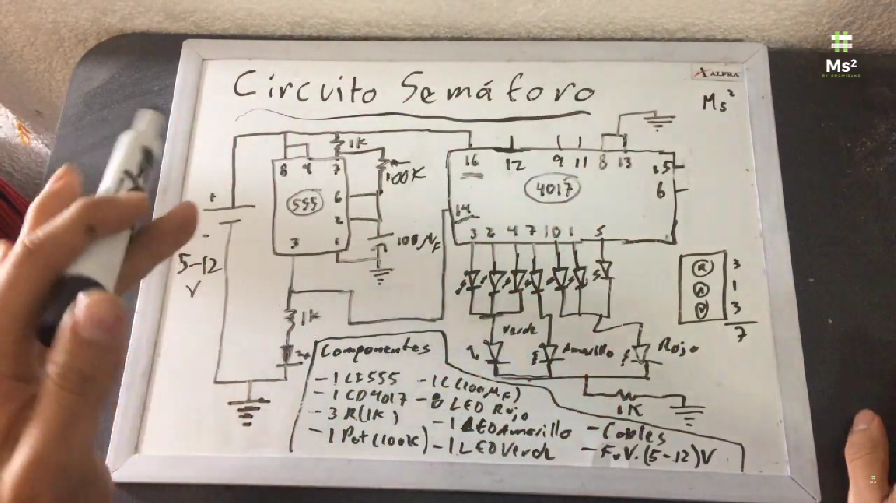
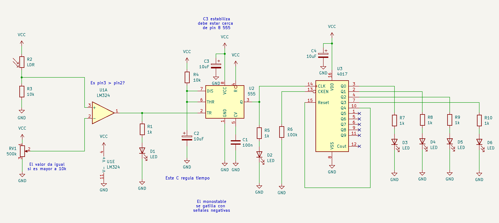

# ⋆₊˚⊹♡ Clase  12a - Circuitos para un proyecto ♡⊹˚₊⋆

Martes 27 Mayo 2025

***

## Observaciones

<!---Recordar para programar "md" (markdown): 
- https://github.com/adam-p/markdown-here/wiki/Markdown-Cheatsheet 
- https://www.markdownguide.org/basic-syntax/--->

Llegué tarde debido a un atraso en la afluencia del metro. Terminé sobre estimulada. Cuando llegué ya estaban hablando de materia y proyectos a realizar. Al igual que la clase pasada me sentí en parte desorientada, estaban hablando sobre el circuito de la clase pasada y cómo a mí me había fallado me costó en parte entenderlo. Más tarde decidí retirarme de la clase por no sentirme bien y por problemas personales. Es por ello que decidí consultar las bitácoras de otros estudiantes.

Los links de los repositorios consultados son:

- 08-clifford1one: <https://github.com/Camila-Parada/dis8644-2025-1/tree/main/08-clifford1one/sesion-12a>
- 19-felix-rg416: <https://github.com/Camila-Parada/dis8644-2025-1/tree/main/19-felix-rg416/sesion-12a>
- 25-FranUDP: <https://github.com/Camila-Parada/dis8644-2025-1/tree/main/25-FranUDP/sesion-12a>

Indagar sobre la [Logica de boole](https://es.wikipedia.org/wiki/%C3%81lgebra_de_Boole).

***

## Bitácora digital

### Parte 1: [Datasheet chip 4017](./archivos/cd4017b-mil.pdf)

Se estuvo analizando las partes de este documento, el cual muestra la naturaleza de este chip. Dentro de la información a destacar se encuentra:

- Se trata de un contador o decorificador con 10 salidas, por lo que requiere de 10 pulsos para luego volver a reiniciarse.

- Permite controlar múltiples dispositivos de manera eficiente.

- Funciona con un voltaje mínimo de 3V y uno máximo de 15V, contando con un bajo consumo de corriente.

Además de esta información se nos recordó sobre la compuerta AND

▼ Esquema de entrada AND. Recuperado de: https://mielectronicafacil.com/sistemas-digtales/compuerta-and/#compuerta-logica-and-de-2-entradas

A la par, por lo que pude entender, se nos consulta cómo deberíamos hacer un semaforo. Por mi parte pensé a primeras que se puede realizar haciendo funcionar 2 chips 4017, pues lo más importante es mantener un tiempo con una luz verde y otro de luz roja, la luz amarilla dura menos dado que es una advertencia. Indagando sobre otras respuestas, pude leer las propuestas de 25-FranUDP, quien indica que "el output 1 active un transistor que conecte otro(s) capacitor(es) al circuito astable (555) que lo haría funcionar, efectivamente cambiando la frecuencia a la que corre el circuito, variando el tiempo que se mantiene encendida cada LED.". Dentro de su misma bitácora informa que @SebastianSaez1003 propone "conectar múltiples outputs a un mismo LED para variar el tiempo que permanecen encendidos cada uno". Al final el profesor Misa propone utilizar el pin "Clock Inhibit" para extender el tiempo de encendido.

Esto queda de revisarlo, por lo que terminé encontrando un [video](https://www.youtube.com/watch?v=HsykBu2-RTQ&ab_channel=MainstreamM2) que enseña un circuito que ayuda con este desafío.

▼ Captura de imagen del video. Recuperado de: https://youtu.be/HsykBu2-RTQ?si=XJc1v17i30nYJRXo.

### Parte 2: Circuito detector de sombras

Más tarde se enseñó un nuevo circuito para desarrollar. En este se pueden observar que las piezas más destacadas se tratan de un amplificador operacional, un chip 555 y un chip 4017.

▼ Esquemático del circuito desarrollado por el profesor Misa. Recuperado de discord.

Dado que muy tarde me di cuenta de la existencia de este circuito, no pude darme el tiempo de fabricarlo, por lo que pude encontrar una imagen del circuito hecho por mi compañera [10_Bernardita Lobo](https://github.com/disenoUDP/dis8644-2025-1/tree/main/10-Bernardita-lobo).

▼ Circuito hecho por "10_Bernardita Lobo". Recuperado de discord.

***

### Posdata

ah  ૮ ◞ ﻌ ◟ ა

***

°˖✧◝(⁰▿⁰)◜✧˖°
