# sesion-10b

viernes 16 de mayo

firefox es el único navegador que no depende de chromium y es programable.

death internet theory:  es una teoría conspirativa que afirma que actualmente Internet está dominado por la actividad de bots, deepfakes, la inteligencia artificial y el contenido generado automáticamente mediante algoritmos, marginando la actividad humana orgánica.

circuit bending: customización creativa de circuitos con dispositivos electrónicos.

nic collins - circuit bending 

*handmade electronic music, the art of hardware hacking* - libro de nicolas collins, se encuentra en el lab de interacción digital

csv: valor separados por coma 

conversor de csv a markdown

css: crear carpeta css para definir distintos estilos, ya sea tipografías, colores, etc.

## entrega de placas y soldaduras 

nos hicieron entrega de las placas diseñadas en Kicad (udpudu), luego nos reunimos en grupos para dar comienzo a las soldaduras de los componentes a la placa.

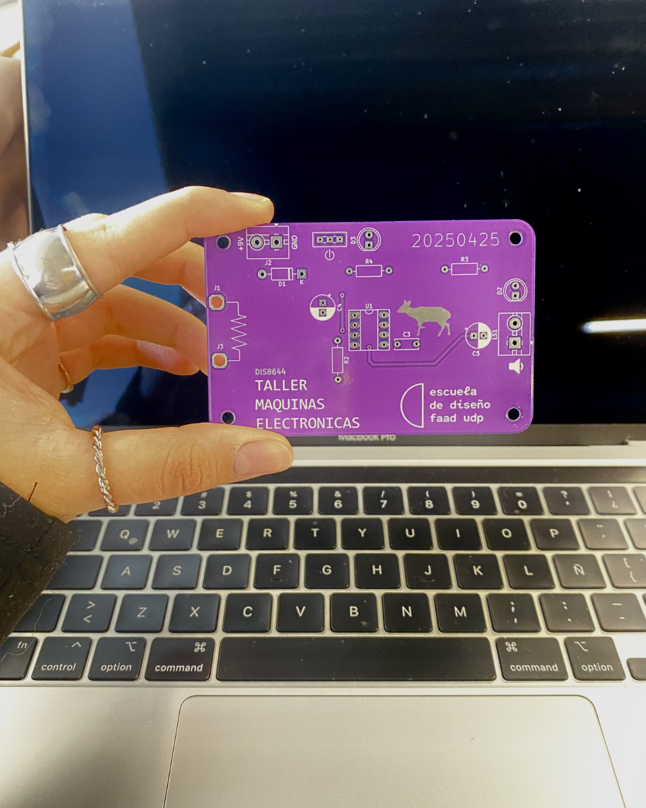

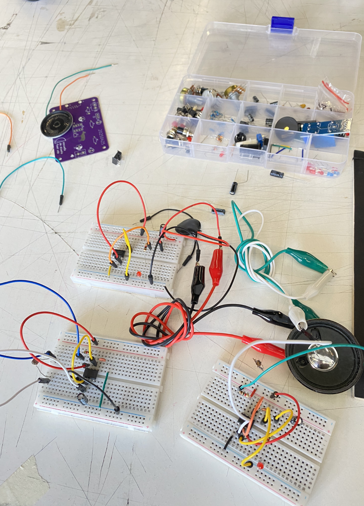

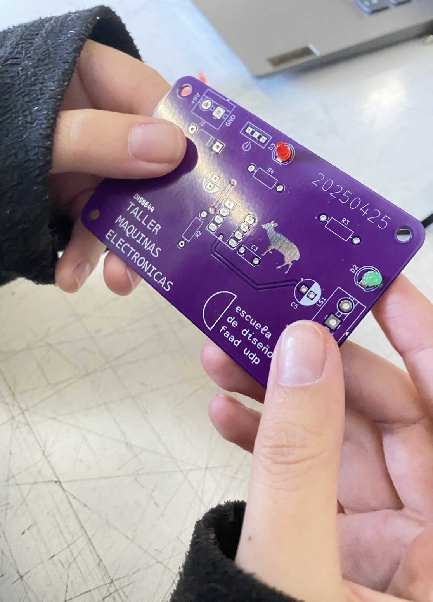

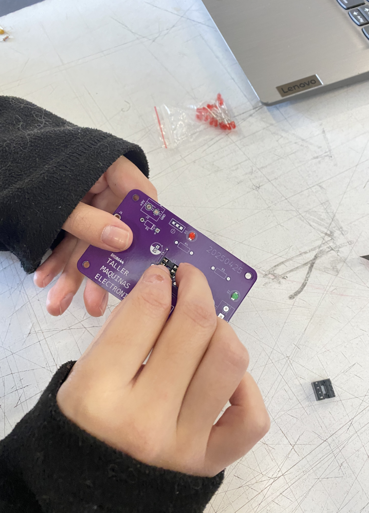

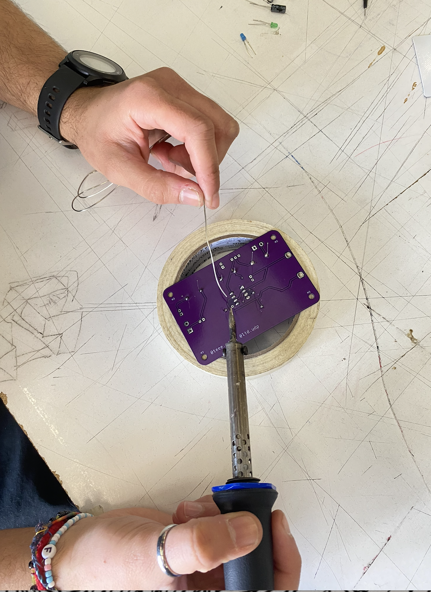

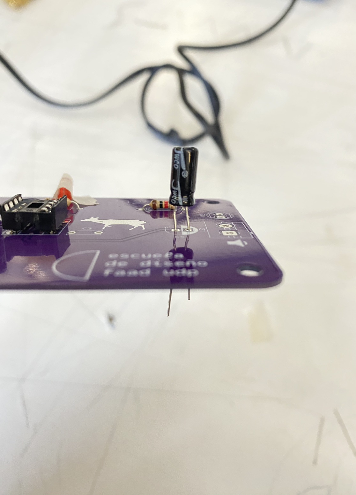

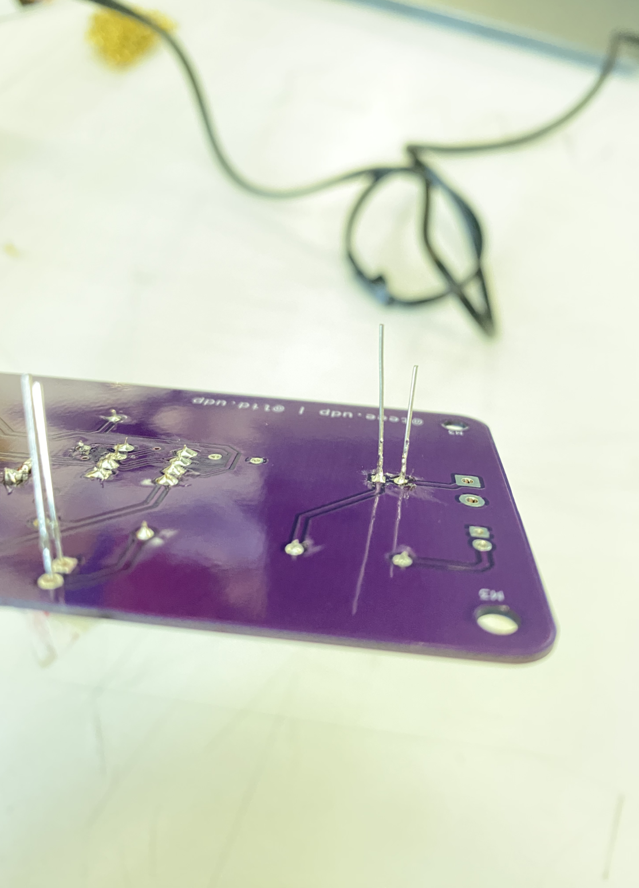


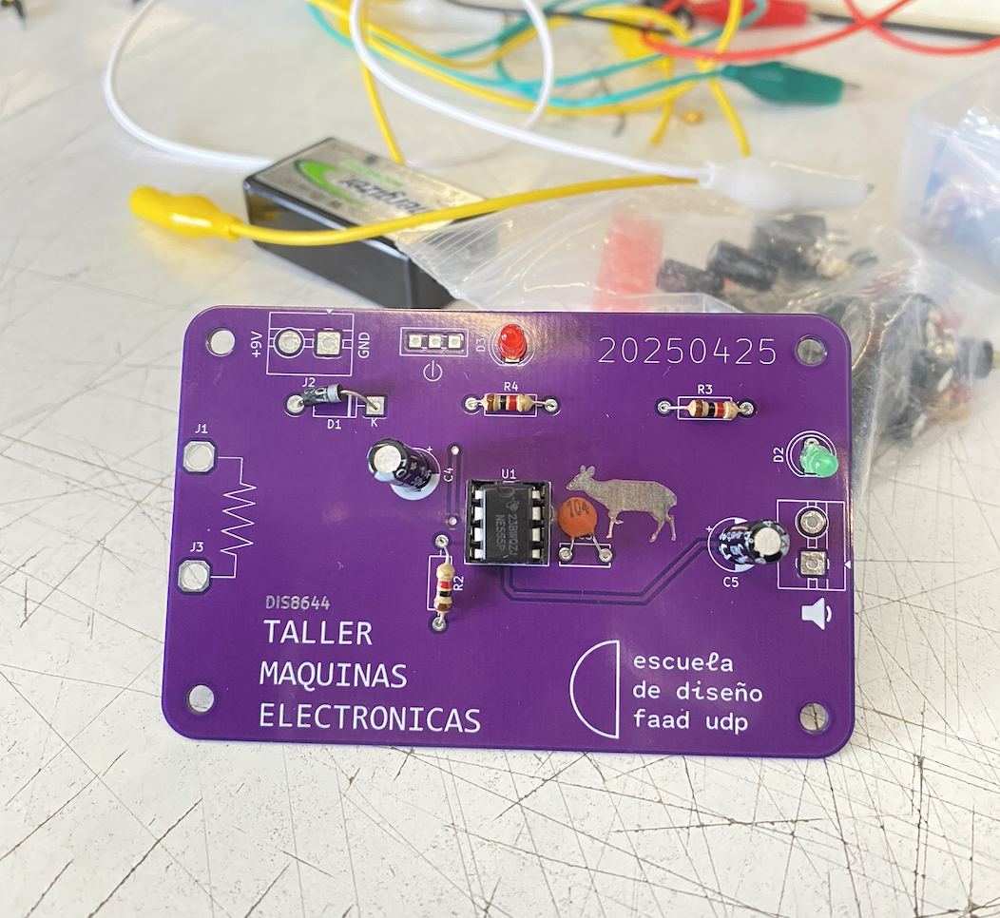

## encargo-20: pantallas de 7 segmentos

**foto tomada el día martes en el laboratorio digital FAAD de la udp en ss.**

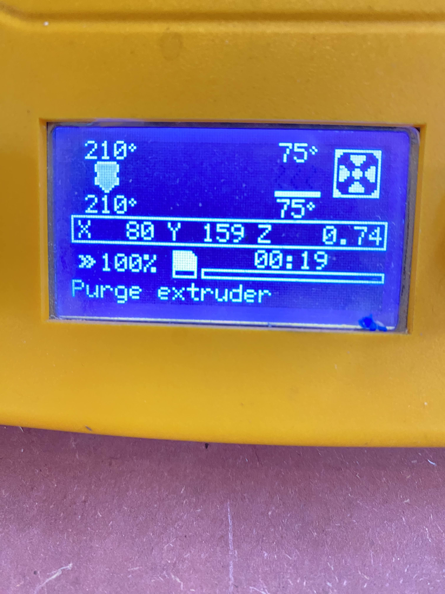

**foto tomada el día martes en la entrada de ss donde los funcionarios marcan y registran su llegada.**

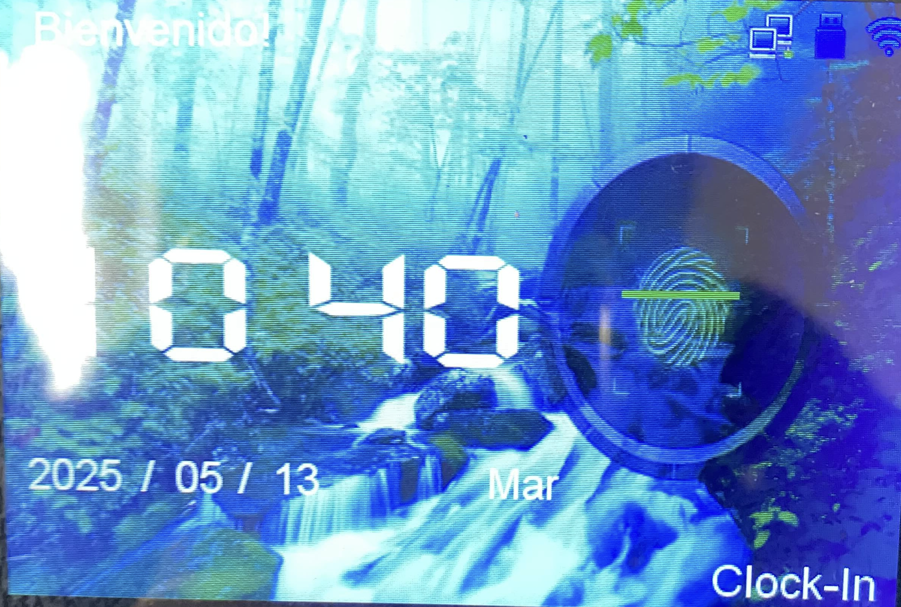

**foto sacada el día jueves a la pantalla de la lavadora de mi casa, indica el tiempo de lavado y el on/off**

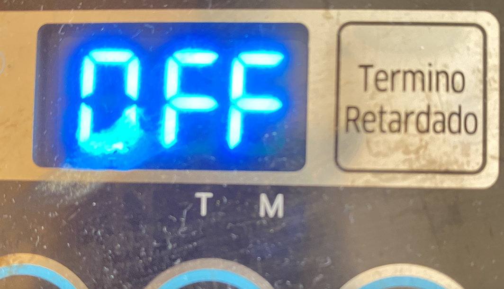

## encargo-21: simulación de circuitos con 555 y/o comparadores hechos con opamps en Falstad

```txt
$ 1 0.000015625 15.472767971186109 40 5 43 5e-11
165 544 64 544 112 6 0
r 288 96 288 160 0 10000
r 544 -16 544 96 0 1000
w 544 160 480 160 0
w 480 160 288 160 0
w 544 192 480 192 0
w 480 192 480 160 0
w 544 96 288 96 0
c 480 192 480 272 4 1.0000000000000001e-7 2.0790550402916117 0.001 0
g 480 272 480 304 0 0
R 544 -48 544 -128 0 0 40 5 0 0 0.5
R 608 -32 608 -128 0 0 40 5 0 0 0.5
w 608 32 608 -32 0
w 672 96 736 96 0
w 736 96 736 -32 0
w 736 -32 608 -32 0
w 544 -16 544 -48 0
g 640 272 640 304 0 0
w 640 272 640 224 0
c 608 224 608 304 4 1.0000000000000001e-7 3.333333333333314 0.001 0
g 608 304 608 336 0 0
165 960 64 960 112 6 4.999999949999993
w 672 128 800 128 0
w 800 128 800 160 0
w 800 160 960 160 0
r 928 -64 928 48 0 1000
r 928 -144 928 -96 0 10000
R 928 -176 928 -224 0 0 40 5 0 0 0.5
w 928 -176 928 -144 0
w 928 -96 928 -64 0
w 928 48 928 96 0
w 928 96 960 96 0
w 928 96 928 192 0
w 928 192 960 192 0
w 928 192 928 256 0
c 928 256 928 320 4 4.7000000000000005e-7 2.473032175625909 0.001 0.1
g 928 320 928 352 0 0
w 1152 -32 1024 -32 0
w 1152 96 1152 -32 0
w 1024 32 1024 -32 0
R 1024 -32 1024 -128 0 0 40 5 0 0 0.5
w 1088 96 1152 96 0
g 1024 304 1024 336 0 0
c 1024 224 1024 304 4 1.0000000000000001e-7 3.3333333333333455 0.001 0
w 1056 272 1056 224 0
g 1056 272 1056 304 0 0
209 1168 128 1264 128 4 0.00009999999999999999 3.375077994860476e-14 0.001 0 1
w 1088 128 1168 128 0
211 1360 128 1488 128 0 1 8000 1
w 1264 128 1360 128 0
o 46 64 0 4363 0.0000762939453125 0.00009765625 0 2 46 3
o 1 64 0 4363 5 0.0015625 1 2 1 3
o 35 64 0 4363 5 0.2 2 2 35 3
´´´
