# sesion-11a

20/05/2025

**Componentes:**
* r          * +9vol
* c          * led
* d          * op-amp
* ic         * ldr
* pot        * relé
* bat        * proto
* ps         * sn (estaño)
* pcb        * perfboard

**Circuitos:**

*APC
*PWM
*astable + monostable = APC 

**Aplicaciones:**

* apc
* brillo - led
* on/off - ampolleta
* sinte - udpudu

## Estudio de chips y modulos

Día de hoy: uso de motor 

transistor mosfet: tiene 3 patas, envía una señal para dejar pasar la energía. Controla el flujo y se activa solo con un voltaje de entrada

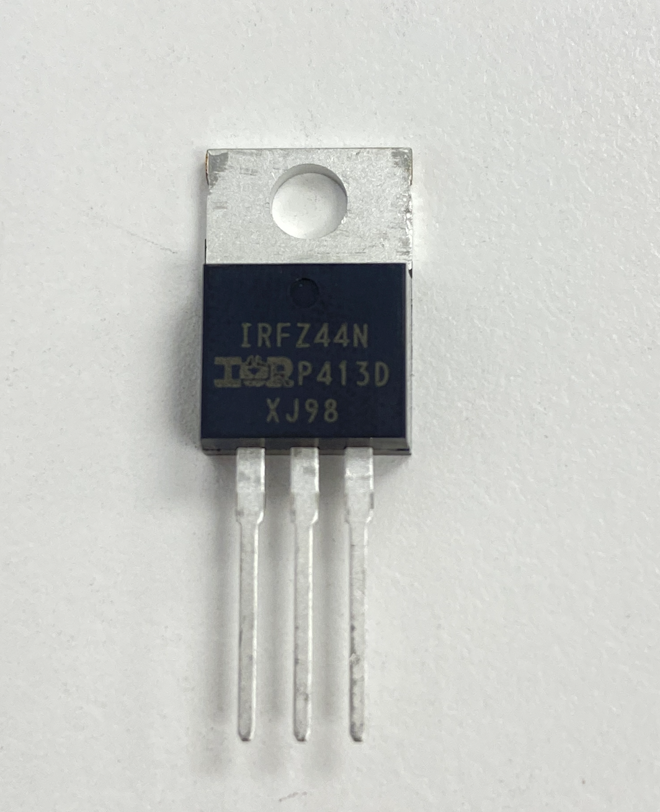

motor PWM: la velocidad o potencia del motor se ajusta al variar el ancho de los pulsos de voltaje que se le suministran, en lugar de variar la tensión de forma continua. 

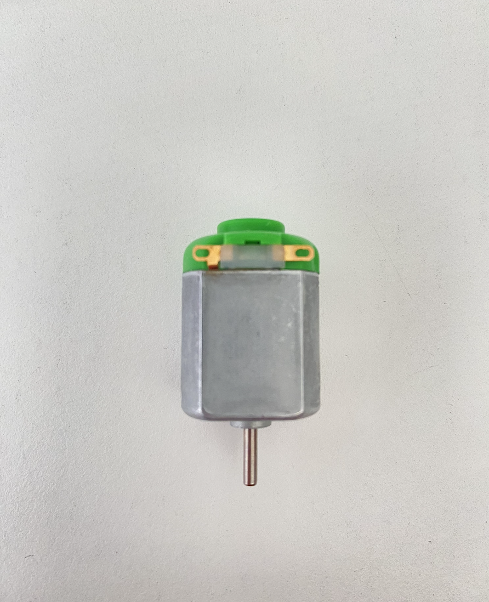

conectar al circuito a un transistor que se conecta a un motor.

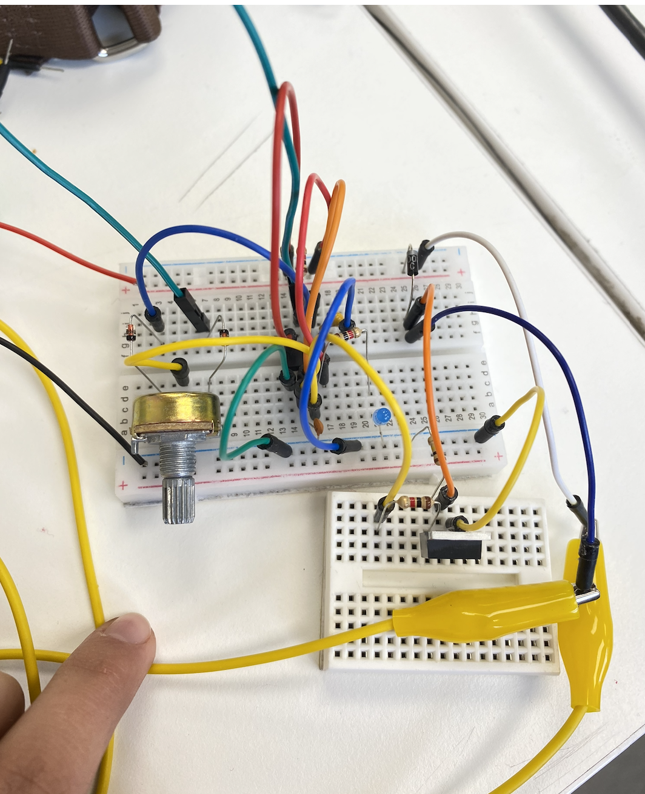

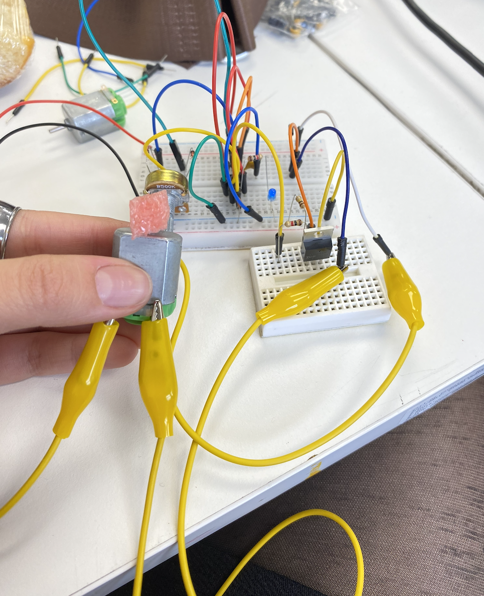

https://github.com/user-attachments/assets/e2bf2f33-2f52-4a92-a823-d0fa2a2c49e9

luego se cambió el potenciometro por un LDR y una resistencia 

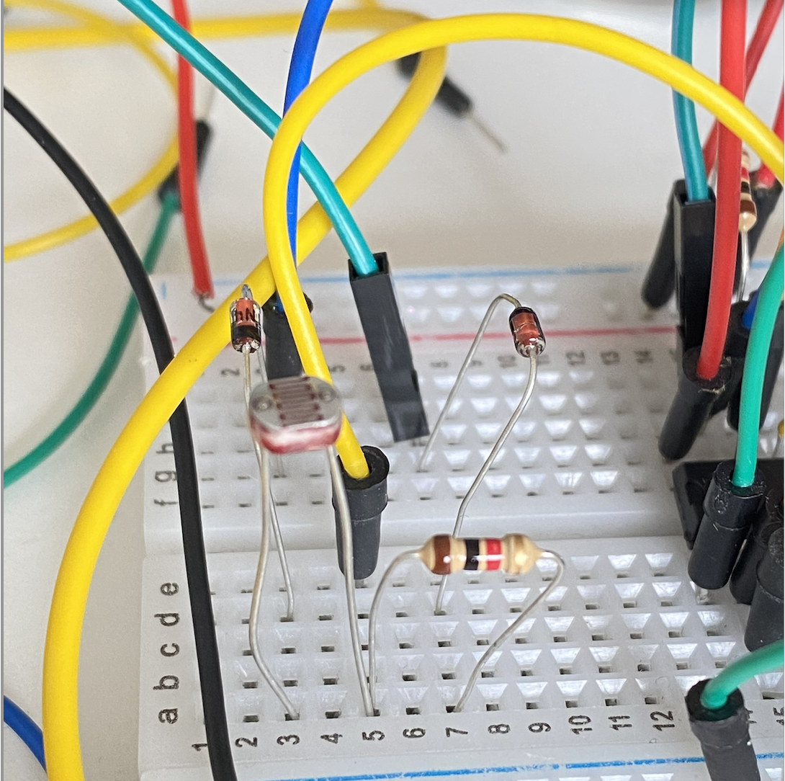

ps: power supply 

* 9v - * portátil
       * accesible
       * recargable
       * alto voltaje

* usb -  * portátil (power bank)
   o
transfo. * accesible
         * recargable
         * voltaje 5v

## encargo-22: documentación textual del proceso de ensamblado de udpudu

Herramientas y materiales necesarios:

1. Cautín
2. Estaño
3. Alicates de corte
4.  Esponja o lana metálica para limpiar la punta del cautín

## Pasos a seguir

**PASO 1: Juntar los componentes necesarios**

* Verificar y revisar la BOM, asegurarse de tener todos los elementos necesarios.
* Organizar los componentes por tipo: resistencias, condensadores, etc.

**PASO 2: Verificar funcionamiento e insertar componentes**

* Rehacer el circuito en la protoboard para verificar su funcionamiento y hacer cambios de componentes.
* Una vez verificado el circuito y que todo funcione, insertar los componentes en la PCB.

Tips:

Doblar las patas de los componentes para que no se salgan al dar vuelta la PCB.

Si hay polaridad, verificar orientación (ej: condensadores electrolíticos, diodos, LEDs).

**PASO 3: Soldar**

* Calentar el cautín.

* Limpiar la punta del cautín antes de cada soldadura.
* Aplicar calor a la pista de cobre y la pata del componente al mismo tiempo.
* Aplicar el estaño sobre la unión (no sobre la punta del cautín).
* Quitar el estaño y luego el cautín.
* Verificar que la soldadura haya quedado bien (evitar soladurad frías, opacas o con forma de bola).

**PASO 4: Cortar excesos**

*Una vez que todos los componentes estén soldados, usar el alicate para cortar las patas sobrantes lo más cerca posible de la soldadura (también se peude usar un cortauñas).

IMPORTANTE: tomar la pata que se cortará para que no salte ni mate a nadie.

**PASO 5: Verificar**

* Revisar visualmente que no haya puentes de soldadura.
* Verificar orientación de componentes.
*( Opcional) Usar un multímetro para chequear continuidad y valores de resistencias.

**PASO 6: Energizar y probar**

* Conectar la alimentación
* Verificar funcionamiento del circuito

## encargo-23: documentación visual del proceso de ensamblado de udpudu

**Asegurarse de tener todos los elementos necesarios**

*foto por @/ AlanisMria en discord*

**Rehacer el circuito en la protoboard**

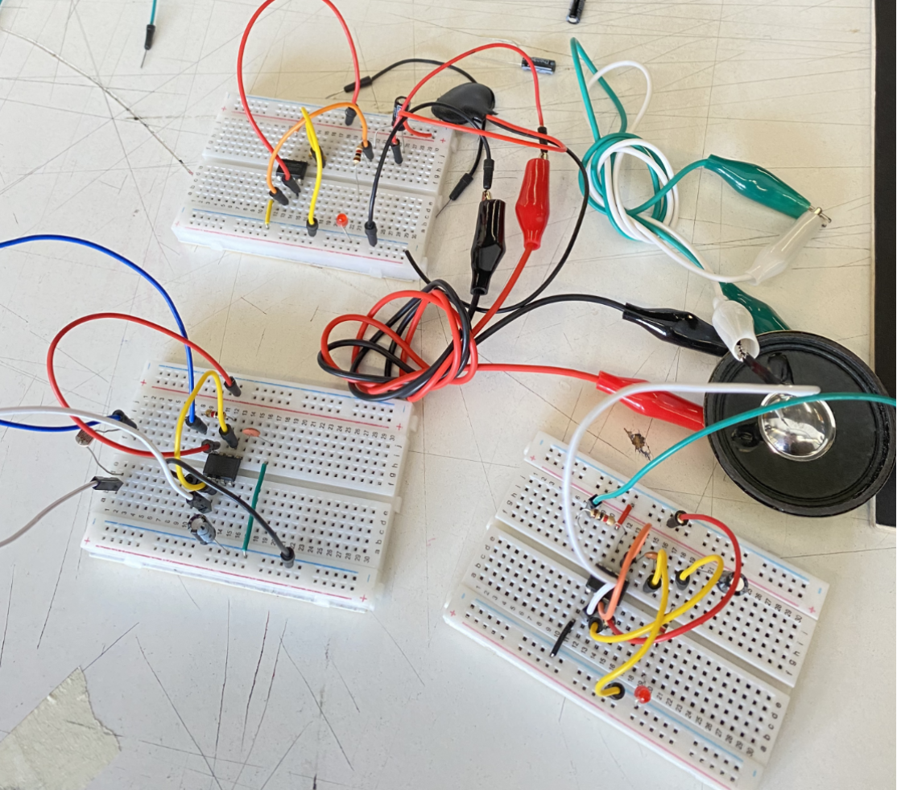

**Insertar los componentes en la PCB**

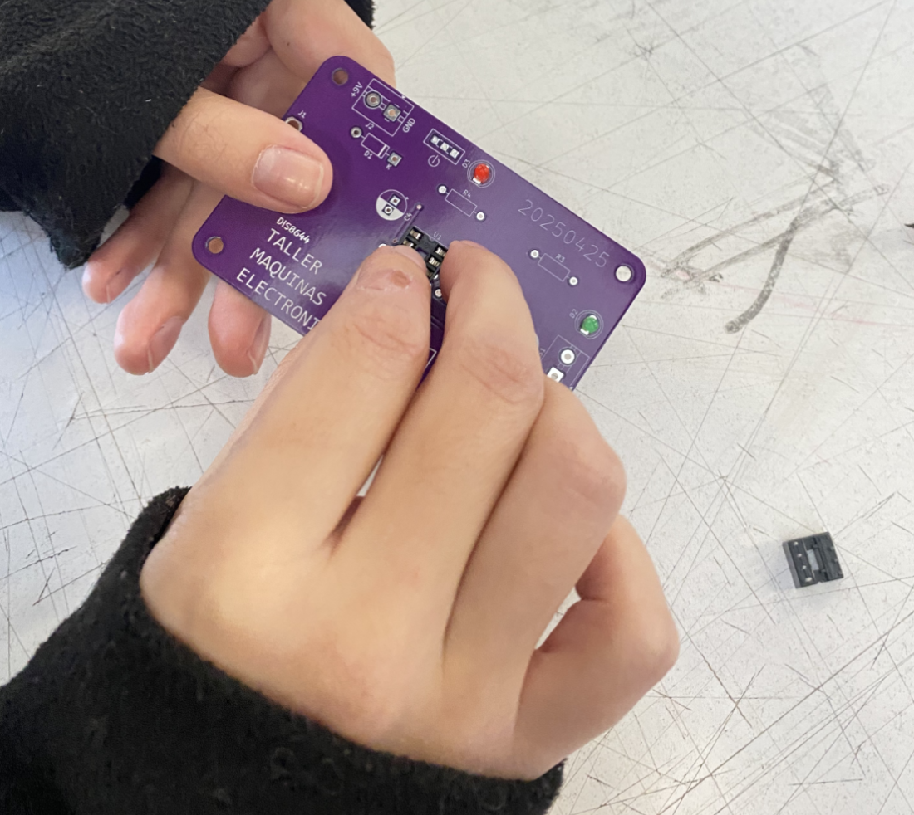

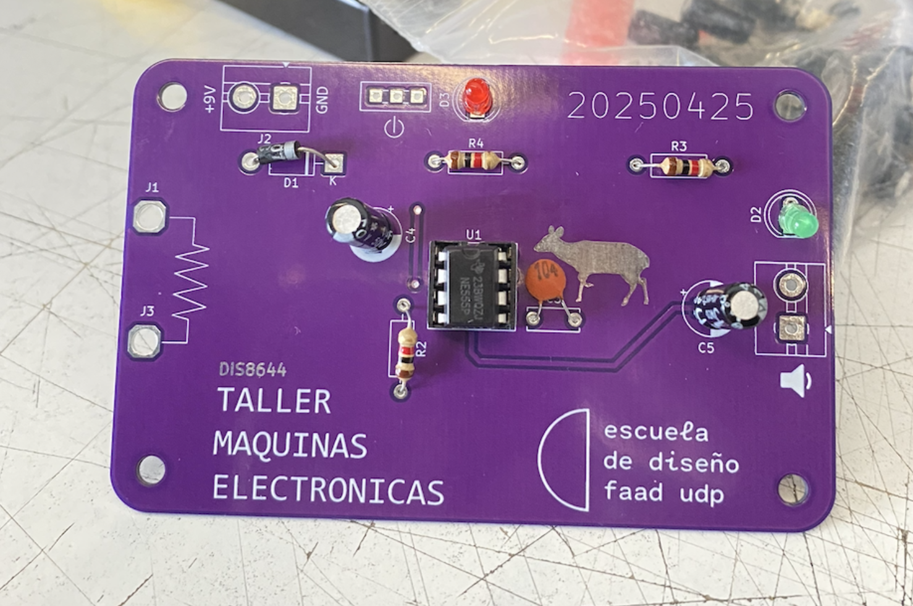

**Soldar**

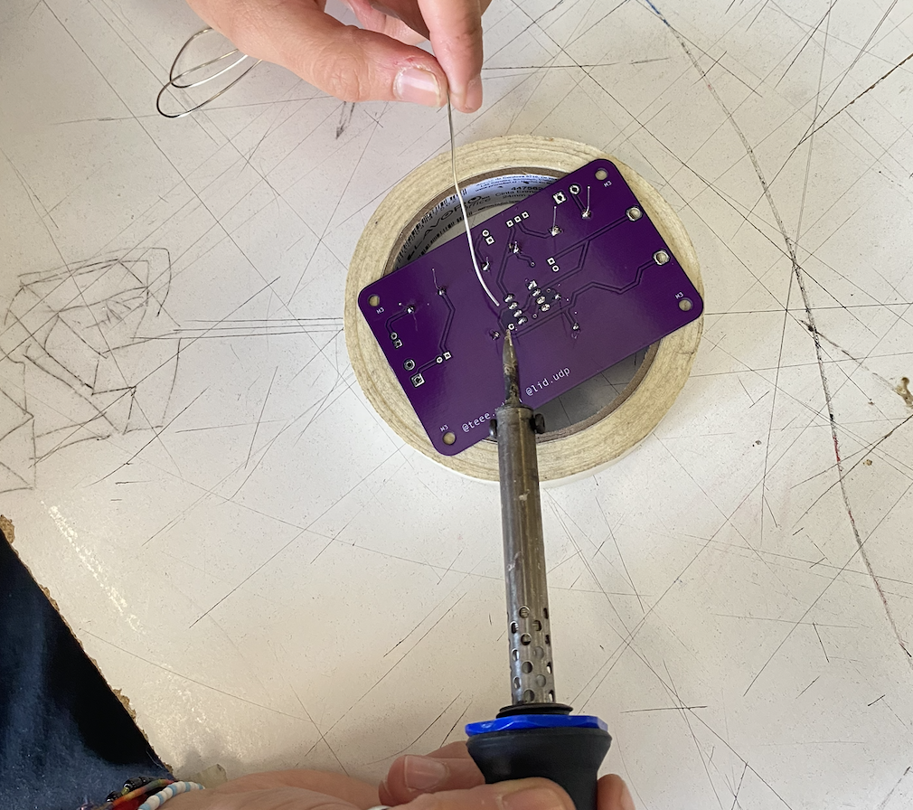

**Cortar excesos**

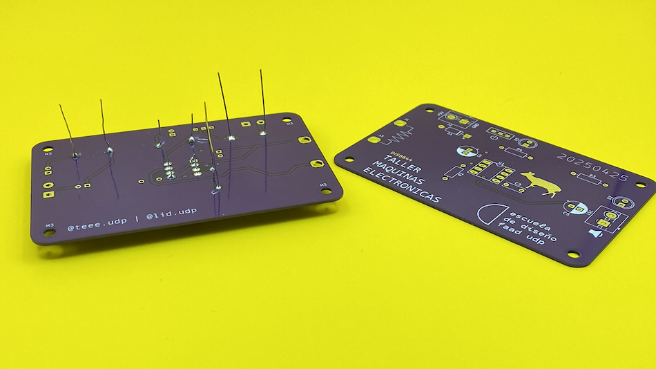

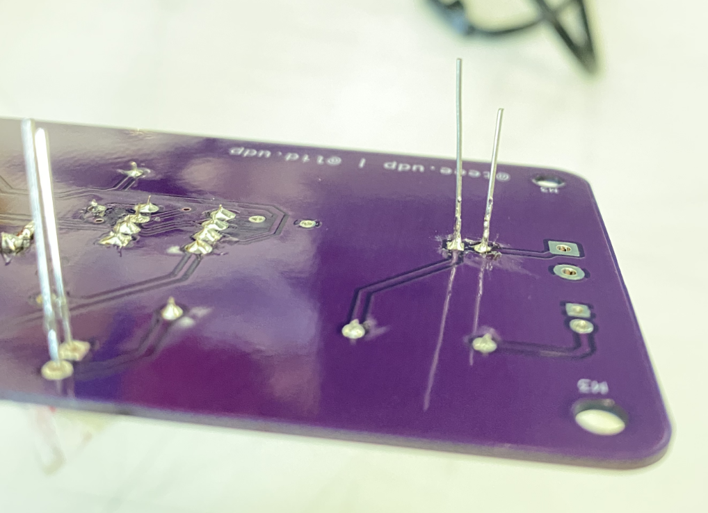

**Energizar y probar**

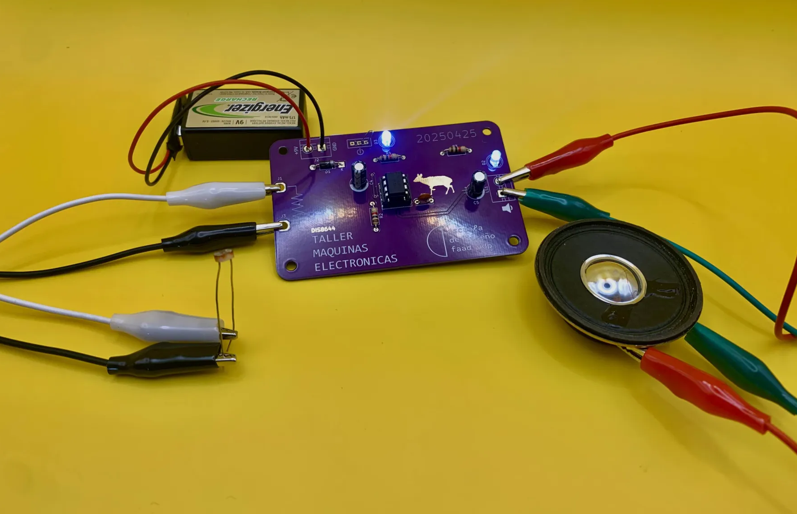

*foto por @/ AlanisMria en discord*

