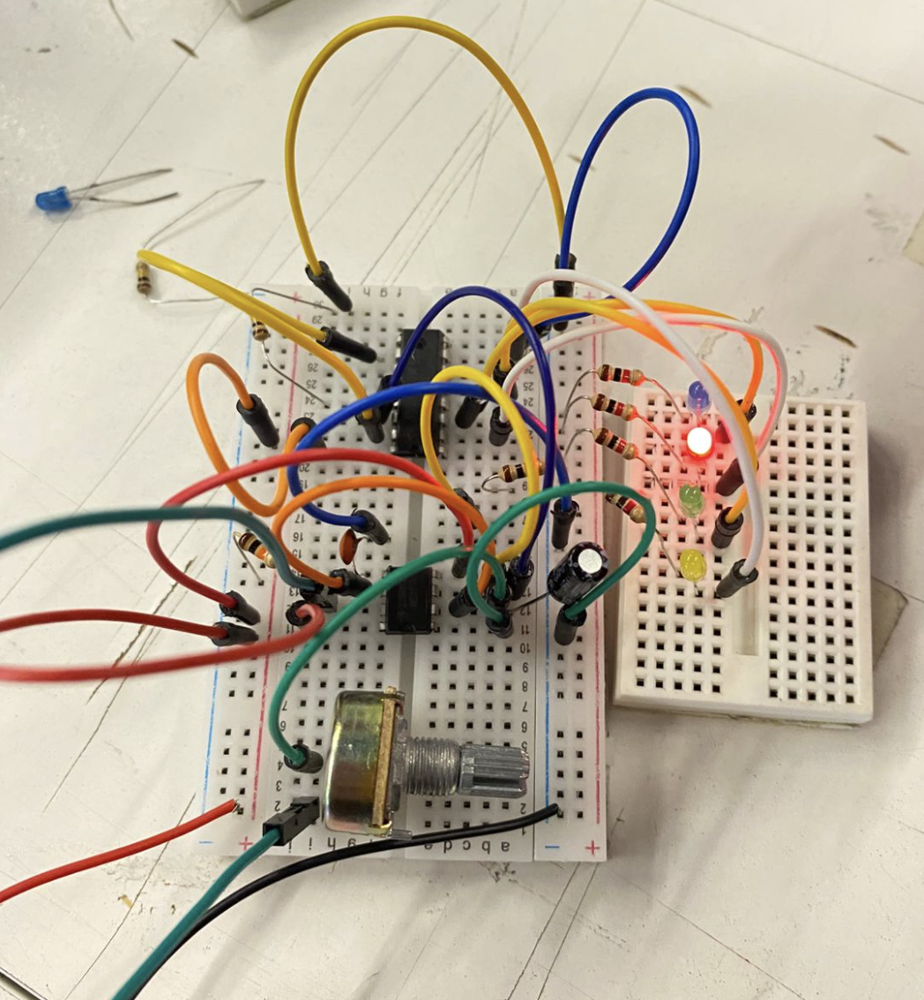
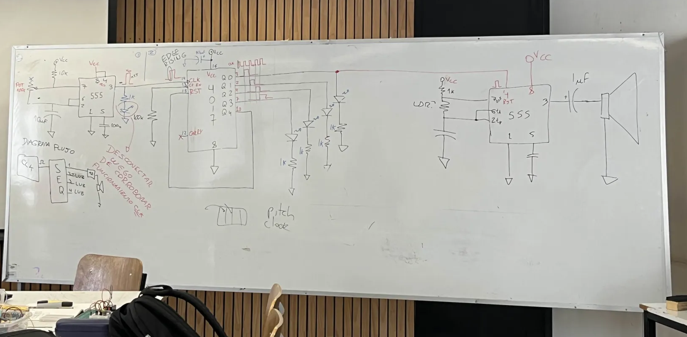

# sesion-11b

23/05/2025

https://www.harvard.com/

## nuevo chip 4017 

chip de 16 patas 

**Introducción**

la pata número 3 del chip 555 funciona como una señal de aviso de poca corriente.

existen dos tipos de lógica enla electronica: lógica secuencial y combinacional.

El 4017 funcionará como un secuenciador, espera un impulso llamdo edge rising, y las salidas dependen del pin clk, tiene un pin de reset que hace volver al principio de la secuencia.

CKEN: inhibidor, se encuentra en la pata 13, su función es inhabilitar las funciones que se le den, lo conectaremos a tierra para que lo convierta en voltaje+

555 astable + 4017 con 4 salidas que forman una secuencia.

## circuito secuenciador

https://github.com/user-attachments/assets/c2b0abaa-1aac-4fca-8a85-40d19679edee

https://github.com/user-attachments/assets/24141505-08cc-4d58-8e9b-b967fc694da6

