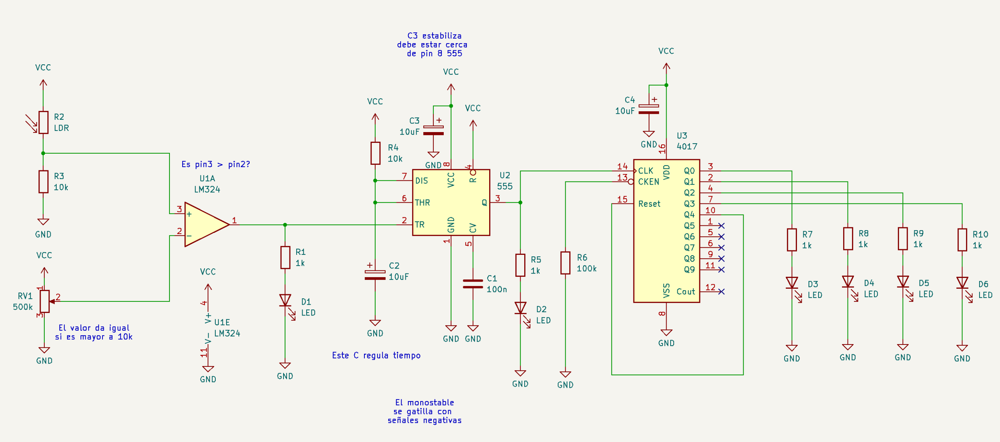

# sesion-12a

27-07-2025

estamos haciendo una modularización, a través del circuito secuenciador, con el chip 4017.

transistor: semiconductor, actúa como amplificador o conmutador de señales. Permite controlar el flujo de corriente eléctrica usando una pequeña señal de entrada que influye en una señal de salida más grande, o para interrumpir el flujo de corriente completamente.

el tiempo de duración (regular) depende de las resistencias y condensadores 

carry out: avisa cuando se sobrepasa la capacidad estimada

diagrama de tiempo: permite visualizar los pulsos, la posición del inhibidor y cuanto dura el pulso, clock inhibit.

diagrama de lógica combinacional: está formado por funciones lógicas elementales que tiene un número de entradas y otro número de salidas, y los valores de éstas dependen exclusivamente del estado que adopten las entradas y de su constitución interna.

cascading: uno tras otro. para hacerlo se necesitan compuertas and, si ambas entradas cumplen las condiciones, permite la salida.
La salida de una compuerta AND (Y) es verdadera (1) solo cuando todas sus entradas son verdaderas (1). en caso contrario, la salida es falsa (0). 

* 4017: cuenta hasta 10
* 4022: cuenta hasta 8

 **para subir archivos de forma correcta a github** 

sincronizar antes de actualizar 
 
para subir las fotos: archivos-subir archivo-cambiar nombre-nombrar

para nombrar las fotos: en el readme  

**proyecto 2 será en proto y en kicad** 

## detector de sombras + temporizador + secuenciador 

hay 3 etapas las cuales hay que seguir para armar este circuito

### etapa 1: LM324 --> OP-Amp 
### etapa 2: 555 --> temporizador
### etapa 3: 4017 --> secuenciador

