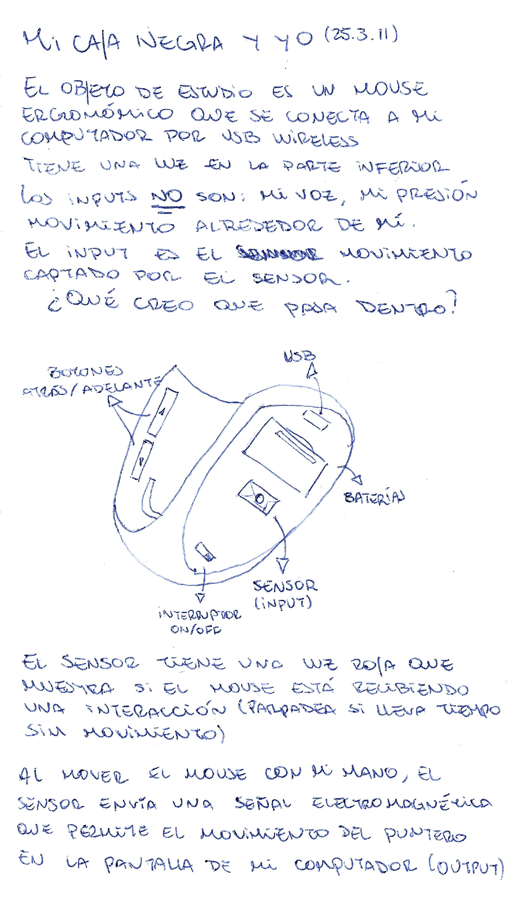

# sesion-01a

11 de marzo del 2025

## Encargo 00 - Introducción a la electrónica

### Barrio Universitario (2013)

*Barrio Universitario* no es una comedia perfecta, pero igual logra entretener con un humor que engancha a la mayoría de los chilenos, sobre todo a los que eran fans del Club de la Comedia. No busca ser una obra maestra, más bien es una película liviana, divertida y llena de referencias a la “cultura pop” de la época.

**Lo bueno:** Lo mejor está en el elenco, con comediantes conocidos que manejan bien el humor local y logran momentos realmente chistosos, especialmente si te gustaba el estilo del Club de la Comedia. Además, capta bien la esencia de la vida universitaria en Santiago a inicios de los 2010, exagerando la típica rivalidad entre las universidades "de élite" y las más humildes, por así decirlo.

**Lo malo:** Aunque la idea es entretenida, el ritmo y la narración son su punto débil. La historia es muy simple, y más que una película con trama, a veces parece una serie de sketches pegados. No hay mucho desarrollo de personajes, más bien son caricaturas, lo que hace que la historia se sienta superficial y fácil de olvidar.

### Kraftwerk

De los discos de Kraftwerk, decidí escuchar *Autobahn* (la versión remasterizada del 2009). Cuando este disco salió originalmente en 1974, la banda aún estaba en transición de su estilo *krautrock experimental* (rock experimental que surgió a finales de los ‘60 en Alemania) hacia la música electrónica. Sus primeros discos eran abstractos y usaban instrumentos como flautas y órganos, pero con *Autobahn* simplificaron su sonido y tomaron un rumbo más electrónico.

El tema principal, de casi 23 minutos, representa un viaje en carretera (“la descripción musical del viaje desde Düsseldorf a Hamburg”) y marca una separación del rock tradicional. A diferencia de sus discos anteriores, Autobahn es más melódico y usa sintetizadores y vocoders primitivos. El resto del álbum incluye canciones más ambientales y experimentales, como *Kometenmelodie 1 & 2*, y *Morgenspaziergang*, una canción de cierre que contrasta con la precisión mecánica del resto del disco.

En su época, mientras bandas como Pink Floyd usaban sintetizadores dentro del rock, Kraftwerk los usó para crear algo totalmente nuevo. Antes del auge de la música disco y electrónica, este disco ya estaba sentando las bases para lo que hoy es el techno y el synthpop que conocemos.

## Encargo 01 - Mi caja negra y yo

