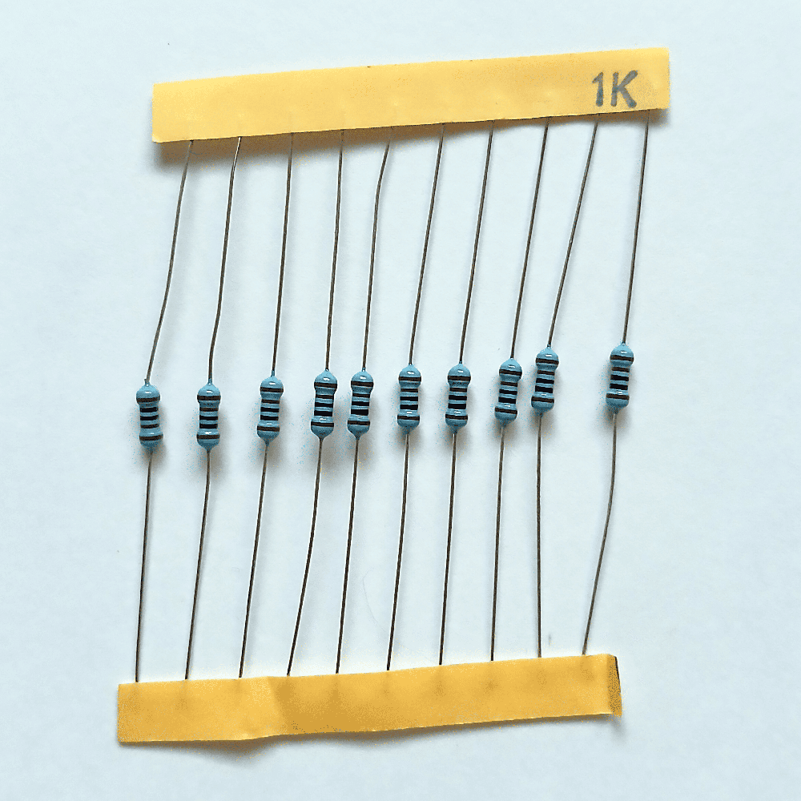
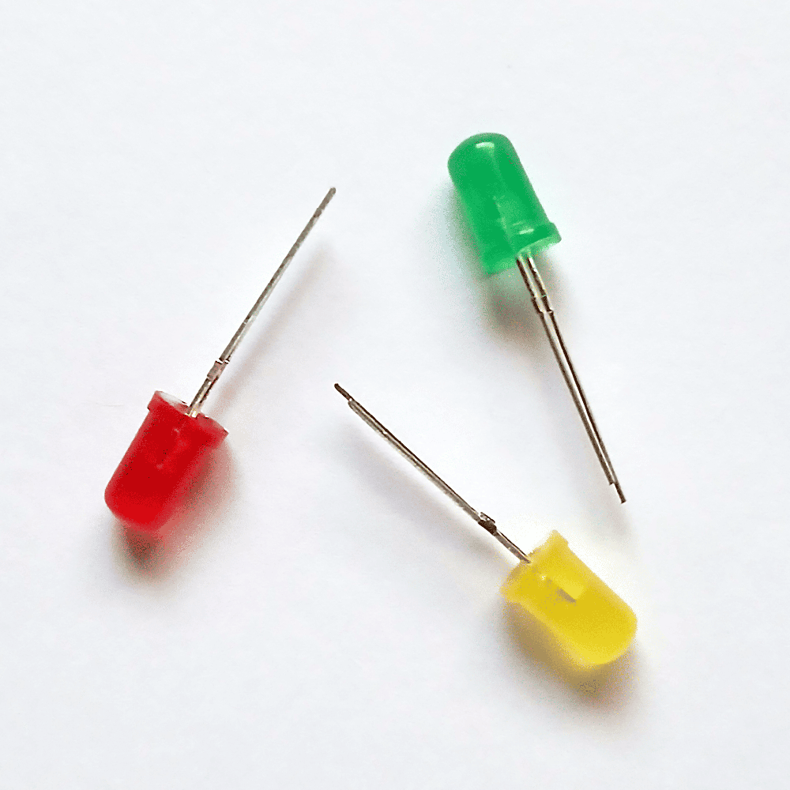
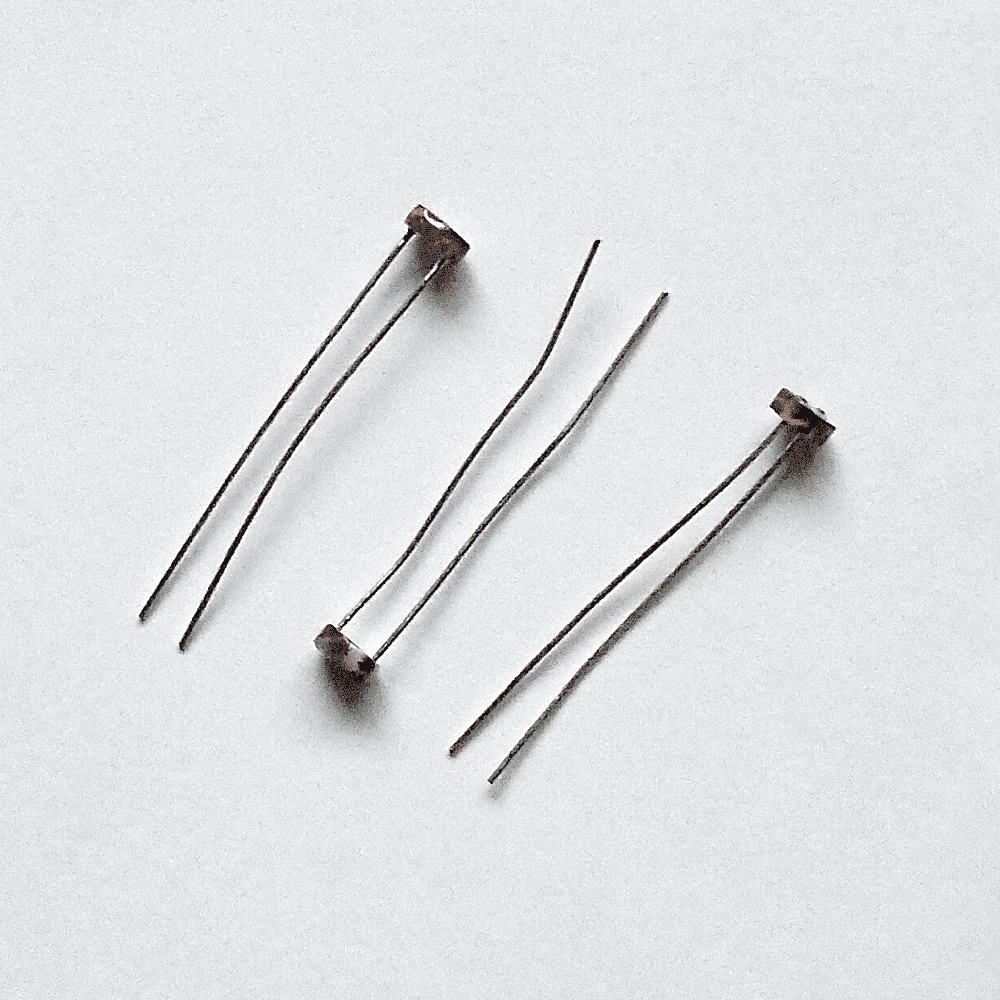

# sesion-01b

14 de marzo del 2025

## encargo-02

### Aphex Twin

Escuché *Come to Daddy* (1997). La canción principal del disco es una explosión de sonidos industriales, ritmos distorsionados y gritos. El video musical refuerza un tono aterrador con niños demoníacos y una figura grotesca saliendo de una pantalla.

El resto del álbum muestra la versatilidad de Aphex Twin. Temas como *Film* y *Bucephalus Bouncing Ball* combinan melodías emotivas con ritmos complejos. En específico, Film es una de sus canciones más delicadas y accesibles, contrastando con el caos de *Come to Daddy (Pappy Mix)*, la canción principal.

Para añadir al caos de este disco, Come to Daddy tiene 4 mixes distintos: Pappy Mix, Little Lord Faulteroy Mix, Mummy Mix, y una versión demo. La inclusión de distintos mixes no es algo inusual de James, así que estas distintas versiones ayudan a reforzar la idea de que la canción original no tenía la intención de tomarse de manera literal.

### Documental "Internet's Own Boy"

Aaron Swartz fue un prodigio digital. Desde adolescente, ayudó a desarrollar RSS, Creative Commons y Reddit. Creía que el conocimiento debía ser accesible para todos y veía internet como una herramienta de empoderamiento y progreso.

Su activismo lo enfrentó a poderosas instituciones, y este documental muestra cómo fue perseguido legalmente de manera desproporcionada, cuestionando las leyes sobre información digital y sus castigos excesivos.

Su muerte generó un debate sobre la imparcialidad de las leyes de internet y la necesidad de reformas. *Internet’s Own Boy* no es solo su biografía, sino un llamado a la acción sobre el acceso al conocimiento y el poder digital.

El legado de Swartz sigue vivo, inspirando a una nueva generación de activistas que buscan una internet libre y equitativa. Su historia nos recuerda que la lucha por el acceso abierto aún continúa.

## encargo-03 - Estudiar la caja de materiales inicial

- Protoboard

Un protoboard *(o placa de pruebas)* es un dispositivo reutilizable que se usa para prototipar circuitos eléctricos. Permite que los ingenieros, estudiantes y aficionados de la electrónica puedan rápidamente construir y probar circuitos sin conexiones permanentes. La placa tiene una grilla de agujeros con tiras de metal debajo que crean estas conexiones eléctricas.

Como parte de su historia, el concepto de un protoboard sin soldadura se remonta a la década de los 70 cuando Ronald J. Portugal lo inventó. Antes de esto, la creación de prototipos se hacía usando placas de madera, donde los componentes eran cableados y soldados manualmente. La introducción de las placas modernas de plástico revolucionó el diseño de circuitos, permitiendo que la experimentación sea más rápida y accesible.

- Cables dupont

Estos son cables puente flexibles y aislados con conectores doblados en cada extremo. Se usand para hacer conexiones rápidas y temporales en circuitos electrónicos. Vienen en 3 tipos: macho a macho, macho a hembra, y hembra a hembra, permitiendo una fácil interconexión entre componentes, protoboards, y microcontrollers.

El término "*cables Dupont*" viene de la DuPont Corporation, quienes popularizaron estos conectores durante el auge de las plataformas de prototipado.

- Resistencias

Una resistencia *(o resistor)* es un componente electrónico que limita o regula el flujo de la corriente eléctrica en un circuito. Funciona según la *ley de Ohm*, donde la resistencia determina cuánto voltaje pasa por una corriente dada. Se usan para la división de voltaje, limitar la corriente, acondicionamiento de señales, entre otros.

Las primeras resistencias estaban hechas de materiales como carbón o aleaciones de metal.

- Luces LED

LED es una sigla de *Light-Emitting Diode* (diodo emisor de luz). Estas luces son dispositivos semiconductores que emiten luz cuando una corriente elécrica pasa a través de ellas. A diferencia de las luces fluorescentes o incandescentes, las luces LED son altamente eficientes, durables y disponibles en distintos colores y niveles de brillo.

El efecto LED fue observado en 1907 por Henry Joseph Round, pero los LED prácticos fueron creados mucho después. En 1962, Nick Holonyak Jr. creó el primer LED de espectro visible (rojo). En las siguientes décadas, los LED evolucionaron con avances en eficiencia y variedad de color, llevando a la creación del LED azul en la década de los 90 por Shuji Nakamura, lo cual permitió la creación de la iluminación LED blanca.

- Fotorresistencia

También conocida como LDR *(Light Dependent Resistor)*, es un tipo de resistor cuya resistencia cambia basado en la intensidad de la luz que cae sobre él.

Cuando se expone a luz brillante, su resistencia disminuye, permitiendo que fluya más corriente; mientras que en la oscuridad, su resistencia aumenta, reduciendo el flujo de corriente.

Generalmente se usan en sistemas de iluminación automatizada y alarmas de seguridad.

El concepto de fotorresistencia fue explorado a fines del siglo XIX, cuando Willoughby Smith descubrió las propiedades fotoconductoras del selenio, este descubrimiento llevó a aplicaciones tempranas en dispositivos sensibles a la luz.

A lo largo del tiempo, materiales como el sulfuro de cadmio (CdS) se volvieron ampliamente usados para los LDR, aunque hoy en día, por preocupaciones ambientales, se están buscando alternativas para reemplazar los LDR de cadmio.
