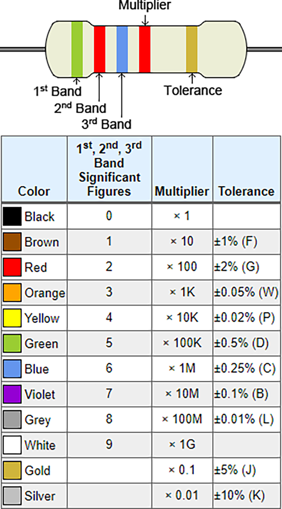
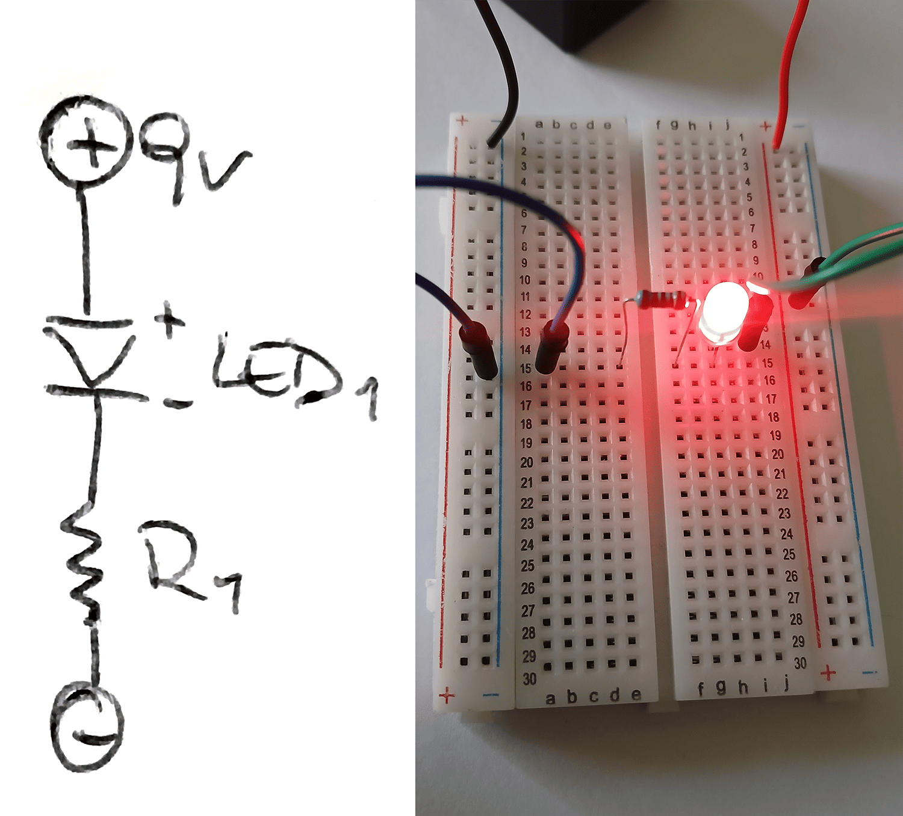
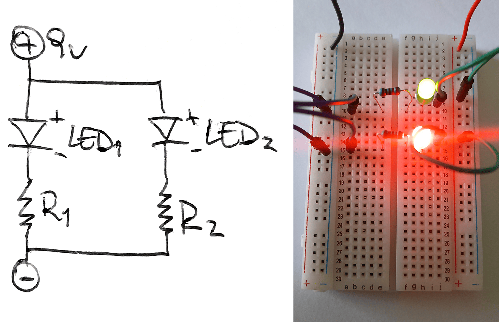
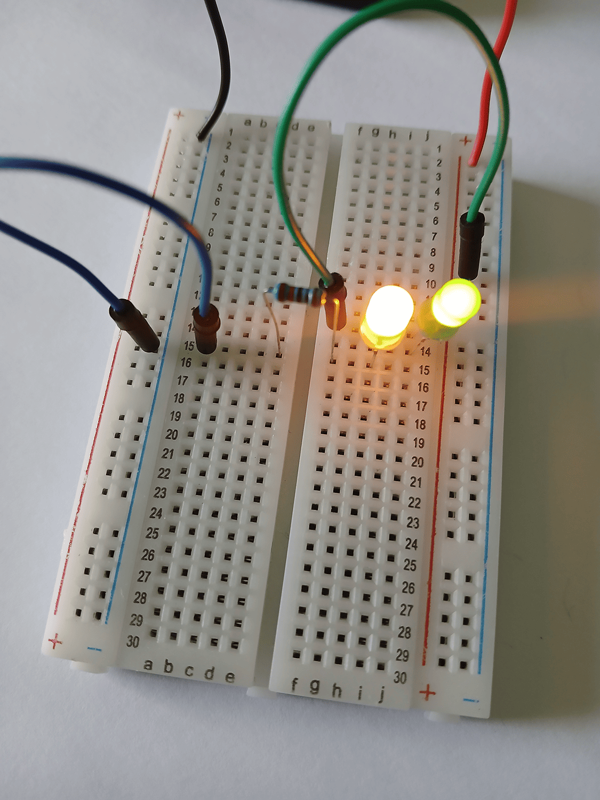
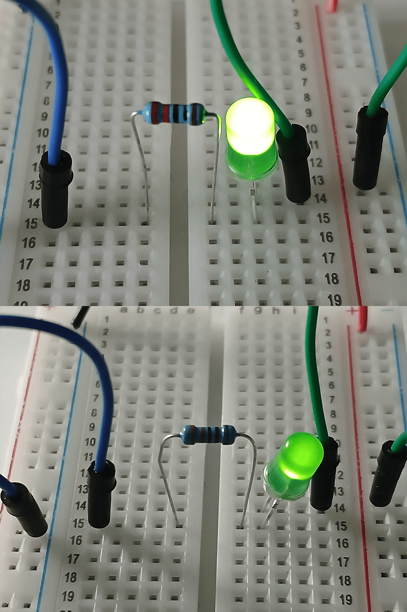
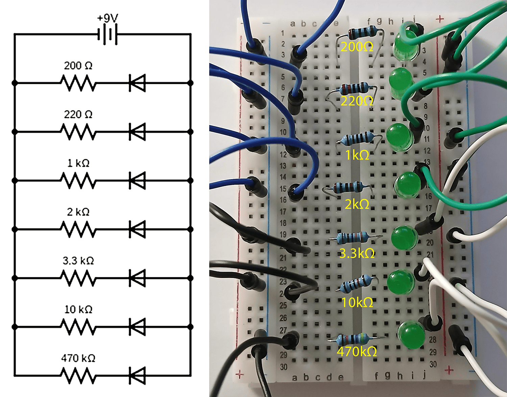

# sesion-02a

18 de marzo del 2025

## encargo-04 - Cultura electrónica chilena y latinoamericana

### MCMLXX (2021) de Gozne

Para empezar, el título *MCMLXX* (1970 en números romanos) sugiere un vínculo conceptual con el pasado, posiblemente como referencia a la experimentación temprana de la electrónica. Si bien Gozne no depende en la estética vintage, hay un obvio intento de capturar las sensaciones de los sintetizadores modulares antiguos manteniendo al mismo tiempo un sentido moderno.

Gozne utiliza una variedad de técnicas en este proyecto, con sintetizadores análogos, grabaciones urbanas, y secuenciación compleja. También añade drones pulsantes, texturas de glitch, y estructuras rítmicas que varían entre minimalismo suave y capas densas de melodías y elementos de percusión. Algo que destaca de este álbum, es su habilidad para flctuar entre quietud ambiental y patrones rítmicos estructurados. No se conforma con la música electro dance tradicional, sino que se mueve entre el arte sonoro y una experiencia donde uno debe escuchar con atención. Cada sonido se siente colocado con intención en vez de ser demasiado refinado, tiene una “estética” casi DIY.

## Encargo-05 - Estudio de resistores y circuitos en serie y paralelo

> Tabla de códigos de color de resistores

***

Circuito simple con una resistencia de 220 Ω y un LED rojo

Circuito paralelo al circuito anterior con un LED verde (R~2~=200 Ω)

Circuito en serie con un LED amarillo seguido por un LED verde

> El LED amarillo se ve más brillante que el verde

2 versiones del mismo circuito con LED verde pero con distintas resistencias

> La imagen superior tiene una resistencia de 220 Ω, mientras que la foto de abajo tiene una resistencia de 3.3k Ω. En la diferencia de brillo se ve como a mayor resistencia, menos corriente.

Circuito en paralelo con 7 distintas resistencias

