# sesion-03b

[28 de marzo del 2025]

> Charla pre-clase
>
> - Hablaron sobre lounge music, la música de ascensor se llama “muzak”
> - Aarón usa?? el tiempo “unix”. semi-related pero en la descripción del disco *MCMLXX* de Gozne dice “creado bajo el concepto del tiempo unix”
> - *La sociedad del espectáculo* de Guy Debord
> - Fritzing, KitCad, Tinkercad
> - [@cumasystem](https://cumasystem.xyz/)
> - Nicole L’Huillier & [Roy Macdonald](https://roymacdonald.github.io/)

***

!!! resistor azul: 5-band / resistor café: 4-band !!!

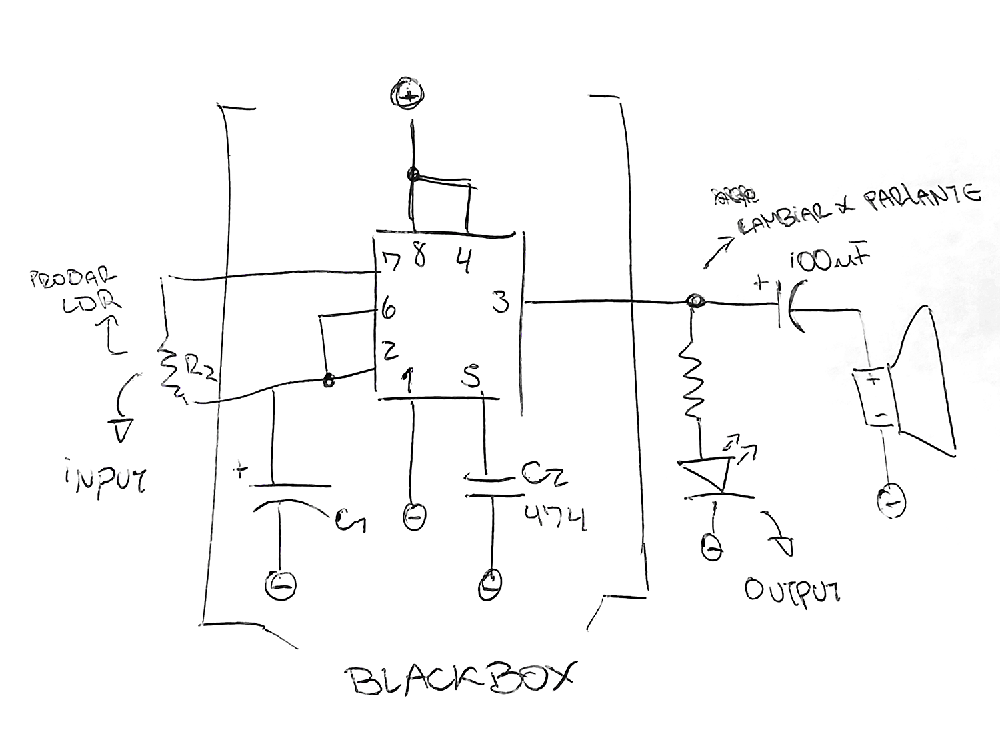

- Black box (caja negra) básicamente lo que no importa, no contiene el output ni el input

- En el circuito, probar cambiar R2 por un LDR

- En vez de un LED, añadir un capacitor y un parlante

- C1 puede cambiar el pitch del parlante

## Encargo 08 - Cultura Musical Nacional

*Gonzalo Martínez y sus Congas Pensantes* (1997) es un proyecto colaborativo entre Jorge González (de Los Prisioneros) y Martín Schopf, también conocido como Dandy Jack. El disco fue creado entre Nueva York y Santiago con la intención de combinar los ritmos tradicionales de la cumbia con la energía de la música electrónica ,tomando como punto de partida las raíces africanas que ambos estilos comparten.
Este dúo reimaginó cumbias clásicas como “*La pollera colorá*”, incorporando beats electrónicos y contando con la participación de productores alemanes como Atom Heart. Aunque en su momento pasó desapercibido en Chile, el álbum logró resonar en la escena underground europea y hoy es considerado una obra pionera en la fusión entre electrónica y música latina.

## Encargo 09 - Museo de Arte Contemporáneo

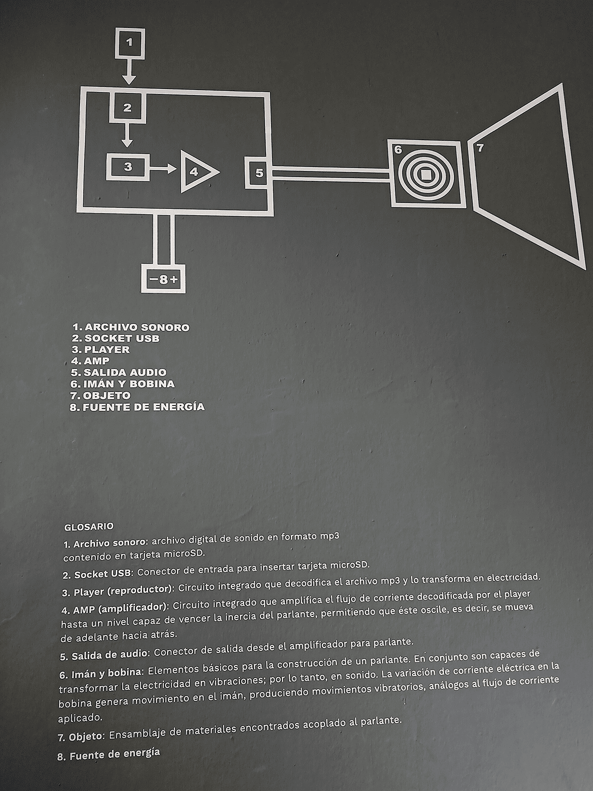

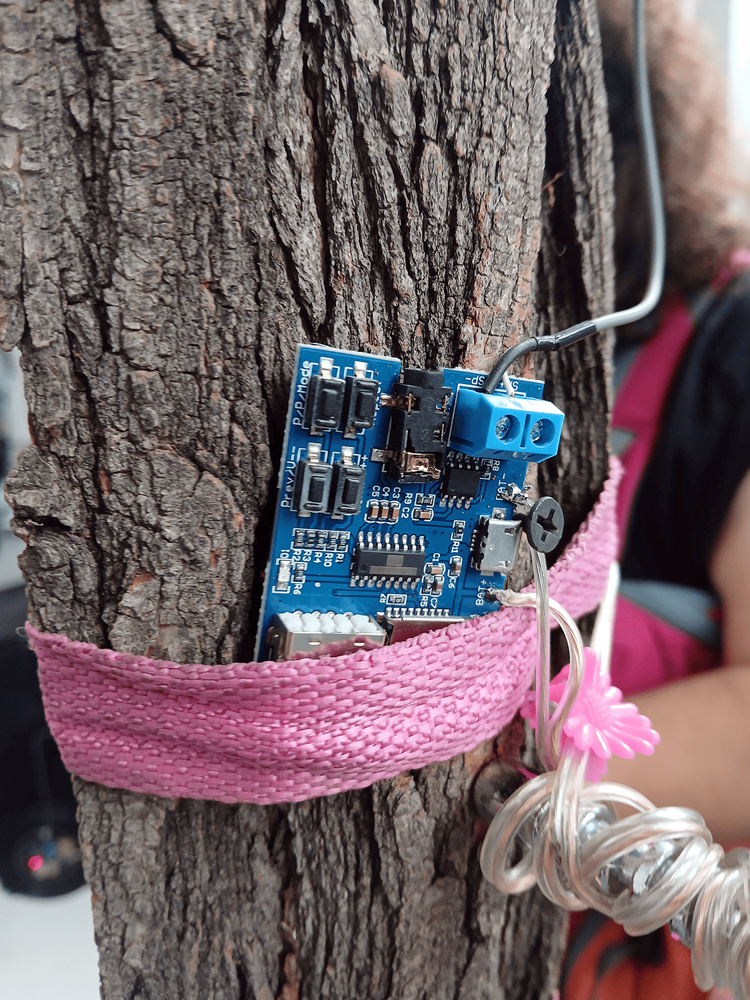

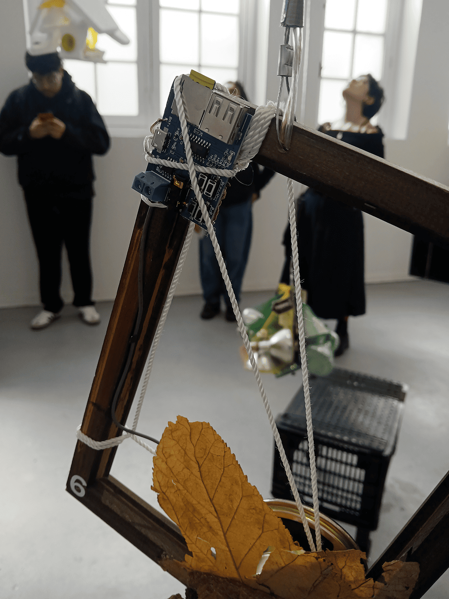

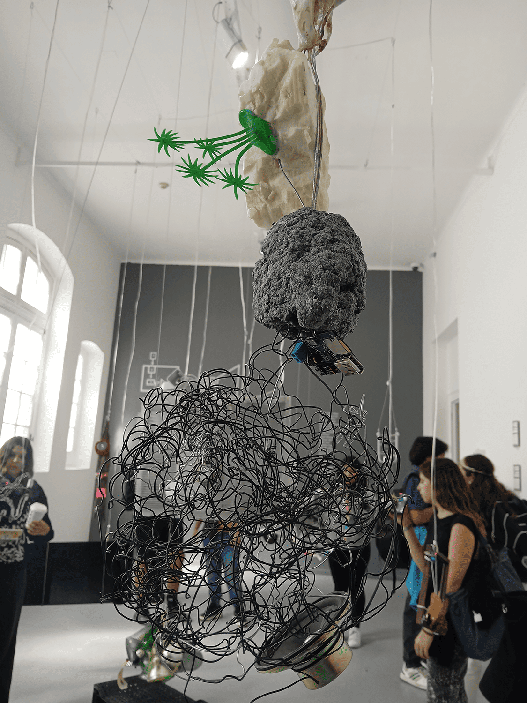

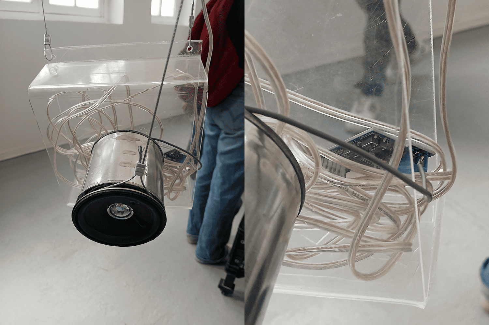

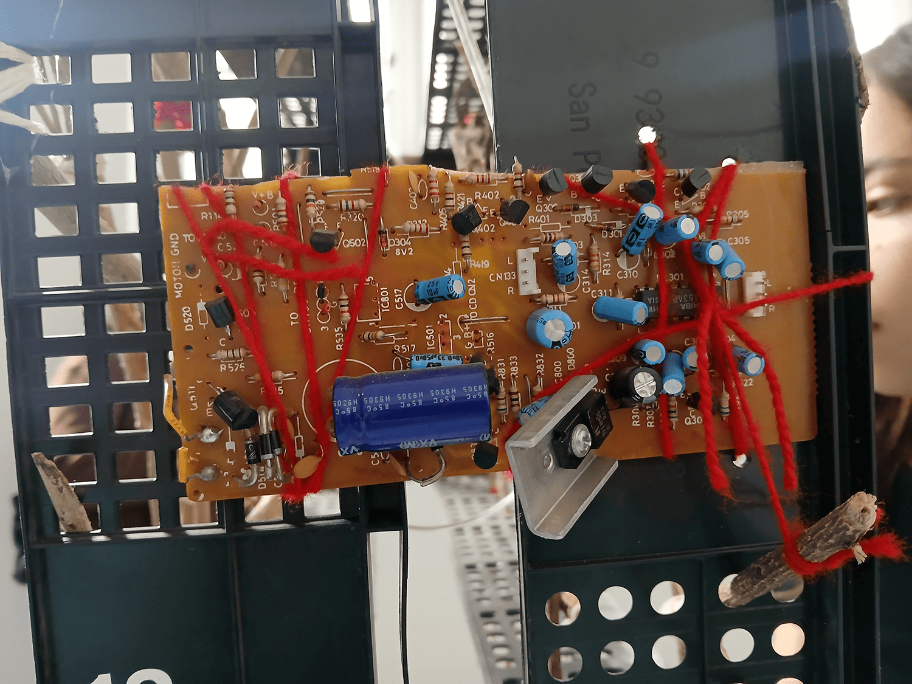

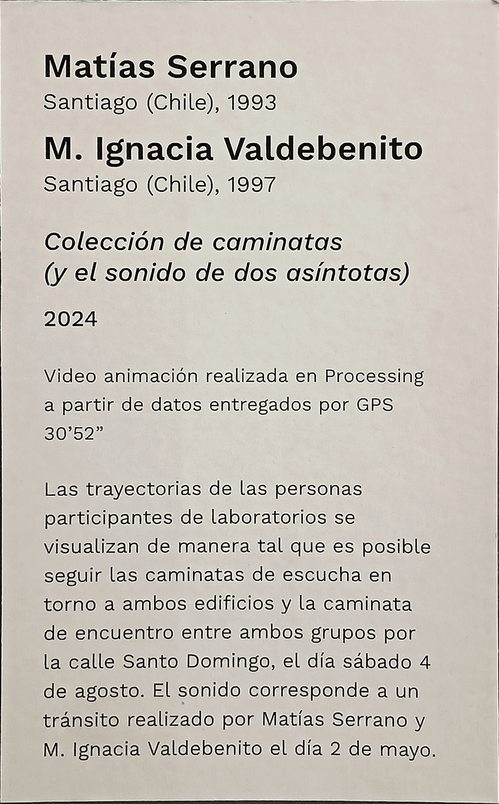

> esto estaba al lado de una pantalla con un video de alrededor de 30min? con audio binaural que marcaba el camino desde el lado de quinta normal hacia el parque forestal por el lado izquierdo, y el camino contrario por el lado derecho

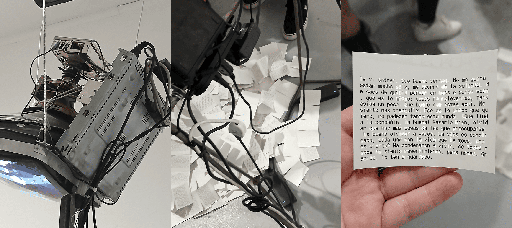

> una pantalla con una cámara encima, aparentemente era/tenía un sensor que hacía se imprimiera un papel con texto. el texto era el mismo en todos los papeles que vi

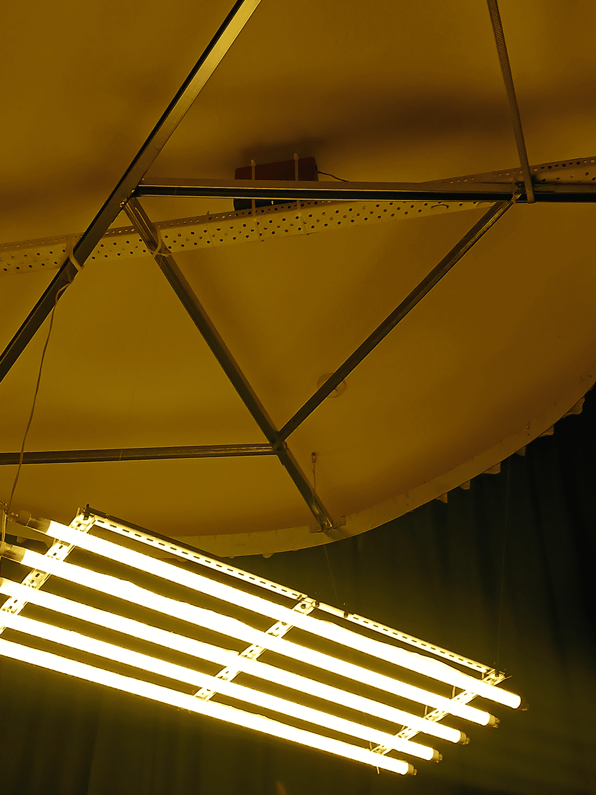

> al principio, pensé que esta sección del museo al principio estaba completamente en silencio, pero de repente escuché el sonido de grillos. en el techo, sobre las luces, estaba el parlante

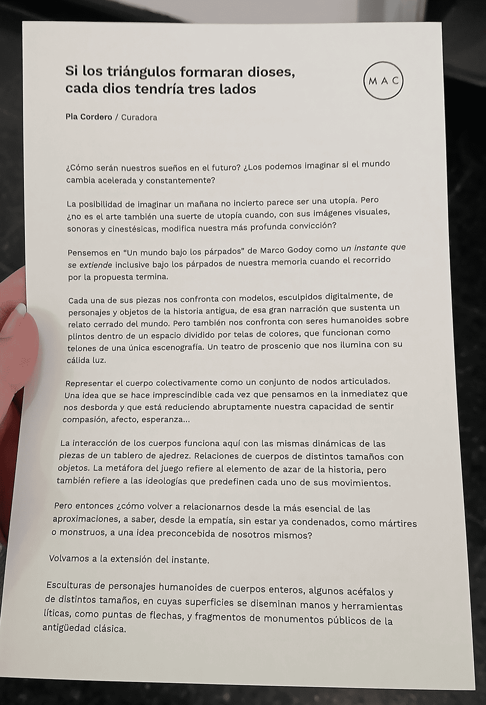
