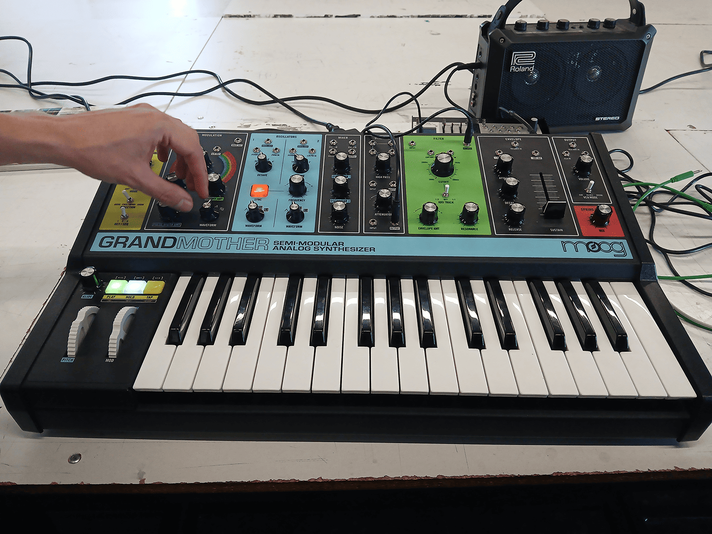
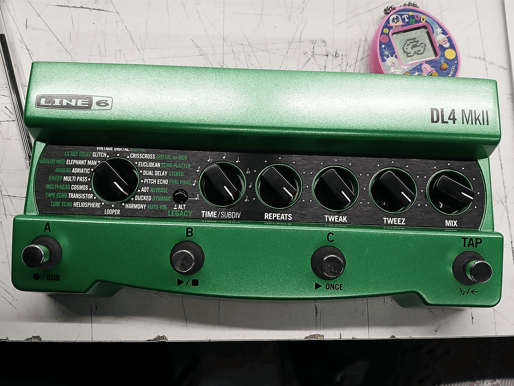
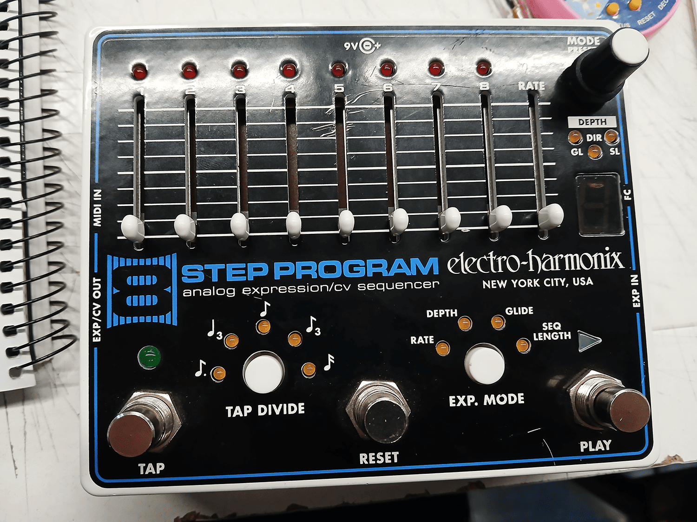
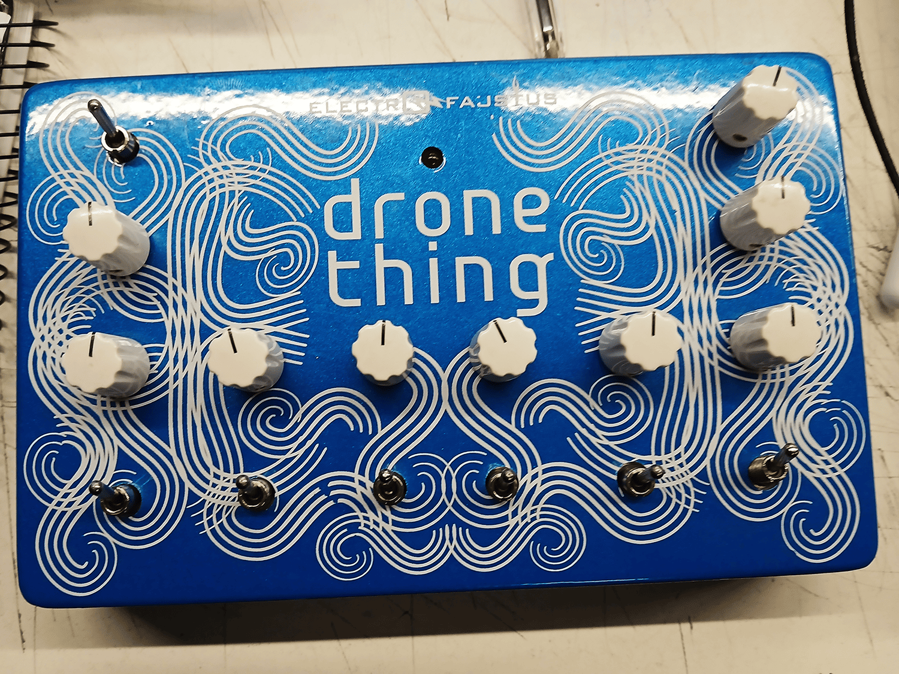
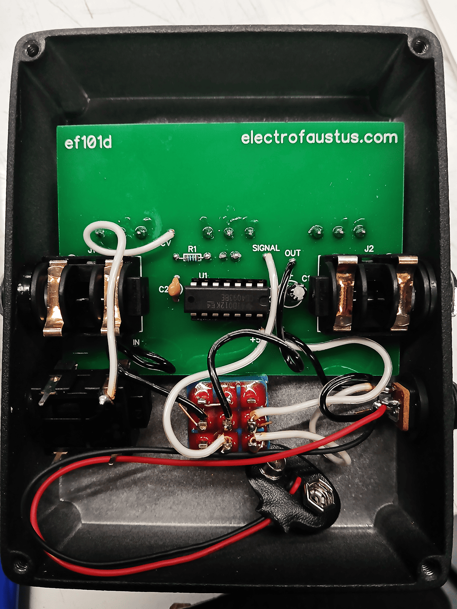
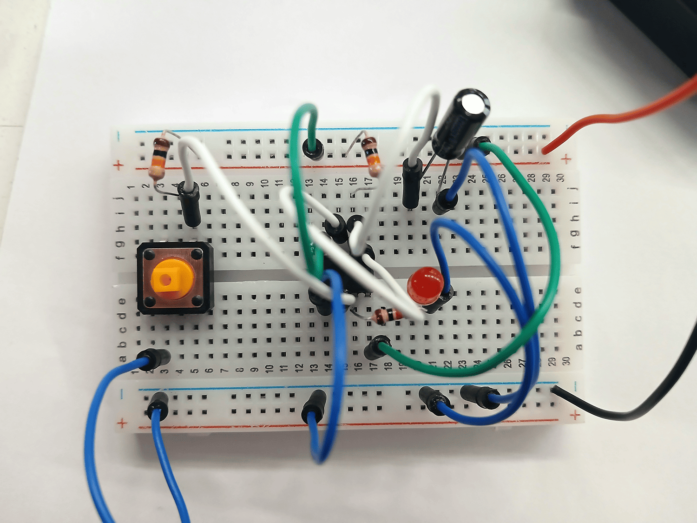

# sesion-04b

[4 de abril del 2025]

- 1-bit / código binario

- Vimos (brevemente) un [video](https://youtu.be/FU_YFpfDqqA) de Veritasium sobre el primer computador

- [Mar Hicks](https://marhicks.com/index.html)

- Ver 1-bit symphony en audacity, se ve el high y el low del bit

- [bitofmystery.com](https://bitofmystery.com/)

- Wendy Carlos

- Buchla

***

Aaron mostró una tarjeta japonesa que tiene, la tarjeta tiene un lado distinto para distinguir por donde se inserta la tarjeta

También llevó un sintetizador Moog Grandmother

y unos pedalboards para que revisemos como clase

***

En clase hicimos un circuito monostable con un botón push

## Encargo 11 - Switched on Bach - Wendy Carlos

*Switched on Bach* (1968) es uno de esos álbumes raros que completamente cambiaron todo. Wendy Carlos tomó las composiciones clásicas de Bach y las recreó con un sintetizador Moog, algo que casi nadie había escuchado en esas fechas. En ese momento, los instrumentos musicales electrónicos aún eran nuevos, y Carlos mostró que tan expresivos y musicales podían llegar a ser. El disco fue un hit, ganándose Grammys y entrando a los charts de Billboard, lo cual es muy sorprendente considerando que era una reinterpretación electrónica de música clásica. Introdujo a toda una generación a Bach y a los sintetizadores, ayudando a comenzar la ola de música electrónica. Aún hoy se puede mantener como una obra audaz y creativa que se adelantó a su tiempo.

## Encargo 02 - proj-01 - Bajando opacidad a la caja negra
