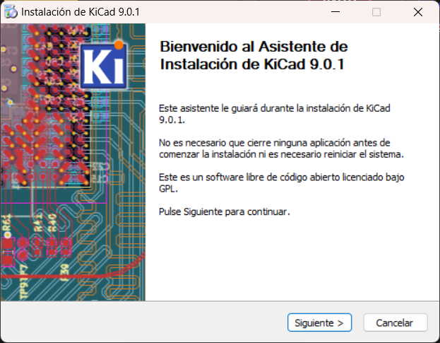
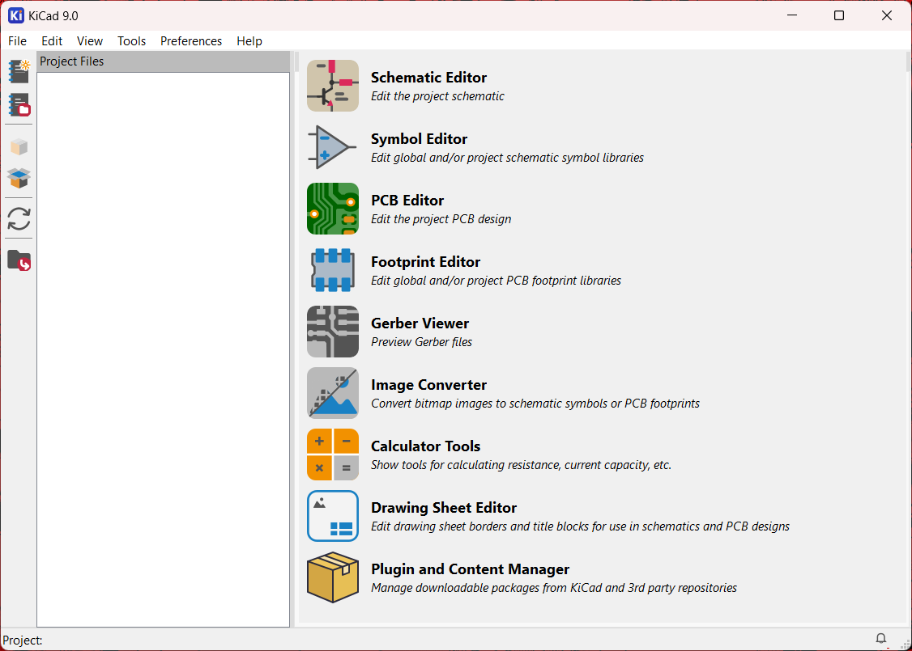
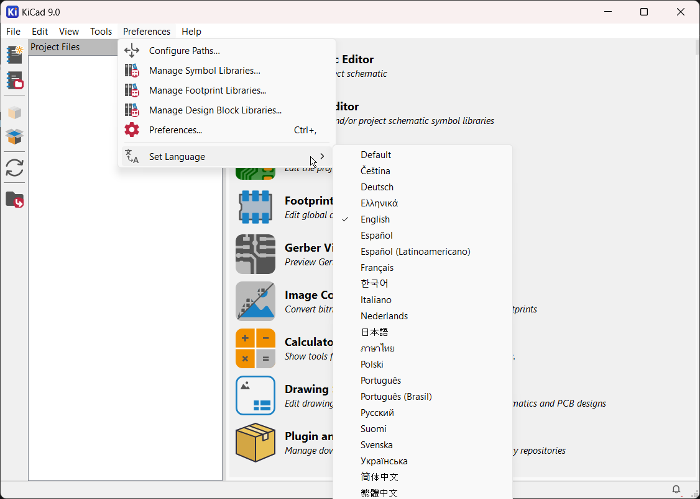
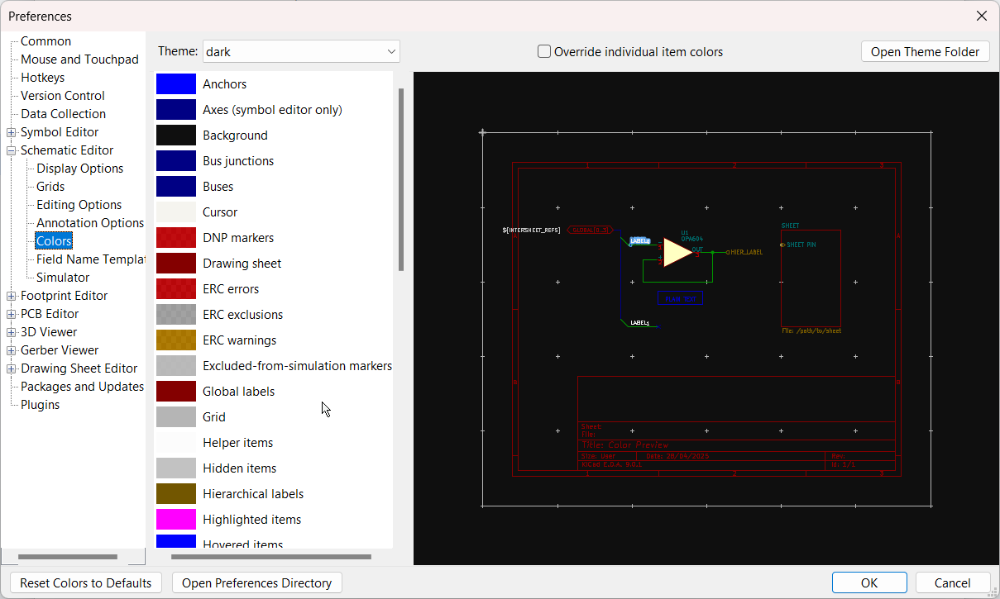

# sesion-06b

[18 de abril del 2025]

## Encargo 12 - Instalar KiCad

Instalé la versión 9.0.1 en mi Windows 11 de 64 bits, en la carpeta de archivos de programa

Decidí cambiarle el idioma a inglés porque al buscar tutoriales, se me haría más fácil saber qué buscar en vez de traducirlo en mi mente y tratar de encontrar el término que más se acerque

También me di la libertad de hacerle unos cambios a los colores de KiCad para que se me hiciera más agradable a la vista

## Encargo 13 - Sisters with transistors
