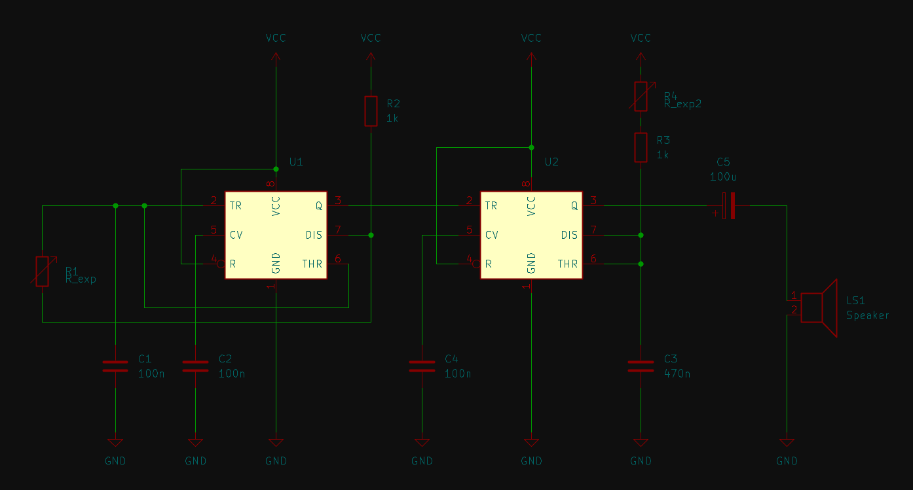

# sesion-07a

[22 de abril del 2025]

## Encargo 14

Diseñar esquemático en KiCad de Atari Punk Console

## Encargo 15

Preguntas sobre el Manual de supervivencia para KiCAD

- ¿Se pueden editar los componentes? Por ejemplo, editar el orden del chip N555

- ¿Cómo se ponen los caimanes? ¿Qué componente sería?

- ¿Hay alguna manera de exportar el esquemático como imagen?
