# sesion-07b

[25 de abril del 2025]

## Apuntes

- [KiCad StepUp]([https://www.kicad.org/external-tools/stepup/](https://www.kicad.org/external-tools/stepup/)) para importar PCB de KiCad a FreeCAD. Hace un modelo 3D de la placa, útil para poder diseñar la carcasa

- Exportar visualización 3D: VRML &#8594; CAD Assistant

- Misaa hizo un componente para el N555 ordenado y lo subió al GitHub del taller para que lo podamos usar

- Algunos hotkeys que aprendí: E &#8594; propiedades, F &#8594; huella, V &#8594; valores, G &#8594; mueve el símbolo junto al cable conectado, X &#8594; vertical mirroring

- Resistor axial vs radial / axial son los que hemos usado cuando armamos un circuito físico, el radial parece un condensador

- LED de tres patas son bicolor

- Encapsulado circuito integrado &#8594; DIP (**D**ual **I**n-line **P**ackage)

- Para el parlante, hay que usar un Terminal Block

- Socket y pin/plug en vez de “macho y hembra”

- Protection diode: diodo que se conecta en serie y hace que nada se muera. Al derecho básicamente no hace nada, al revés hace circuito abierto

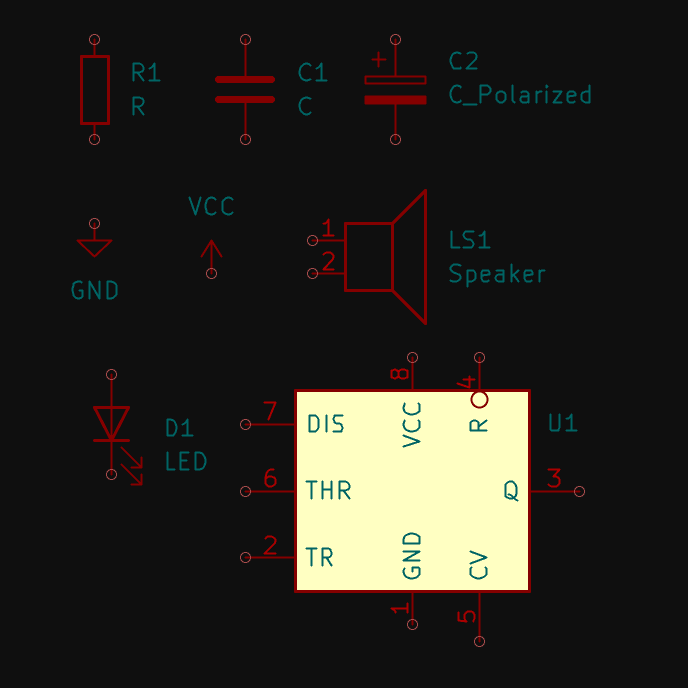

> Componentes principales para el circuito

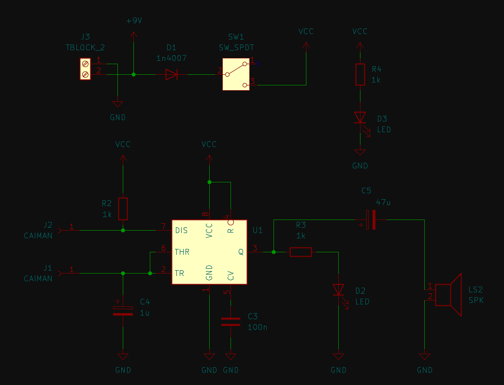

> Esquemático del circuito completado

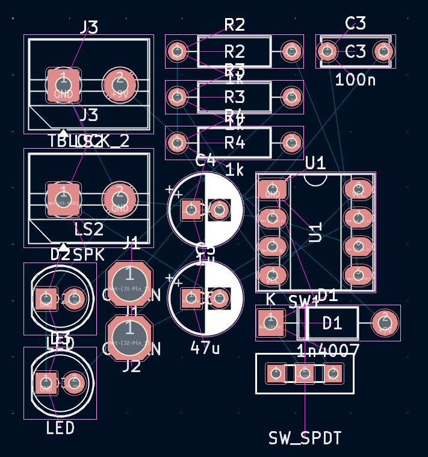

> PCB importado directo del esquemático

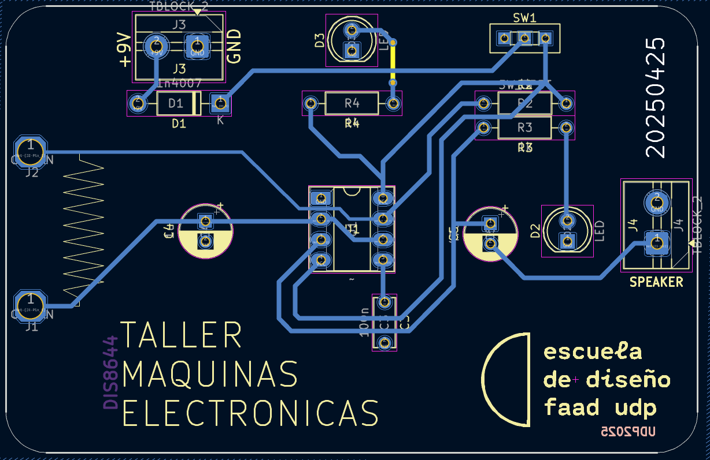

> PCB con los componentes ordenados y las rutas definidas

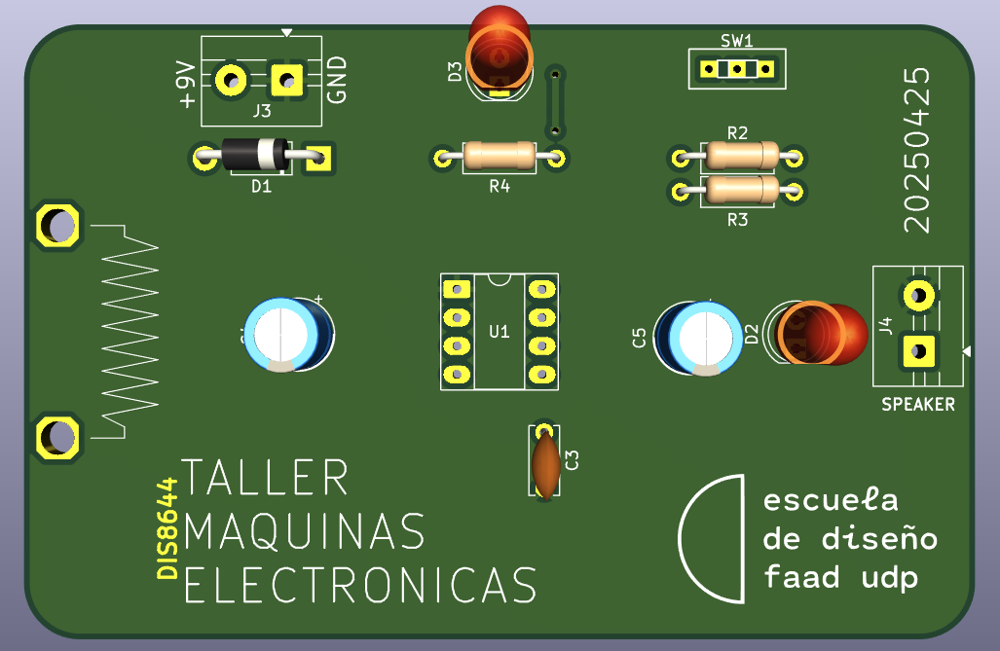

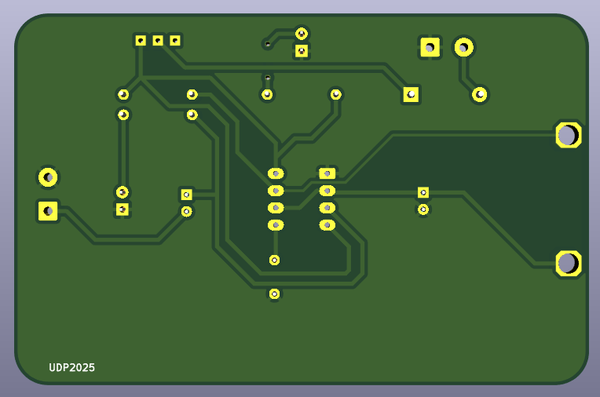

> Visualización 3D

## Encargo 16 - Cotizar udpudu para 30 personas

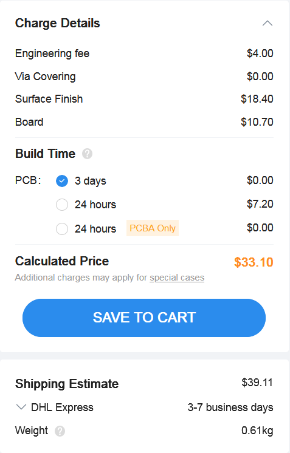

> Precio para las opciones por defecto que entrega (placa verde, 1.6mm de grosor, ENIG)

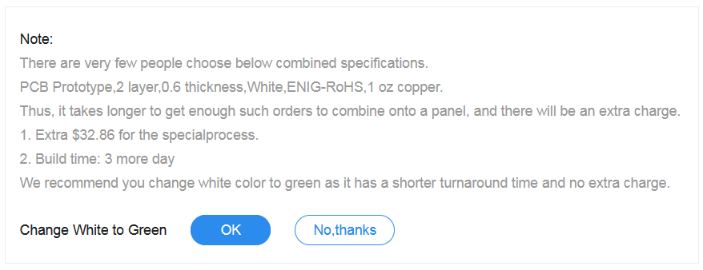

Cambié el color de la placa a blanco, y cuando probé otros grosores, me mostró este mensaje diciendo que tendrá un precio extra y tardará más tiempo solo por no ser una combinación común entre clientes, la advertencia se veía con todos los grosores excepto 1.6mm (0.4mm a 2mm). Curiosamente, al elegir el grosor de 0.4mm, el mensaje aparecía en la sección del grosor del oro, y no en el grosor de la placa en sí

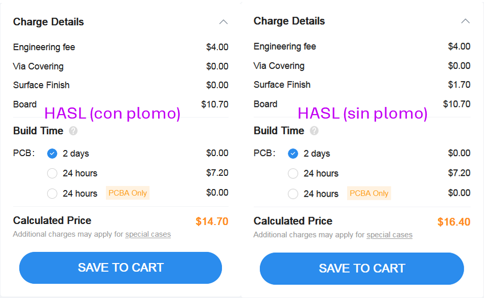

Cambiando el surface finish a HASL (hot air solder leveling), el precio baja demasiado comparado al ENIG. La versión con plomo no tiene costo en el surface finish en sí, pero leadfree le agrega $1.70 USD

## Encargo 17

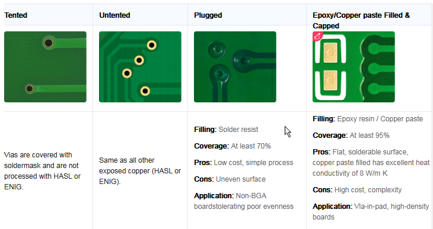

Al principio no entendí qué es lo que esto hace, solo noté que *plugged* le sube el precio a $49.03 y *epoxy* a $86.86, así que pensé que quizás podría ser solo un cambio estético, pero luego de buscar información, descubrí que es porque la pasta de las soldaduras a veces puede meterse en las vías y hacer cortocircuito, así que dan la opción de poner otros materiales en los agujeros para evitar que esto pase

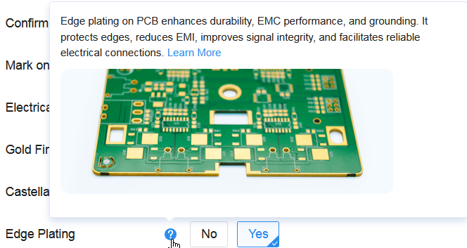

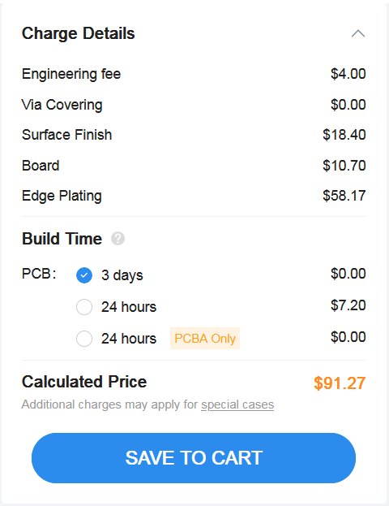

Vi que una de las opciones era ponerle un plating de oro al borde de la placa, para la sorpresa de nadie, esto le sube casi $60 al precio de la placa por defecto

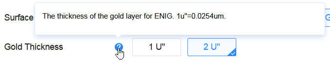

El grosor del oro es una opción, no entiendo mucho en qué afecta este cambio, aún después de averiguar un poco
