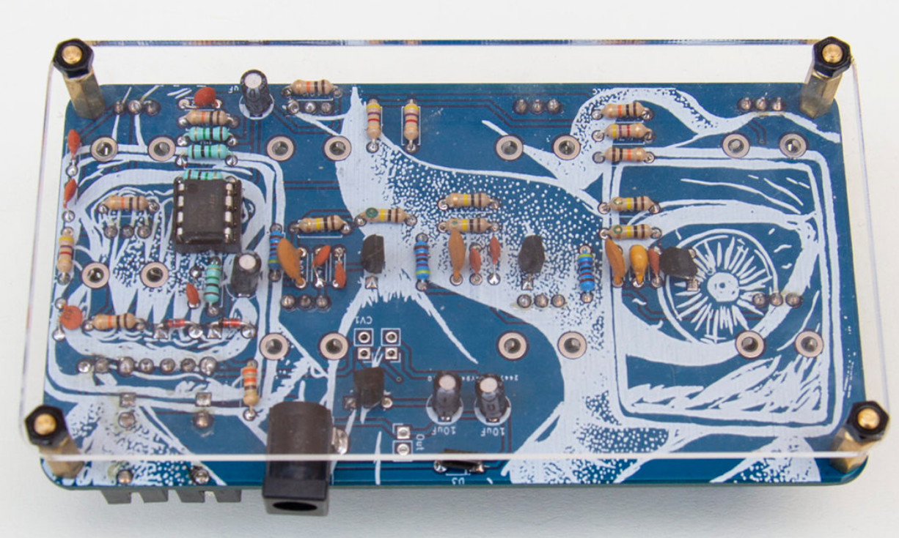

# sesion-08a

[29 de abril del 2025]

## Apuntes

- En KiCad, las imágenes de la PCB se guardan en.svg o .dxf / ctrl+shift+f hotkey para importar graphics

- Empezar a usar "pull request" en GitHub

- Aaron nos mostró cómo hacer un issue en el repo original de la clase para especificar la revisión de bitácoras o encargos

- Añadir un mounting hole al esquemático de la PCB

- Bolt M3 es el mejor, dicen

- El sintetizador SubaQuatic de [Oficina de sonido](https://www.oficinadesonido.org/) es transparente por un lado, lo que permite una vista directa a la placa PCB

- En JLCPBC, tipo de producto puede ser industrial, aeroespacio, o médico. Cambian algunas especificaciones especializadas para su uso fuera del área industrial (4-Wire Kelvin Test)

- [Summer of Code](https://summerofcode.withgoogle.com/): programa online en el que gente contribuye por 12 semanas al desarrollo de un software open source

- [Thingiverse](https://www.thingiverse.com/) para modelados para impresión 3D

- [Prusa](https://www.prusa3d.com/) &#8594; Impresoras de Chequia, open source

- [Bambu Lab](https://bambulab.com/en) &#8594; Útiles??? para impresión 3D chinos (de Shenzhen específicamente) // [Maker World](https://makerworld.com/)

- Cantata de Santa Maria de Iquique – Quilapayún

- [Oskitone](https://www.oskitone.com/) &#8594; instrumentos electrónicos DIY y kits de soldadura

- [homebrew](https://brew.sh/) &#8594; Habilita el CMD **solo** en MAC y Linux

- Winget (Windows Package Manager) &#8594; gratis y open source

- Aarón recomienda?? dice que usemos GitHub Desktop (i'm already using it)

- El readme.md puede editarse en bloc de notas, muy rasca tho

- [Atom Editor](https://atom-editor.cc/) podía usarse pero murió r.i.p, renació como [Pulsar](https://pulsar-edit.dev/)

- [Visual Studio Code](https://code.visualstudio.com/) para propiammente editar los .md, compatible con GitHub Desktop

- Para añadir un vídeo al .md, intentar subir el vídeo a YouTube y colocar el link en el readme

- Embed en markdown no se ve el vídeo, pero si se ve en el sitio html del repo

- Transpilar &#8594; transformar código fuente de un lenguaje a otro

## Encargo

No hay encargo por semana de receso
