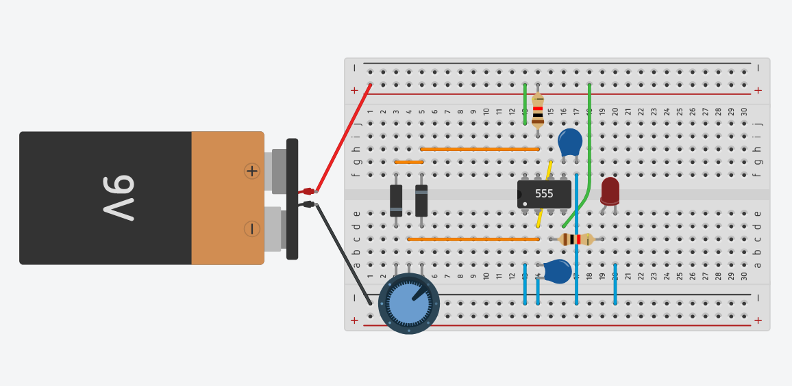
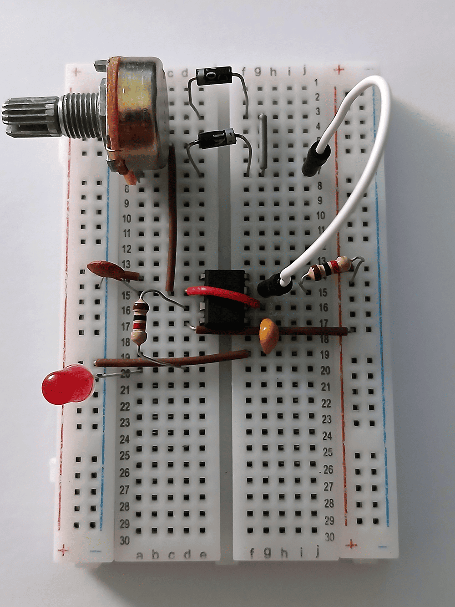

# sesion-09b

[9 de mayo del 2025]

## Apuntes

- PAM8403: Amplificador de audio estéreo // potencia única, pero tamaño compacto // 3W en canal de 4 Ω // tiene todas las conexiones listas

- SRD05 (relé): Para controlar on/off por el usuario

***

- 555 Timer

    - Astable: genera señal oscilante // in: R y C // out: LEDs, sonido
    
    - Monostable: cambia de estado al recibir una señal // in: R y C // out: LEDs, sonido

- Módulo: e-, componentes, circuitos (apc, as, ms, pls)

- Diagrama de flujo: detecta sombra &rarr; TIMER &rarr; se enciende la luz

- PWM (pulse width modulation)

- Diodos: 1n4148 y 1u4007

- Duty: en un ciclo, cuánto tiempo está encendida una señal

## Encargo 18 - De Tinkercad a protoboard

## Encargo 19 - Cultura electrónica y Laurie Anderson
