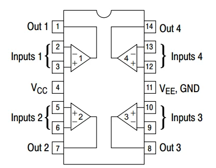
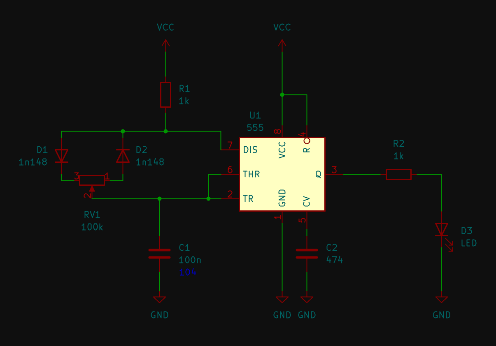
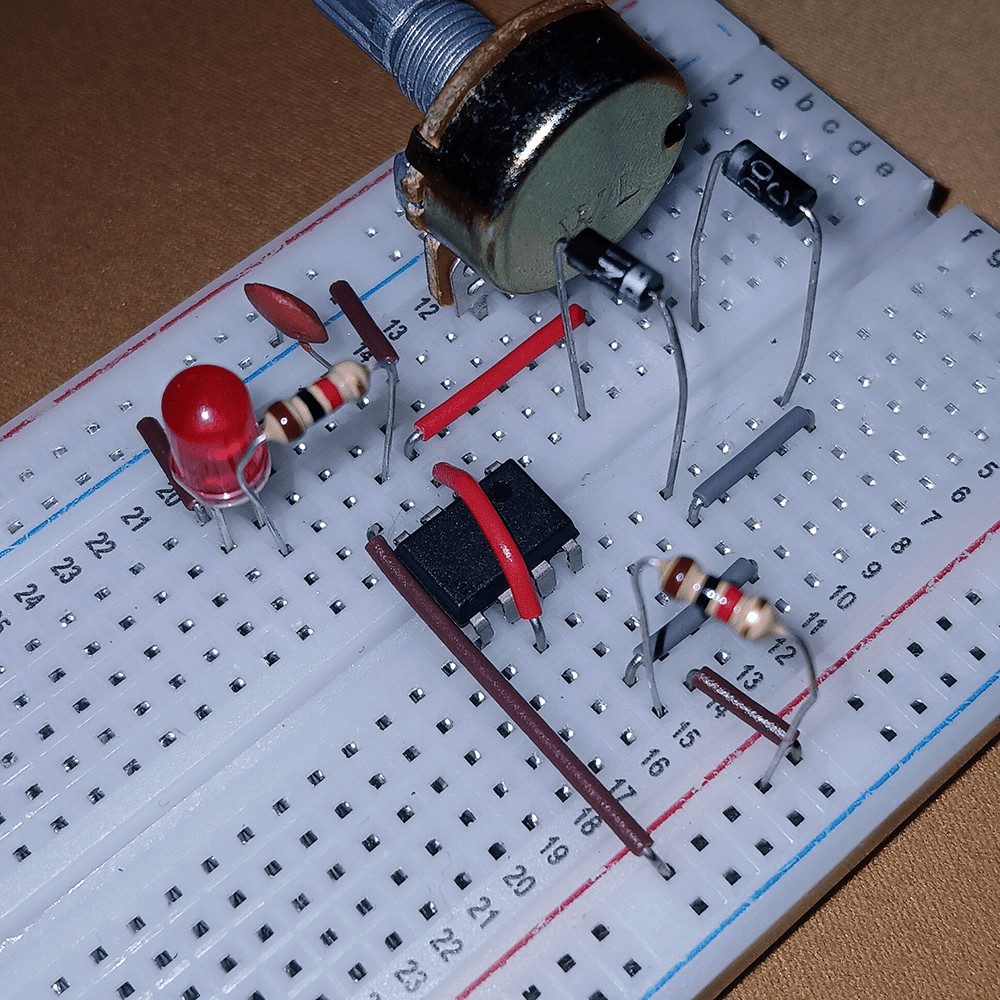
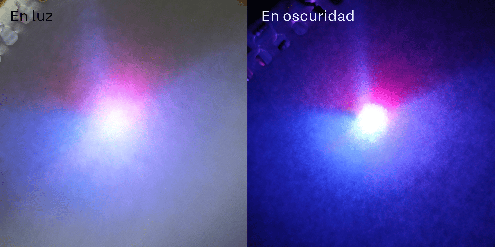
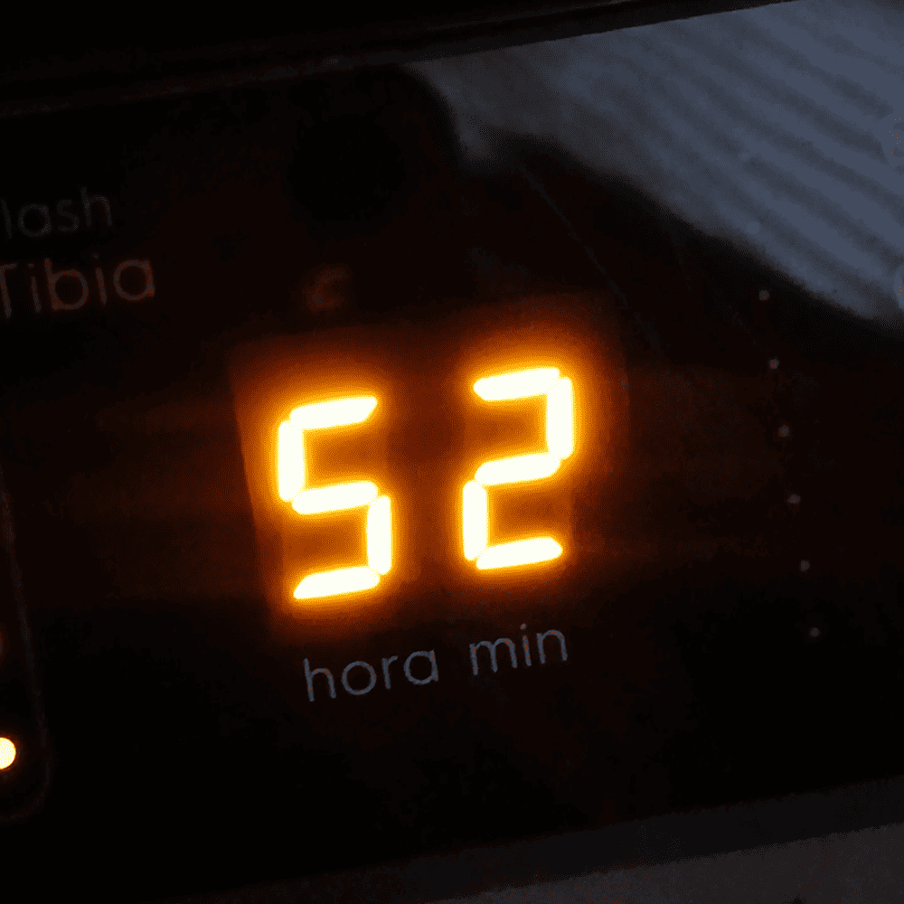
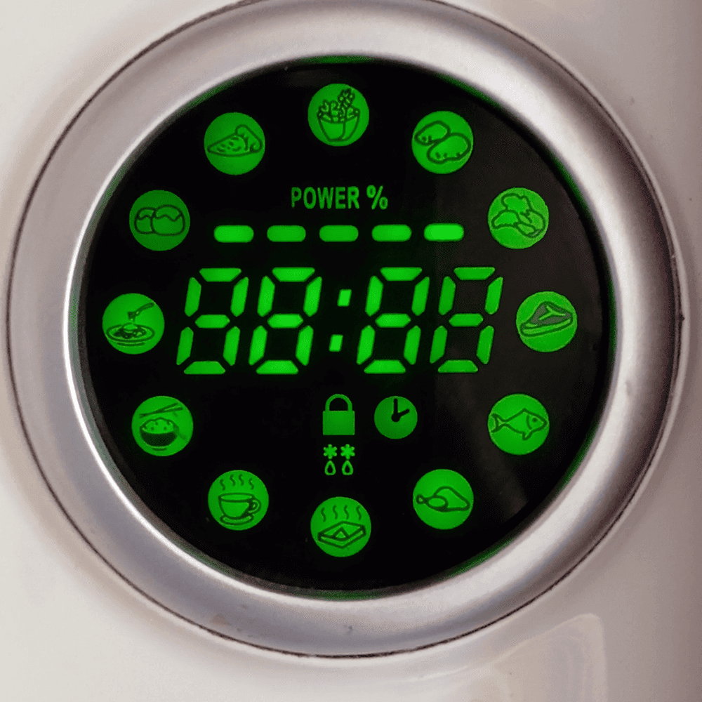
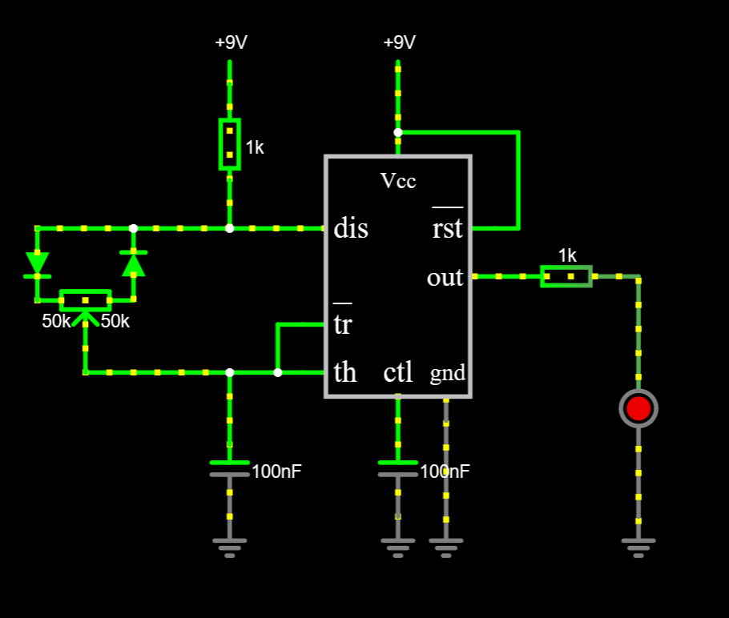

# sesion-10a

[13 de mayo del 2025]

## Apuntes

- [falstad](https://falstad.com/circuit/) &rarr; para simular circuitos

- LM324 &rarr; chip de 14 pines // 4 amplificadores operacionales (op-amp) // amplifica señales eléctricas



(Sacado de [microcontrollerslab](https://microcontrollerslab.com/lm324-op-amp-pinout-datasheet-applications-features-datasheet/))

***

- Armar circuito PWM

- Juntar LEDs rojo, azul, verde, y combinar colores







## Encargo 20 - Pantallas de siete segmentos

Foto 1: Lavadora de mi casa (14/05)



Foto 2: Microondas en la casa de una amiga (15/05)



Foto 3: Audífonos inalámbricos de una amiga (15/05)


## Encargo 21 - Simulación de circuitos con 555 y/o comparadores hechos con opamps en Falstad

Circuito PWM en falstad



```
$ 1 0.000005 10.20027730826997 50 5 43 5e-11
R 320 160 320 96 0 0 40 9 0 0 0.5
w 352 416 352 352 0
g 352 416 352 432 0 0
165 256 192 352 192 6 0
r 384 256 480 256 0 1000
162 480 304 480 384 2 default-led 1 0 0 0.01
g 480 416 480 432 0 0
w 480 256 480 304 0
w 480 384 480 416 0
w 256 288 240 288 0
w 240 288 240 320 0
w 240 320 256 320 0
c 208 368 208 400 4 1.0000000000000001e-7 0.001 0.001 0
w 240 320 208 320 0
g 208 400 208 432 0 0
r 208 192 208 144 0 1000
w 256 224 208 224 0
w 208 224 208 192 0
R 208 128 208 96 0 0 40 9 0 0 0.5
w 208 128 208 144 0
w 384 224 400 224 0
w 400 224 400 160 0
w 400 160 320 160 0
174 80 272 128 304 1 100000 0.5 Potentiometer
w 208 320 112 320 0
w 112 320 112 304 0
d 144 272 144 224 2 default
d 80 224 80 272 2 default
w 80 224 144 224 0
w 208 224 144 224 0
g 320 416 320 432 0 0
c 320 352 320 416 4 1.0000000000000001e-7 0.001 0.001 0
w 208 320 208 368 0
