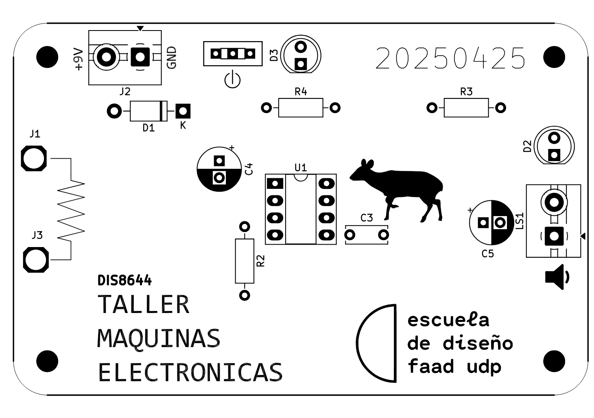
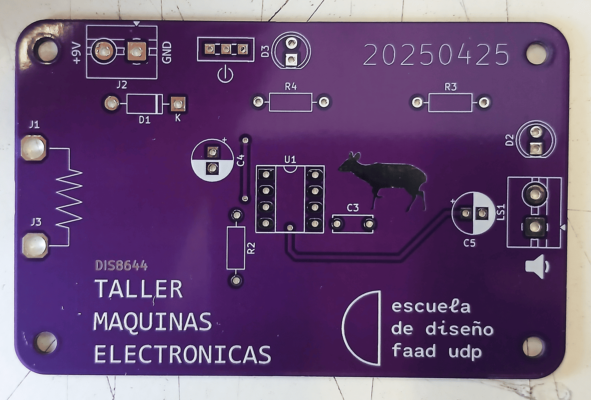
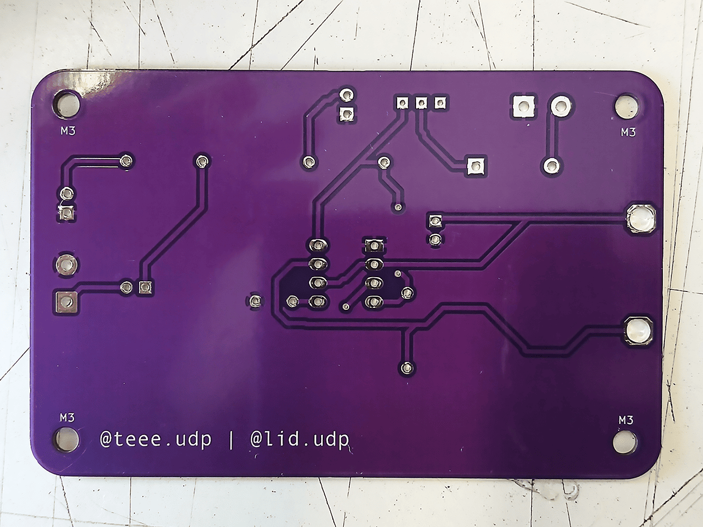
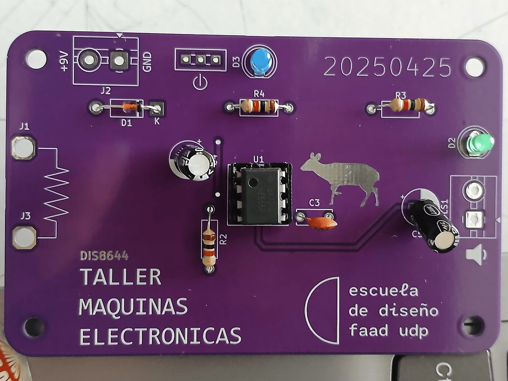
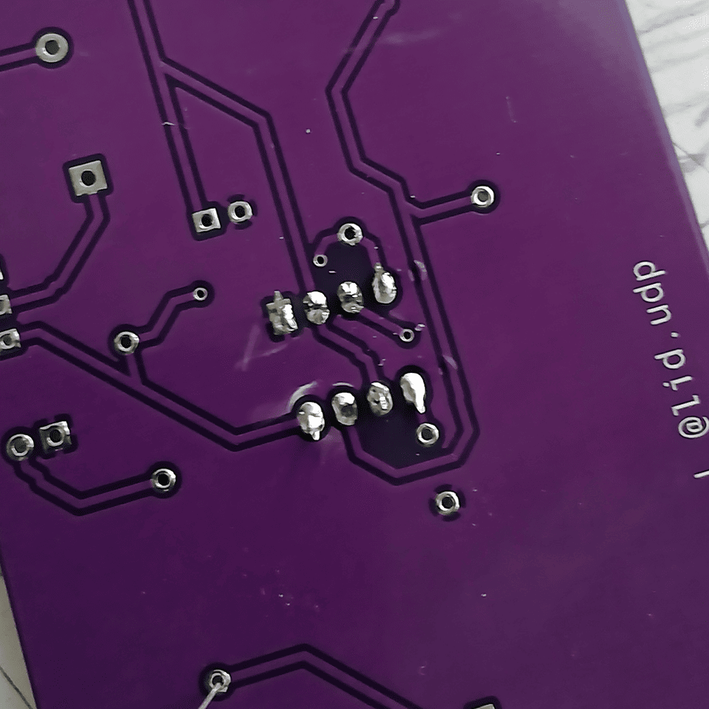
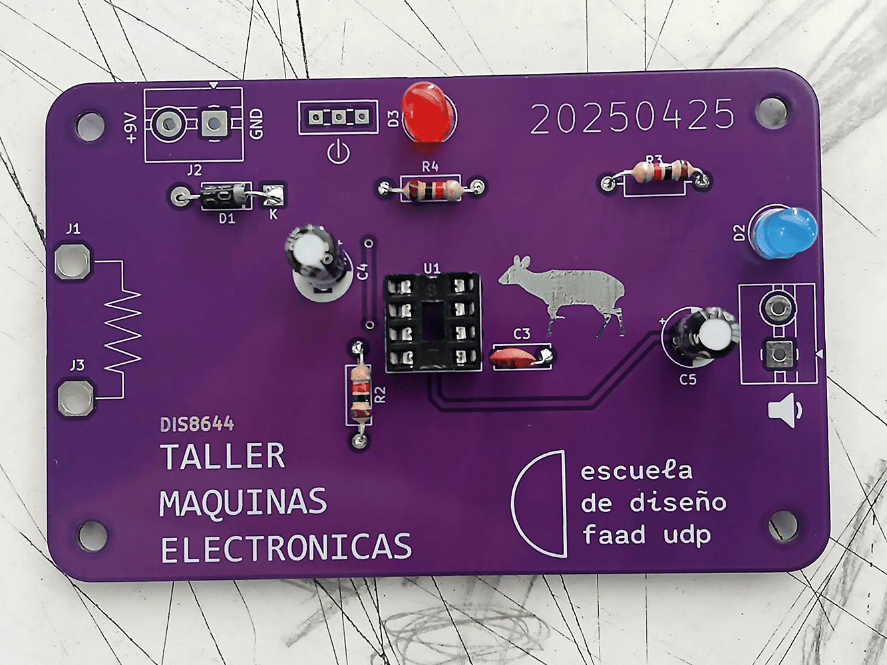
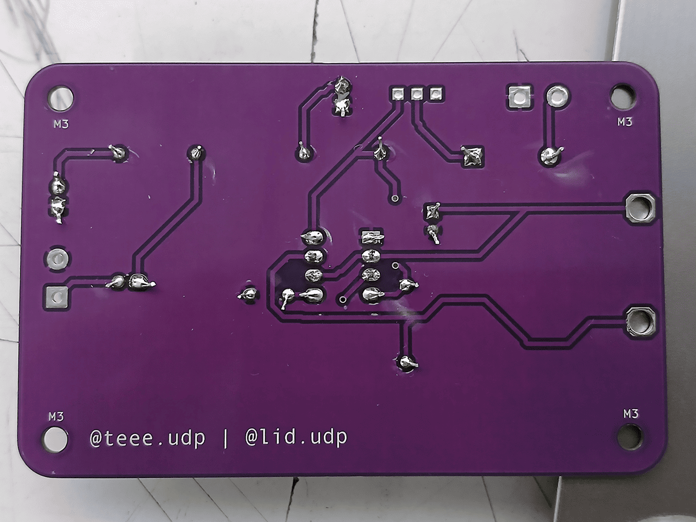

# sesion-10b

[16 de mayo del 2025]

### Charla pre-clase

> Aarón mostró que llegaron las placas y dijo que hoy probablemente ocupemos toda la clase soldando
>
> Chrome en sí no es opensource, pero hay una versión opensource de chromium online
>
> [Dead internet theory](https://en.wikipedia.org/wiki/Dead_Internet_theory): teoría que decide que por un *"esfuerzo coordinado e intencional"* (lol), el internet consiste mayormente de bots y contenido generado automáticamente para controlar a la población
>
> Circuit bending: utilizar los circuitos de juguetes de niños o sintetizadores digitales para poder hacer música
>
> [Nic Collins](https://www.nicolascollins.com/HEM3/bending.htm) es un circuit bender
>
> (Video de Six bells and a bow)
>
> 
>
> (Video de The Royal Touch)
>
> 
>
> El juguete speak and spell es fácil de usar para circuit bending
>
> (Video de Hack of the Month Club -- Project #3: Jumping Speakers)
>
> 
>
> The Art of Handmade Electronic Music por Nic Collins &rarr; [página del libro Handmade Electronic Music](handmadeelectronicmusic.com) // [página en el sitio de Nic Collins sobre el libro](http://nicolascollins.com/handmade.htm)

## Apuntes

- En KiCad, se importa de PCB a PDF via seleccionando plot

- Al exportar el BOM, se hace legible para la persona común subiendo el csv en excel y convirtiéndolo en tabla, además de modificar los nombres para que todos entiendan fácilmente

### BOM udpudu

|Reference   |Value   |Footprint            	|Qty|OBS           	|
|------------|--------|-------------------------|---|------------------|
|U1      	|~   	|Socket 8 pines       	|1  |              	|
|R2,R3,R4	|1k  	|Resistencias         	|3  |              	|
|D1      	|1n4007  |Diodo                	|1  |              	|
|C3      	|100n	|Condensador cerámico 	|1  |104           	|
|C4      	|1u  	|Condensador electrolítico|1  |              	|
|C5      	|47u 	|Condensador electrolítico|1  |              	|
|D2,D3   	|LED 	|Led 5mm              	|2  |              	|
|J2      	|TBLOCK_2|Terminal Block 2     	|1  |              	|
|LS1     	|SPK 	|Terminal Block 2     	|1  |              	|
|SW1     	|SW_SPDT |Switch spdt          	|1  |              	|
|U1      	|NE555   |DIP-8                	|1  |Va en el socket U1|
|Clip batería|9v  	|                     	|1  |              	|
|Parlante	|8ohm	|                     	|1  |              	|
|J1,J3   	|CAIMAN  |Cables caimán        	|2  |              	|

## Encargo 22 - Documentación textual del proceso de ensamblado de udpudu

1. Nos entregaron las placas de udpudu, les hicimos una revisón rápida, con una explicación breve de algunas partes como las perforaciones en las esquinas

2. Luego se extrajo el BOM del archivo en KiCad para poder organizar el orden en el que vamos a soldar, además de mostrar cómo se le entregaría esta lista a alguien al momento de comprar los componentes

3. Juntamos los componentes necesarios, yo decidí colocarlos inmediatamente todos en la placa solamente para asegurarme de que todo estuviera en su lugar y no me faltase nada, además de comprobar que las polaridades de los componentes relevantes estén colocados correctamente

4. En mi caso, no sabía soldar, pero Misaa me enseñó soldando dos pins del socket de 8 y luego revisó que soldara bien el resto de los pines

5. Soldé los resistores primero, porque los profes sugirieron que comenzáramos por los componentes más bajos primero, luego el diodo, seguido por el condensador cerámico y los electrolíticos, y finalmente los LEDs. Estos LEDs casi los soldé mal porque no sabía como se veía su polaridad en la placa, pero pedí ayuda antes de cometer un error

## Encargo 23 - Documentación visual del proceso de ensamblado de udpudu

