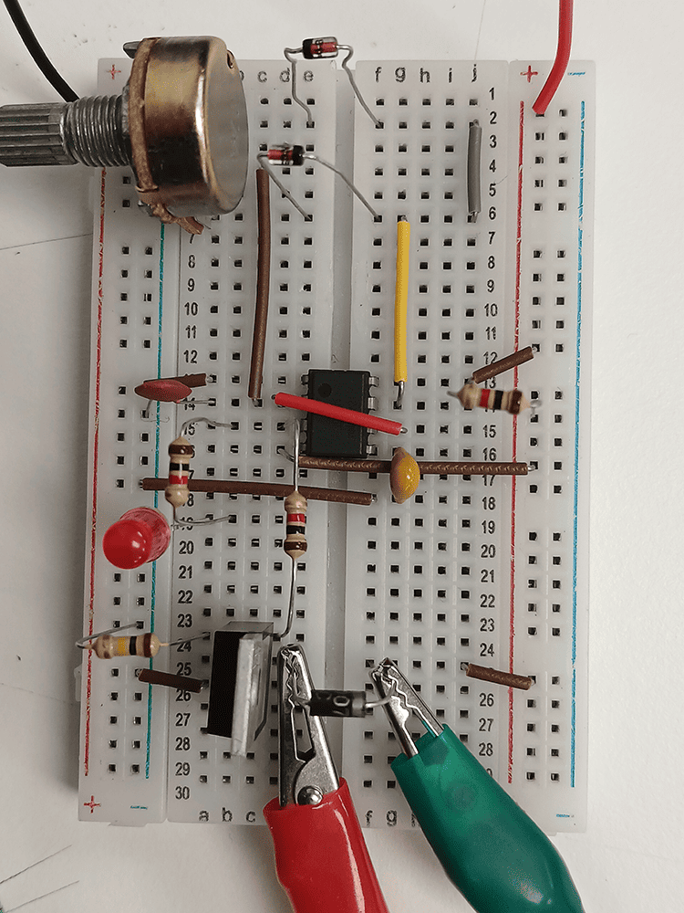
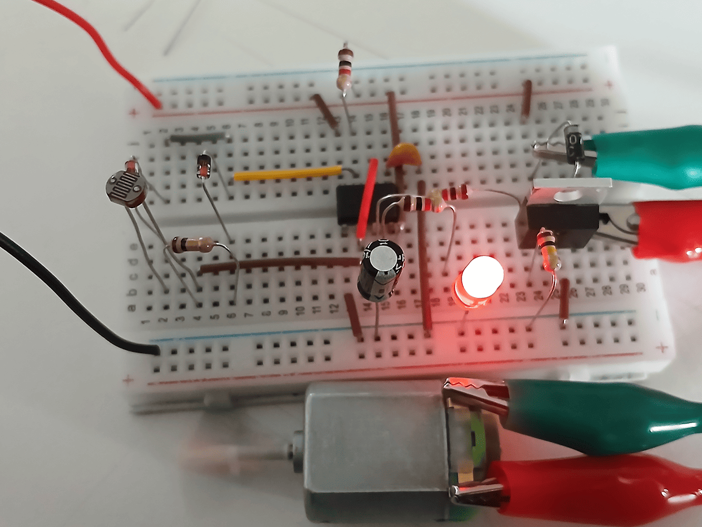

# sesion-11a

[20 de mayo del 2025]

### Teloneo

> Misaa habló de artistas sonoros como [Jaap Blonk](http://www.jaapblonk.com/)
>
> También poetas sonoros, ex. Altazor de Vicente Huidobro y Ursonate de Kurt Schwitters
>
> Artistas que Aarón y Misaa consideran escenciales a la clase: Caterina Barbieri, Ela Minus, Kali Malone

## Apuntes

### Qué conocemos

- Componentes: R, C, D, IC, POT, BAT, PS, +9V, GND, LED, OP AMP, LDR, Relé, PROTO, PCB, [Sn, Cu, Au, Si], Perfboard

- Circuitos: PWM, Astable, Monostable

- Aplicaciones: APC, LED Brightness, On/Off light bulb, Sinte Rexp (udpudu)

- PWM que mueve un motor

***

- Objetivo de hoy: un 555 active por un rato un motor

- Transistor mosfet : PACKAGE TO-220 en KiCad

- Potenciómetro son dos resistencias variables

&darr; Video del circuito con motor y LDR &darr;

