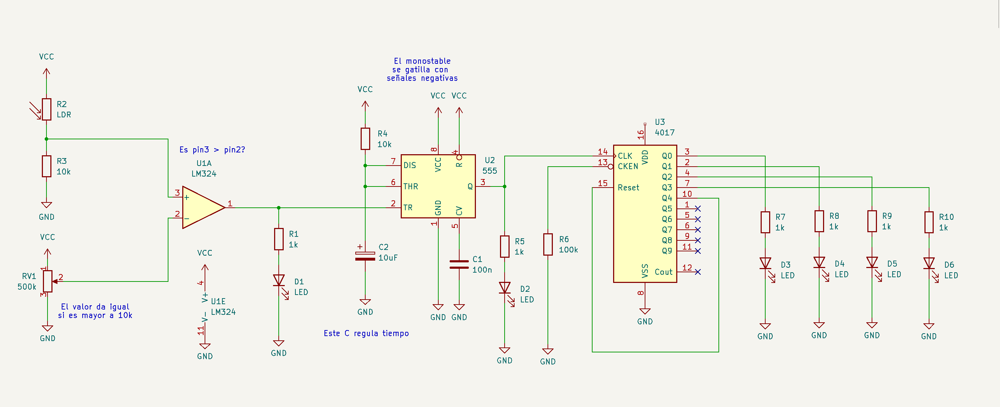
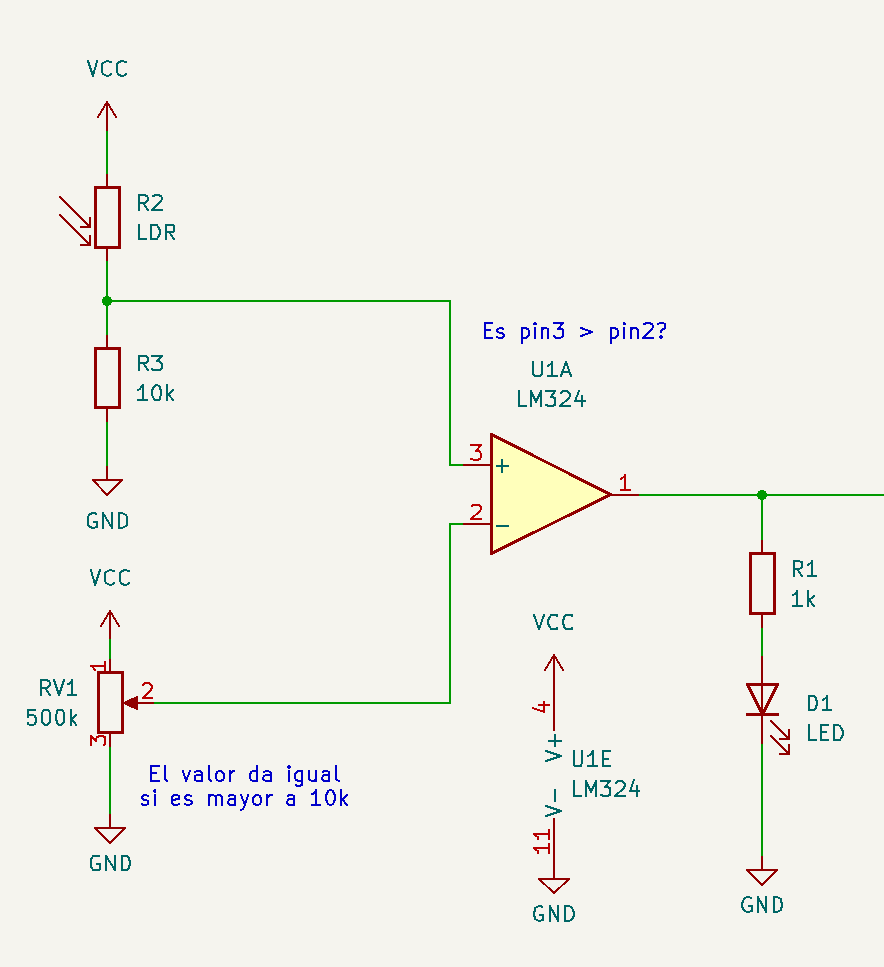
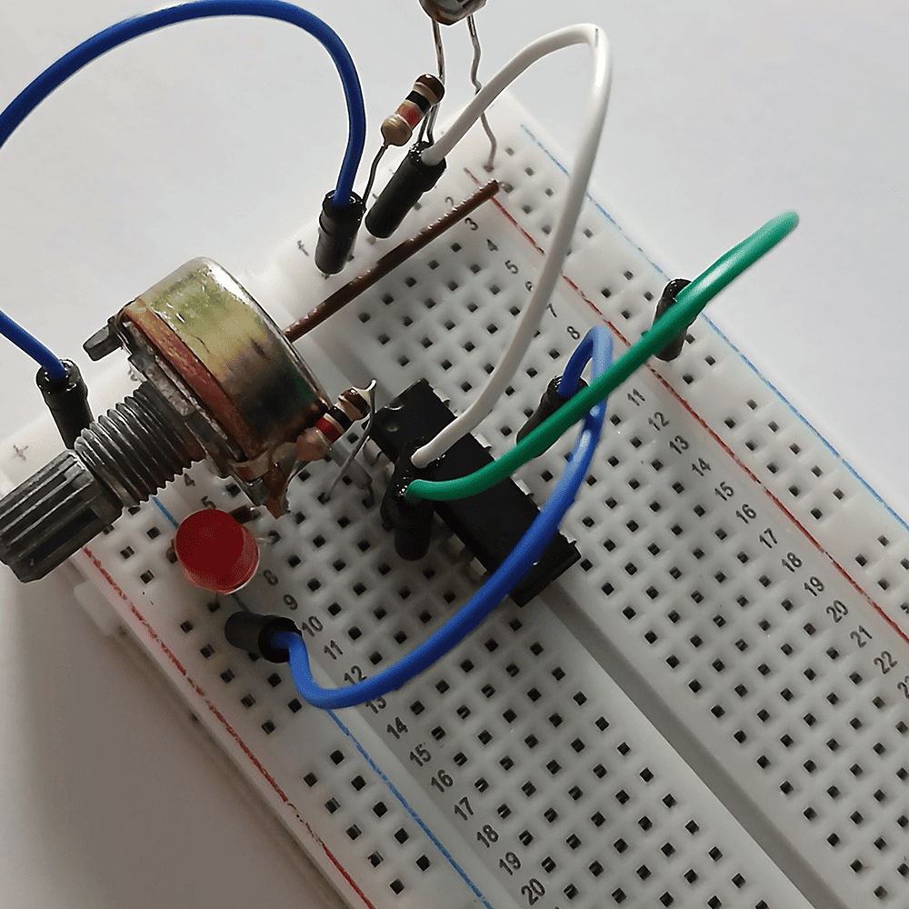
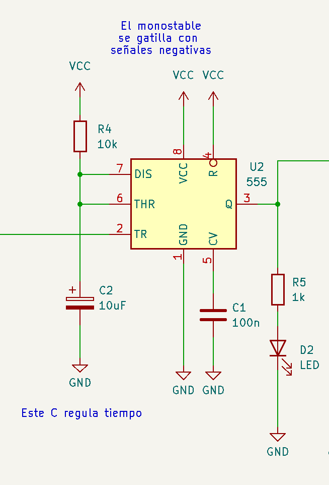
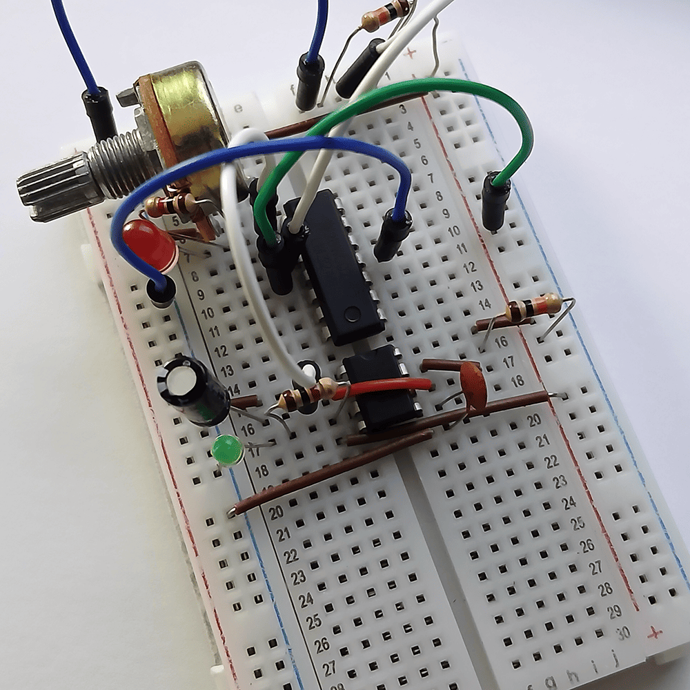
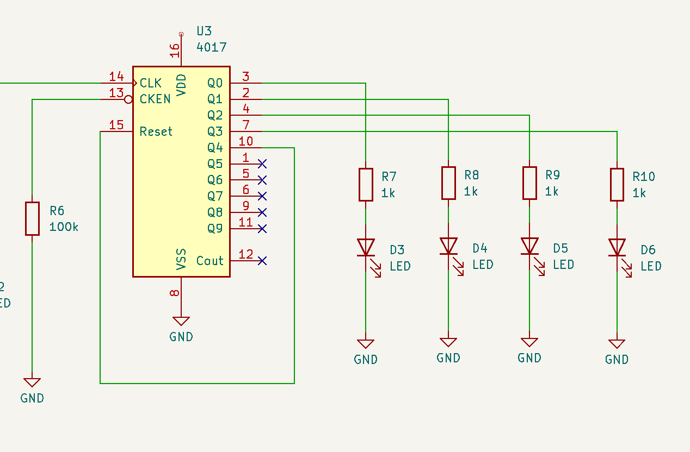

# sesion-12a

[27 de mayo del 2025]

## Apuntes

- Hipotéticamente, las luces de un semáforo duran 4seg en amarillo, y 60seg en verde y rojo // múltiplos de 4

- El tiempo de encendido del semáforo depende del CLK

- Modularización con el chip 4017

- [w3schools](https://www.w3schools.com/) &rarr; eli5 tutoriales de coding (html, css, javascript, etc)

- [Datasheet](https://www.ti.com/lit/ds/symlink/cd4017b-mil.pdf?ts=1749183819738) del 4017

    - 4017 cuenta hasta 10 // 4022 cuenta hasta 8

    - Mínimo 3V, máximo 18V

- Diagrama de tiempo muestra los cambios que suceden en un circuito (ondas digitales, pulsos, la duración de estos, etc)

- Diagrama de lógica convencional: representa operaciones y el orden en el que se deben ejecutar

- Diagrama de lógica combinacional: salidas son función exclusiva al valor de las entradas

- Funciones booleanas:

    - AND

    |A|B|A y B|
    |--|--|:--:|
    |0|0|0|
    |1|0|0|
    |0|1|0|
    |1|1|1|
    
    - OR

    |A|B|A y B|
    |--|--|:--:|
    |0|0|0|
    |1|0|1|
    |0|1|1|
    |1|1|1|

***

### Circuito detector de sombras

    Recien en este punto decidí probar si el circuito funcionaba, y no, el primer LED no se apagaba del todo, y al girar la perilla del potenciómetro aunque sea un poco, se apagaba completamente y no volvía a encenderse.

    Por parte del segundo LED, permanecía encendido sin importar que sucedía con el LM324, así que claramente también hice algo mal en las conexiones del NE555, pero decidí primero enfocarme en entender qué hice mal en la primera parte.

    Desarmé el circuito por completo y volví a hacerlo, solo probando la primera etapa, pero esta vez el LED directamente no se encendía, aún colocando el flash del celular sobre el LDR o cubriéndolo completamente. Hubo un momento donde se encendió de repente, pero al mover la perilla del potenciómetro, se volvió a apagar y nuevamente no prendía, aunque reajustara el potenciómetro.

    Desarmé y rearmé el circuito como 5 veces, fijándome muy bien que estuviera conectando todo como debía, pero seguía fallando, realmente no entiendo qué estaba haciendo mal. Cambié de cables, chip, LED, potenciómetro, intenté todo, hasta mantuve un mini circuito con una resistencia y un LED aparte por si quizás fuese un problema de la batería, pero no, solo era del circuito del LM324.

