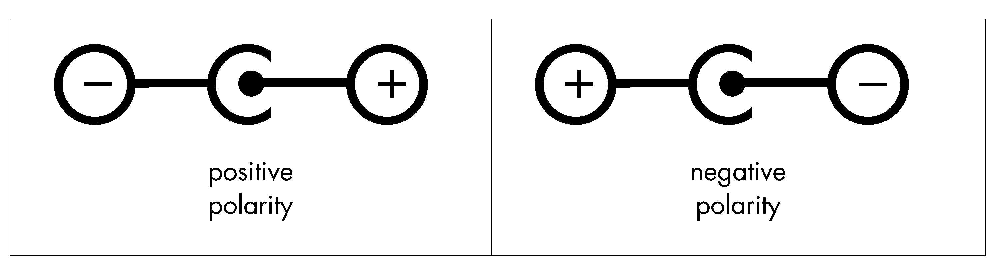

# sesion-12b

[30 de mayo del 2025]

### Teloneo

> [posternurarecords](https://posternurarecords.cl/) - Creado por Christian Oyarzún
>
> [error404.cl](https://error404.cl/) - Christian Oyarzún
>
> Y2K o Year 2000 problem: se refiere a los problemas relacionados al formato de calendario de los computadores después del año 2000
>
> web 1.0: pre-2000, apenas cargaba gifs // web 2.0: rss feed, net art (a esto se dedicaba Christian)
>
> [Summer - Olia Lialina](https://art.teleportacia.org/olia/summer/) &rarr; cada frame es un sitio web de sus amigos
>
> Muchos de los proyectos de Christian fueron echos en Adobe Flash, así que ahora están obsoletos
>
> Bienal Artes Mediales 2015 &rarr; [drumCircle\[\]](https://error404.cl/drumCircle/)
>
> Misaa vió el drumCircle[] y decidió expandirlo, así creando la tutupá
>
> [Sonic Pi](https://sonic-pi.net/): Software de música con coding
>
> Algorave: Raves donde se hace código algorítmico en vivo
>
> Rasterized vs vectors &rarr; sample vs midi
>
> [General MIDI](https://www.youtube.com/watch?v=MWAnDOX5Xxwu)
>
> noisk8: Live coder de Medellín y sk8r, usa foxdot y hasta lo tradujo al español
>
> [Joshua: Teenager vs Superpower](https://www.imdb.com/title/tt6333072/) on Netflix
>
> Webring: círculo de sitios web enlazados de manera circular, generalmente estaban centrados en un tema y eran de ámbito educativo o social
>
> Twitter and Tear Gas - Zeynep Tufekci
>
> Ai Weiwei Cam &rarr; proyecto de self-survaillance donde Weiwei colocó 4 webcams con un 24h livestream en el sitio weiweicam.com
>
> Wafaa Bilal &rarr; tiene una obra donde llevaba una [cámara en la nuca](https://wafaabilal.com/thirdi/) que tomaba fotos cada minuto
>
> McLuhan's "el medio es el mensaje"

## Apuntes

### Fuentes de poder

- 9V batteries pero son caras y contaminantes

- Alternativa: AC/DC power source o eliminador de pilas

- Tomar en consideración: voltage, polarization (centro muestra si es neg o pos), conector size (2.1mm o 2.5mm), currents (la corriente se entrega, el voltaje se pide)

- Siempre usar una fuente de poder **mayor** a la que quiero utilizar

- Los gringos usan plugs asimétricos

- Power banks or USB-A and USB-B, USB-C usa otro estándar

- Paneles solares // [BMS](https://afel.cl/collections/cargador-balanceador) como intermediario para cargar baterías de litio

- Regular batteries (1.5V) or 2032 battery (3V)

### Luces

- LEDs se queman, useful para saber cuando algo está funcionando

- Normal lightbulb (220V), peligroso, usamos relés

- High potency LEDs require high potency resistors

- LED strips controllable via PWM and proper transitor, can be cut, 1Amp per meter

- Consider additive qualities of light ex. [SpectraBloom](https://lorre-mill.com/spectrabloom)

### Motores

- Needs transistors

- DC 6V, rotates con electricidad, en juguetes, ventiladores, ruedas
 
- Motorreductor, reduces RPM but speeds torque via principio de conservación del movimiento angular ex. [Arthur Ganson](https://www.arthurganson.com/faster-1)

- Steppermotor (paso a paso). significantly slower but precise, used in 3D printers. Two types, unipolar and bipolar

- Servomotor: often used in arduino, knows where it is, is precise, sometimes unstable

- H bridge allows change in the directon of a DC motor, can be made with 4 switches, 4 transistors, or an integrated circuit called L298n

- Solenoid: generates lineal movement, used in electromagnetic percussion and electronic locks, can also control liquids

- Magnetismo implica electricidad y viceversa

- Water or air pump

### Trasistores

- Two types, bipolar and FET (bipolar: 2n2222 // mosfet: IRFZ44n)

- Used like switch, como inversor, amplifier and compuerta lógica

### Sonido

- Active and passive speakers: activo se enchufan, pasivos no bc it requiers outside amplification, intensity depends on size (in), potency (watts), impedancia (ohm) // impedancia es la cantidad de ohm con la cual se opone a la circulación de corriente (sacado de una [guía de estudio](https://www.inet.edu.ar/wp-content/uploads/2020/07/ELECTRONICA_Gu--a06-Impedancia.pdf) del INET en Argentina)

- Buzzers: really basic speakers, mainly used for alarms, can be **VERY** loud

- Audio players: converts digital data into sound electricity

- Microphones: converts sound into electricity

- Synths generate sound a partir de señales eléctricas made inside the machine itself

- Pedales de guitarra

## Encargo 24 - Describir de forma textual 3 proyectos de máquinas electrónicas

1. **Detector de mala vibra**: hace sonidos aleatoriamente y a veces enciende luces sin sentido

1. **Detector de nada**: cuando no hay luz, no hay sonido, ni movimiento, activa luces intermitentes y sonidos como alarma

1. **Botón de pánico falso**: un botón que activa luces y alarmas dramáticas, pero no hace nada más

## Encargo 25 - Dibujar diagramas de los 3 proyectos
