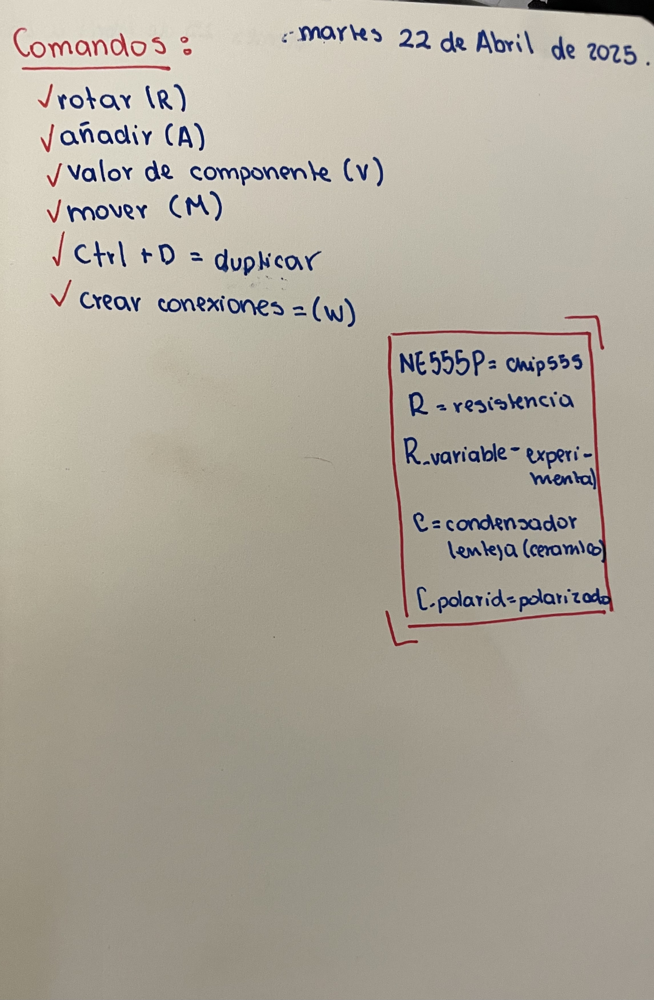
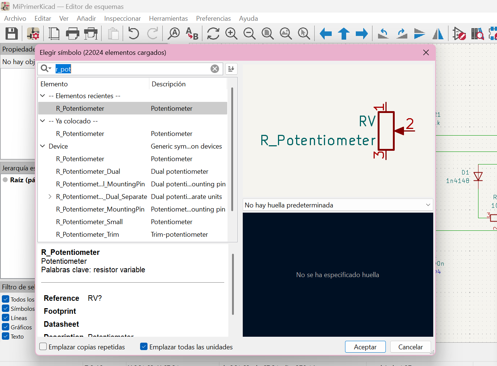
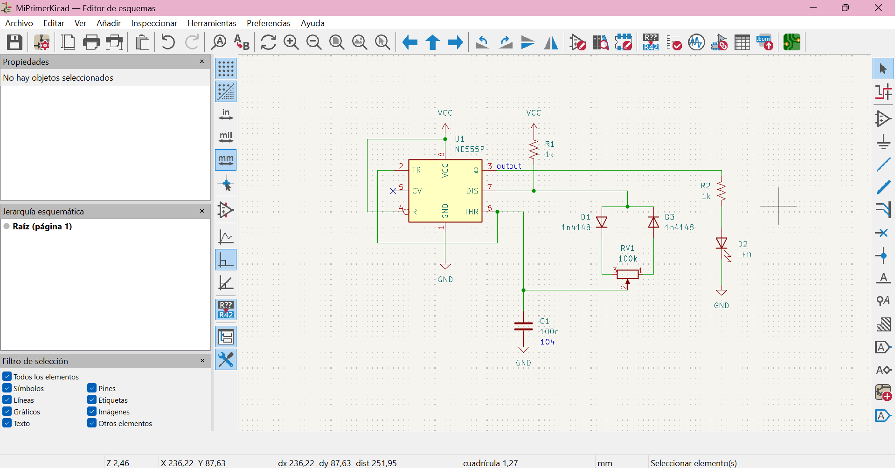
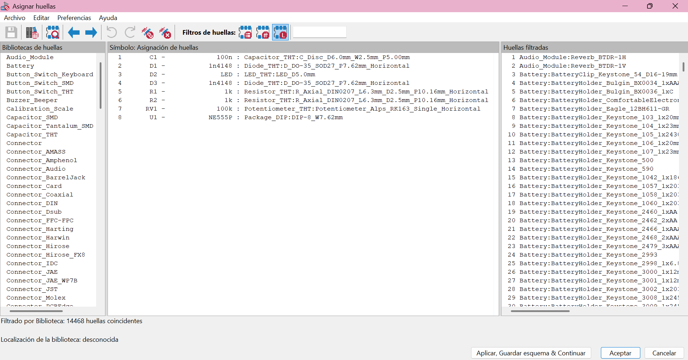
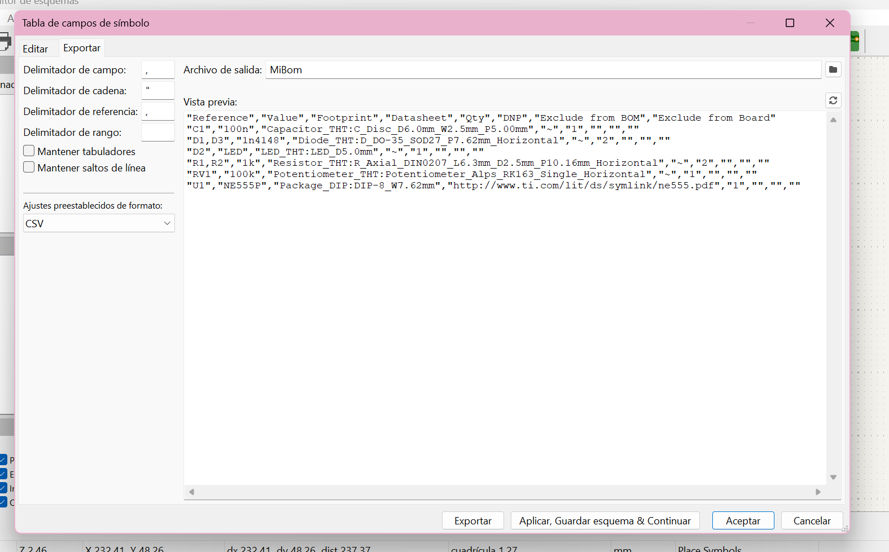
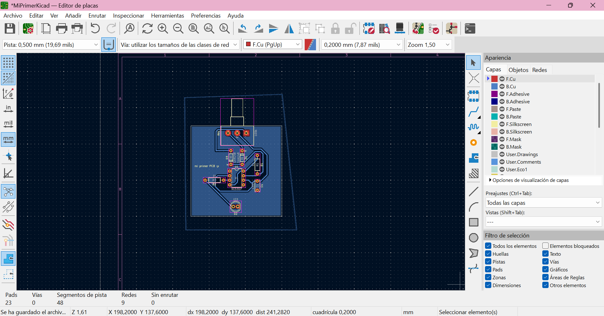
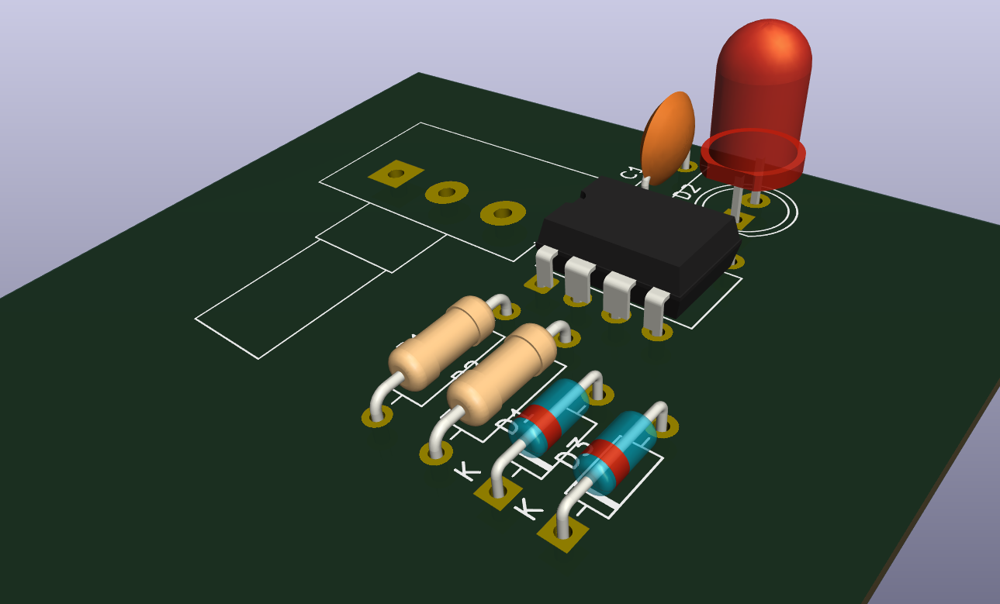
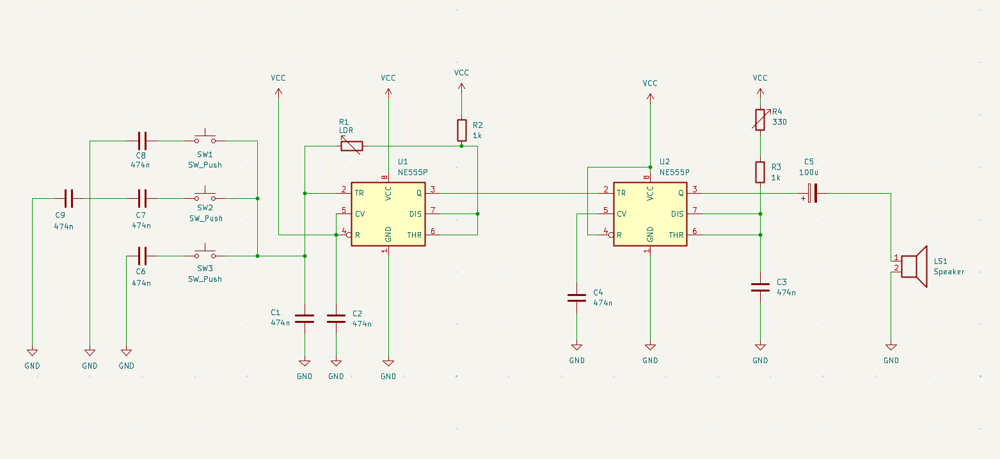

# sesion-07a

martes 22 de abril del 2025.

## Apuntes clases

Foto de mi bitácora

Foto de mi bitácora

## Aprender a usar KiCad

Registro

1- Lugar para buscar componentes

2- Circuito esquematico.

3- Lugar donde asignar algun componente especifico.

4- BOM.

5- Acomodar componentes en placa.

6- Como se ve la placa con el circuito incluido.

## Encargo 14: Recrear Atari Punk Console

## Modicicación Atari Punk Console

