# sesion-10a

Martes 13 de Mayo del 2025.

## Ejercicio realizado en clases

- armar 1 circuito PWM c/u (primer circuito que diseñamos en KiCad).
- juntarse entre 3, c/u con un LED rojo, verde o azul.
- combinar colores.

**Primer circuito esquematico diseñado en KiCad**

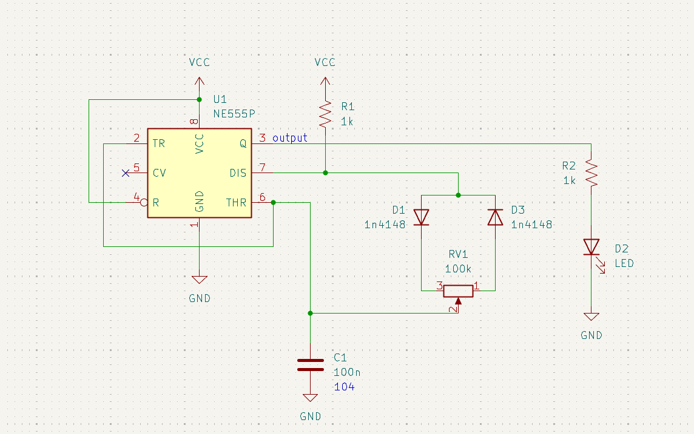

## Registro del circuito en clases

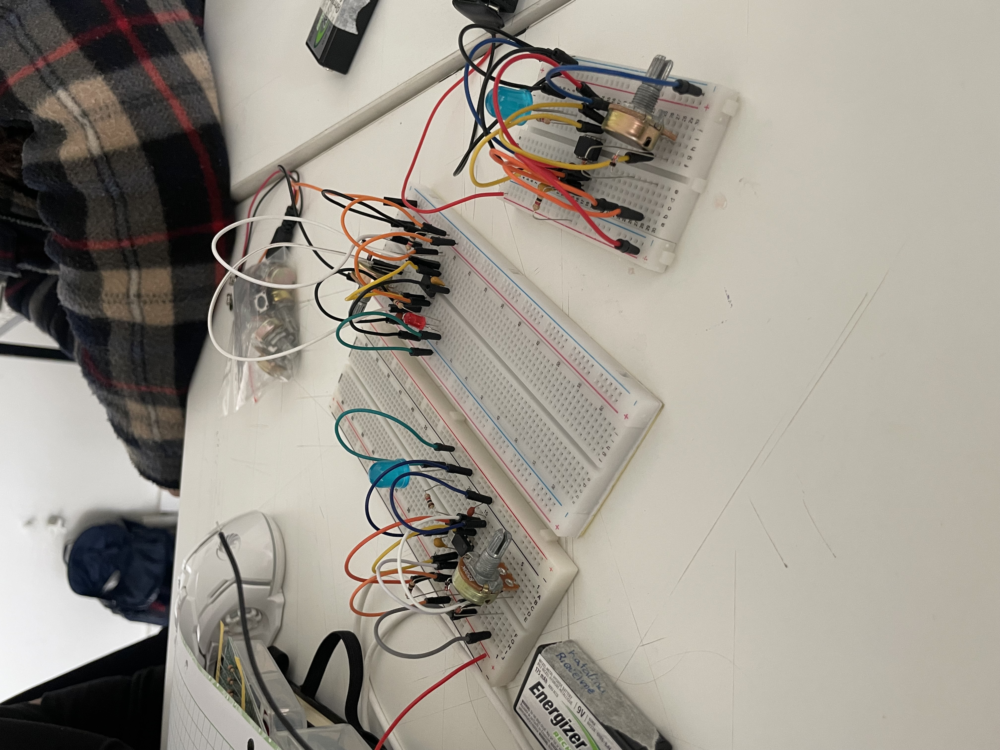

## Apuntes clase

circuit.js se abre automaticamente un circuito **RESONADOR RLC**

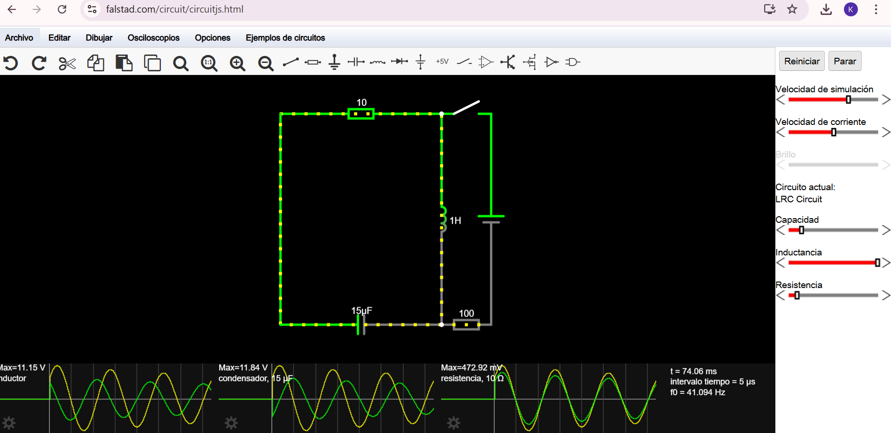

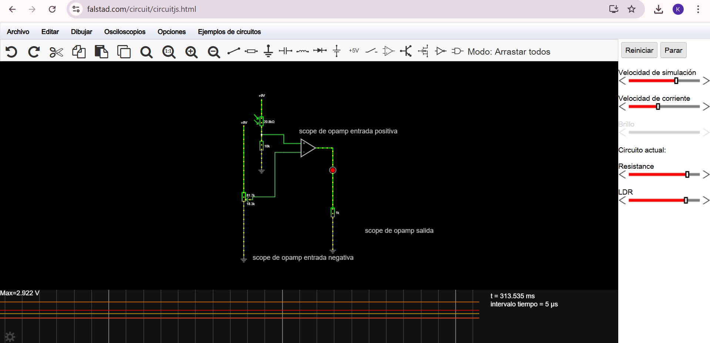

## Ejercicio en clases

Tomar fotografías de pantallas con siete segmentos que encuentremos en la FAAD o sus alrededores y subirlas al discord.

**CONTEXTO: ¿Qué es una pantalla de siete segmentos?**

Es un aparato electrónico que utiliza siete segmentos LED, los cuales se pueden encender o apagar de manera individual, para representar números del 0 al 9 en formato de cifras arábigas.

Ejemplo:

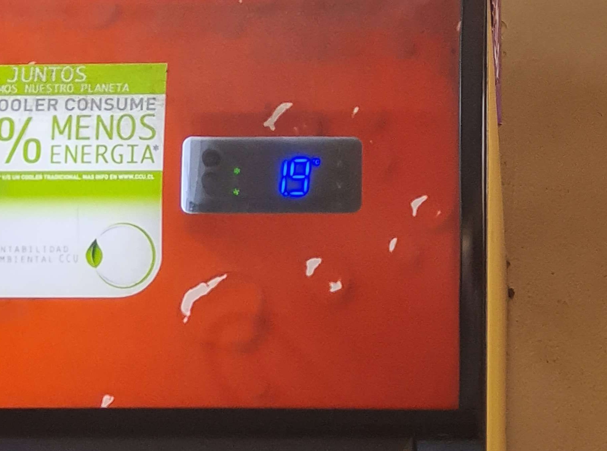

*FotografÍa tomada por mi compañera de taller Thyare Santander el 13/05 en el negocio al lado de la FAAD (no recuerdo como se llama :( )*

También el sistema de siete segmentos está diseñado para números, pero no para letras, por eso algunas no son compatibles y hacen confundir a un número y a veces, no se puede distinguir. Aquí tenemos los números y las letras del alfabeto latino.

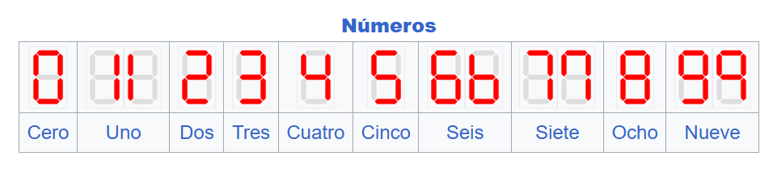

Imagen rescada de wikipedia https://es.wikipedia.org/wiki/Visualizador_de_siete_segmentos

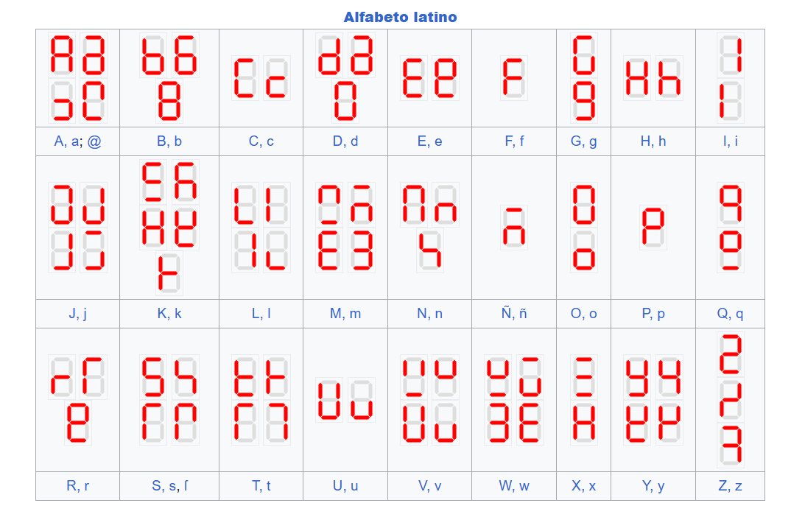

Imagen rescada de wikipedia https://es.wikipedia.org/wiki/Visualizador_de_siete_segmentos

## Encargo 20: pantallas de siete segmentos

**IMAGEN 1**

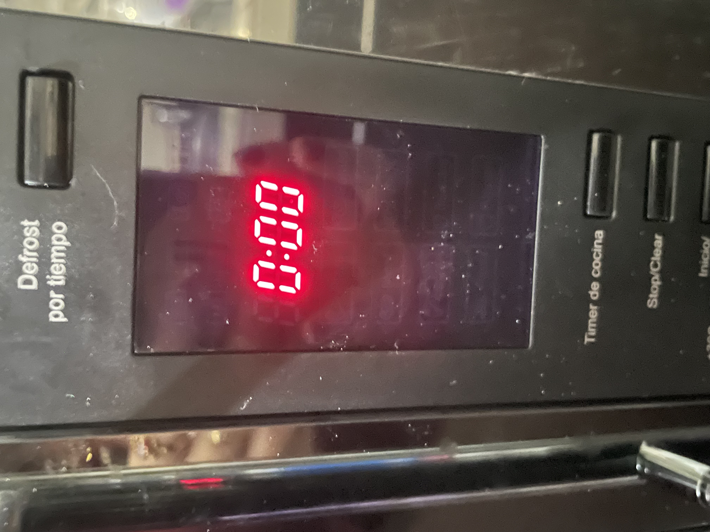

fue capturada el 14/05 en mi casa.

**IMAGEN 2**

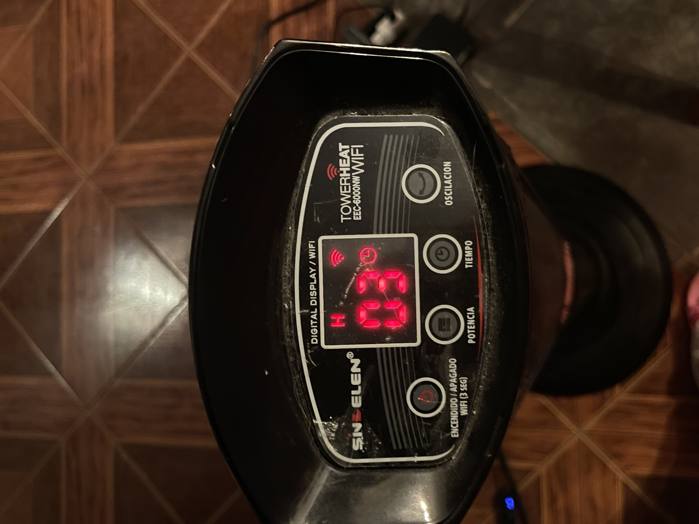

fue capturada el 15/05 en mi casa.

**IMAGEN 3**

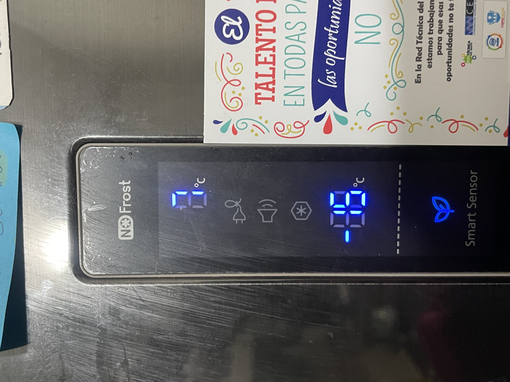

fue capturada el 15/05 en mi casa.

## Encargo 21: simulación de circuitos con 555 y/o comparadores hechos con opamps en Falstad

Realizar algun circuito visto en clases con chip555.

PWN

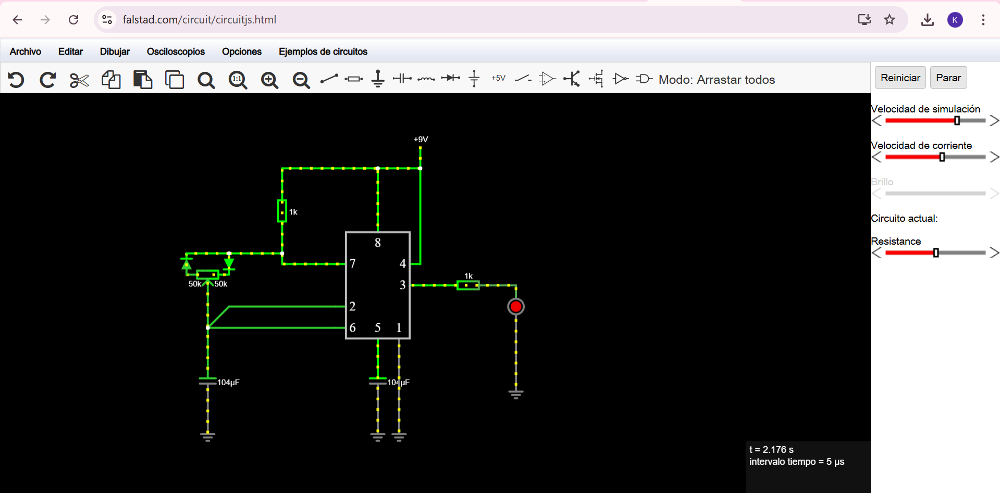

código

```txt
$ 1 0.000005 10.20027730826997 50 5 50 5e-11
165 320 304 464 304 14 0
R 448 192 448 144 0 0 40 9 0 0 0.5
w 384 272 384 192 0
w 384 192 448 192 0
w 448 336 448 192 0
r 448 368 592 368 0 1000
162 592 368 592 432 2 default-led 1 0 0 0.01
g 592 432 592 528 0 0
c 384 464 384 560 4 0.000104 5.999108982982355 0.001 0
g 384 560 384 592 0 0
g 416 464 416 592 0 0
w 320 432 128 432 0
w 320 400 160 400 0
174 96 352 160 384 1 100000 0.5 Resistance
w 128 432 128 384 0
d 160 320 160 352 2 default
d 96 352 96 320 2 default
w 96 320 160 320 0
w 160 320 240 320 0
w 240 320 240 336 0
w 240 336 320 336 0
g 128 560 128 592 0 0
c 128 464 128 560 4 0.000104 4.234031265341355 0.001 0
w 128 464 128 432 0
w 160 400 128 432 0
r 240 320 240 192 0 1000
w 240 192 384 192 0
```
