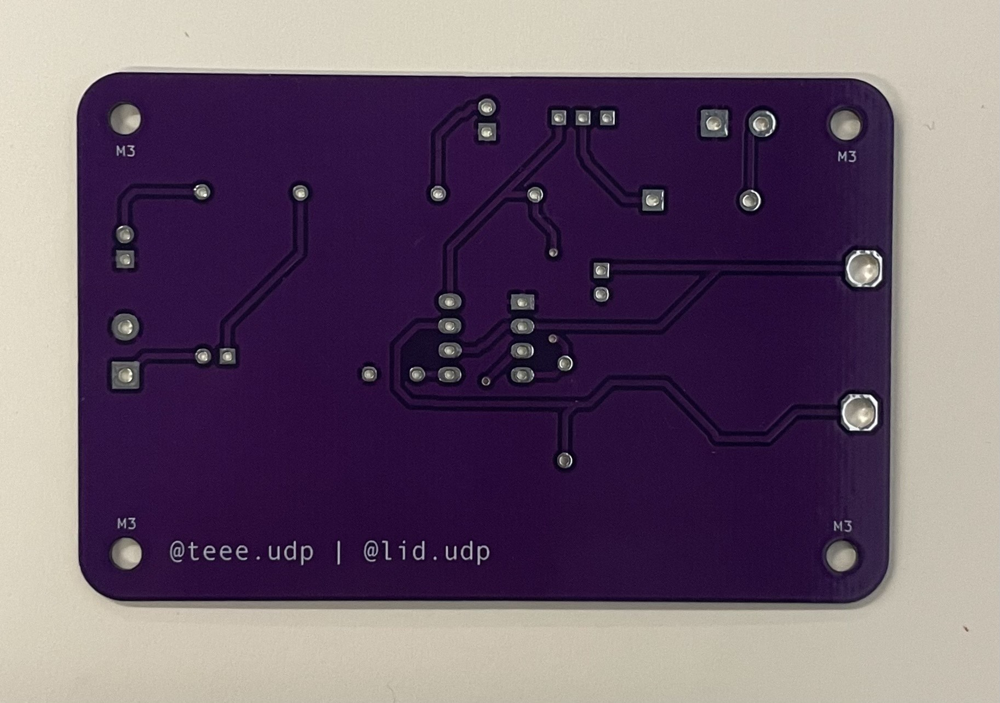
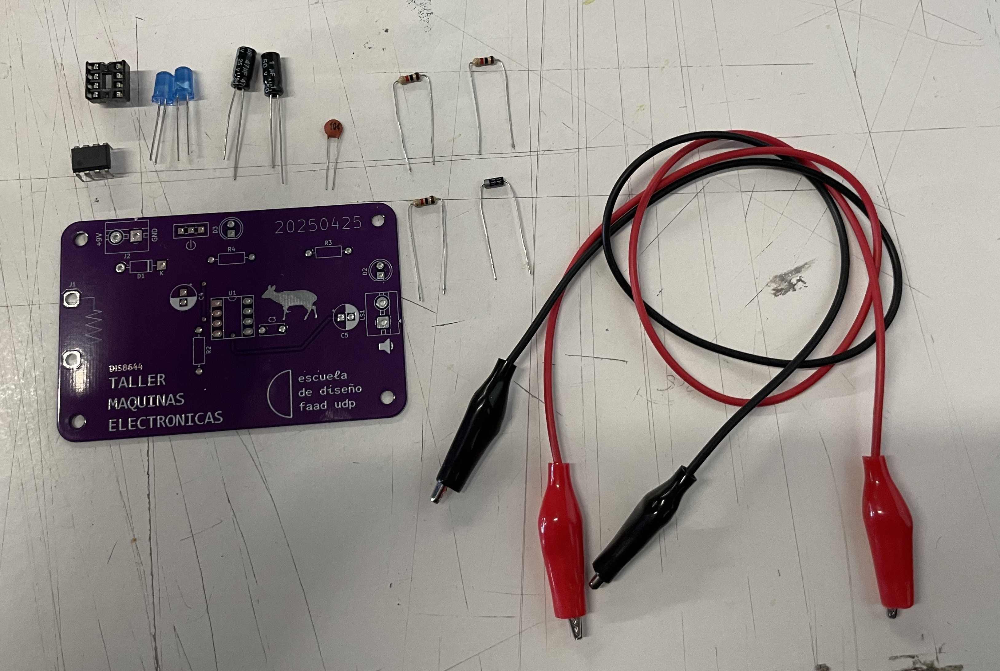
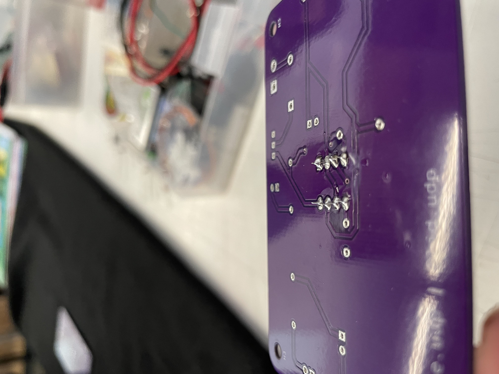
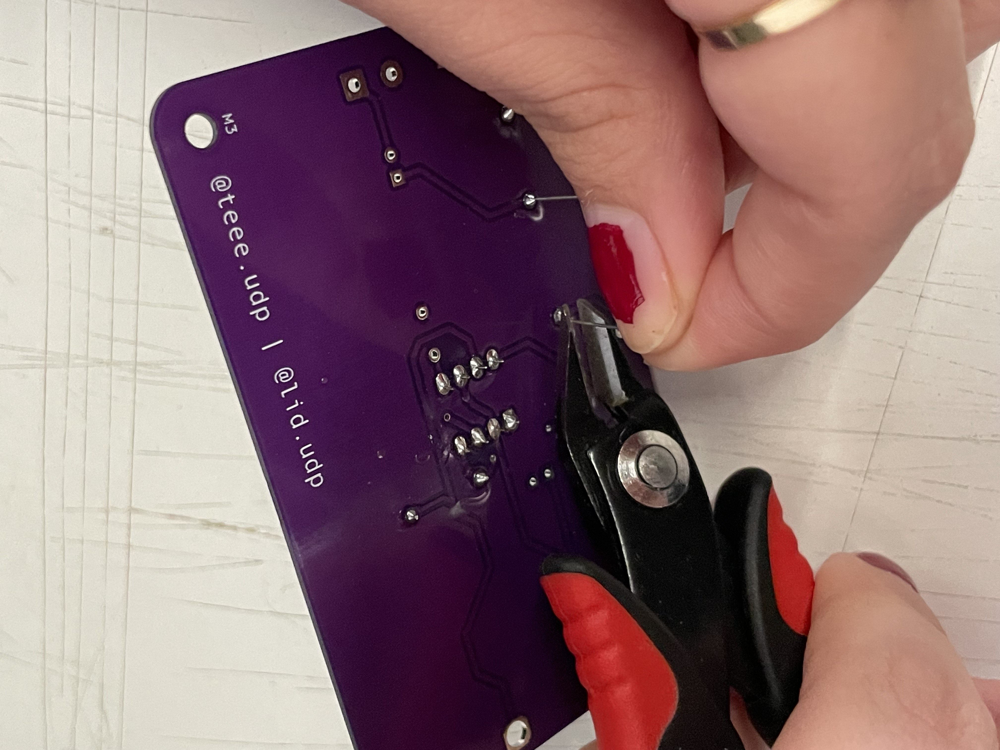

# sesion-10b

Viernes 16 de Mayo del 2025.

## Trabajo en clases

- hablamos de lo que haremos el dia de hoy, que era soldar los componentes a la placa PCB que realizamos hace unas clases atrás el cual era udpudu.
- para ello vimos los componentes que usaremos y realizamos un BOM en excel.

**BOM CSV Original (sin modificaciones)**

|Reference|Value                        |Datasheet|Footprint                                    |Qty|DNP|
|---------|-----------------------------|---------|---------------------------------------------|---|---|
|C3       |100n                         |~        |Capacitor_THT:C_Disc_D6.0mm_W2.5mm_P5.00mm   |1  |   |
|C4       |1u                           |~        |Capacitor_THT:CP_Radial_D6.3mm_P2.50mm       |1  |   |
|C5       |47u                          |~        |Capacitor_THT:CP_Radial_D6.3mm_P2.50mm       |1  |   |
|D1       |1n4007                       |~        |Diode_THT:D_DO-41_SOD81_P10.16mm_Horizontal  |1  |   |
|D2,D3    |LED                          |~        |LED_THT:LED_D5.0mm                           |2  |   |
|J1,J3    |CAIMAN                       |~        |modules_teee2025:caiman                      |2  |   |
|J2       |TBLOCK_2                     |~        |TerminalBlock:TerminalBlock_MaiXu_MX126-5.0-02P_1x02_P5.00mm|1  |   |
|LS1      |SPK                          |~        |TerminalBlock:TerminalBlock_MaiXu_MX126-5.0-02P_1x02_P5.00mm|1  |   |
|R2,R3,R4 |1k                           |~        |Resistor_THT:R_Axial_DIN0207_L6.3mm_D2.5mm_P10.16mm_Horizontal|3  |   |
|SW1      |SW_SPDT                      |~        |modules_teee2025:SPDT_PCB_small_P2.5mm       |1  |   |
|U1       |~                            |         |Package_DIP:DIP-8_W7.62mm_Socket_LongPads    |1  |   |

**BOM (con modificaciones/ nombre de componentes simplificados)**

|Referencia  |Valor   |Huella                   |Qty|OBS               |
|------------|--------|-------------------------|---|------------------|
|U1          |~       |Socket 8 pines           |1  |                  |
|R2,R3,R4    |1k      |Resistencias             |3  |                  |
|D1          |1n4007  |Diodo                    |1  |                  |
|C3          |100n    |Condensador cerámico     |1  |104               |
|C4          |1u      |Condensador electrolítico|1  |                  |
|C5          |47u     |Condensador electrolítico|1  |                  |
|D2,D3       |LED     |Led 5mm                  |2  |                  |
|J2          |TBLOCK_2|Terminal Block 2         |1  |                  |
|LS1         |SPK     |Terminal Block 2         |1  |                  |
|SW1         |SW_SPDT |Switch spdt              |1  |                  |
|U1          |NE555   |DIP-8                    |1  |Va en el socket U1|
|Clip batería|9v      |                         |1  |                  |
|Parlante    |8ohm    |                         |1  |                  |
|J1,J3       |CAIMAN  |Cables caimán            |2  |                  |

## Encargo 22 y 23: documentación textual y visual del proceso de ensamblado de udpudu

- escribir manual con pasos a seguir, receta, de los pasos que siguieron para ensamblar la PCB.
- incluir aciertos y errores, aprendizajes y consejos.
- subir documentación visual sobre lo realizado en clases.

## Paso a paso de ensamblado de udpudu

- **PASO 1:** Como se menciono anteriormente realizamos un BOM para poder identificar los componentes a utilizar.

|Referencia  |Valor   |Huella                   |Qty|OBS               |
|------------|--------|-------------------------|---|------------------|
|U1          |~       |Socket 8 pines           |1  |                  |
|R2,R3,R4    |1k      |Resistencias             |3  |                  |
|D1          |1n4007  |Diodo                    |1  |                  |
|C3          |100n    |Condensador cerámico     |1  |104               |
|C4          |1u      |Condensador electrolítico|1  |                  |
|C5          |47u     |Condensador electrolítico|1  |                  |
|D2,D3       |LED     |Led 5mm                  |2  |                  |
|J2          |TBLOCK_2|Terminal Block 2         |1  |                  |
|LS1         |SPK     |Terminal Block 2         |1  |                  |
|SW1         |SW_SPDT |Switch spdt              |1  |                  |
|U1          |NE555   |DIP-8                    |1  |Va en el socket U1|
|Clip batería|9v      |                         |1  |                  |
|Parlante    |8ohm    |                         |1  |                  |
|J1,J3       |CAIMAN  |Cables caimán            |2  |                  |

- **PASO 2:** Hicieron entrega de nuestras placas PCB y de una base DIP.

Placa PCB por parte delantera

Placa PCB por parte trasera

Sobreposicion de base DIP para ver como se veria

![como se veria la placa pcb con su componente soldado(./archivos/sobreposicion_base_dip.jpeg)

- **PASO 3:** Al ya saber cuales eran todos los componentes que utilizaremos, realizarmos el circuito en la protoboard. En el cual verificaremos si nos gusta como suena o modificamos algun condensador para que el sonido sea diferente.
- **PASO 4:** Separamos todos los componentes que utilizademos para soldar.

- **PASO 5:** Reunimos 4 mesas para formar grupos de 6 y ayudarnos a soldar, dieron un cautin por 3 personas, por lo menos así fue en mi grupo. 
- **PASO 6:** Luego calentamos el cautín con mucho cuidado, siempre dejandolo en su respectiva base.
- **PASO 7:** Limpiamos la punta y comenzamos a soldar, en esta parte nos ibamos turnando con mis compañeras de clase y simepre llevando registro de lo que hacíamos.

Registro de video soldando

https://github.com/user-attachments/assets/4eb16723-1366-4345-8e7a-974ea8bdc051

Resultado de la primera pieza soldada

- **PASO 8:** Realizamos lo mismo con todos los componentes y los que tenian las patitas largas lo cortabamos con ... (no me acuerdo como se llama, pero para mí era un corta cuticula xd)

- **PASO 9:** Y ese fue el resultado final de la clase, no alcancé a soldar todas las piezas por el tiempo pero voy a continuar en mi casa :). 

https://github.com/user-attachments/assets/2f4b2e38-c6eb-45bc-975d-c05aa686c220

## Páginas utilizadas

**Para comprimir videos** https://clideo.com/es/compress-video
