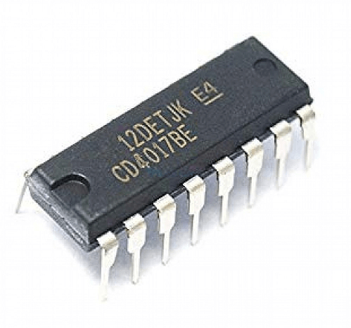
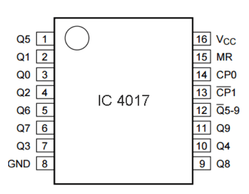

# sesion-11b

Viernes 23 de Mayo del 2025.

Me encontraba con licencia pero de igual forma me consegui la materia
## Apuntes

Se vio un componete nuevo, el cual es el **Chip 4017**

Foto del Chip 4017

Este "chip 4017" Chip 4017
El chip 4017 es un circuito integrado, también llamado contador de décadas o divisor, es un dispositivo que puede contar hasta diez pulsos de entrada antes de reiniciar el ciclo. Dispone de diez salidas que se activan de forma secuencial con cada pulso recibido.

Foto de pinout

## Diagrama de flujo

El diagrama de flujo del circuito que vamos a trabajar en clase comienza con el primer 555, que funciona como un generador de reloj. Luego, el 4017 proporciona una secuencia de salidas. A continuación, se encuentra el segundo 555, configurado en modo astable, y finalmente, todo está conectado a un parlante que produce sonido en función de la frecuencia con la que se encienden los LED del secuenciador.

