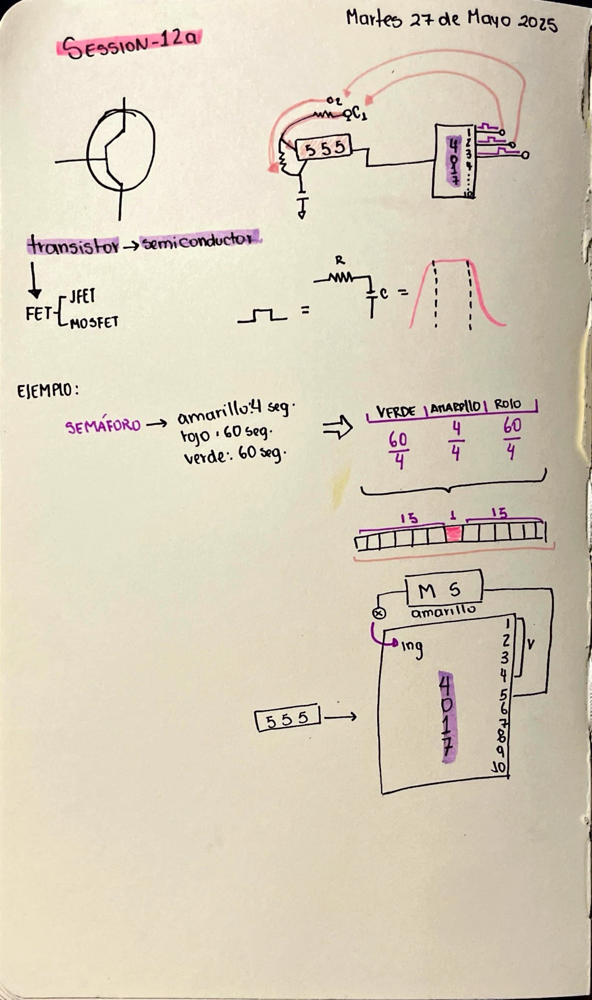
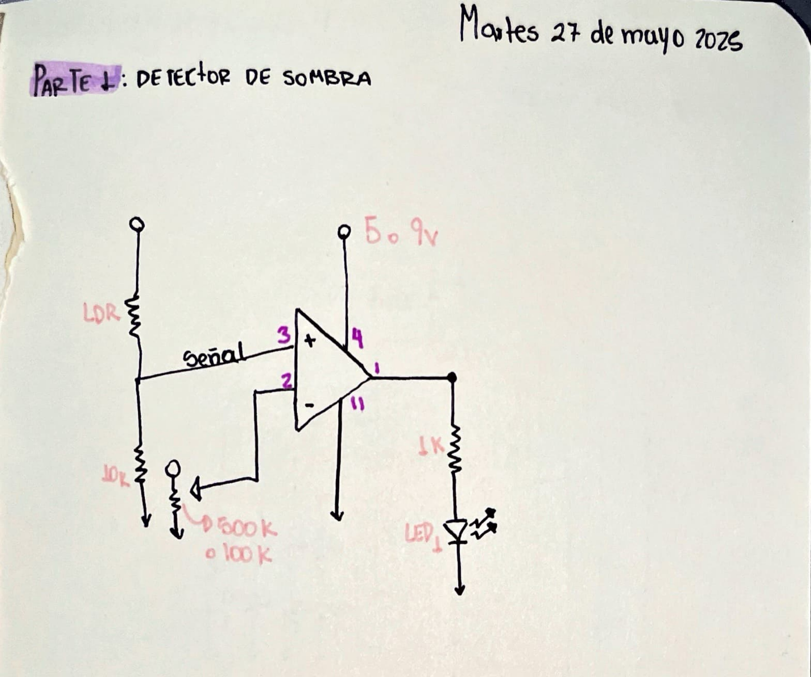
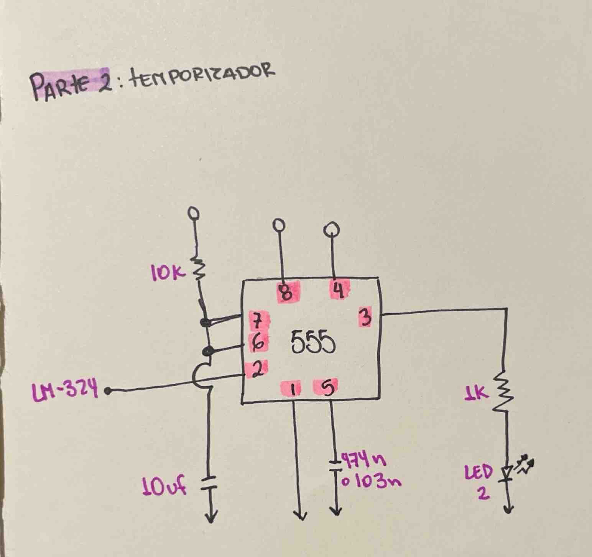
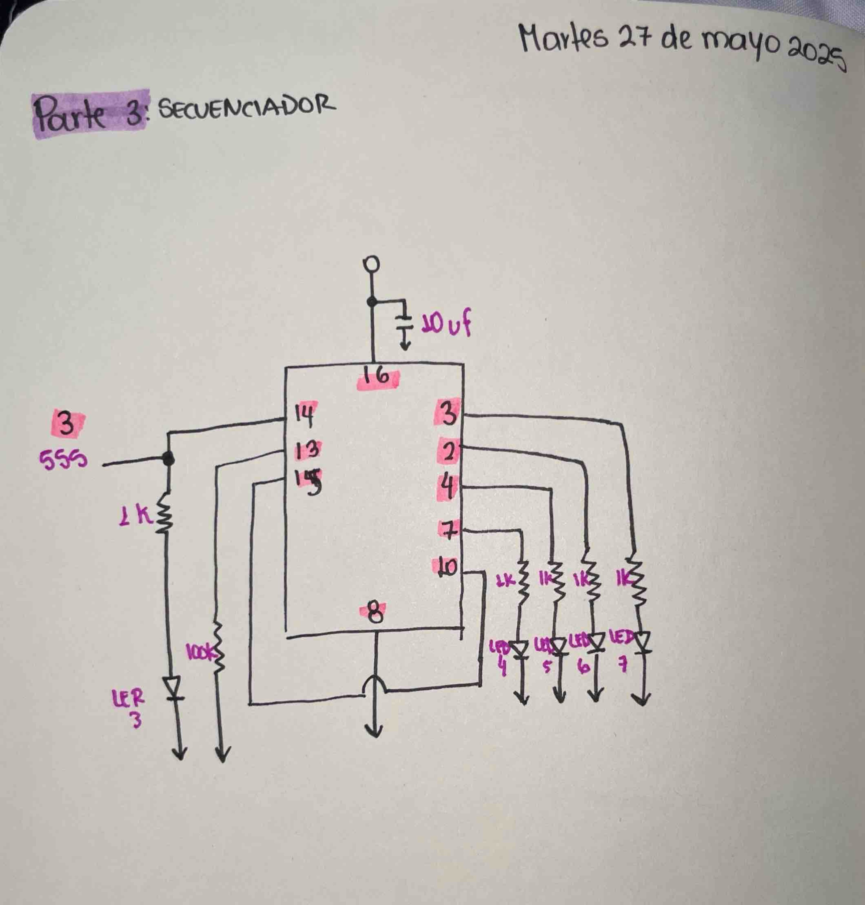
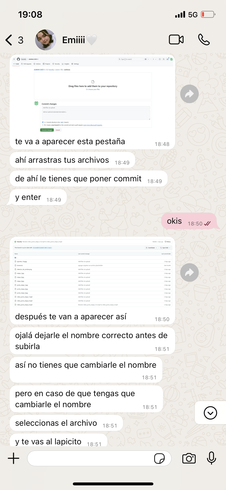

# sesion-12a

Martes 27 de Mayo del 2025.

## Apuntes 

 Foto de mi bitácota

  

## Detector de sombra

Circuito esquemático **Detector de sombra** realizado por Matías Serrano.

 
 
**Parte 1: Detector de sombra**

Para comenzar usamos un potenciómetro para ajustar el punto en el que el LED casi se apaga, dejándolo justo en ese estado. Luego, al generar sombra sobre el LDR, el LED debería apagarse, y cada vez que el LDR reciba luz nuevamente, el LED se encenderá otra vez.

Foto circuito esquemático en mi bitácora.

 

Foto circuito "parte 1" en protoboard.

Video funcionamiento circuito "parte 1" en protoboard.
 
**Parte 2: Temporizador**

En esta segunda etapa, colocamos un segundo LED en la protoboard, conectado a un chip 555 configurado en modo monoestable. Cuando se proyecta una sombra sobre el LDR, el primer LED se apaga y el segundo se enciende, y viceversa.

**Observación:** Para hacer el circuito más estable, cambié el condensador electrolítico de 10uF por uno de 100uF.

Foto circuito esquemático en mi bitácora.

 
 
Foto circuito "parte 2" en protoboard.

Video funcionamiento circuito "parte 2" en protoboard.

**Parte 3: Secuenciador**

Al agregar el chip 4017, conseguimos que los LEDs se enciendan en secuencia cada vez que se pone una sombra sobre el LDR. Esto significa que, cuando el LDR se oscurece, el LED de la etapa 3 se enciende en orden.

**Observación:** Aunque al principio el circuito no funcionaba bien, al poner un condensador electrolítico de 10uF entre el pin 16 y tierra, logramos que todo funcione de manera más estable.

Foto circuito esquemático en mi bitácora.

 
 
Foto circuito "parte 3" en protoboard.

Video funcionamiento circuito "parte 3" en protoboard.

## Subir fotos a GitHub

No sabia como subir fotos bien a github, solo conocia la forma de subir las fotos mediante un link, lo cual no aseguraba que esta permaneciese de manera permanente en la nube, si no que era probable a que se borrara, debido a que si se borraba de la fuente original desaparecia de github.

Mi amiga y compañera Emilia (hazzaily) me enseño a como subir las fotos de manera correcta.

 
