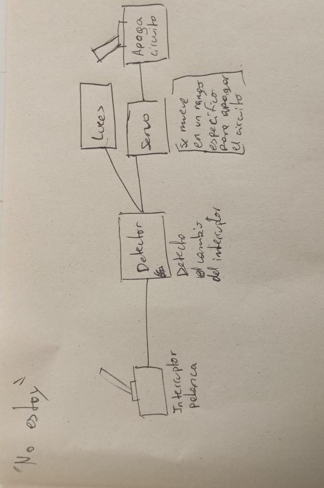
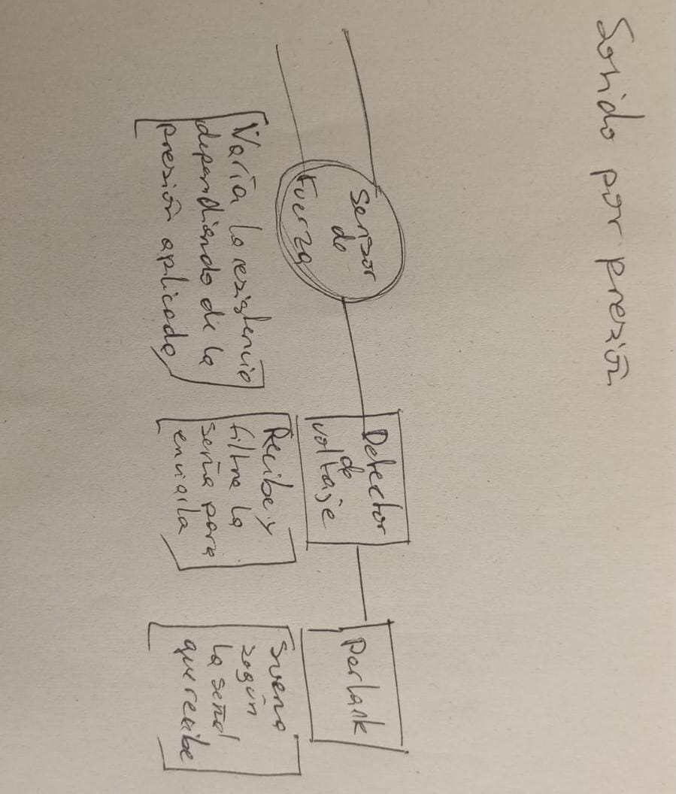
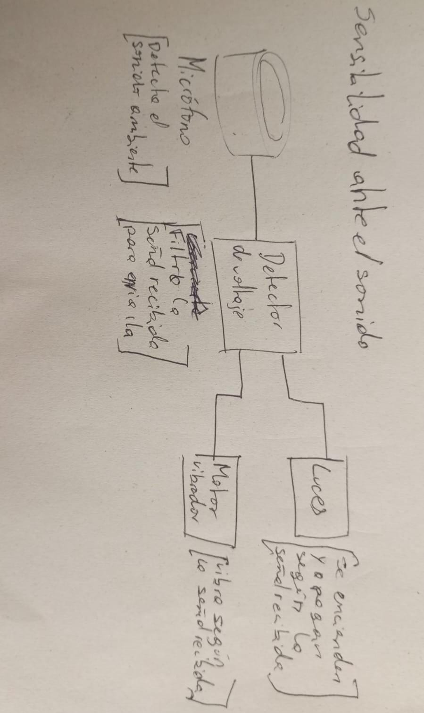

# sesion-12b

30-05

- [cristian oyazun](https://error404.cl/coyarzun.htm)

- net art happens

- [olia - summer](https://art.teleportacia.org/olia/summer/)

- primavera hacker

- documental joshua: teenager vs superpower

- webring

- libro - twitter and tear gas

- ai weiwei cam - 

- wafa bilal - pistola de paintball - 

- "el contenido de un medio es tan importante como un "

- [arthur ganson](https://www.arthurganson.com/concrete-1) - hoja de alcachofa
[guitarra magnética](https://en.wikipedia.org/wiki/Single_coil_guitar_pickup)

- [instrumento raro](https://www.youtube.com/watch?v=70w5TIubMik)

- [kickstarter](https://www.kickstarter.com/)

- [adafruit](https://www.adafruit.com/) muy buenas guías de cada componente

- [etsy](https://www.etsy.com/es/search?q=+synth&ref=search_bar&dd_referrer=https%3A%2F%2Fwww.etsy.com%2Fes%2F)

- [tindie](https://www.tindie.com/)

## fuentes de poder
- batería 9V . son contaminantes y caras

- eliminador de voltaje o fuente de poder AC/DC
    - hay de 4,5 - 5 - 6 - 8 - 12 , etc. son DC, como una vatería. debe ser igual al que espero que se utilices

    - polaridad: el centro puede ser negatico o positivo, depende del diseñador

    - tamaño del conector varía - 2.1 o 2.5mm

    - corriente - **el voltaje se entrega, la corriente se pide** "simepre usar una fuente de poder de corriente MAYOR a la que quiero utilizar"

- voltaje polaridad y dimenciones fúizicas

- pantalla solar "puede ser uqe su producto tenga que ver con los días numblados"

- pilas de 1,5 o pilas de reloj 2032 3v

## iluminación

- LEDs - se queman - sirven para saber si algo está funcionando [TIENE QUE ESTAR EN PARALELO, si se quema, caga todo]

- Ampolletas domésticas (220V) - son peligrosas - usar relé

- LED de 3 o 5W - los ciclistas que encandilan lo usasn

- tiras led - pueden ser controladas con PWM - 
[demasled](https://demasled.com.ar/) - tiras led más inteligentes NEOPIXEL

## motores

- requieren transistores

- dc 6v - gira tan rápido como pueda si le llega electricidad 

- para reducir velocidad se necesita un moto reductor mediante **conservación del momento angular**

- Streppermotor o paso a paso - es mucho más lento y preciso, pero no sabe dónde está- impresoras 3D - los grados que avanaz depende del motor [video](https://www.youtube.com/watch?v=Vc2XRVJ9n1o)

- servo motor - preciso, sabe donde está 

- puente H - cambiar ladirección de un motor DC - L298n

- [solinoide](https://www.youtube.com/watch?v=om0yTP59nG4) - [polyned perc](https://polyend.com/legacy/polyend-perc/) - por principio electromagnético genera movimiento lineal - percusiones electromecánicas

- bomba de agua o de aire - hacen circular el agua o el aire

## transistores

- se usan como amplificador, switch, inversor o compuerta lógic

- tipos:
    - bipolares
        - ej: 2n2222 (para que se separe electricamente el pin 3)
    - mosfet
        - ej:  IRFZ44n
- [transmisor modo inversor](https://es.wikipedia.org/wiki/Puerta_NOT)

## sonido

- parlantes activo y pasivos
    - activos se enchiufan
    - pasivos no se enchufan - requieren amplificación externa, como el PAM8403 - intensidad sonora depende de su tamaño, potencia (W) y de impedencia (Ohm)

- buzzer - parlantes muy básicos - usados en alarmas - tiene un sólo tono

- reproductor de audio - convierte datos digitales en electricidad sonora

- micrófono - convierte movimiento mecánico en electricidad - Electret es el más usado (controlar algo con un micrófono)

- piezoeléctrico - convierte vibración mecánica en electricidad - [ejemplo](https://www.electrofaustus.com/ef105-drum-thing) - [transducer](https://deanmarkley.com/products/transducer-acoustic-guitar-pickups) - permite detectar si suelto o presiono algo

- sintetizadores - genetan sonido a partir de señales eléctricas creadas detro del mismo aparato
    - [logic noise](https://hackaday.com/series_of_posts/logic-noise/)
    - [moritz klein](https://www.youtube.com/watch?v=Xbl1xwFR3eg)
    - [tonepad](http://www.tonepad.com/projects.asp?projectType=fx)
    - [big muff pi fuzz](https://www.youtube.com/watch?v=lBMdBmz88yU)

# encargo 01

- describir 3 proyectos que quieran hacer de forma individual
- ordenar por preferencia o interés
- buscar chips distintos a los que hemos visto
- ¿para qué es? ¿qué sentimiento quiero generar en otra persona? presición o para burlarse ¿es irónico? ¿práctico, especulativo, performático?

### 01 "no estoy"

una máquina que se apaga sola. 

al presionar una palanca se enciende una luz que "despierta" a un brazo que sólo se mueve para volver a apagar la máquina

o que la persona mueva la palanca que haga encender una luz blanca (aburrido), sale un bracito que mueve otra palanca y aparecen luces de colores desordenadas como si fuera una fiesta

ya existe - si lo quiero usar puedo hacer una modificación muy buena al que ya existe

### 02 sonido por presión

se basa en un objeto comúnmente conocido como antiestrés (pelota u otro objeto presionable), modificado para que, al ser presionado, genere sonidos caóticos, desagradables y "estresantes". la idea es generar incomodidad y sorpresa en el usuario. es un objeto irónico y burlesco, uno espera desestresarse y termina estresándose más.

una pelota antiestrés que al apretarla reproduce distintos sonidos dependiendo de la presión que se ejerce. 

genera incomodidad

en vez de una pelota, aarón dijo que podría ser un puff que cuando te sientes, suena, se le pueden poner hartos sensores de presión

### 03 sensibilidad ante el sonido

una máquina que vibra y hace encender y apagar luces de forma caótica cuando recibe una señal de sonido o ruido

# encargo 02

- dibujar diagrama de comportamiento, flujos de interacción - caja negra - no especificar los chips - procesos de manera especultiva - ¿cuánto tiempo se usará?¿que encendidos y apagados tiene?¿cómo se interactúan?

### 01 "no estoy" 

se enciende con la palanca, la cual enciende una luz y activa un servo motor que se mueve sólo para empujar la palanca y apagar el circuito.

### 02 sonido por presión

el sensor de fuerza recibe presión y la envía como señal eléctrica al circuito integrado, el cual la recibe, ,la filtra y la envía al parlante que reproduce la señal en sonido. el circuito está funcionando sólo cuando se presiona el sensor.

falsa seguridad, te dicen que te va a calmar, pero en realidad te estresa más

### 03 sensibilidad ante el sonido

el micrófono detecta ruido y lo manda como señal eléctrica al circuito integrado, éste lo recibe, filtra y envía señal eléctrica a las luces que se prenden y apagan de forma aleatória (guiadas por el sonido) y a un motor vibrador que se mueve de forma caótica por el sonido. el circuito funicona sólo cuando recibe cierto nivel de sonido.