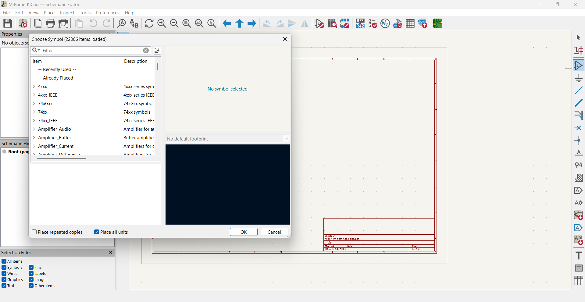
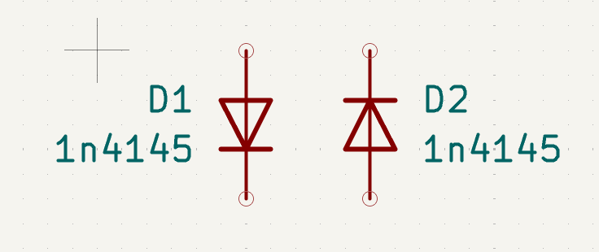

# sesion-07a
## Módulo de la mañana
Para nuestra placa tendremos que tener en cuenta que nuestros componentes eléctricos tienen lo siguiente:

-Rating (¿Cuánto aguanta un componente?) Ej: ¼ watt)

- Valor (10k)

- Símbolo (esquemático)

- “Footprint” (Las dimensiones físicas del componente, donde se soportan en la placa)

En KiCad hay distintas etapas.

Esquema: Dibujo esquemático: qué componentes hay, qué símbolo ocupan, qué valor tienen, fisicalidad aún no.
Asignó huellas, luego ruteo; para rutear necesitas saber cómo se ven las patas de los componentes para poder conectar el circuito.

El esquema se hace en el archivo SCH, el ruteo se hace en PCB.

Al presionar (1.ª screenshot) o la letra “a” de add, podremos seleccionar los componentes.

Con la letra “r” roto este componente, con click la dejo en el plano; si presiono “esc” vuelvo al modo normal de mi mouse, con “m” de mover es para agarrar un componente ya puesto, “v” de valor es para asignarle un valor a un componente.

Por hoy da lo mismo que 555 elijamos, pero agregaremos el NE555P.

Agregamos un VCC (alimentación), GND (tierra) y seleccionamos y con Ctrl+D duplicamos resistencias.

  
(screenshot 2)

Con “w” salen los cables; un círculo significa que no está conectado el componente.

Con la letra “g” de grab se agarra el componente con la conexión.

Los esquemáticos son mejores cuando hay menos líneas.  

    

En (screenshot 3) y (screenshot 4) con “q” le ponemos una x para decir que no será usada esa pata.

Con “e” sale como el “portafolio” del componente seleccionado. 

  
(screenshot 5)  

Con “x” el texto se refleja en el eje x.

Con “y”, el texto se refleja en el eje y.
r_pot es el potenciómetro bonito.

Luego conectamos los diodos al potenciómetro.

Con ese primero símbolo en la parte de arriba de la barra de herramientas es para que pueda ordenar el nombre de los componentes de manera ordenada.

El de derecho de ese, dice que errores están presentes en el circuito.

Dos más a la derecha dejan asignar huellas.

La región del medio son los componentes que tengo en el circuito.

En la región de la derecha están todas las huellas posibles.

La región de la derecha recibía todas las huellas que recomendaban para mi circuito.

Pitch es distancia entre las patitas.

## Módulo después del break

Package, que podemos buscarlo en internet, que es la forma del componente, son el nombre que tiene cada forma.

Potenciómetro ALPS RK09

En la barrita de arriba, luego de asignar todos nuestros componentes, podemos hacer un BOM automático, que se exporta en CSV.

El mundo de las ideas es el esquemático, ya que todavía no tiene forma física.

En KiCad se ocupan 7 capas.

La estructura de la PCB hecha de fiberglass, que es el soporte donde están todos los agujeros “edge cuts”. 

Pista de cobre “Cu” que está en el front y bottom de la PCB.

Serigrafía, serigrafíacon texto, elementos

Mask, la carcasa negra que es una capa protectora que protege el cobre.

una vez asignados y repartidos todos los componentes en las edge cuts

Elijo b.Cu, herramienta de enrutar con “x”.

Seleccionar, expandir conexión para tener el cobre entero o con la letra U después de hacerle clic a algún tramo.

área de relleno en la placa de cobre, presionar la B

PCB art en Wikipedia, por ejemplo.

Kelly Keaton, que hace circuitos funcionales con pinturas y los PCB.

Clacktornics es un libro que se convierte en un sintetizador modular.

## encargo-14

Aquí está el esquemático de la modificación de la ATARI PUNK CONSOLE.  
Primero, añadí todos los componentes que estaban presentes en nuestro BOM.

Luego empecé a conectar los puntos según el esquemático especificado del primer proyecto, tratando de que fuese lo más ordenado posible, aumentando el tamaño de las conexiones y usando distintos colores para que se pudiesen diferenciar entre los interconectados de mejor manera, siguiendo las indicaciones de todo lo que va a positivo, que sería conectado con cables rojos, y todo lo que va a negativo, que iría con cables azules.
  
  

## encargo-15

