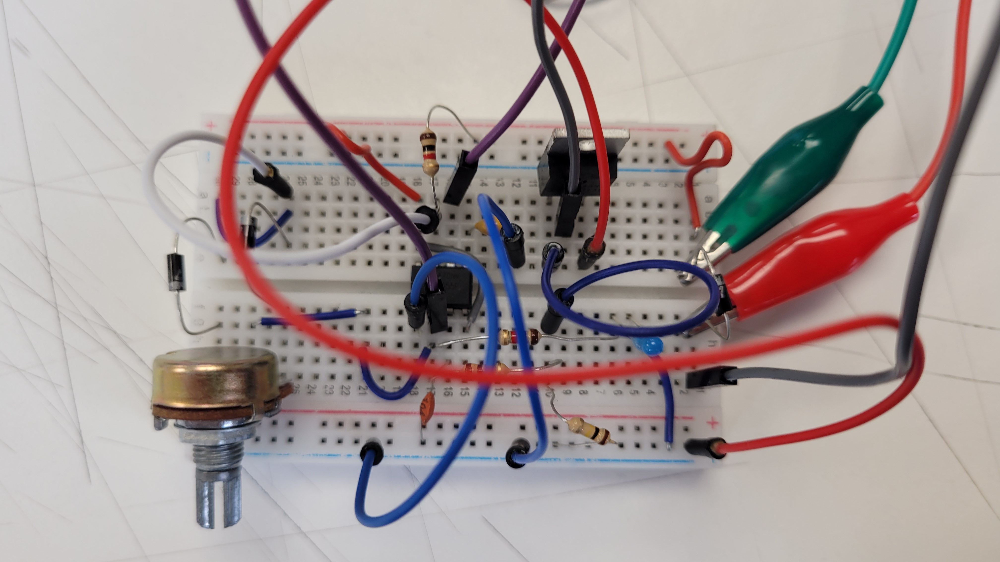
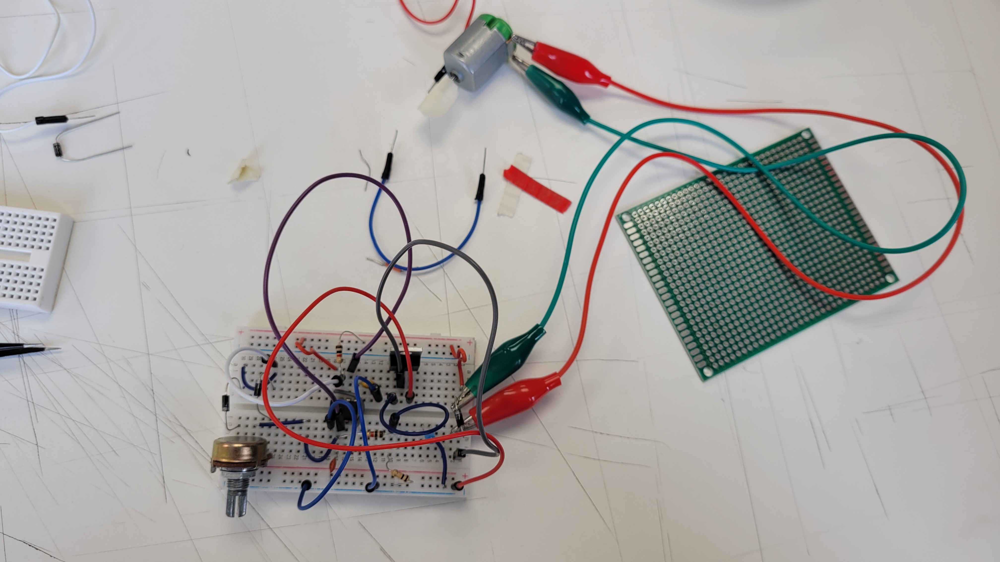
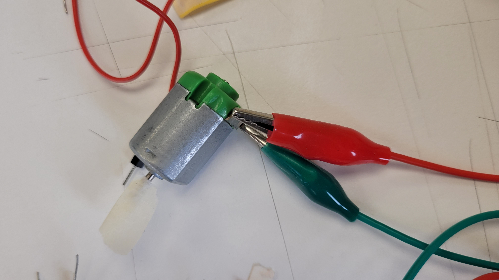
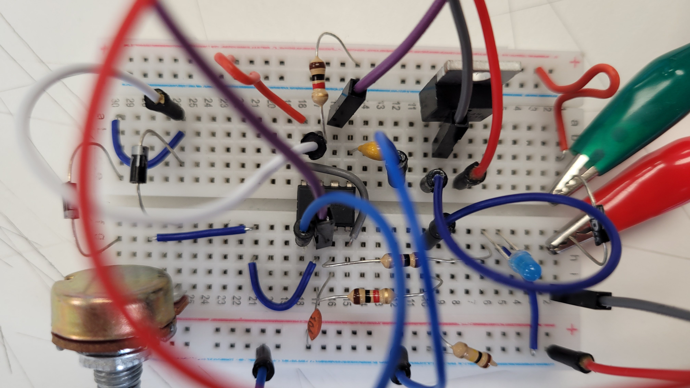
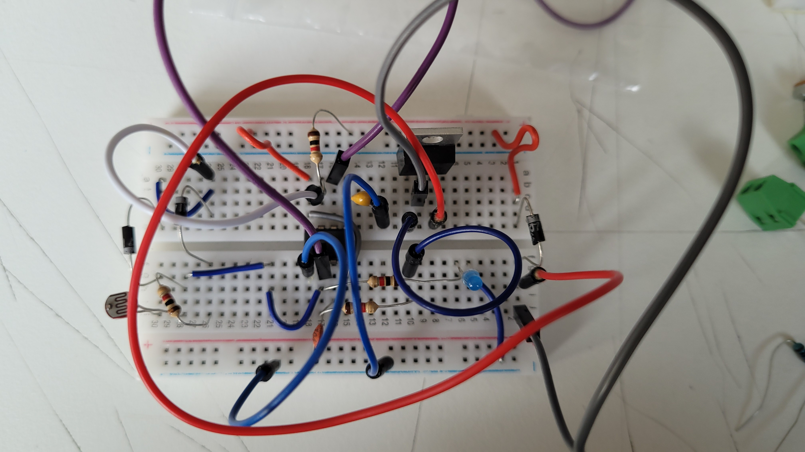

# sesion-11a
## Módulo de la mañana

Hoy conocimos que era un transistor MOSFET.

Este lo vamos a ocupar para amplificar señales electrónicas.

En este caso, será usado dentro de un circuito que es formado a partir de un 555, donde el output en el pin 3 iría al transistor y, por último, al motor.

El motor necesita más corriente que el chip 555 es capaz de emitir directamente y por esto mismo se hará un PWM (pulse width modulator) para que le llegue lo suficiente y cree su acción, que esta ocasión sería simplemente el girar, sin una dirección específica, ya que no hemos acoplado nada más; por ahora no tiene importancia.

Un PWM es lo que hace que sean más potentes las aspas de un motor, por ejemplo, el ventilador de mi compu y el juguete que trajo una compañera hace unas clases que funcionaba con un sensor de proximidad.

        

## Módulo después del break

El motor que vamos a ocupar es de 6V.

Algunos transistores se pueden calentar mucho, así que existen disipadores de potencia protoboard para que reciban mayor enfriamiento regularmente gracias a un flujo de aire, entre otras maneras.

PS son power supplies

Los diodos que estábamos ocupando en específico eran G (gate), D (drain), S (source).

Me complico mucho el armarlo en 2 protoboards distintos, así que solo lo hice más compacto para que pudiese entender mejor qué estaba haciendo.

