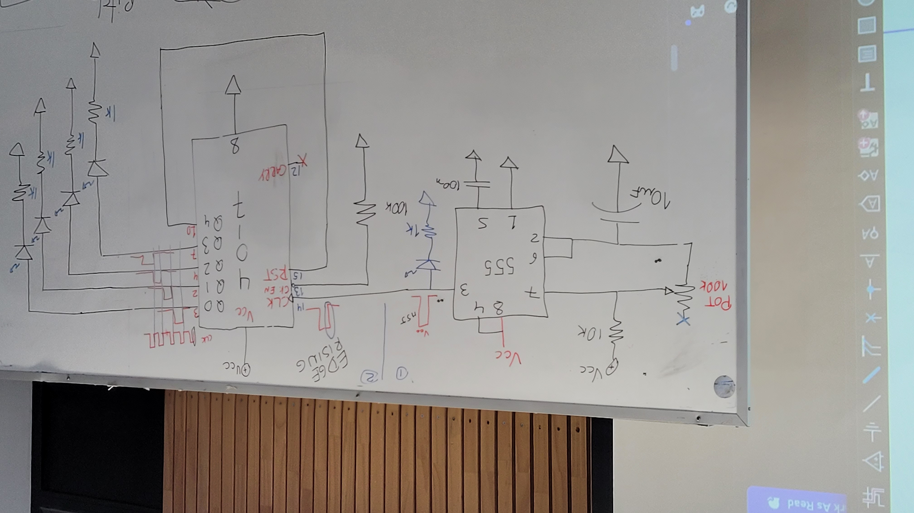
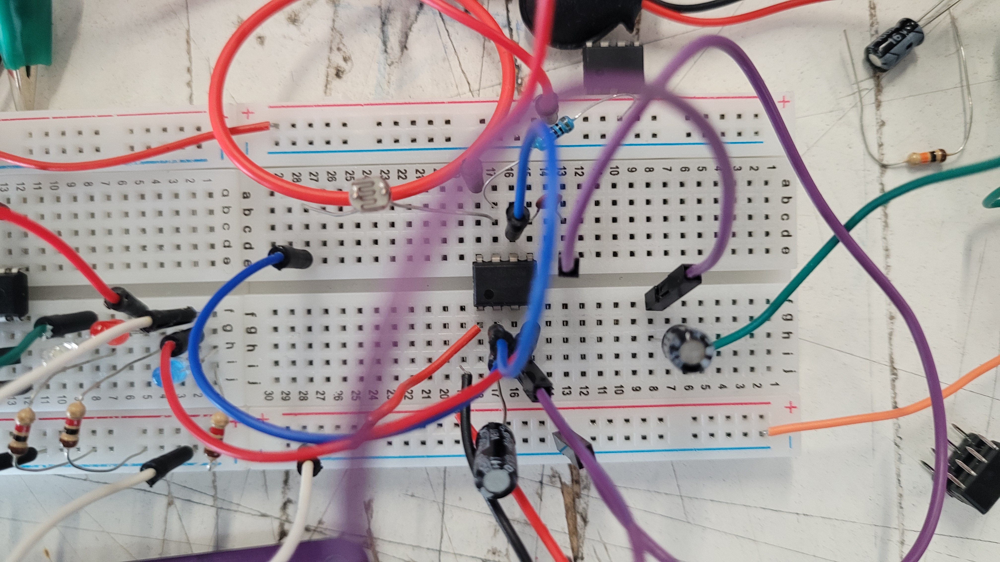
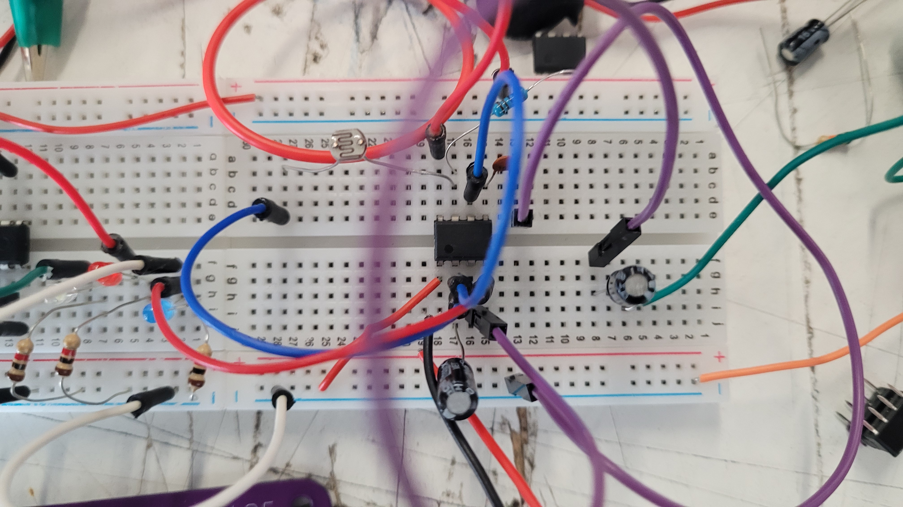
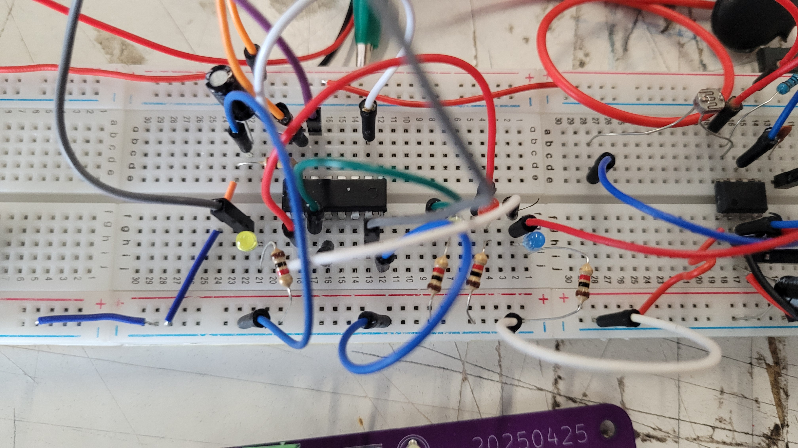
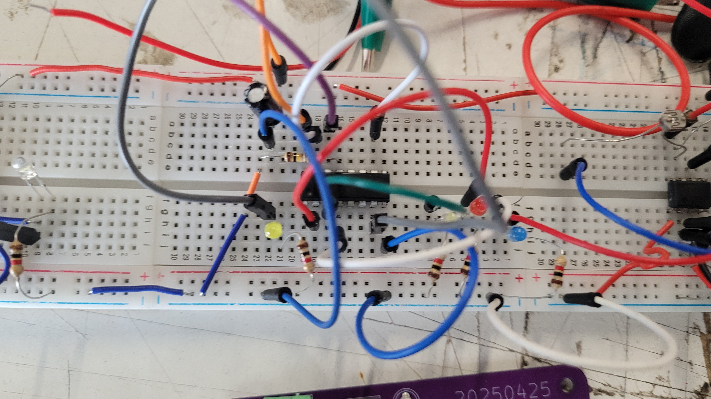
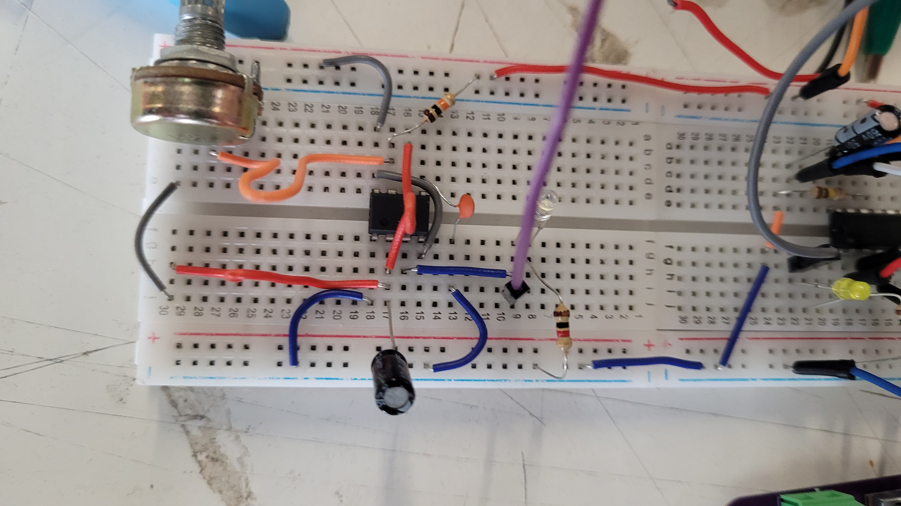

# sesion-11b
## Módulo de la mañana

Vamos a ver un poco de la secuencia; son cosas que pasan a través del tiempo, como indicaría el nombre, donde tiene que ocurrir paso a paso.

El chip 4017 tiene 16 patas, donde 10 de esas patas son de un output, mientras que las demás son para sus otras funciones, como el clock y la alimentación.

Lo que vamos a hacer con el 4017 va a ser algo secuencial; vamos a aprender a agregar más momentos de nuestros circuitos.

Tenemos que digerir de aquí al martes el poder de las secuencias.

Un clock es una señal de aviso que gobierna la velocidad a la que ocurren las cosas después. 

El cambio del clock no tiene por qué ser regular; la pata del clock detecta el edge rising de una señal, así que puede ser controlado por nosotros o por elementos que nosotros armemos.

Hay muchos chips que empiezan con 40; guardemos esto en nuestro corazón.

Pata positiva, pata N16 VCC; pata negativa es la 8 GND.

Hay 10 salidas, pero si tan solo quiero ocupar una cantidad menor, por ejemplo 4, deberíamos conectar la pata Q4 al reset, ya que se cuenta de Q0 a Q9.

El reset no depende de la señal propia del LED; en caso de que no reciba nada, este se reiniciará solo.

La pata 14 es el clock.

La pata 12 la vamos a ignorar por ahora.

Primero deberíamos armar el 555 para poder probarlo.

Un 555 astable para usar 4 salidas del 4017.

    

## Módulo después del break

Lo que quieren los profes es que entendamos el cómo llegar a hacer modularidad, la conexión entre circuitos y de qué manera se puede llegar a lograr distintos resultados.

Por último, como desafío, intentamos conectar primero un 555, después un 4017 y, por último, otro 555 que estaba conectado a la salida de un parlante.

