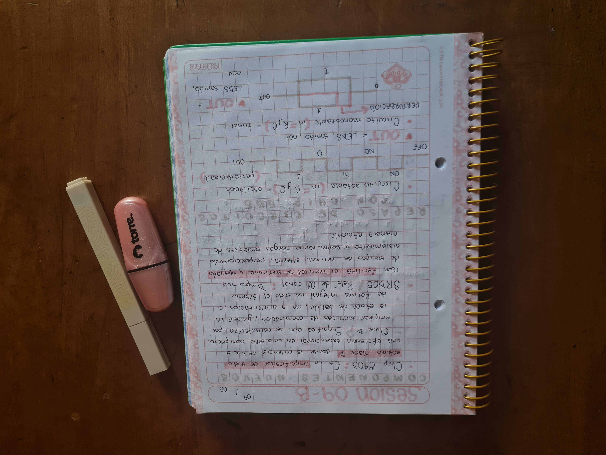
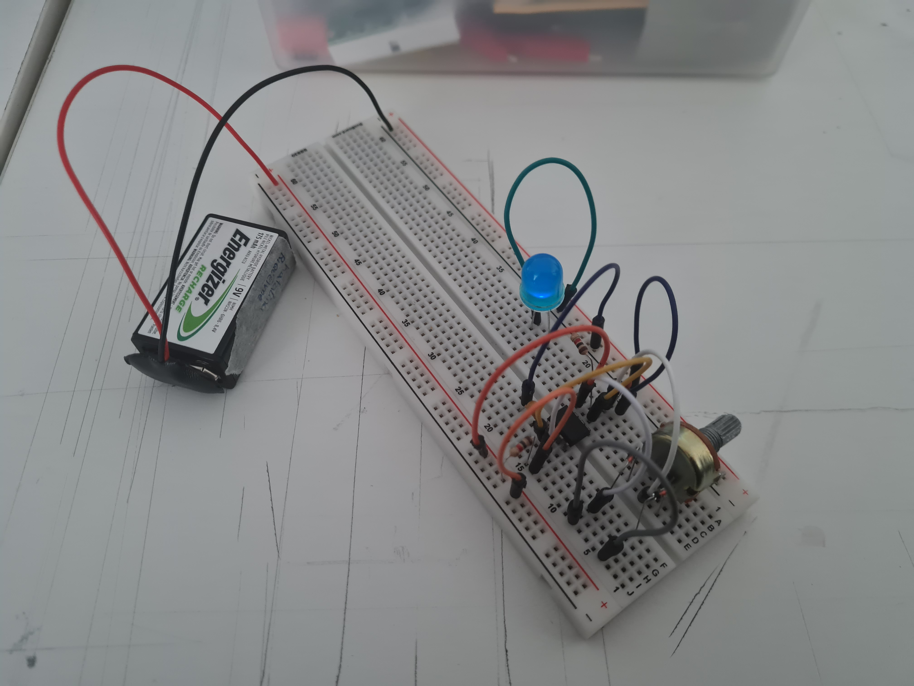
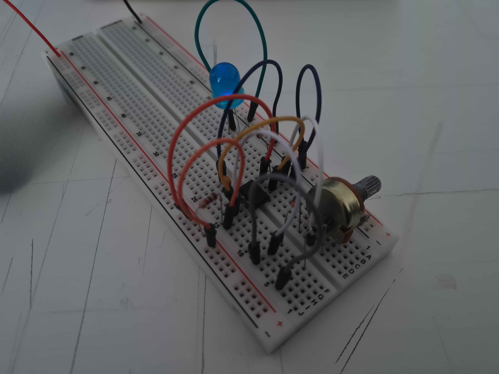

# sesion-09b

## apuntes

## encargo-18: Realizar circuito de la clase en protoboard

## encargo-19: Investigar cultura electrónica y Laurie Anderson

La electrónica es una evolución constante. Desde los primeros experimentos con sonidos sintetizados hasta la creación de géneros musicales como el techno y el house. Además esta cultura a trasformado la forma de experimentar la música y la interacción social.
Laurie Anderson vanguardista estadounidense, es conocida por su enfoque innovador en el arte escénico 
