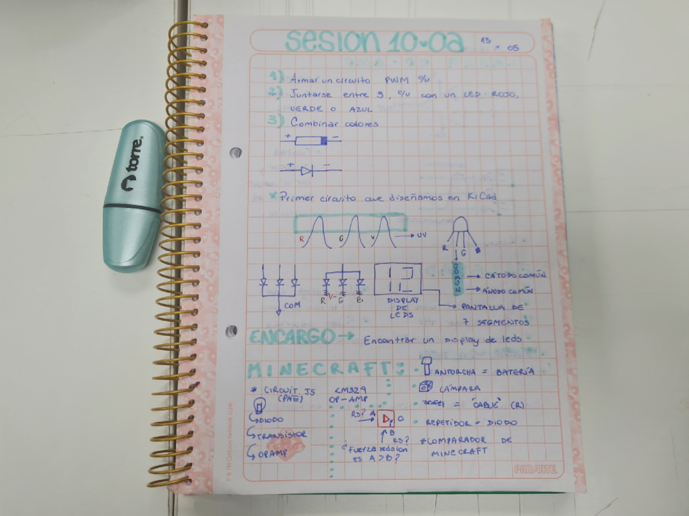
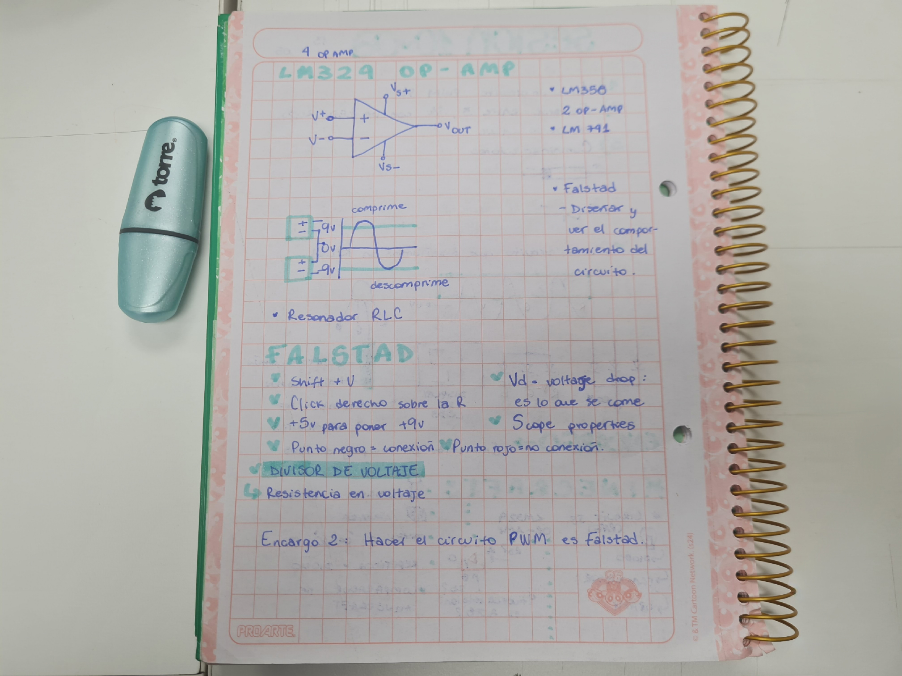
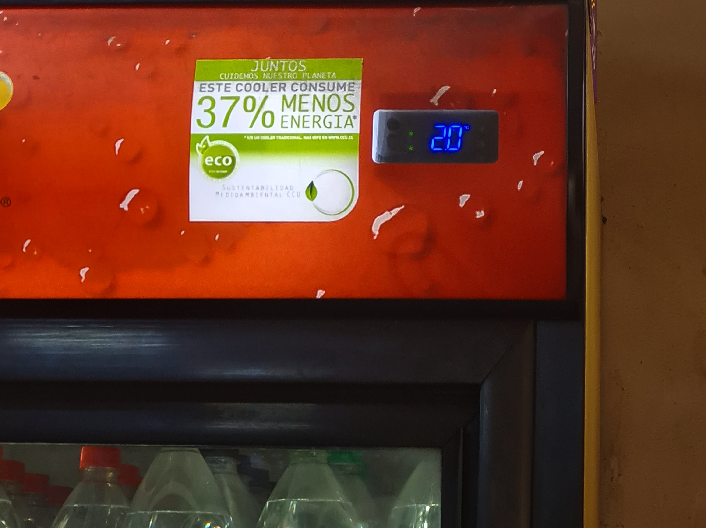
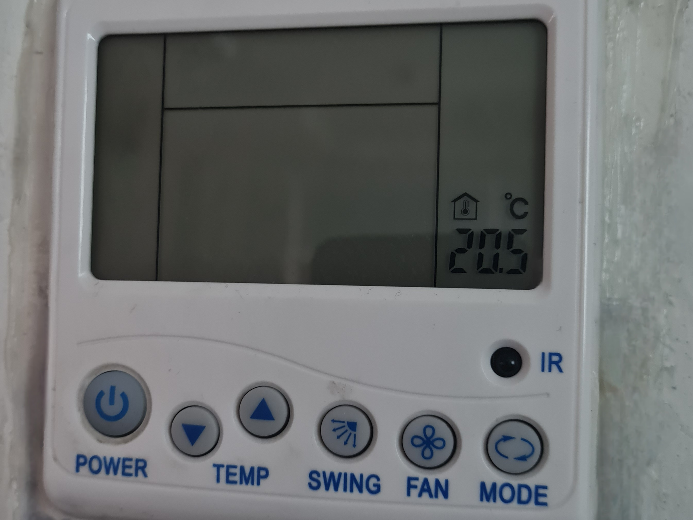

# sesion-10a

Apuntes 13/05



En esta clase aprendimos a usar la página Falstad, para simular circuitos eléctricos como se puede observar en las siguientes imágenes


**¿Qué es una pantalla de 7 segmentos?**
Es un aparato que utiliza 7 segmentos LED, los cuales se pueden encender o apagar de forma individual, para mostrar números del 0 al 9 en forma de cifras arábigas

## Encargo 20: Pantallas de 7 segmentos (Al menos 3)


Imagen tomada el día 13/05 en el almacén de al lado izquierdo de la facultad de arquitectura, arte y diseño en república


Imagen tomada el día 15/05 en mi casa, es un despertador


Imagen tomada en mi clase de Inglés en la facultad de Manuel Rodriguez, en la sala 503 de su termostato

## Encargo 21: Simulación de circuitos con 555 y/o comparadores hechos con opamps en Falstad

Realizar el circuito PWN visto en clases en Falstad


Código

```txt
$ 1 0.000005 10.20027730826997 50 5 50 5e-11
165 320 304 464 304 14 0
R 448 192 448 144 0 0 40 9 0 0 0.5
w 384 272 384 192 0
w 384 192 448 192 0
w 448 336 448 192 0
r 448 368 592 368 0 1000
162 592 368 592 432 2 default-led 1 0 0 0.01
g 592 432 592 528 0 0
c 384 464 384 560 4 0.000104 5.999108982982355 0.001 0
g 384 560 384 592 0 0
g 416 464 416 592 0 0
w 320 432 128 432 0
w 320 400 160 400 0
174 96 352 160 384 1 100000 0.5 Resistance
w 128 432 128 384 0
d 160 320 160 352 2 default
d 96 352 96 320 2 default
w 96 320 160 320 0
w 160 320 240 320 0
w 240 320 240 336 0
w 240 336 320 336 0
g 128 560 128 592 0 0
c 128 464 128 560 4 0.000104 4.234031265341355 0.001 0
w 128 464 128 432 0
w 160 400 128 432 0
r 240 320 240 192 0 1000
w 240 192 384 192 0
```
