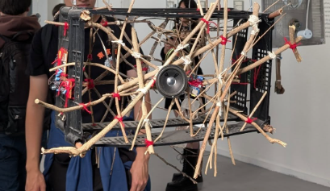
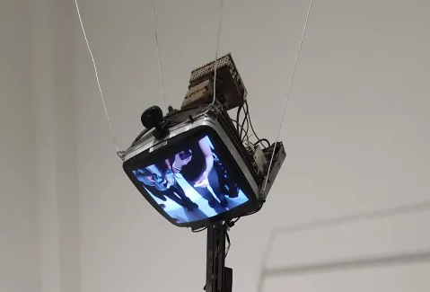

# sesion-03b 

# Encargo 08: Cultura Musical Nacional - *Gonzalo Martínez y sus Congas Pensantes*

El disco "**Gonzalo Martínez y sus Congas Pensantes**" es un proyecto de 1997 hecho por Jorge González (el vocalista de Los Prisioneros) y Martín Schopf, un músico chileno que vivía en Alemania y usaba el nombre Dandy Jack conocido por su música electrónica, especialmente en los géneros minimal techno y microhouse. El nombre del disco "Gonzalo Martínez" viene de combinar sus nombres: "Gonzalo" por González y "Martínez" por Martín.

Jorge González en 1994 despues de sacar el albúm "**El futuro se fue**" se traslado a Nueva York para estudiar ingeniería de sonido. Allí se reencontró con Martín Schopf, juntos decidieron fusionar la cumbia tradicional con la música electrónica, inspirados en la similitud rítmica entre ambos géneros. González mencionó que, al asistir a clubes en Nueva York, notaba que el hi-hat del house y el platillo de la cumbia eran muy similares, lo que lo llevó a explorar esta fusión. 

El álbum, lanzado en 1997 bajo el sello BMG, incluye versiones electrónicas de cumbias clásicas como "La pollera amarilla", "La piragua" y "La pollera colorá", además de composiciones originales como "La cumbia triste" de González, "¡Guapa!" de Schopf y "La cumbia del pepino", coescrita por ambos. 

El disco "**Gonzalo Martínez y sus Congas Pensantes**" en Chile, el disco no tuvo una recepción comercial destacada, vendiendo menos de 2.000 copias. Sin embargo, en el circuito underground europeo, especialmente en Alemania y el Reino Unido, fue bien recibido, siendo considerado un proyecto adelantado a su época.

La propuesta del disco Gonzalo Martínez influyó en la escena musical chilena al ser pionera en esta fusión de cumbia y electrónica, abriendo camino para proyectos posteriores que exploraron esta combinación de géneros. Aunque en su momento no obtuvo gran reconocimiento en Chile, con el tiempo ha sido valorado como un trabajo innovador y precursor en la música latinoamericana.

# Encargo 09: Visita al Museo de Arte Contemporáneo

El **viernes 28 de marzo** realizamos una salida a terreno al **Museo de Arte Contemporáneo (MAC)**, donde pudimos apreciar y observar diversas exposiciones de distintos estilos y temáticas. A continuación, presento las exhibiciones que más llamaron mi atención como grupo:

   

