# sesion-06a

# PROYECTO 01 - Grupo 09 

**Integrantes:**
- Bastián Solís Cavieres
- Carlo Martinez Arzola
- Martin Silva Reyes

# NOMBRE DEL PROYECTO: *Caja Sonora Interactiva*

Antes que nada, tomamos como base el circuito del 'Atari Punk Console', es decir, primero partimos con el circuito inicial del APC, el cual modificamos principalmente para alterar la frecuencia del parlante mediante el uso de botones e interruptores.

Circuito Inicial del APC (Atari Punk Console)

# CIRCUITO APC - CAJA SONORA INTERACTIVA - Projecto 01 

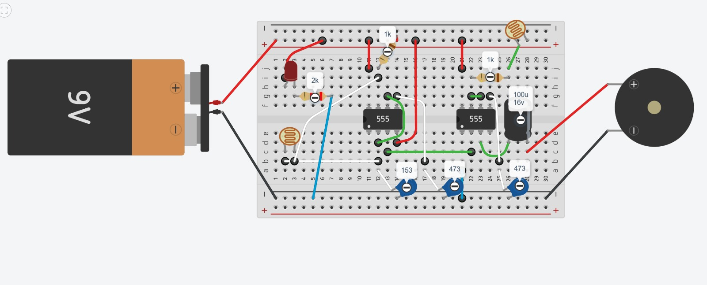

Nuestro proyecto consiste en una caja de sonido que contiene en su interior tres protoboards, todas con un diseño similar, pero diferenciadas por el color del LED que utiliza cada una. ¿Por qué LEDs de distinto color? Porque al encenderse, cada LED activa un LDR (sensor de luz), el cual responde a la intensidad lumínica y genera una señal que se traduce en sonido a través de un parlante.

La interacción del usuario se da mediante una pieza impresa en 3D, ubicada en la parte superior de la caja. Esta pieza puede moverse para bloquear o permitir el paso de luz desde el LED hacia el LDR. De esta forma, se regula la cantidad de luz recibida y, en consecuencia, se modifica la frecuencia del sonido emitido, haciendo de la caja un sistema sonoro dinámico e interactivo.na por cada circuito. En estas ranuras se ubicarán barritas o patitas impresas en 3D, que funcionarán como barreras móviles entre un LED y un LDR. Estas barritas están diseñadas para levantarse al ejercer presión sobre ellas, permitiendo que el LED ilumine directamente al LDR.

Como el LDR responde a los cambios de luz, su exposición directa al LED modificará la resistencia del circuito, lo cual alterará la frecuencia del sonido emitido por la bocina. De este modo, cada barrita presionada genera una variación sonora, logrando una interacción física y directa con el usuario, convirtiendo la caja en una verdadera experiencia sonora interactiva.

# Puntos Clave del Proyecto:

- Uso de 3 circuitos APC conectados y alimentados por 3 batería de 9V.

- Caja de madera diseñada con tres ranuras para insertar los mecanismos interactivos y tambien otros 3 agujeros por donde saldran las bocinas.

- Barritas impresas en 3D que funcionan como barreras móviles entre LED y LDR.

- Interacción física al levantar una barrita, se modifica el sonido emitido por la bocina.

# MODELO 3D del Proyecto

La idea de nuestro proyecto es crear una caja sonora interactiva, que cuente con tres barritas impresas en 3D. Al presionarlas, estas se elevan y actúan como una barrera entre un LED y un LDR. De este modo, cada vez que una barrita sube, se modifica la cantidad de luz que llega al sensor, lo que permite ajustar el sonido según la presión ejercida.

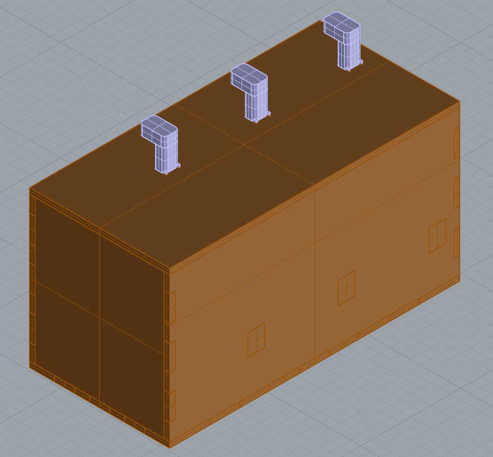

Como se puede observar en la imagen a continuación, las barritas (representadas en rojo en el esquema) están ubicadas entre el LED y el LDR. Al levantarlas, actúan como una barrera que regula la cantidad de luz que llega al sensor. Esto provoca que el LDR reciba más o menos luz, lo que a su vez modifica el sonido emitido por las bocinas.

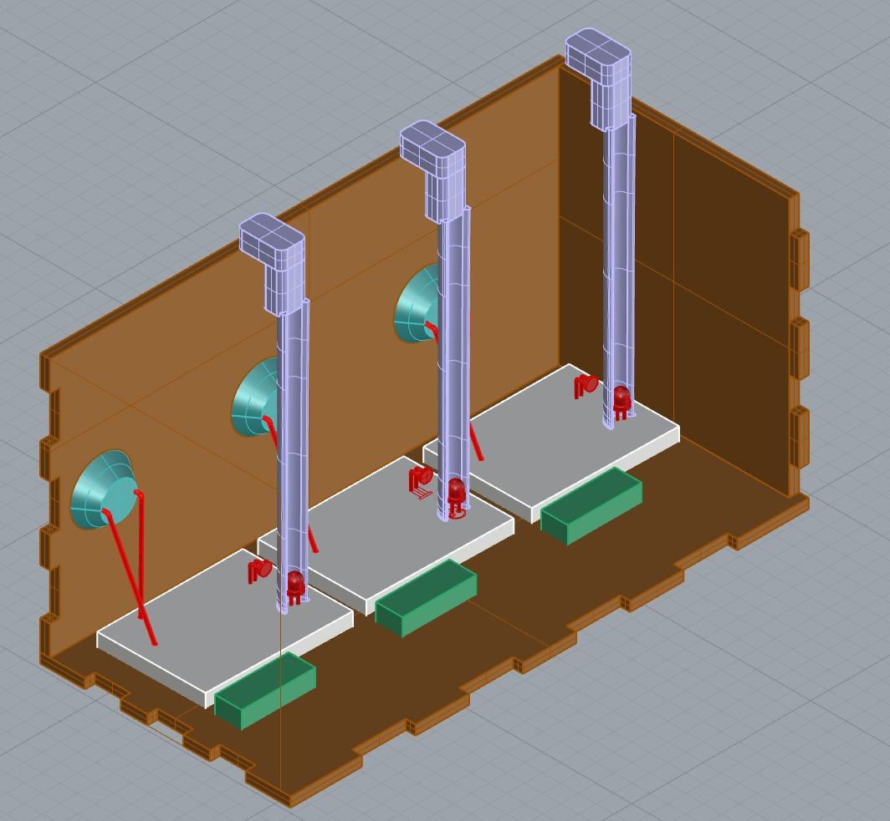

Dado que el LED está muy cerca del LDR, cualquier cambio en la cantidad de luz es fácilmente detectado por el sensor. Esto permite que la bocina emita distintas frecuencias de sonido según la posición de las barritas. De esta forma, nuestro proyecto funciona como una caja sonora interactiva.

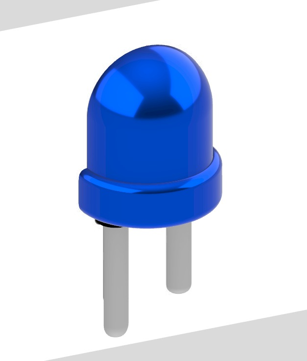

# Estructura hecha con Corte Láser

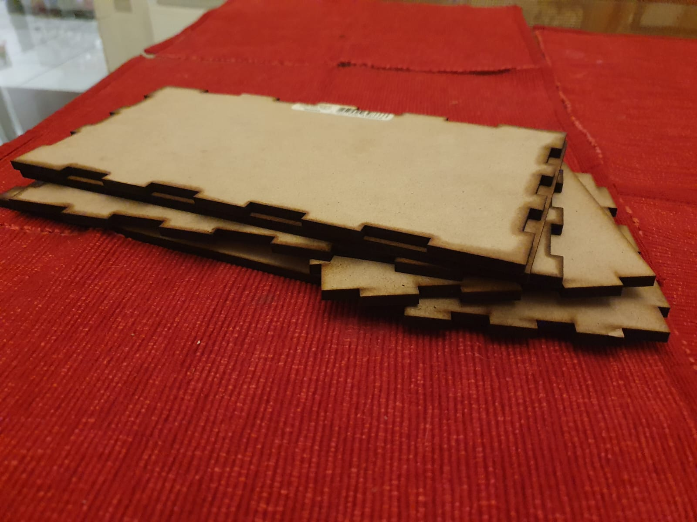
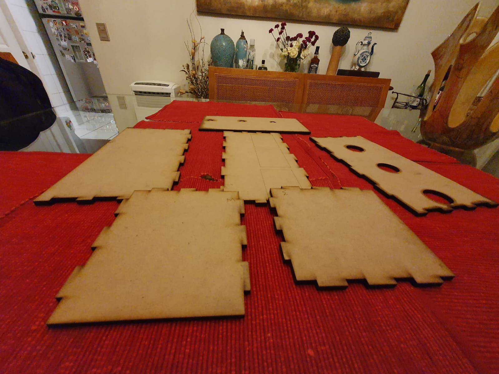
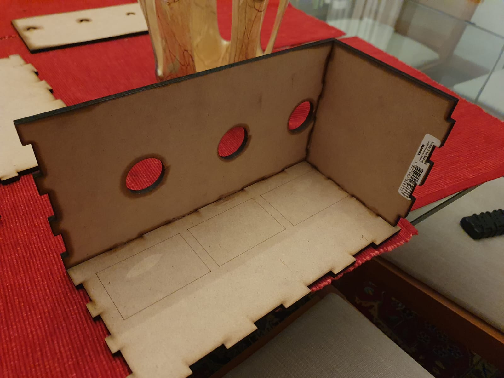

# Estructura por dentro

La idea principal de nuestra caja es que sea interactiva, por lo que cuenta con tres agujeros por donde saldrán las bocinas que emiten el sonido. Por esta razón, el corte láser fue diseñado de esta forma, permitiendo que el sonido se proyecte adecuadamente hacia el exterior.

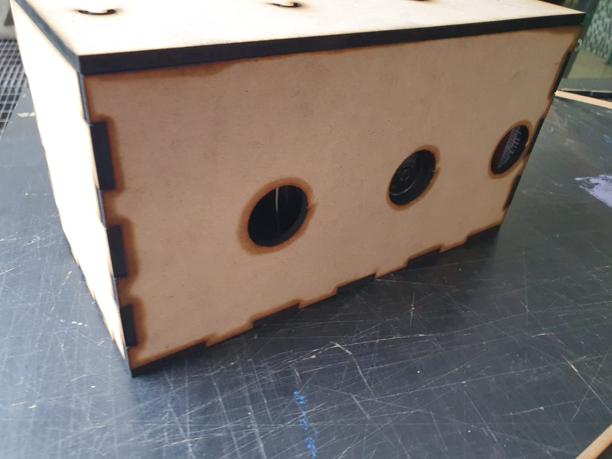

Aquí se puede apreciar cómo la bocina queda posicionada en el agujero, permitiendo que el sonido se proyecte hacia el exterior.

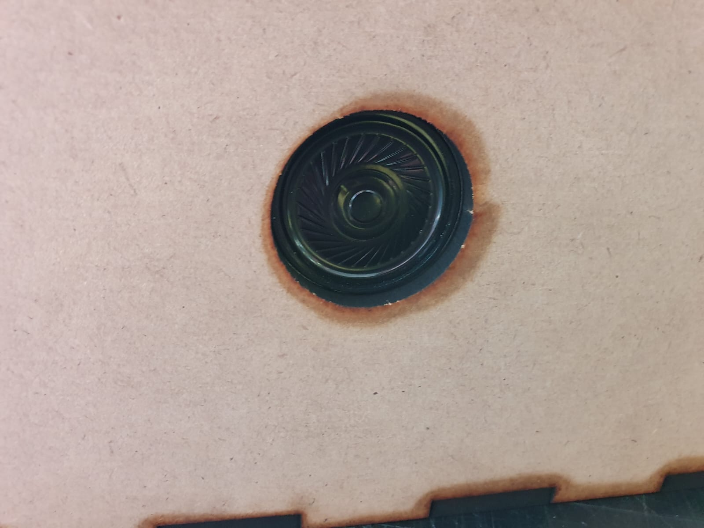

Se muestra una vista superior del interior de nuestra caja, la cual contiene un circuito APC. La idea final es incorporar tres protoboards para implementar el sistema de bocinas en los 3 agujeros.

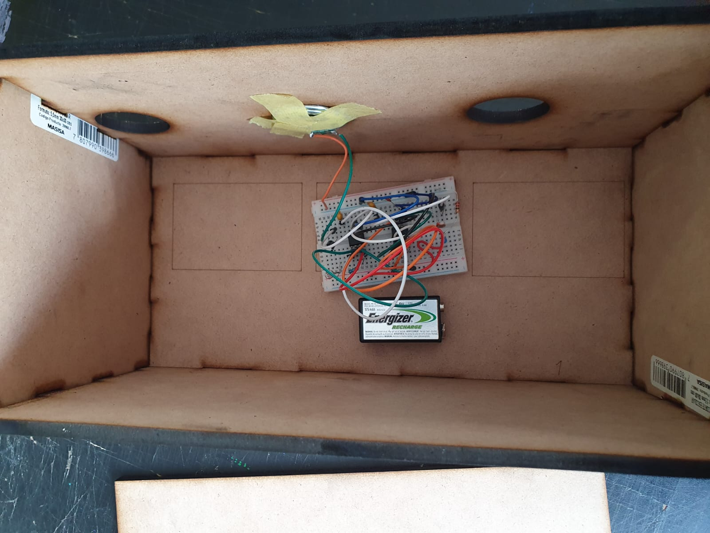

Nuestra caja incorpora bisagras que permiten abrirla fácilmente, lo cual facilita el acceso al interior para insertar la batería de 9V necesaria para el funcionamiento del proyecto. 

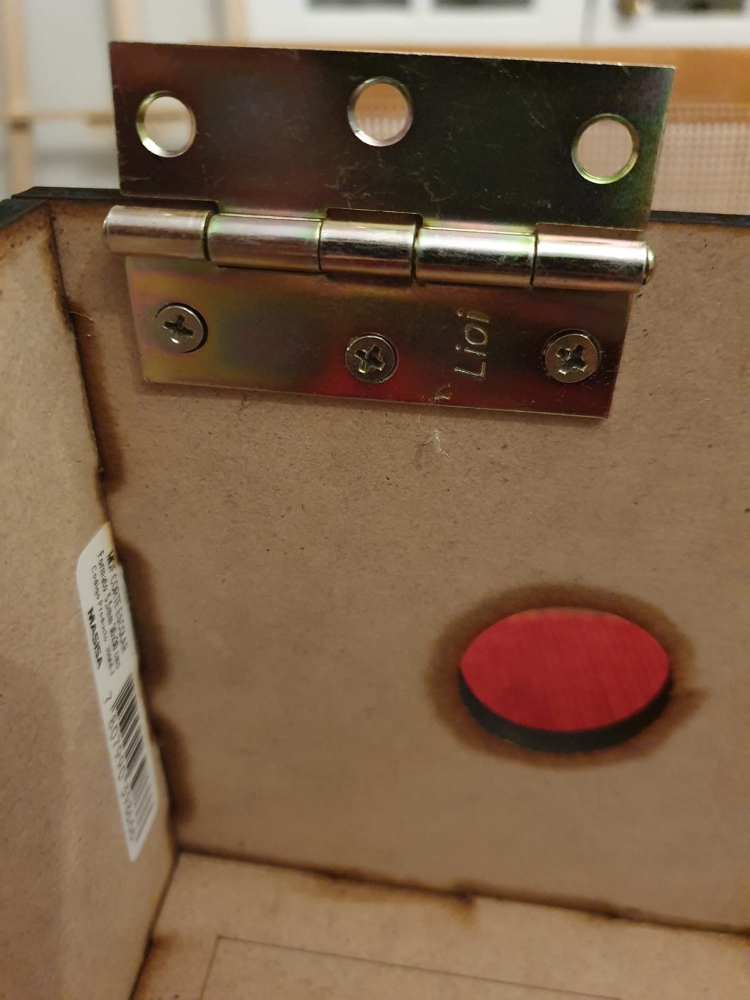

Aca se aprecia más de cerca el funcionamiento de nuestro APC, con el LED azul encendido como parte de una prueba para verificar que todo funcionara correctamente.

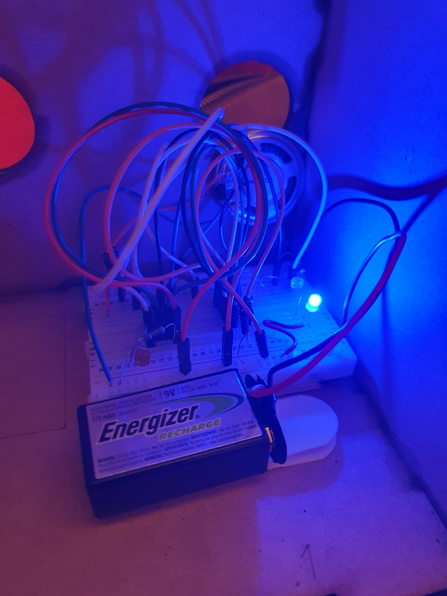

# Bills of Materials - CAJA MADERA

| Materiales                   | Cantidad | Precio   | Especificaciones                         |
|-----------------------------|----------|----------|------------------------------------------|
| MB Pack Sujeta Cuadros      | 1        | $11.490  | Kit para montaje y sujeción de estructuras |
| Corte placa MDF 5.5mm 30x30 cm | 1     | $3.303   | Placa MDF de 5.5 mm cortada a láser, 30x30 cm |
| Bisagra Lin 38 2½"           | 2        | $1.990   | Bisagras metálicas pequeñas para caja    |

# Bills of Materials - Circuito APC x3 

| Materiales               | Cantidad | Precio Aproximado | Especificaciones                                 |
|--------------------------|----------|--------------------|--------------------------------------------------|
| NE555 o NE556            | 3        | $3.000 CLP         | Temporizador IC, DIP-8 o DIP-14 (uno por APC)    |
| Resistencias             | 6        | $600 CLP           | 10 kΩ (2 por APC, pueden variar)                 |
| Potenciómetros           | 6        | $4.800 CLP         | 10 kΩ o 100 kΩ lineales (2 por APC)              |
| Condensadores            | 3        | $300 CLP           | 0.01 µF – 1 µF (1 por APC, típicamente 0.1 µF)   |
| Bocinas (speakers)       | 3        | $3.000 CLP         | 8 ohm / 0.5W                                     |
| LDR (fotorresistencias)  | 3        | $1.500 CLP         | Una por cada sistema interactivo                 |
| LED                      | 3        | $600 CLP           | 5mm, alto brillo                                 |
| Protoboards (o mini-PCB) | 3        | $4.500 CLP         | Una por cada APC                                 |
| Cables jumper            | Varios   | $500 CLP           | Macho-macho y macho-hembra según necesidad       |
| Batería 9V               | 1        | $9.000 CLP         | Bateria Recargable                               |
| Clip para batería 9V     | 1        | $500 CLP           | Conector estándar                                |

